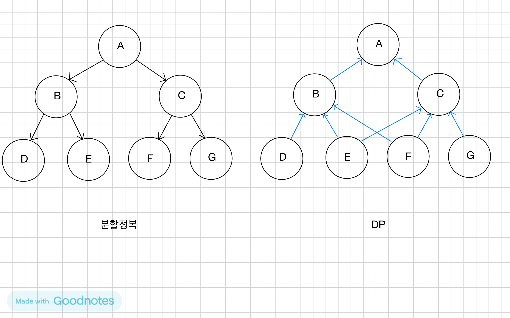
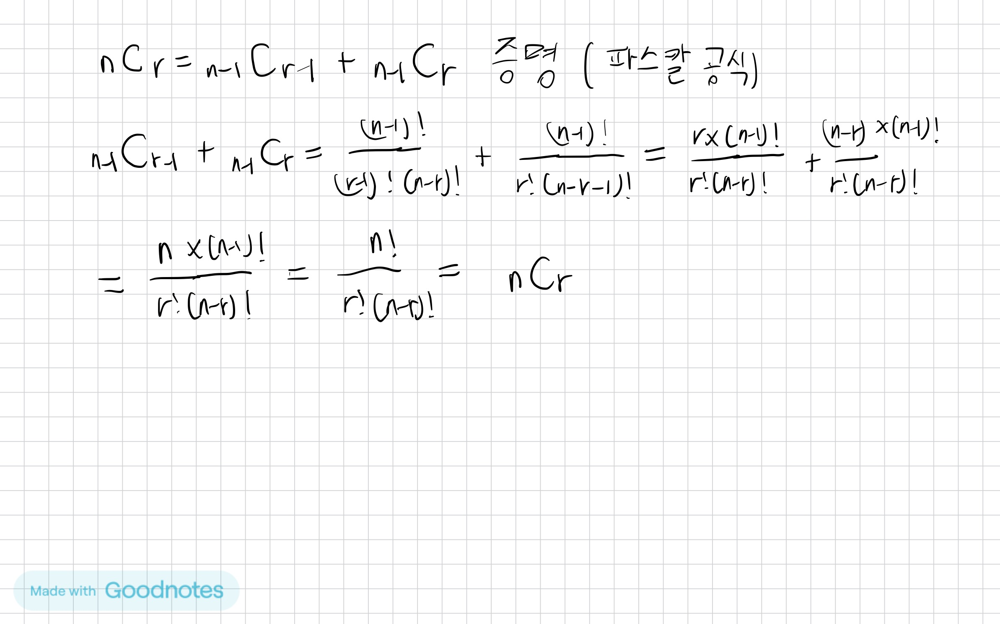
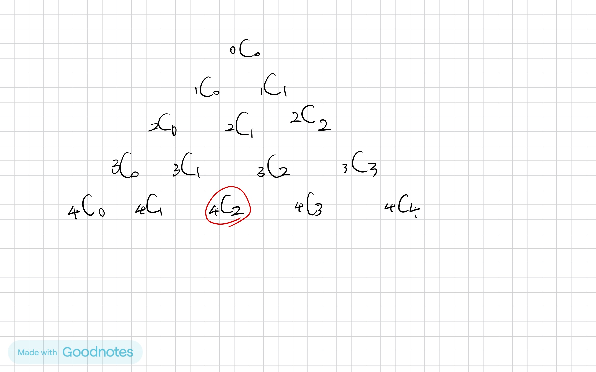
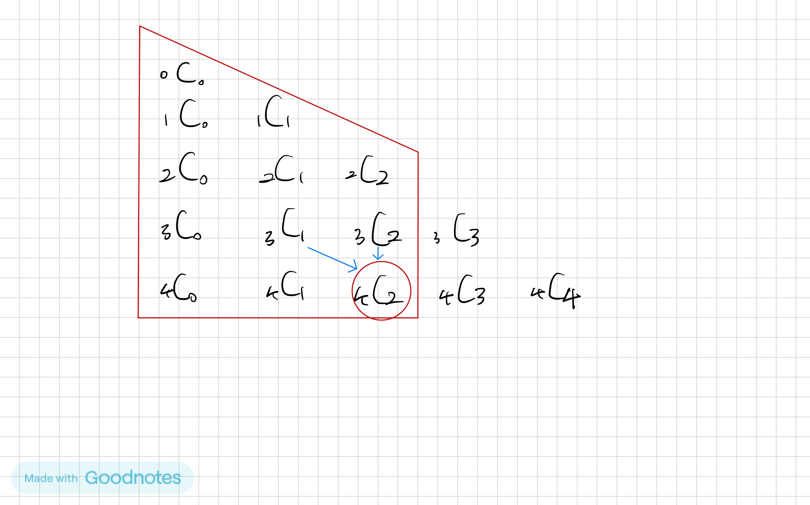

# 동적 계획법(Dynamic Programming)
<br>

## 다이나믹 프로그래밍의 적용 요건(언제 DP를 적용하면 좋을지 고민해보자)
- 중복 부분문제 구조(Overlapping subproblem)
    - 같은 부분 문제를 같은 방식으로 여러번 해결하면 해결할 수 있는가?
- 점화식을 사용하는 구조인지?
    > 참고로 점화식보다 일반식으로 적용할 수 있다면 일반식이 훨씬 성능이 좋다.  
예를 들어, 등차수열도 `a_n = a_(n-1) + d`로 표현한다면 O(N)의 시간복잡도가 걸리지만, 일반식 `a_n = a_1 + (n-1) * d`로 표현할 수 있다면 O(1)로 해결할 수 있기 때문이다.  
따라서 DP가 무조건 최적화의 만능이라고 오해해서는 안 된다.
- 최적 부분문제 구조(Optimal substructure)
    - 전체를 최적화하기 위해서는 부분 문제들 또한 최적화해야하는가?
    - 만약 큰 문제의 최적해가 작은 문제들의 최적 해들로 구성되지 않는다면 이 문제는 DP를 적용할 수 없다.

<br>

## 분할 정복 vs. DP
**분할 정복**
- 연관 없는 부분 문제로 분할한다.
    - 즉, 중복부분문제의 구조가 아니다.
    - 따라서 저장을 할 필요가 없고, 메모이제이션을 적용할 필요가 없다.
- 부분문제를 재귀적으로 해결한다.
- 부분문제의 해를 결합(combine)한다.
- 예: 병합 정렬, 퀵 정렬

<br>

**DP**
- 부분 문제들이 연관이 없으면 적용할 수 없다.
    - 즉, 부분 문제들은 더 작은 부분 문제들을 공유한다.(중복부분문제)
- 모든 부분 문제를 한 번만 계산하고 결과를 저장하고 재사용한다.


<br>

## 이항계수 활용

메모이제이션을 활용하기 위한 공식 증명은 아래와 같다.


파스칼의 삼각형은 아래와 같다.

이제부터 4C2를 구할 것이다.

파스칼의 삼각형의 모양을 이해하기 쉽게 직각삼각형 구조로 만들면, 빨간색으로 테두리된 곳 외의 곳은 불필요한 부분임을 알 수 있다.


이제 DP를 통해서 코드로 구현하면 다음과 같다.
```java
package example;

import java.io.*;
import java.util.*;

/**
 * 파스칼 공식을 활용한 이항계수
 */
public class BinomialCoefficientTest {

    // nCk
    public static void main(String[] args) throws Exception {
        BufferedReader br = new BufferedReader(new InputStreamReader(System.in));
        int N = Integer.parseInt(br.readLine());
        int K = Integer.parseInt(br.readLine());

//        int[][] B = new int[N + 1][N + 1];
        int[][] B = new int[N + 1][K + 1];

        for (int i = 0; i < N + 1; i++) {
//        for (int j = 0; j < i + 1; j++) {
          for (int j = 0, end = Math.min(i, K); j < end + 1; j++) {
                if (j == 0 || j == i) B[i][j] = 1;
                else B[i][j] = B[i - 1][j - 1] + B[i - 1][j];
                // nCk = (n-1)C(k-1) + (n-1)Ck
            }
        }

        for (int[] arr : B) {
            System.out.println(Arrays.toString(arr));
        }
        System.out.println(B[N][K]) ;
        br.close();
    }
}
```
입력
```text
4
2
```
출력
```text
[1, 0, 0]
[1, 1, 0]
[1, 2, 1]
[1, 3, 3]
[1, 4, 6]
6
```
> 참고로 주석친 부분으로 바꿔주면 빨간색 테두리 이외의 것까지 연산되어 사다리꼴이 아닌 삼각형이 완성이 된다.