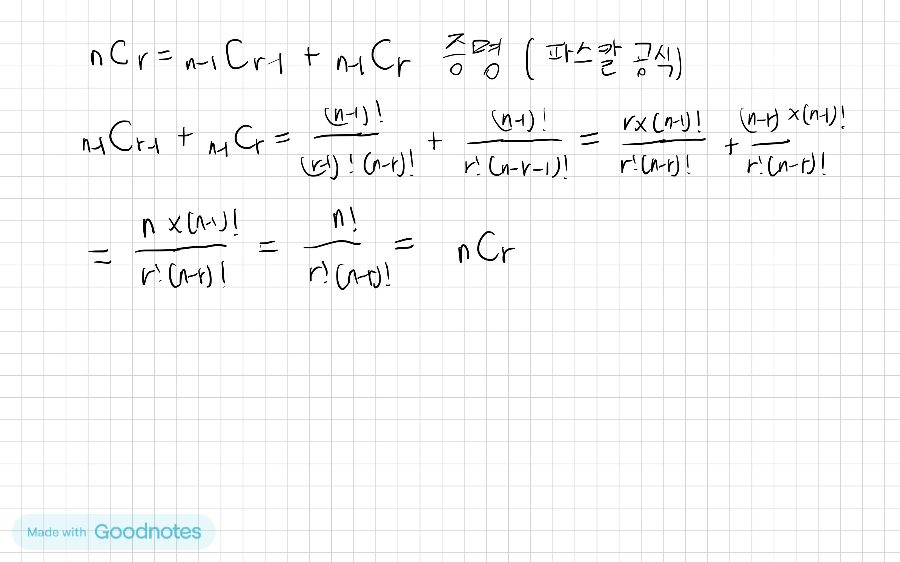

## 이항계수 활용

메모이제이션을 활용하기 위한 공식 증명은 아래와 같다.


파스칼의 삼각형은 아래와 같다.

이제부터 4C2를 구할 것이다.

파스칼의 삼각형의 모양을 이해하기 쉽게 직각삼각형 구조로 만들면, 빨간색으로 테두리된 곳 외의 곳은 불필요한 부분임을 알 수 있다.


이제 DP를 통해서 코드로 구현하면 다음과 같다.
```java
package example;

import java.io.*;
import java.util.*;

/**
 * 파스칼 공식을 활용한 이항계수
 */
public class BinomialCoefficientTest {

    // nCk
    public static void main(String[] args) throws Exception {
        BufferedReader br = new BufferedReader(new InputStreamReader(System.in));
        int N = Integer.parseInt(br.readLine());
        int K = Integer.parseInt(br.readLine());

//        int[][] B = new int[N + 1][N + 1];
        int[][] B = new int[N + 1][K + 1];

        for (int i = 0; i < N + 1; i++) {
//        for (int j = 0; j < i + 1; j++) {
          for (int j = 0, end = Math.min(i, K); j < end + 1; j++) {
                if (j == 0 || j == i) B[i][j] = 1;
                else B[i][j] = B[i - 1][j - 1] + B[i - 1][j];
                // nCk = (n-1)C(k-1) + (n-1)Ck
            }
        }

        for (int[] arr : B) {
            System.out.println(Arrays.toString(arr));
        }
        System.out.println(B[N][K]) ;
        br.close();
    }
}
```
입력
```text
4
2
```
출력
```text
[1, 0, 0]
[1, 1, 0]
[1, 2, 1]
[1, 3, 3]
[1, 4, 6]
6
```
> 참고로 주석친 부분으로 바꿔주면 빨간색 테두리 이외의 것까지 연산되어 사다리꼴이 아닌 삼각형이 완성이 된다.