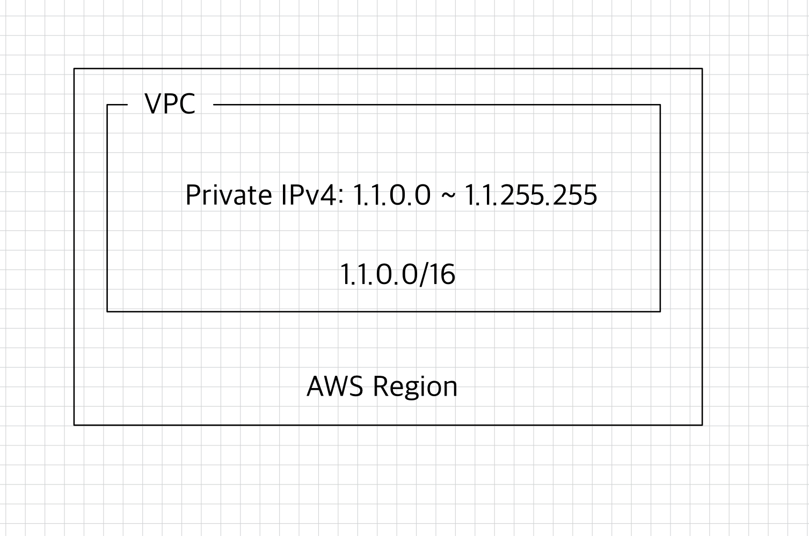
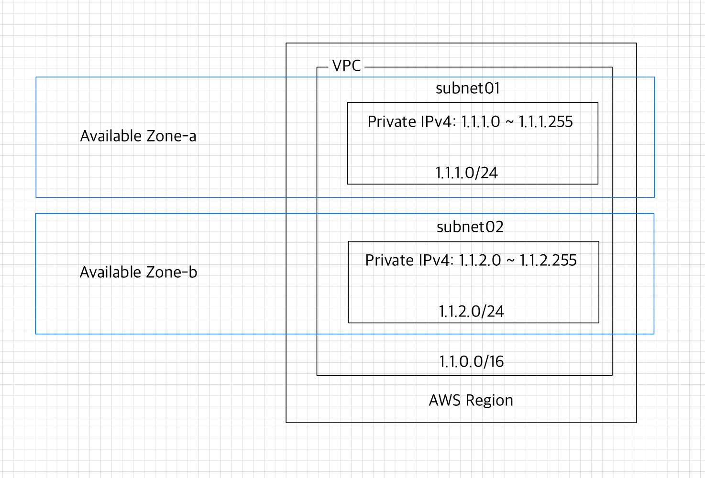

# 🧑🏻‍💻 AWS
## ❗️ 기본 용어
- [VPC](#-vpc)
- [AZ(Available Zone)](#-azavailable-zone)
- [서브넷(Subnet)](#-서브넷subnet)
- [인터넷 게이트웨이(Internet Gateway)](#-인터넷-게이트웨이internet-gateway)
- [라우팅 테이블](#-라우팅-테이블)
- [EBS](#-ebs)

### ✅ VPC
VPC는 Virtual Private Cloud의 약자로 사용자가 정의한 가상의 네트워크다.  
온프레미스에서 운영하는 내부 네트워크의 개념과 유사하다.  
1. 리전을 선택하고 특정 IP 대역을 VPC로 생성할 수 있다.
2. VPC로 생성한 네트워크 대역에 프라이빗 IP를 가진 EC2 인스턴스를 생성할 수 있다.
3. 네트워크 대역은 CIDR(Classless Inter-Domain Routing) 표기법으로 선언하여 할당한다.

### ✅ AZ(Available Zone)
AZ는 AWS 리전에 존재하는 개별 데이터 센터를 뜻한다.  
각 AZ는 다른 AZ와 물리적으로 구분되어 있기 때문에 AZ의 장애는 다른 AZ에 전파되지 않는다.  
동일 리전의 AZ 간에는 네트워크 지연이 매우 낮기 때문에 AZ 장애에 대응하여 다수의 AZ에 서비스를 다중 운영하면 안전하게 서비스를 운영할 수 있다.  
AWS의 서울 리전(ap-northeast-2)에서는 총 4개의 AZ(ap-northeast-2a, ap-northeast-2b, ap-northeast-2c, ap-northeast-2d)를 제공한다.

### ✅ 서브넷(Subnet)
서브넷은 VPC 내부에서 생성할 수 있는 네트워크 대역이다.  
서브넷을 만들 때는 VPC 네트워크 대역에 포함된 네트워크 영역을 지정해야 한다.  
VPC의 네트워크 대역을 넘어가는 IP를 가진 서브넷 영역은 생성할 수 없다.  
또한, 각 서브넷끼리는 네트워크 대역이 겹쳐서는 안 된다.  
서브넷은 단일 AZ에만 존재하며, 여러 AZ에 걸쳐서 AZ를 생성할 수 없다.  

  

### ✅ 인터넷 게이트웨이(Internet Gateway)
인터넷 게이트웨이가 설정되지 않은 서브넷은 구글, 네이버와 같은 퍼블릭 네트워크와 통신할 수 없다.  
그렇기 때문에 서브넷의 네트워크 영역에 생성된 EC2 인스턴스가 퍼블릭 네트워크와 연결하기 위해서는 인터넷 게이트웨이를 설정해야 한다.  
이렇게 인터넷 게이트웨이를 설정한 서브넷을 '퍼블릭 서브넷'이라고 한다.  
반면, 인터넷 게이트웨이가 설정되지 않은 서브넷을 '프라이빗 서브넷'이라고 한다.  
퍼블릭 서브넷에서 EC2 인스턴스를 생성하면 퍼블릭 네트워크에서 접속할 수 있도록 퍼블릭 IP가 할당된다.

### ✅ 라우팅 테이블
VPC, 인터넷 게이트웨이, VPN 연결 시 서브넷 간 패킷 전달 규칙을 지정한다.  
VPC의 각 서브넷은 1개 이상 라우팅 테이블과 연결되어 있다. 

  

### ✅ EBS
Elastic Block Store라고 불리는 'EBS'는 EC2 인스턴스에서 사용할 수 있도록 설계된 볼륨 스토리지 서비스이다.  
EC2 인스턴스와 연결된 EBS는 파일 시스템으로 사용할 수 있다.

