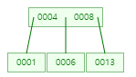
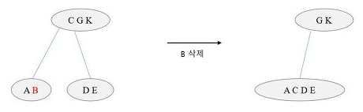

# 💻 B-Tree 와 B+Tree
### 🤔 M원 검색 트리(M-way Search Tree)
B-Tree 이전에 먼저 M원 검색 트리부터 살펴봐야한다.  
이진 탐색 트리는 차수는 2이기 때문에 높이가 커지게 되는 문제점이 있다.  
M원 검색 트리는 차수를 2에서 M개로 늘려 문제점을 해결하였다.  

특징
1. 각 노트는 M-1개의 레코드와 M개의 서브트리를 가질 수 있다.
2. 이진 탐색 트리의 확장된 형태로 높이를 줄일 수 있다.
3. 각 노드안에서는 정렬되어 있다.  
  
**원소 개수가 M개가 아니고 차수가 M개인 것이 중요하다.**

## ✅ B-Tree
M-way Search Tree 로 높이는 많이 줄였지만 균형이 맞지 않다는 문제가 있다.  
B-Tree 에서는 아래의 특징을 가지며 균형을 유지한다.  

특징
1. 모든 단말 노드는 같은 레벨에 있다.
2. 루트 노드와 단말 노드를 제외한 모든 노드는 (M/2) 이상 M 이하의 자식을 갖는다.
3. 루트 노드는 적어도 2개의 자식을 갖는다.
4. 각 노드의 원소 수는 최소 (M/2)-1개 ~ 최대 M-1개를 가진다.
   - 최소 개수 이하: underflow
   - 최대 개수 이상: overflow

### 💡데이터 삽입
1. 데이터는 항상 단말 노드에 추가된다.
2. 추가될 단말 노드에 여유 공간이 있다면 그냥 삽입, 없다면 분할한다.
3. 분할 규칙은 아래와 같다.
   1. 루트 노드가 가득 찼을 경우  
      
   2. 루트 노드 이외에 노드가 가득 찼을 경우  
          

 

**예시) 차수가 3인 B-Tree 데이터 삽입(1, 8, 4, 6, 13, 5 27, 9)**    
1, 8 삽입  
  
 
4삽입 후 분할  
  
  
 
6 삽입  
  
 
13 삽입 후 분할  
  
  
 
5 삽입  
  
 
27 삽입  
  
 
9 삽입 후 분할  
  
  
  
 

### 💡 데이터 삭제
만약 삭제해도 B-Tree 조건을 만족한다면 아무런 과정이 필요없다.  
하지만 B-Tree 구조가 깨진다면 다시 맞춰줘야 한다.  

 

**Case 1. 단말 노드 삭제**  
5차 B-Tree 를 예시로 든다.
1. 빌리기: 형제 노드가 (M/2)-1개보다 많은 데이터를 가지고 있을 경우  
  
2. 결합하기: 형제 노드에서 빌릴 수 없는 경우  
  
 

**Case 2. 단말 노드 이외 노드 삭제**  
- 대체 키와 위치를 바꾼 뒤 삭제하면 된다.
- 대체 키는 왼쪽 서브트리 중 가장 큰 값 or 오른쪽 서브트리 중 가장 작은 값이다.

 

**예시) 8 삭제**  
  
 
왼쪽 서브트리 중 가장 큰 값인 6과 자리 변경  
  

 

## ✅ B+Tree
  
B+Tree 는 B-Tree 의 변형된 형태로 데이터의 효율적인 삽입, 검색, 삭제를 추구하는 자료구조다.  
B-Tree 와 달리 삽입, 삭제 연산이 단말 노드에서만 이루어지며 단말 노드끼리 연결리스트로 연결되어 있다.  
단말 노드가 순차집합 연결되어있기 때문에 순차적인 탐색에 유리하다.

### 💡 데이터 삽입
1. 단말 노드가 가득 찼을 경우 → 중간값을 부모노드로 올리고 분할한다.  
   4 삽입 예시  
     
     
     
   4를 넣었더니 노드가 꽉차서 [2] [3, 4]로 분열한 뒤 부모노드로 중간값 3이 올라간 모습이다.

2. 내부 노드가 가득 찼을 경우  
   5 삽입 예시  
     
   - 5를 넣었더니 노드가 꽉찼다.  

   
   - [3], [4, 5] 노드로 분열한 뒤 중간값인 4를 부모노드로 올린다.
   
     
    - 부모노드도 꽉차서 중간값인 3을 부모로 올리고 [2], [4]로 분열한다.
    - 이때 중요한 것이 index set은 분열할 때 [3, 4]으로 되지 않는다는 것이다.

 

### 💡 데이터 삭제
B+Tree 에서 데이터 삭제는 단말노드에서만 일어나기 때문에 내부노드는 신경쓸 필요가 없다.  
 
**Case 1. 삭제한 노드가 underflow 가 아닐 때 → 부모노드만 수정해주면 된다.**  
  
  
 
**Case 2. 삭제한 노드가 underflow 일 때 → 형제노드에게 값을 빌린 후 부모노드 수정**  
  
  
 
**Case 3. 형제노드도 underflow 라면?**  
위에서는 계속 3차 B+Tree 예시였지만, 여기서는 5차 B+Tree 로 예시를 든다.  
  
4 데이터를 삭제한다.  
 
  
삭제하였지만 형제노드도 underflow 상태라 병합을 진행한다.  
 
  
병합 후 부모노드 수정  

## ✅ 정리
B-Tree 는 BTS 의 높이를 줄이기 위해 등장한 M원 탐색트리의 좌우 균형을 맞추기 위해 등장하였다.  
B+Tree 는 순차 탐색이 힘들다는 B-Tree 를 보완하기 위해 등장하였다.  
직접 탐색의 경우 B-Tree 와 B+Tree 나 성능이 비슷하지만 순차 탐색의 경우 B+Tree 의 성능이 뛰어나다.  

B+Tree 로 더 연습이 하고 싶다면 아래의 사이트를 활용하자.  
[B+트리 시각화 사이트 링크](https://www.cs.usfca.edu/~galles/visualization/BPlusTree.html)

**참고 자료**  
[[자료구조] B트리와 B+트리 ](https://m.blog.naver.com/shekwl24/222245938621)