# 💻 B-Tree 와 B+Tree
<hr>

- [🤔 M원 검색 트리(M-way Search Tree)](#-m원-검색-트리m-way-search-tree)
- [✅ B-Tree](#-b-tree)
- [✅ B+Tree](#-btree)

### 🤔 M원 검색 트리(M-way Search Tree)
B-Tree 이전에 먼저 M원 검색 트리부터 살펴봐야한다.  
이진 탐색 트리는 차수는 2이기 때문에 높이가 커지게 되는 문제점이 있다.  
M원 검색 트리는 차수를 2에서 M개로 늘려 문제점을 해결하였다.  

특징
1. 각 노트는 M-1개의 레코드와 M개의 서브트리를 가질 수 있다.
2. 이진 탐색 트리의 확장된 형태로 높이를 줄일 수 있다.
3. 각 노드안에서는 정렬되어 있다.  
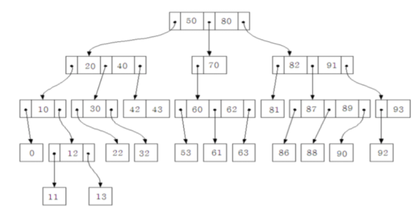  
**원소 개수가 M개가 아니고 차수가 M개인 것이 중요하다.**

## ✅ B-Tree
<hr>

- [💡 구조 및 특성](#-구조-및-특성)
- [💡 데이터 삽입](#-데이터-삽입)
- [💡 데이터 삭제](#-데이터-삭제)
- [❗️ B-Tree 인덱스 키 추가 및 삭제](#-b-tree-인덱스-키-추가-및-삭제)
- [💡 B-Tree 인덱스 사용에 영향을 미치는 요소](#-b-tree-인덱스-사용에-영향을-미치는-요소)

> [!IMPORTANT]
> 시간복잡도: `O(longN)`
- B-tree란 자식 노드가 2개 이상인 트리
- 균형 트리(Balanced Tree)로서, 최상위 루트 노드에서 리프 노드까지의 거리가 모두 동일하다.
   - ❗️ Binary Tree가 아니다.

### 💡 구조 및 특성
<hr>

> [!NOTE]
> B-Tree는 트리 구조의 최상위에 하나의 Root Node가 존재하고, 그 하위에 자식 노드가 붙어 있는 형태다.  
> 가장 하위에 붙어 있는 노드가 Leaf Node, 중간의 노드를 Branch Node라고 한다.  
> 데이터베이스에서 인덱스와 실제 데이터가 저장된 데이터는 따로 관리되는데, 인덱스의 Leaf Node는 항상 실제 데이터 레코드를 찾아가기 위한 주솟값을 가지고 있다.

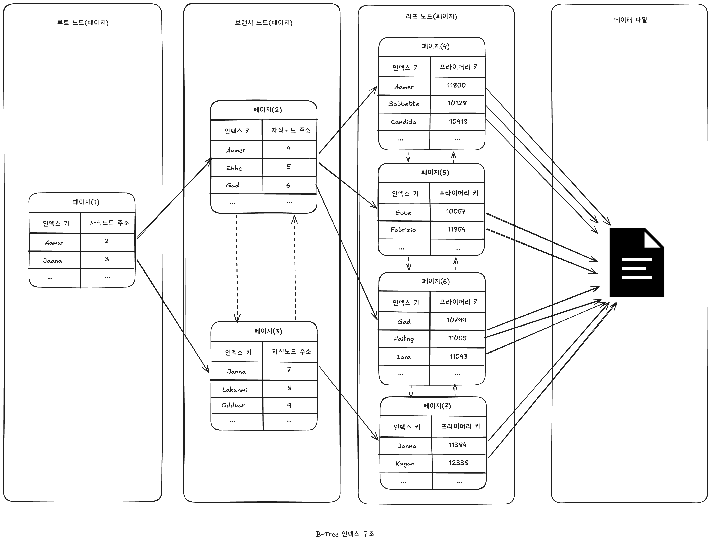  
위 그림과 같이, 인덱스의 키 값은 모두 정렬돼 있지만, 데이터 파일의 레코드는 정렬돼 있지 않고 임의의 순서로 저장돼 있다.

> [!TIP]
> 대부분의 RDBMS의 데이터 파일에서 레코드는 특정 기준으로 정렬되지 않고 임의의 순서로 저장된다.  
> 하지만 MySQL의 InnoDB 테이블에서 레코드는 클러스터되어 디스크에 저장되므로 기본적으로 프라이머리 키 순서로 정렬되어 저장된다.  
> ➡️ 이는 오라클의 IOT(Index organized table)이나 MS-SQL의 클러스터 테이블과 같은 구조를 말한다.  
> 다른 DBMS에서는 클러스터링 기능이 선택 사항이지만, MySQL의 InnoDB에서는 사용자가 별도의 명령이나 옵션을 선택하지 않아도 디폴트로 클러스터링 테이블이 생성된다.


M-way Search Tree 로 높이는 많이 줄였지만 균형이 맞지 않다는 문제가 있다.  
B-Tree 에서는 아래의 특징을 가지며 균형을 유지한다.  

특징
1. 모든 단말 노드는 같은 레벨에 있다.
2. 루트 노드와 단말 노드를 제외한 모든 노드는 (M/2) 이상 M 이하의 자식을 갖는다.
3. 루트 노드는 적어도 2개의 자식을 갖는다.
4. 각 노드의 원소 수는 최소 (M/2)-1개 ~ 최대 M-1개를 가진다.
   - 최소 개수 이하: underflow
   - 최대 개수 이상: overflow

### 💡 데이터 삽입
1. 데이터는 항상 단말 노드에 추가된다.
2. 추가될 단말 노드에 여유 공간이 있다면 그냥 삽입, 없다면 분할한다.
3. 분할 규칙은 아래와 같다.
   1. 루트 노드가 가득 찼을 경우  
      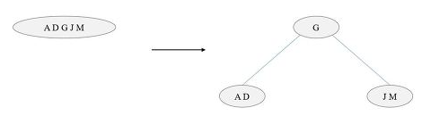
   2. 루트 노드 이외에 노드가 가득 찼을 경우  
      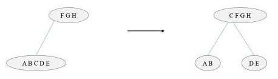    

<br>

**예시) 차수가 3인 B-Tree 데이터 삽입(1, 8, 4, 6, 13, 5 27, 9)**    
1, 8 삽입  
  
<br>
4삽입 후 분할  
  
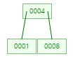  
<br>
6 삽입  
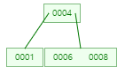  
<br>
13 삽입 후 분할  
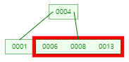  
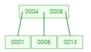  
<br>
5 삽입  
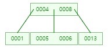  
<br>
27 삽입  
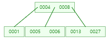  
<br>
9 삽입 후 분할  
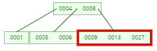  
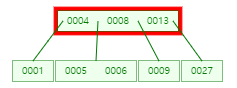  
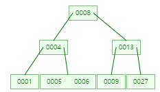  
<br>

### 💡 데이터 삭제
만약 삭제해도 B-Tree 조건을 만족한다면 아무런 과정이 필요없다.  
하지만 B-Tree 구조가 깨진다면 다시 맞춰줘야 한다.

<br>

**Case 1. 단말 노드 삭제**  
5차 B-Tree 를 예시로 든다.
1. 빌리기: 형제 노드가 (M/2)-1개보다 많은 데이터를 가지고 있을 경우  
   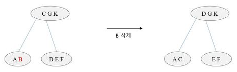
2. 결합하기: 형제 노드에서 빌릴 수 없는 경우  
   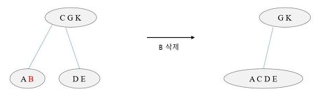  
   <br>

**Case 2. 단말 노드 이외 노드 삭제**
- 대체 키와 위치를 바꾼 뒤 삭제하면 된다.
- 대체 키는 왼쪽 서브트리 중 가장 큰 값 or 오른쪽 서브트리 중 가장 작은 값이다.

<br>

**예시) 8 삭제**  
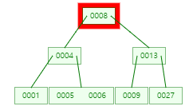  
<br>
왼쪽 서브트리 중 가장 큰 값인 6과 자리 변경  
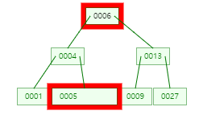  
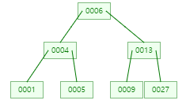

<br>


### ❗️ B-Tree 인덱스 키 추가 및 삭제
<hr>

- [🚀 B-Tree 인덱스 추가](#-b-tree-인덱스-추가)
- [🚀 B-Tree 인덱스 키 삭제](#-b-tree-인덱스-키-삭제)
- [🚀 B-Tree 인덱스 키 변경](#-b-tree-인덱스-키-변경)
- [🚀 인덱스 키 검색](#-인덱스-키-검색)

#### 🚀 B-Tree 인덱스 추가
> [!IMPORTANT]
> 새로운 키 값이 B-Tree에 저장될 때 테이블의 스토리지 엔진에 따라 새로운 키 값이 즉시 인덱스에 저장될 수도 있고, 그렇지 않을 수도 있다.  
> B-Tree에 저장될 때
> 1. 저장될 키 값을 이용해 B-Tree상의 적절한 위치를 검색해야 한다.
> 2. 저장될 위치가 결정되면 레코드의 키 값과 대상 레코드의 주소 정보를 B-Tree의 리프 노드에 저장한다.
> 3. 리프 노드가 꽉 차서 더는 저장할 수 없을 때는 리프 노드가 분리돼야 하는데, 이는 상위 브랜치 노드까지 처리의 범위가 넓어진다.
> 
> ➡️ B-Tree는 상대적으로 쓰기 작업에 비용이 많이 드는 것으로 알려졌다.

> [!TIP]
> 인덱스 추가로 인해 INSERT나 UPDATE 문장이 어떤 영향을 받을지 궁금하다.  
> 대략적으로 계산하는 방법은 테이블에 레코드를 추가하는 작업 비용을 1이라고 가정하면, 해당 테이블의 인덱스에 키를 추가하는 작업 비용을 1.5 정도로 예측하는 것이다.  
> ➡️ 테이블에 인덱스가 B-Tree 구조로 3개가 있다면, 5.5(= 1.5 * 3 + 1) 정도의 비용으로 예측한다.  
> ❗️ 중요한 것은 이 비용의 대부분이 메모리와 CPU에서 처리하는 시간이 아니라 디스크로부터 인덱스 페이지를 읽고 쓰기를 해야 해서 걸리는 시간이라는 점이다.  
> 
> MySQL의 MyISAM이나 MEMORY 스토리지 엔진의 경우 INSERT 문장이 실행되면 즉시 새로운 키 값을 B-Tree 인덱스에 변경한다.
> 
> 하지만 InnoDB 스토리지 엔진은 체인지 버퍼가 있어 인덱스 키 추가 작업을 지연시켜 나중에 처리할 수 있다.  
> 물론 프라이머리 키나 유니크 인덱스의 경우 중복 체크가 필요하기 때문에 즉시 B-Tree에 추가하거나 삭제한다.

<br>


#### 🚀 B-Tree 인덱스 키 삭제
> [!IMPORTANT]
> MySQL의 경우 B-Tree의 키 값이 삭제되는 경우는 상당히 간단하다.  
> 해당 키 값이 저장된 B-Tree의 리프 노드를 찾아서 그냥 삭제 마크만 하면 작업이 완료된다.  
> 이렇게 삭제 마킹된 인덱스 키 공간은 계속 그대로 방치하거나 재활용할 수 있다.  
> ✔️ 인덱스 키 삭제로 인한 마킹 작업 또한 디스크 쓰기가 필요하므로 이 작업 역시 디스크 I/O가 필요한 작업이다.  
> 
> InnoDB 스토리지 엔진에서는 이 작업 또한 버퍼링되어 지연 처리될 수 있다.  
> MyISAM이나 MEMORY 스토리지 엔진의 경우, 체인지 버퍼와 같은 기능이 없으므로 인덱스 키 삭제가 완료된 후 쿼리 실행이 완료된다. 

<br>

#### 🚀 B-Tree 인덱스 키 변경
> [!TIP]
> 인덱스의 키 값은 그 값에 따라 저장될 리프 노드의 위치가 결정되므로 B-Tree의 키 값이 변경되는 경우에는 단순히 인덱스상의 키 값만 변경하는 것은 불가능하다.  
> B-Tree의 키 값 변경 작업은 먼저 키 값을 삭제한 후, 다시 새로운 키 값을 추가하는 형태로 처리된다.  
> InnoDB 스토리지 엔진을 사용하는 테이블에 대해서는 이 작업 모두 체인지 버퍼를 활용해 지연 처리될 수 있다.

<br>

#### 🚀 인덱스 키 검색
> [!NOTE]
> INSERT, UPDATE, DELETE 작업을 할 때 인덱스 관리에 따르는 추가 비용을 감당하면서 인덱스를 구축하는 이유는 바로 빠른 검색을 위해서다.  
> 인덱스 트리 탐색은 SELECT에서만 사용하는 것이 아니라 UPDATE나 DELETE를 처리하기 위해 항상 해당 레코드를 먼저 검색해야 할 경우에도 사용된다.  

> [!CAUTION]
> B-Tree 인덱스를 이용한 검색은 100% 일치 값 또는 값의 앞 부분(Left-most part)만 일치하는 경우에 사용할 수 있다.  
> 부등호 비교 조건에서도 인덱스를 활용할 수 있지만, 인덱스를 구성하는 키 값의 뒷부분만 검색하는 용도로는 인덱스를 사용할 수 없다.  
> 또한 인덱스를 이용한 검색에서 중요한 사실은 인덱스의 키 값에 변형이 가해진 후 비교되는 경우에는 절대 B-Tree의 빠른 검색 기능을 사용할 수 없다는 것이다.  
> ➡️ 함수나 연산을 수행한 결과로 정렬한다거나 검색하는 작업은 B-Tree의 장점을 이용할 수 없으므로 주의해야 한다.

<br>

### 💡 B-Tree 인덱스 사용에 영향을 미치는 요소
<hr>

- [🚀 인덱스 키 값의 크기](#-인덱스-키-값의-크기)
- [🚀 B-Tree 깊이](#-b-tree-깊이)
- [🚀 선택도(기수성)](#-선택도기수성)
- [🚀 읽어야 하는 레코드의 건수](#-읽어야-하는-레코드의-건수)

> [!NOTE]
> B-Tree 인덱스는 인덱스를 구성하는 칼럼의 크기와 레코드의 건수, 그리고 유니크한 인덱스 키 값의 개수 등에 의해 검색이나 변경 작업의 성능에 영향을 받는다.

<br>

#### 🚀 인덱스 키 값의 크기

> [!NOTE]
> InnoDB 스토리지 엔진은 디스크에 데이터를 저장하는 기본 단위를 페이지(Page) 또는 블록(Block)이라고 하며, 디스크의 모든 읽기 및 쓰기 작업의 최소 작업 단위가 된다.  
> 또한 페이지는 InnoDB 스토리지 엔진의 버퍼 풀에서 데이터를 버퍼링하는 기본 단위이기도 하다.  
> 인덱스도 결국은 페이지 단위로 관리되며, 상단에 [B-Tree 구조 및 특성](#-구조-및-특성)에 작성된 그림에서 루트와 브랜치, 리프 노드를 구분한 기준이 바로 페이지 단위다.

> [!IMPORTANT]
> DBMS의 B-Tree는 자식 노드의 개수가 가변적인 구조다.  
> MySQL의 B-Tree는 자식 노드를 몇 개까지 가질까?  
> ➡️ 인덱스의 페이지 크기와 키 값의 크기에 따라 결정된다.

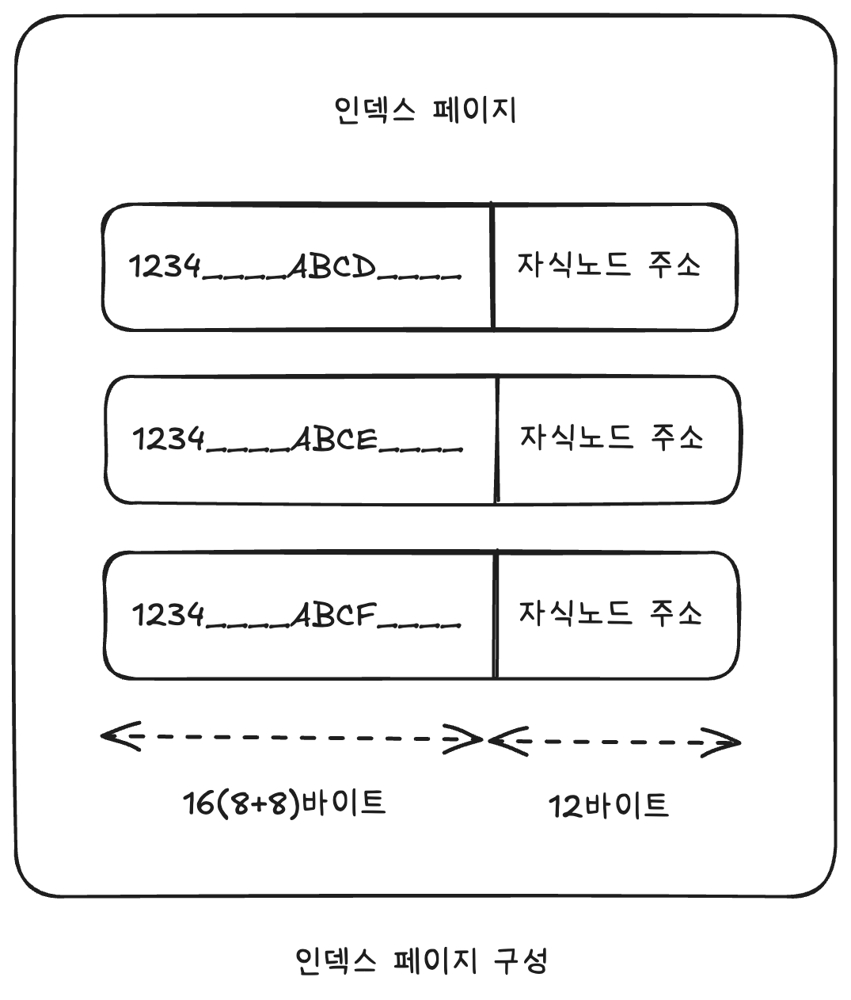  
> [!NOTE]
> MySQL 5.7 버전부터는 InnoDB 스토리지 엔진의 페이지 크기를 `innodb_page_size` 시스템 변수를 이용해 4~64KB 사이의 값을 선택할 수 있지만 기본값은 16KB고, 여기서는 16KB를 기준으로 작성하겠다.  
> 인덱스의 키가 16바이트라고 가정했을 때, 위 그림과 같이 인덱스 페이지가 구성될 것이다.  
> 자식 노드 주소라는 것은 여러 가지 복합적인 정보가 담긴 영역이며, 페이지의 종류 별로 대략 6~12바이트까지 다양한 크기의 값을 가질 수 있지만, 편의상 여기에서는 12바이트로 구성된다고 가정한다.

> [!IMPORTANT]
> 위 구성에서 하나의 인덱스 페이지(16KB)에 몇 개의 키를 저장할 수 있을까?  
> `16 * 1024 / (16 + 12) = 585`개 저장할 수 있다.  

> [!CAUTION]
> 인덱스 키 값이 커지면 어떤 현상이 발생할까?  
> 위의 경우, 키 값의 크기가 두 배인 32바이트로 늘어났다고 가정하면 한 페이지에 인덱스 키를 `16 * 1024 / (32 + 12) = 372`개 저장할 수 있다.  
> ➡️ SELECT 쿼리가 레코드 500개를 읽어야 한다면 인덱스 키 값이 늘어나기 전에는 인덱스 페이지 한 번으로 해결될 수 있지만, 후자는 최소한 2번 이상의 디스크로부터 읽어야 하고, 그만큼 느려지는 것이다.  
> 
> 또한 인덱스 키 값의 길이가 길어진다는 것은 전체적인 인덱스의 크기가 커진다는 것을 의미한다.  
> 인덱스를 캐시해두는 InnoDB 버퍼 풀이나 MyISAM의 키 캐시 영역은 크기가 제한적이기 때문에, 하나의 레코드를 위한 인덱스의 크기가 커지면 커질수록 메모리에 캐시해둘 수 있는 레코드 수는 줄어든다.  
> ➡️ 메모리의 효율이 떨어지는 결과를 가져오는 것이다.

<br>

#### 🚀 B-Tree 깊이
> [!IMPORTANT]
> 인덱스의 B-Tree 깊이가 3인 경우, 위 예제와 마찬가지로 키 값이 16바이트인 경우에는 최대 2억(585 * 585 * 585)개 정도의 키 값을 담을 수 있지만, 키 값이 32바이트로 늘어나면 5천만(372 * 372 * 372)개로 줄어든다.  
> ➡️ 인덱스 키 값의 크기가 커지면 커질수록 하나의 인덱스 페이지가 담을 수 있는 인덱스 키 값의 개수가 적어지고, 그 때문에 같은 레코드 건수라 하더라도 B-Tree의 깊이가 깊어져서 디스크 읽기가 더 많이 필요하게 된다.  
> ❗️ 실제로는 아무리 대용량 데이터베이스라도 B-Tree의 깊이(Depth)가 5단계 이상까지 깊어지는 경우는 흔치 않다.

<br>

#### 🚀 선택도(기수성)
> [!NOTE]
> 인덱스에서 선택도(Selectivity) 또는 기수성(Cardinality)은 거의 같은 의미로 사용되며, 모든 인덱스 키 값 가운데 유니크한 값의 수를 의미한다.  
> ➡️ 전체 인덱스 키 값은 100개인데, 그 중에서 유니크한 값의 수는 10개라면 기수성은 10이다.  
> ➡️ 인덱스 키 값 가운데 중복된 값이 많아지면 기수성은 낮아지고, 동시에 선택도 또한 떨어진다.  
> 인덱스는 선택도가 높을수록 검색 대상이 줄어들기 때문에 그만큼 빠르게 처리된다.

> 선택도가 좋지 않다고 하더라도 정렬이나 그루핑과 같은 작업을 위해 인덱스를 만드는 것이 훨씬 나은 경우도 많다.  
> 인덱스가 항상 검색에만 사용되는 것은 아니므로 여러 가지 용도를 고려해서 적절히 인덱스를 설계할 필요가 있다.

<br>

> [!NOTE]
> 예시를 들어서 보자.  
> `country`라는 컬럼과 `city`라는 컬럼을 포함한 `tb_test` 테이블이 있다.  
> `tb_test` 테이블은 전체 레코드 건수는 1만 건이고, `country` 컬럼으로만 인덱스가 생성된 상태다.  
> - 케이스 A: country 컬럼의 유니크한 값의 개수가 10개
> - 케이스 B: country 컬럼의 유니크한 값의 개수가 1,000개


```mysql
mysql> SELECT *
       FROM tb_test
       WHERE country = 'KOREA'
         and city = 'SEOUL';
```

> [!IMPORTANT]
> A 케이스의 경우 평균 1,000건, B 케이스의 경우 평균 10건이 조회되는 것으로 예측할 수 있다.  
> A 케이스와 B 케이스 모두 실제 모든 조건을 만족하는 레코드가 단 1건만 있었다면 A 케이스의 인덱스는 적합하지 않은 것이라고 볼 수 있다.  
> ➡️ A 케이스는 1건의 레코드를 위해 쓸모없는 999건의 레코드를 더 읽은 것이지만, B 케이스는 9건만 더 읽은 것이다.  
> ❗️ 물론 필요한 만큼의 레코드만 정확하게 읽을 수 있다면 최상이겠지만 현실적으로 모든 조건을 만족하게 인덱스를 생성한다는 것은 불가능하므로 이 정도의 낭비는 무시할 수 있다.

<br>

#### 🚀 읽어야 하는 레코드의 건수
> [!TIP]
> 인덱스를 통해 테이블의 레코드를 읽는 것은 인덱스를 거치지 않고 바로 테이블의 레코드를 읽는 것보다 높은 비용이 드는 작업이다.  
> 테이블에 레코드가 100만 건이 저장돼 있는데, 그 중에서 50만 건을 읽어야 하는 쿼리가 있다고 가정해 보자.  
> 이 작업은 전체 테이블을 모두 읽어서 필요 없는 50만 건을 버리는 것이 효율적일지, 인덱스를 통해 필요한 50만 건만 읽어 오는 것이 효율적일지 판단해야 한다.
> 인덱스를 이용한 읽기의 손익 분기점이 얼마인지 판단할 필요가 있는데, 일반적인 DBMS 옵티마이저에서는 인덱스를 통해 레코드 1건을 읽는 것이 테이블에서 직접 레코드 1건을 읽는 것보다 4~5배 정도 비용이 더 많이 드는 작업인 것으로 예측한다.  
> ➡️ 인덱스를 통해 읽어야 할 레코드의 건수가 전체 테이블 레코드의 20~25%를 넘어서면 인덱스를 이용하지 않고 테이블을 모두 직접 읽어서 필요한 레코드만 필터링 방식으로 처리하는 것이 효율적이다.


<br>

## ✅ B+Tree
  
B+Tree 는 B-Tree 의 변형된 형태로 데이터의 효율적인 삽입, 검색, 삭제를 추구하는 자료구조다.  
B-Tree 와 달리 삽입, 삭제 연산이 단말 노드에서만 이루어지며 단말 노드끼리 연결리스트로 연결되어 있다.  
단말 노드가 순차집합 연결되어있기 때문에 순차적인 탐색에 유리하다.

### 💡 데이터 삽입
1. 단말 노드가 가득 찼을 경우 → 중간값을 부모노드로 올리고 분할한다.  
   4 삽입 예시  
   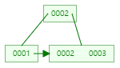  
   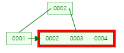  
     
   4를 넣었더니 노드가 꽉차서 [2] [3, 4]로 분열한 뒤 부모노드로 중간값 3이 올라간 모습이다.

2. 내부 노드가 가득 찼을 경우  
   5 삽입 예시  
   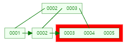  
   - 5를 넣었더니 노드가 꽉찼다.  

   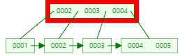
   - [3], [4, 5] 노드로 분열한 뒤 중간값인 4를 부모노드로 올린다.
   
     
    - 부모노드도 꽉차서 중간값인 3을 부모로 올리고 [2], [4]로 분열한다.
    - 이때 중요한 것이 index set은 분열할 때 [3, 4]으로 되지 않는다는 것이다.

<br>

### 💡 데이터 삭제
B+Tree 에서 데이터 삭제는 단말노드에서만 일어나기 때문에 내부노드는 신경쓸 필요가 없다.  
<br>
**Case 1. 삭제한 노드가 underflow 가 아닐 때 → 부모노드만 수정해주면 된다.**  
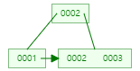  
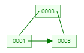  
<br>
**Case 2. 삭제한 노드가 underflow 일 때 → 형제노드에게 값을 빌린 후 부모노드 수정**  
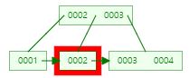  
  
<br>
**Case 3. 형제노드도 underflow 라면?**  
위에서는 계속 3차 B+Tree 예시였지만, 여기서는 5차 B+Tree 로 예시를 든다.  
  
4 데이터를 삭제한다.  
<br>
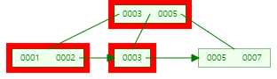  
삭제하였지만 형제노드도 underflow 상태라 병합을 진행한다.  
<br>
  
병합 후 부모노드 수정  

## ✅ 정리
B-Tree 는 BTS 의 높이를 줄이기 위해 등장한 M원 탐색트리의 좌우 균형을 맞추기 위해 등장하였다.  
B+Tree 는 순차 탐색이 힘들다는 B-Tree 를 보완하기 위해 등장하였다.  
직접 탐색의 경우 B-Tree 와 B+Tree 나 성능이 비슷하지만 순차 탐색의 경우 B+Tree 의 성능이 뛰어나다.  

B+Tree 로 더 연습이 하고 싶다면 아래의 사이트를 활용하자.  
[B+트리 시각화 사이트 링크](https://www.cs.usfca.edu/~galles/visualization/BPlusTree.html)

**참고 자료**  
[[자료구조] B트리와 B+트리 ](https://m.blog.naver.com/shekwl24/222245938621)  
[Real MySQL 8.0](https://product.kyobobook.co.kr/detail/S000001766482)
