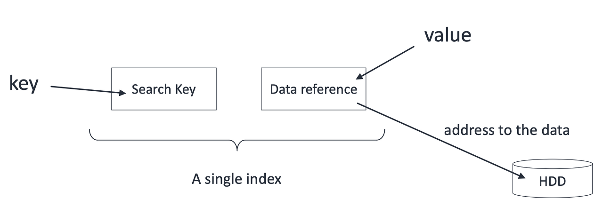
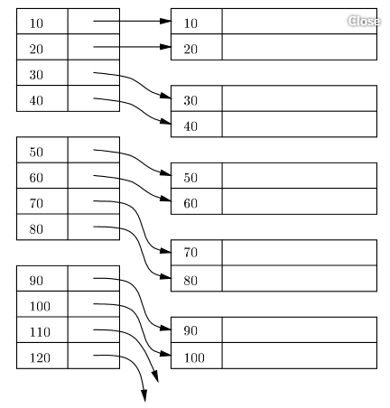
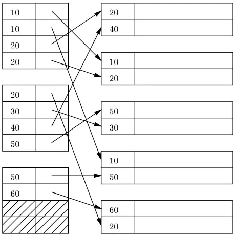
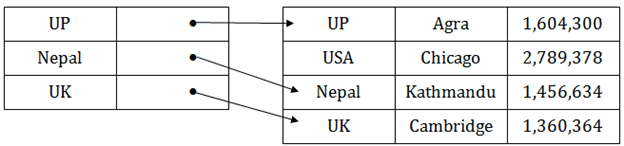
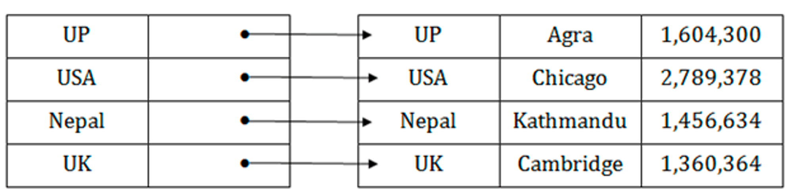
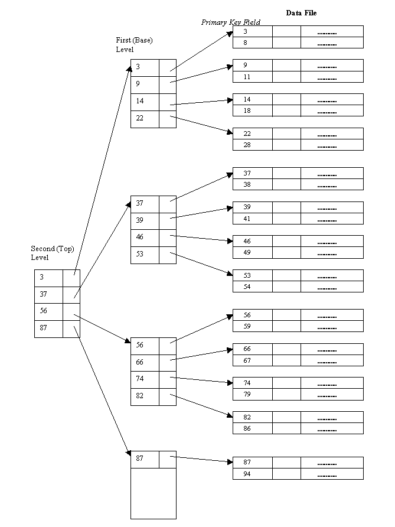
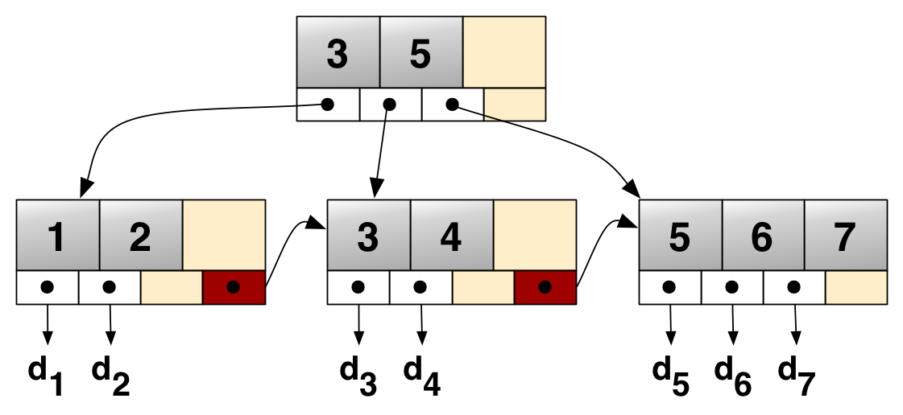

# 인덱스(Index)
## ✔️ DB 테이블에 인덱스가 필요한 이유
<hr>
### 만약 table에 index를 걸지 않는다면?
```sql
SELECT *
FROM customer
WHERE first_name = "charles";
```
=> 원하는 데이터를 찾고 싶을 때 table 전체를 full scan해야한다.  
=> 따라서, 시간복잡도: `O(N)`

### 만약 index를 걸었다면?
시간복잡도: `O(longN)`
(B-tree based Index)

## 1. 이미 테이블과 데이터가 존재하는 경우
다음과 같은 테이블이 있다고 가정하자.
```sql
CREATE TABLE player (
    id INT PRIMARY KEY,
    name VARCHAR(255) NOT NULL,
    team_id INT NOT NULL,
    back_number INT NOT NULL 
);
```

그리고 아래와 같이 두 가지 쿼리문이 있다.
```sql
SELECT * FROM player WHERE name = "charles";
SELECT * FROM player WHERE team_id = 105 and back_number = 7;
```
이때 이렇게 index를 생성할 수 있다.
```sql
-- single column index
CREATE INDEX player_name_idx ON player (name);
-- multi column index
CREATE UNIQUE INDEX team_id_back_number_idx ON player (team_id, back_number);
```
> 두 번째 쿼리문의 index는 player 테이블에 각 데이터를 유니크하게 식별할 수 있어 UNIQUE INDEX로 생성했다.

## 2. 테이블 생성 시 index 생성
```sql
CREATE TABLE player (
    id INT PRIMARY KEY,
    name VARCHAR(255) NOT NULL,
    team_id INT NOT NULL,
    back_number INT NOT NULL,
    INDEX player_name_idx (name),
    UNIQUE INDEX team_id_back_number_idx (team_id, back_number)
);
```
> 대부분의 RDBMS는 primary key에는 index가 자동으로 생성된다.


## [Multi Column Index]
### 1) 고려사항
위의 예시에서 사용한 multi column index
```sql
-- multi column index
SELECT * FROM player WHERE team_id = 105 and back_number = 7;
```
**❓어떤 경우에 multi column index 생성을 고려해야할까?**  
➡️ WHERE절에서 AND 연산자에 의해 자주 같이 질의되는 칼럼일 경우
- `WHERE team_id = 105 and back_number = 7`
- 만약 team_id에만 index가 걸려있다면 team_id가 105인 데이터 중에서 back_number를 찾는 것은 team_id=105인 데이터 중에서 `full scan`을 해야하기 때문에 index 설정을 고민해봐야 한다.

<br>

**❓어떻게 정렬될까?**  
➡️ index를 생성할 때 칼럼의 순서에 따라 정렬된다.
현재 예시에서는 **INDEX(team_id, back_number)** 순으로 index가 걸려있다.

<br>

**❓만약 `WHERE back_number=7` 조건문이 들어오면 성능은 어떨까?**
➡️ 현재 multi column index는 우선 team_id를 기준으로 정렬되어 있다. 그래서 성능이 full scan과 같거나 더 좋지 않을 수도 있다.
- 그래서 이럴 경우에는 back_number만 single column index를 생성하여 조회하거나 인덱스를 타지 않는 방법이 있다.
- 따라서, multi column index를 생성할 때 순서에 따라 성능이 달라질 수 있기 때문에 이 점을 고려하여 개발해야 한다.

<br>

### 2) 장점: Covering Index
위의 예시대로 INDEX(team_id, back_number) 이 걸려있는 상황에서 다음과 같은 쿼리가 들어온다고 가정하자.
```sql
SELECT team_id, back_number FROM player WHERE team_id = 5;
```
- 모든 Attribute를 가져오는 것이 아니라 `team_id`, `back_number` 두 가지 정보만 가지고 온다.
- 그러면 인덱스에서 검색한 이후 물리적인 데이터 블록을 읽을 필요가 없다.
- 즉, 인덱스 테이블만 읽으면 된다.

### 정리하자면
- 조회하는 attribute를 index 모두 cover할 때 조회 성능이 빠르다.
- 하지만 무조건 index를 설정한다고 검색 속도가 향상되는 것은 아니다.

<br>

## ✔️Index 구조
### [Single-Level Ordered Indexes]
- 각 엔트리는 `<탐색 키, 레코드에 대한 포인터>`
- 엔트리들은 탐색 키 값의 오름차순으로 정렬


### 1) Primary index(기본 인덱스) | sparse index
- 탐색 키 값에 따라 정렬된 데이터 파일에 대해 정의
- 탐색 키가 테이블의 `기본 키(primary key)`인 인덱스


### 2) Clustering index(클러스터링 인덱스) | sparse index
- 탐색 키 값에 따라 정렬된 데이터 파일에 대해 정의
- 많은 레코드가 ordering field에 대한 공통된 값을 가질 경우 사용할 수 있다.

> **Primary Index vs. Clustering Index**  
> 예시로, 학생에서 학번은 중복이 없지만, 학과 단위로 검색을 하면 중복된 학생이 있을 것이다. 
> 이때 학번을 primary index, 학과를 clustering index라 할 수 있다.  
> 출처: [[데이터베이스] 7. Indexing (Ch. 17)](https://yeongjaekong.tistory.com/85)


### 3) Secondary index(보조 인덱스) | dense index
- 다른 인덱스를 돕는 보조 인덱스이며 레코드가 어디 위치하는지만 알려주는 역할을 한다.
- 주키가 아니라 보조 키를 이용하여 추가적인 방법으로 원하는 값을 가져올 수 있다.
  - 보조 인덱스는 순서를 가지지 않는다 (정렬되지 않아도 상관없다). 인덱스 블록의 인덱스 키만 정렬되어야 한다.


> `Sparse Index`: 몇몇 값에 대해서만 entry를 만든다. 대부분 기본적으로 sparse index를 사용한다. Primary index도 sparse index이다.  
>   
> `Dense Index`: 모든 key value에 대해 index entry를 준다. 즉, 모든 레코드에 대해 색인을 만든다.
> 
> 출처: [Database - Primary Index vs Secondary Index](https://velog.io/@hyoeunla/Database-Primary-Index-vs-Secondary-Index)

### Multi-level indexes
- 인덱스 자체가 큰 경우 인덱스를 탐색하는 시간도 오래 걸릴 수 있다.\
- 인덱스 엔트리를 탐색하는 시간을 줄이기 위해서 Single-Level Ordered Indexes를 디스크 상의 하나의 순서로 파일로 생각하고, 이것에 대해 다시 인덱스를 정의할 수 있다.
- 가장 상위 단계 인덱스를 마스터 인덱스(master index)
- 대부분은 B+ 트리를 사용한다.


## ✔️동작 방식(자료구조)
<hr>

DB index에 자주 쓰이는 자료구조는 `B-Tree`, `B+Tree`, `Hash Table`이다.
### B-tree
> 시간복잡도: `O(longN)`
- B-tree란 자식 노드가 2개 이상인 트리
- 균형 트리(Balanced Tree)로서, 최상위 루트 노듸에서 리프 노드까지의 거리가 모두 동일하다.
- 
### B+tree
- B+tree는 B-tree를 확장 및 개선한 자료구조
- 데이터의 빠른 접근을 위한 인덱스 역할만 하는 비단말 노드(not leaf)가 분리되어 있다.
- 관계형 DB에서 가장 많이 사용한다.


### Hash Table
> 시간복잡도: `O(1)`


B-tree보다 시간복잡도가 좋은데 왜 B-tree 계열을 쓸까?
- 해시는 등호(=) 연산에만 특화되어 있어 부등호 연산이 자주 사용되는 데이터베이스 검색에는 적합하지 않다.
- multi column index의 경우, 전체 attributes에 대한 조회만 가능하다.
  - 예를 들어, B-tree 기반의 인덱스에서는 INDEX(team_id, black_number)는 상황에 따라 team_id 칼럼만으로 조회할 수 있었다.
  - 하지만 hash index는 무조건 두 칼럼 모두를 사용해서 조회해야 한다.

❓ 그런데 왜 이진트리(Binary Tree), 레드 블랙 트리를 사용하지 않고 B-트리 계열을 사용할까?  
💡 B-트리 계열을 사용하면 다른 트리(Binary Tree, 레드 블랙 트리)보다 데이터를 찾을 때 탐색 범위를 빠르게 좁힐 수 있다.  
💡 또한 B-트리 노드는 여러 개의 데이터를 저장할 수 있다. (=여러 개의 자녀 노드를 가질 수 있다.)


## ✔️ Index를 설정할 때 고려사항
### [성능저하]
- 테이블에 write 작업(INSERT, DELETE, UPDATE)를 할 때 index도 추가적인 연산이 발생
- 추가적인 저장 공간 차지
### [Full scan이 성능이 더 좋은 경우]
> full scan을 할지 여부는 optimizer가 판단한다.
1. 테이블에 데이터가 조금 있을 때
2. 조회하려는 데이터가 테이블의 상당 부분을 차지할 때
- 보통 전체 데이터의 5~10% 정도로 걸러지는 경우 index를 사용했을 때 좋은 효율을 낼 수 있다.
- 전체 데이터의 20%가 넘어간느 경우 오히려 full scan이 빠를 수 있다.

### [Index 설정 기준]
1. 카디널리티(Cardinality)
- 카디널리티가 높을수록 인덱스 설정에 좋은 칼럼이다.
- 한 칼럼이 갖고 있는 값의 중복 정도가 낮을수록 좋다.
- WHERE절로 걸러낸 데이터가 원본 데이터의 대부분을 차지할 경우 성능이 떨어질 수 있다.

2. 선택도(Selectivity)
- 선택도가 낮을수록 인덱스 설정에 좋은 칼럼이다. (일반적으로 5~10%가 적당)
- 선택도가 낮다는 의미는 한 칼럼이 갖고 있는 값 하나로 적은 row가 찾아지는 것을 의미한다.
3. 활용도
- 활용도가 높을수록 인덱스 설정에 좋은 칼럼이다.
4. 수정 빈도
- 수정 빈도가 낮을수록 인덱스 설정에 좋은 칼럼이다.
- 인덱스 설정된 칼럼이 값이 바뀌게 되면 인덱스도 새로 갱신해주어야하기 때문이다.

출처  
[2023-CS-Study](https://github.com/devSquad-study/2023-CS-Study/blob/main/DB/db_index.md)  
[기본 인덱스 (primary index)와 보조 인덱스 (secondary index)의 차이점](https://m.blog.naver.com/remocon33/221037713789)