# 인덱스(Index)
<hr>

- [✔️ DB 테이블에 인덱스가 필요한 이유](#-db-테이블에-인덱스가-필요한-이유)
- [1. 이미 테이블과 데이터가 존재하는 경우](#1-이미-테이블과-데이터가-존재하는-경우)
- [2. 테이블 생성 시 index 생성](#2-테이블-생성-시-index-생성)
- [[Multi Column Index]](#multi-column-index)
- [✔️ Index 구조](#-index-구조)
- [✔️ 동작 방식(자료구조)](#-동작-방식자료구조)
- [✔️ Index를 설정할 때 고려사항](#-index를-설정할-때-고려사항)

## ✔️ DB 테이블에 인덱스가 필요한 이유
<hr>

- [🤔 인덱스란?](#-인덱스란)
- [✅ 만약 table에 index를 걸지 않는다면?](#-만약-table에-index를-걸지-않는다면)
- [✅ 만약 index를 걸었다면?](#-만약-index를-걸었다면)

### 🤔 인덱스란?
> [!NOTE]
> 보통 인덱스를 언급할 때는 항상 책의 맨 끝에 있는 찾아보기(또는 "색인")로 설명한다.  
> ➡ 책의 내용은 데이터 파일에 해당된다.  
> ➡ 페이지 번호는 레코드의 주소에 해당된다.  
> ❗️ 책의 "찾아보기"와 DBMS 인덱스의 공통점 가운데 가장 중요한 것은 정렬이 되어있어야 한다는 것이다.

> [!IMPORTANT]
> DBMS에서 인덱스는 데이터의 저장(INSERT, UPDATE, DELETE) 성능을 희생하고 그 대신 데이터의 읽기 속도를 높이는 기능이다.  
> ➡️ SELECT 쿼리 문장의 WHERE 조건절에 사용되는 컬럼이라고 해서 전부 인덱스로 생성하면 데이터 저장 성능이 떨어지고 인덱스의 크기가 비대해져 오히려 역효과만 불어올 수 있다.


### ✅ 만약 table에 index를 걸지 않는다면?
```sql
SELECT *
FROM customer
WHERE first_name = "charles";
```
=> 원하는 데이터를 찾고 싶을 때 table 전체를 full scan해야한다.  
=> 따라서, 시간복잡도: `O(N)`

### ✅ 만약 index를 걸었다면?
시간복잡도: `O(logN)`
(B-tree based Index)

## 1. 이미 테이블과 데이터가 존재하는 경우
다음과 같은 테이블이 있다고 가정하자.
```sql
CREATE TABLE player (
    id INT PRIMARY KEY,
    name VARCHAR(255) NOT NULL,
    team_id INT NOT NULL,
    back_number INT NOT NULL 
);
```

그리고 아래와 같이 두 가지 쿼리문이 있다.
```sql
SELECT * FROM player WHERE name = "charles";
SELECT * FROM player WHERE team_id = 105 and back_number = 7;
```
이때 이렇게 index를 생성할 수 있다.
```sql
-- single column index
CREATE INDEX player_name_idx ON player (name);
-- multi column index
CREATE UNIQUE INDEX team_id_back_number_idx ON player (team_id, back_number);
```
> 두 번째 쿼리문의 index는 player 테이블에 각 데이터를 유니크하게 식별할 수 있어 UNIQUE INDEX로 생성했다.

## 2. 테이블 생성 시 index 생성
```sql
CREATE TABLE player (
    id INT PRIMARY KEY,
    name VARCHAR(255) NOT NULL,
    team_id INT NOT NULL,
    back_number INT NOT NULL,
    INDEX player_name_idx (name),
    UNIQUE INDEX team_id_back_number_idx (team_id, back_number)
);
```
> 대부분의 RDBMS는 primary key에는 index가 자동으로 생성된다.


## [Multi Column Index]
### 1) 고려사항
위의 예시에서 사용한 multi column index
```sql
-- multi column index
SELECT * FROM player WHERE team_id = 105 and back_number = 7;
```
**❓어떤 경우에 multi column index 생성을 고려해야할까?**  
➡️ WHERE절에서 AND 연산자에 의해 자주 같이 질의되는 칼럼일 경우
- `WHERE team_id = 105 and back_number = 7`
- 만약 team_id에만 index가 걸려있다면 team_id가 105인 데이터 중에서 back_number를 찾는 것은 team_id=105인 데이터 중에서 `full scan`을 해야하기 때문에 index 설정을 고민해봐야 한다.

<br>

**❓어떻게 정렬될까?**  
➡️ index를 생성할 때 칼럼의 순서에 따라 정렬된다.
현재 예시에서는 **INDEX(team_id, back_number)** 순으로 index가 걸려있다.

<br>

**❓만약 `WHERE back_number=7` 조건문이 들어오면 성능은 어떨까?**  
➡️ 현재 multi column index는 우선 team_id를 기준으로 정렬되어 있다. 그래서 성능이 full scan과 같거나 더 좋지 않을 수도 있다.
- 그래서 이럴 경우에는 back_number만 single column index를 생성하여 조회하거나 인덱스를 타지 않는 방법이 있다.
- 따라서, multi column index를 생성할 때 순서에 따라 성능이 달라질 수 있기 때문에 이 점을 고려하여 개발해야 한다.

<br>

### 2) 장점: Covering Index
위의 예시대로 INDEX(team_id, back_number) 이 걸려있는 상황에서 다음과 같은 쿼리가 들어온다고 가정하자.
```sql
SELECT team_id, back_number FROM player WHERE team_id = 5;
```
- 모든 Attribute를 가져오는 것이 아니라 `team_id`, `back_number` 두 가지 정보만 가지고 온다.
- 그러면 인덱스에서 검색한 이후 물리적인 데이터 블록을 읽을 필요가 없다.
- 즉, 인덱스 테이블만 읽으면 된다.

### 정리하자면
- 조회하는 attribute를 index 모두 cover할 때 조회 성능이 빠르다.
- 하지만 무조건 index를 설정한다고 검색 속도가 향상되는 것은 아니다.

<br>

## ✔️ Index 구조
### [Single-Level Ordered Indexes]
- 각 엔트리는 `<탐색 키, 레코드에 대한 포인터>`
- 엔트리들은 탐색 키 값의 오름차순으로 정렬
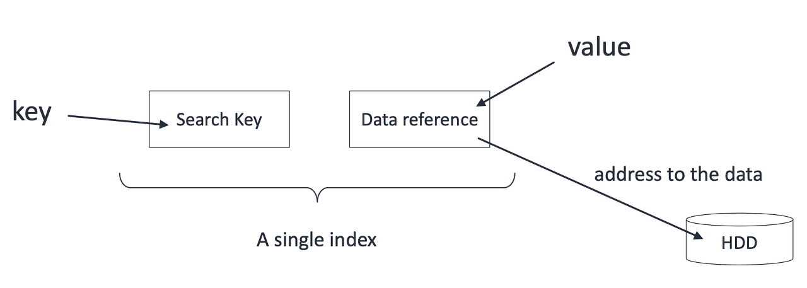

### 1) Primary index(기본 인덱스) | sparse index
- 탐색 키 값에 따라 정렬된 데이터 파일에 대해 정의
- 탐색 키가 테이블의 `기본 키(primary key)`인 인덱스
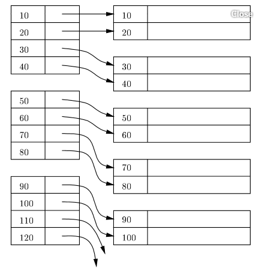

### 2) Clustering index(클러스터링 인덱스) | sparse index
- 탐색 키 값에 따라 정렬된 데이터 파일에 대해 정의
- 많은 레코드가 ordering field에 대한 공통된 값을 가질 경우 사용할 수 있다.

> **Primary Index vs. Clustering Index**  
> 예시로, 학생에서 학번은 중복이 없지만, 학과 단위로 검색을 하면 중복된 학생이 있을 것이다. 
> 이때 학번을 primary index, 학과를 clustering index라 할 수 있다.  
> 출처: [[데이터베이스] 7. Indexing (Ch. 17)](https://yeongjaekong.tistory.com/85)


### 3) Secondary index(보조 인덱스) | dense index
- 다른 인덱스를 돕는 보조 인덱스이며 레코드가 어디 위치하는지만 알려주는 역할을 한다.
- 주키가 아니라 보조 키를 이용하여 추가적인 방법으로 원하는 값을 가져올 수 있다.
  - 보조 인덱스는 순서를 가지지 않는다 (정렬되지 않아도 상관없다). 인덱스 블록의 인덱스 키만 정렬되어야 한다.
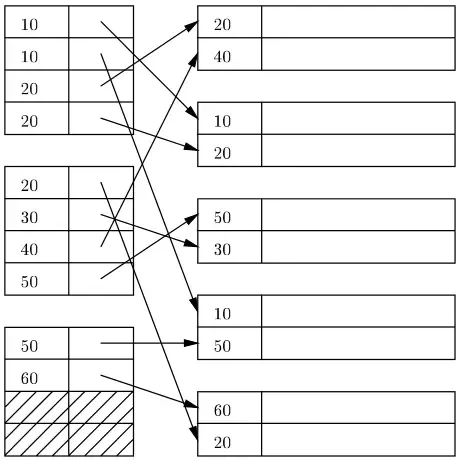

> `Sparse Index`: 몇몇 값에 대해서만 entry를 만든다. 대부분 기본적으로 sparse index를 사용한다. Primary index도 sparse index이다.  
> 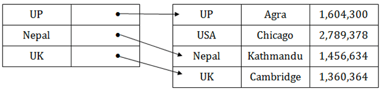  
> `Dense Index`: 모든 key value에 대해 index entry를 준다. 즉, 모든 레코드에 대해 색인을 만든다.
> 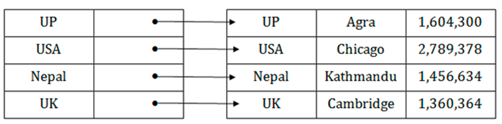
> 출처: [Database - Primary Index vs Secondary Index](https://velog.io/@hyoeunla/Database-Primary-Index-vs-Secondary-Index)

### Multi-level indexes
- 인덱스 자체가 큰 경우 인덱스를 탐색하는 시간도 오래 걸릴 수 있다.
- 인덱스 엔트리를 탐색하는 시간을 줄이기 위해서 Single-Level Ordered Indexes를 디스크 상의 하나의 순서로 파일로 생각하고, 이것에 대해 다시 인덱스를 정의할 수 있다.
- 가장 상위 단계 인덱스를 마스터 인덱스(master index)
- 대부분은 B+ 트리를 사용한다.  
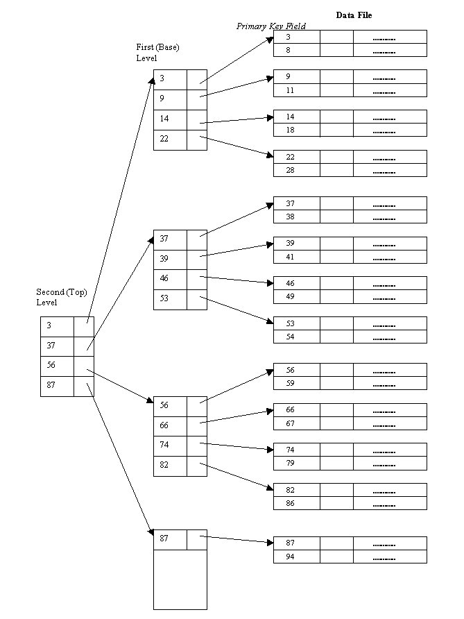

## ✔️ 동작 방식(자료구조)
<hr>

> [!NOTE]
> DB index에 자주 쓰이는 자료구조는 `B-Tree`, `B+Tree`, `Hash Table`이다.

### 🧑🏻‍💻 B-tree
> [!NOTE]
> B-Tree 알고리즘은 가장 일반적으로 사용되는 인덱스 알고리즘이다.  
> 컬럼의 값을 변경하지 않고 원래의 값을 이용해 인덱싱하는 알고리즘이다.  

> [!IMPORTANT]
> 시간복잡도: `O(longN)`
- B-tree란 자식 노드가 2개 이상인 트리
- 균형 트리(Balanced Tree)로서, 최상위 루트 노드에서 리프 노드까지의 거리가 모두 동일하다.
  - ❗️ Binary Tree가 아니다.

B-Tree에 대한 자세한 설명은 [B-Tree 페이지](https://github.com/kyeoungchan/note/tree/main/database/b-tree-b-plus-tree)에서 작성하였다.


### 🧑🏻‍💻 B+tree
- B+tree는 B-tree를 확장 및 개선한 자료구조
- 데이터의 빠른 접근을 위한 인덱스 역할만 하는 비단말 노드(not leaf)가 분리되어 있다.
- 관계형 DB에서 가장 많이 사용한다.  

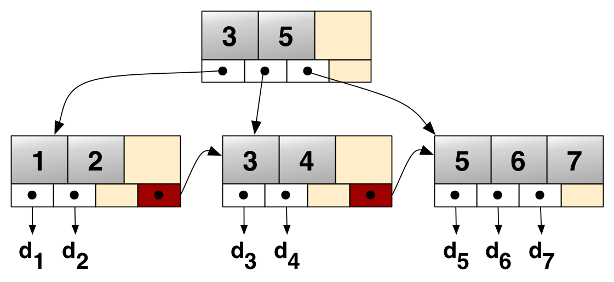

### 🧑🏻‍💻 Hash Table
> [!NOTE]
> Hash 인덱스 알고리즘은 컬럼의 값으로 해시값을 계산해서 인덱싱하는 알고리즘으로, 매우 빠른 검색을 지원한다.  
> 값을 변형해서 인덱싱하므로 전방(Prefix) 일치와 같이 값의 일부만 검색하거나 범위를 검색할 때는 해시 인덱스를 사용할 수 없다.  
> Hash 인덱스는 주로 메모리 기반의 데이터베이스에서 많이 사용한다.

> [!IMPORTANT]
> 시간복잡도: `O(1)`

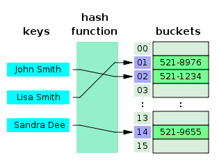  
B-tree보다 시간복잡도가 좋은데 왜 B-tree 계열을 쓸까?
- 해시는 등호(=) 연산에만 특화되어 있어 부등호 연산이 자주 사용되는 데이터베이스 검색에는 적합하지 않다.
- multi column index의 경우, 전체 attributes에 대한 조회만 가능하다.
  - 예를 들어, B-tree 기반의 인덱스에서는 INDEX(team_id, black_number)는 상황에 따라 team_id 칼럼만으로 조회할 수 있었다.
  - 하지만 hash index는 무조건 두 칼럼 모두를 사용해서 조회해야 한다.

❓ 그런데 왜 이진트리(Binary Tree), 레드 블랙 트리를 사용하지 않고 B-트리 계열을 사용할까?  
💡 B-트리 계열을 사용하면 다른 트리(Binary Tree, 레드 블랙 트리)보다 데이터를 찾을 때 탐색 범위를 빠르게 좁힐 수 있다.  
💡 또한 B-트리 노드는 여러 개의 데이터를 저장할 수 있다. (=여러 개의 자녀 노드를 가질 수 있다.)
➡️ B-Tree의 각 노드는 배열로서 실제 메모리 상에 차례대로 저장이 되어 있다.
  - 같은 노드 공간의 데이터들끼리 굳이 자식 노드처럼 참조 포인터 값으로 접근할 필요가 없다.
  - 즉, 같은 노드 상 데이터를 탐색할 때는 포인터 접근을 하는 것이 아니라 실제 메모리 디스크에서 바로 다음 인덱스에 접근을 하는 것이다.

➡️ 반면 RedBlack-Tree는 각 노드마다 무조건 하나의 데이터만 가지게 되므로 모든 데이터를 접근할 때 무조건 참조 포인터로 접근한다.
  - 참조 포인터로 메모리에 접근한다는 것은 실제 메모리 상 순서대로 저장이 되었든 안 되었든 접근하려는 주소를 연산을 통해 직접 알아 내어 데이터에 접근한다는 뜻이다.
  - 주소를 알아내기 위해 CPU 내부적으로 많은 연산을 수행한다.

출처: [[데이터베이스] B-Tree 인덱스를 보편적으로 사용하는 이유](https://steady-coding.tistory.com/558)

## ✔️ Index를 설정할 때 고려사항
### [성능저하]
- 테이블에 write 작업(INSERT, DELETE, UPDATE)를 할 때 index도 추가적인 연산이 발생
- 추가적인 저장 공간 차지
### [Full scan이 성능이 더 좋은 경우]
> full scan을 할지 여부는 optimizer가 판단한다.
1. 테이블에 데이터가 조금 있을 때
2. 조회하려는 데이터가 테이블의 상당 부분을 차지할 때
- 보통 전체 데이터의 5~10% 정도로 걸러지는 경우 index를 사용했을 때 좋은 효율을 낼 수 있다.
- 전체 데이터의 20%가 넘어가는 경우 오히려 full scan이 빠를 수 있다.

### [Index 설정 기준]
1. 카디널리티(Cardinality)
- 카디널리티가 높을수록 인덱스 설정에 좋은 칼럼이다.
- 한 칼럼이 갖고 있는 값의 중복 정도가 낮을수록 좋다.
- WHERE절로 걸러낸 데이터가 원본 데이터의 대부분을 차지할 경우 성능이 떨어질 수 있다.

2. 선택도(Selectivity)
- 선택도가 낮을수록 인덱스 설정에 좋은 칼럼이다. (일반적으로 5~10%가 적당)
- 선택도가 낮다는 의미는 한 칼럼이 갖고 있는 값 하나로 적은 row가 찾아지는 것을 의미한다.
3. 활용도
- 활용도가 높을수록 인덱스 설정에 좋은 칼럼이다.
4. 수정 빈도
- 수정 빈도가 낮을수록 인덱스 설정에 좋은 칼럼이다.
- 인덱스 설정된 칼럼이 값이 바뀌게 되면 인덱스도 새로 갱신해주어야하기 때문이다.

<br>

## ✅ B-Tree 인덱스의 구조 및 특성
<hr>

> [!NOTE]
> B-Tree는 트리 구조의 최상위에 하나의 Root Node가 존재하고, 그 하위에 자식 노드가 붙어 있는 형태다.  
> 가장 하위에 붙어 있는 노드가 Leaf Node, 중간의 노드를 Branch Node라고 한다.  
> 데이터베이스에서 인덱스와 실제 데이터가 저장된 데이터는 따로 관리되는데, 인덱스의 Leaf Node는 항상 실제 데이터 레코드를 찾아가기 위한 주솟값을 가지고 있다.

  
위 그림과 같이, 인덱스의 키 값은 모두 정렬돼 있지만, 데이터 파일의 레코드는 정렬돼 있지 않고 임의의 순서로 저장돼 있다.

> [!TIP]
> 대부분의 RDBMS의 데이터 파일에서 레코드는 특정 기준으로 정렬되지 않고 임의의 순서로 저장된다.  
> 하지만 MySQL의 InnoDB 테이블에서 레코드는 클러스터되어 디스크에 저장되므로 기본적으로 프라이머리 키 순서로 정렬되어 저장된다.  
> ➡️ 이는 오라클의 IOT(Index organized table)이나 MS-SQL의 클러스터 테이블과 같은 구조를 말한다.  
> 다른 DBMS에서는 클러스터링 기능이 선택 사항이지만, MySQL의 InnoDB에서는 사용자가 별도의 명령이나 옵션을 선택하지 않아도 디폴트로 클러스터링 테이블이 생성된다.


<br>

## ✅️ B-Tree 인덱스 키 추가 및 삭제
<hr>

- [🚀 B-Tree 인덱스 추가](#-b-tree-인덱스-추가)
- [🚀 B-Tree 인덱스 키 삭제](#-b-tree-인덱스-키-삭제)
- [🚀 B-Tree 인덱스 키 변경](#-b-tree-인덱스-키-변경)
- [🚀 인덱스 키 검색](#-인덱스-키-검색)

### 🚀 B-Tree 인덱스 추가
> [!IMPORTANT]
> 새로운 키 값이 B-Tree에 저장될 때 테이블의 스토리지 엔진에 따라 새로운 키 값이 즉시 인덱스에 저장될 수도 있고, 그렇지 않을 수도 있다.  
> B-Tree에 저장될 때
> 1. 저장될 키 값을 이용해 B-Tree상의 적절한 위치를 검색해야 한다.
> 2. 저장될 위치가 결정되면 레코드의 키 값과 대상 레코드의 주소 정보를 B-Tree의 리프 노드에 저장한다.
> 3. 리프 노드가 꽉 차서 더는 저장할 수 없을 때는 리프 노드가 분리돼야 하는데, 이는 상위 브랜치 노드까지 처리의 범위가 넓어진다.
>
> ➡️ B-Tree는 상대적으로 쓰기 작업에 비용이 많이 드는 것으로 알려졌다.

> [!TIP]
> 인덱스 추가로 인해 INSERT나 UPDATE 문장이 어떤 영향을 받을지 궁금하다.  
> 대략적으로 계산하는 방법은 테이블에 레코드를 추가하는 작업 비용을 1이라고 가정하면, 해당 테이블의 인덱스에 키를 추가하는 작업 비용을 1.5 정도로 예측하는 것이다.  
> ➡️ 테이블에 인덱스가 B-Tree 구조로 3개가 있다면, 5.5(= 1.5 * 3 + 1) 정도의 비용으로 예측한다.  
> ❗️ 중요한 것은 이 비용의 대부분이 메모리와 CPU에서 처리하는 시간이 아니라 디스크로부터 인덱스 페이지를 읽고 쓰기를 해야 해서 걸리는 시간이라는 점이다.
>
> MySQL의 MyISAM이나 MEMORY 스토리지 엔진의 경우 INSERT 문장이 실행되면 즉시 새로운 키 값을 B-Tree 인덱스에 변경한다.
>
> 하지만 InnoDB 스토리지 엔진은 체인지 버퍼가 있어 인덱스 키 추가 작업을 지연시켜 나중에 처리할 수 있다.  
> 물론 프라이머리 키나 유니크 인덱스의 경우 중복 체크가 필요하기 때문에 즉시 B-Tree에 추가하거나 삭제한다.

<br>


### 🚀 B-Tree 인덱스 키 삭제
> [!IMPORTANT]
> MySQL의 경우 B-Tree의 키 값이 삭제되는 경우는 상당히 간단하다.  
> 해당 키 값이 저장된 B-Tree의 리프 노드를 찾아서 그냥 삭제 마크만 하면 작업이 완료된다.  
> 이렇게 삭제 마킹된 인덱스 키 공간은 계속 그대로 방치하거나 재활용할 수 있다.  
> ✔️ 인덱스 키 삭제로 인한 마킹 작업 또한 디스크 쓰기가 필요하므로 이 작업 역시 디스크 I/O가 필요한 작업이다.
>
> InnoDB 스토리지 엔진에서는 이 작업 또한 버퍼링되어 지연 처리될 수 있다.  
> MyISAM이나 MEMORY 스토리지 엔진의 경우, 체인지 버퍼와 같은 기능이 없으므로 인덱스 키 삭제가 완료된 후 쿼리 실행이 완료된다.

<br>

### 🚀 B-Tree 인덱스 키 변경
> [!TIP]
> 인덱스의 키 값은 그 값에 따라 저장될 리프 노드의 위치가 결정되므로 B-Tree의 키 값이 변경되는 경우에는 단순히 인덱스상의 키 값만 변경하는 것은 불가능하다.  
> B-Tree의 키 값 변경 작업은 먼저 키 값을 삭제한 후, 다시 새로운 키 값을 추가하는 형태로 처리된다.  
> InnoDB 스토리지 엔진을 사용하는 테이블에 대해서는 이 작업 모두 체인지 버퍼를 활용해 지연 처리될 수 있다.

<br>

### 🚀 인덱스 키 검색
> [!NOTE]
> INSERT, UPDATE, DELETE 작업을 할 때 인덱스 관리에 따르는 추가 비용을 감당하면서 인덱스를 구축하는 이유는 바로 빠른 검색을 위해서다.  
> 인덱스 트리 탐색은 SELECT에서만 사용하는 것이 아니라 UPDATE나 DELETE를 처리하기 위해 항상 해당 레코드를 먼저 검색해야 할 경우에도 사용된다.

> [!CAUTION]
> B-Tree 인덱스를 이용한 검색은 100% 일치 값 또는 값의 앞 부분(Left-most part)만 일치하는 경우에 사용할 수 있다.  
> 부등호 비교 조건에서도 인덱스를 활용할 수 있지만, 인덱스를 구성하는 키 값의 뒷부분만 검색하는 용도로는 인덱스를 사용할 수 없다.  
> 또한 인덱스를 이용한 검색에서 중요한 사실은 인덱스의 키 값에 변형이 가해진 후 비교되는 경우에는 절대 B-Tree의 빠른 검색 기능을 사용할 수 없다는 것이다.  
> ➡️ 함수나 연산을 수행한 결과로 정렬한다거나 검색하는 작업은 B-Tree의 장점을 이용할 수 없으므로 주의해야 한다.

<br>

## ✅ B-Tree 인덱스 사용에 영향을 미치는 요소
<hr>

- [🚀 인덱스 키 값의 크기](#-인덱스-키-값의-크기)
- [🚀 B-Tree 깊이](#-b-tree-깊이)
- [🚀 선택도(기수성)](#-선택도기수성)
- [🚀 읽어야 하는 레코드의 건수](#-읽어야-하는-레코드의-건수)

> [!NOTE]
> B-Tree 인덱스는 인덱스를 구성하는 칼럼의 크기와 레코드의 건수, 그리고 유니크한 인덱스 키 값의 개수 등에 의해 검색이나 변경 작업의 성능에 영향을 받는다.

<br>

### 🚀 인덱스 키 값의 크기

> [!NOTE]
> InnoDB 스토리지 엔진은 디스크에 데이터를 저장하는 기본 단위를 페이지(Page) 또는 블록(Block)이라고 하며, 디스크의 모든 읽기 및 쓰기 작업의 최소 작업 단위가 된다.  
> 또한 페이지는 InnoDB 스토리지 엔진의 버퍼 풀에서 데이터를 버퍼링하는 기본 단위이기도 하다.  
> 인덱스도 결국은 페이지 단위로 관리되며, 상단에 [B-Tree 구조 및 특성](#-구조-및-특성)에 작성된 그림에서 루트와 브랜치, 리프 노드를 구분한 기준이 바로 페이지 단위다.

> [!IMPORTANT]
> DBMS의 B-Tree는 자식 노드의 개수가 가변적인 구조다.  
> MySQL의 B-Tree는 자식 노드를 몇 개까지 가질까?  
> ➡️ 인덱스의 페이지 크기와 키 값의 크기에 따라 결정된다.


> [!NOTE]
> MySQL 5.7 버전부터는 InnoDB 스토리지 엔진의 페이지 크기를 `innodb_page_size` 시스템 변수를 이용해 `4~64`KB 사이의 값을 선택할 수 있지만 기본값은 16KB고, 여기서는 16KB를 기준으로 작성하겠다.  
> 인덱스의 키가 16바이트라고 가정했을 때, 위 그림과 같이 인덱스 페이지가 구성될 것이다.  
> 자식 노드 주소라는 것은 여러 가지 복합적인 정보가 담긴 영역이며, 페이지의 종류 별로 대략 `6~12`바이트까지 다양한 크기의 값을 가질 수 있지만, 편의상 여기에서는 12바이트로 구성된다고 가정한다.

> [!IMPORTANT]
> 위 구성에서 하나의 인덱스 페이지(16KB)에 몇 개의 키를 저장할 수 있을까?  
> `16 * 1024 / (16 + 12) = 585`개 저장할 수 있다.

> [!CAUTION]
> 인덱스 키 값이 커지면 어떤 현상이 발생할까?  
> 위의 경우, 키 값의 크기가 두 배인 32바이트로 늘어났다고 가정하면 한 페이지에 인덱스 키를 `16 * 1024 / (32 + 12) = 372`개 저장할 수 있다.  
> ➡️ SELECT 쿼리가 레코드 500개를 읽어야 한다면 인덱스 키 값이 늘어나기 전에는 인덱스 페이지 한 번으로 해결될 수 있지만, 후자는 최소한 2번 이상의 디스크로부터 읽어야 하고, 그만큼 느려지는 것이다.
>
> 또한 인덱스 키 값의 길이가 길어진다는 것은 전체적인 인덱스의 크기가 커진다는 것을 의미한다.  
> 인덱스를 캐시해두는 InnoDB 버퍼 풀이나 MyISAM의 키 캐시 영역은 크기가 제한적이기 때문에, 하나의 레코드를 위한 인덱스의 크기가 커지면 커질수록 메모리에 캐시해둘 수 있는 레코드 수는 줄어든다.  
> ➡️ 메모리의 효율이 떨어지는 결과를 가져오는 것이다.

<br>

### 🚀 B-Tree 깊이
> [!IMPORTANT]
> 인덱스의 B-Tree 깊이가 3인 경우, 위 예제와 마찬가지로 키 값이 16바이트인 경우에는 최대 2억(585 * 585 * 585)개 정도의 키 값을 담을 수 있지만, 키 값이 32바이트로 늘어나면 5천만(372 * 372 * 372)개로 줄어든다.  
> ➡️ 인덱스 키 값의 크기가 커지면 커질수록 하나의 인덱스 페이지가 담을 수 있는 인덱스 키 값의 개수가 적어지고, 그 때문에 같은 레코드 건수라 하더라도 B-Tree의 깊이가 깊어져서 디스크 읽기가 더 많이 필요하게 된다.  
> ❗️ 실제로는 아무리 대용량 데이터베이스라도 B-Tree의 깊이(Depth)가 5단계 이상까지 깊어지는 경우는 흔치 않다.

<br>

### 🚀 선택도(기수성)
> [!NOTE]
> 인덱스에서 선택도(Selectivity) 또는 기수성(Cardinality)은 거의 같은 의미로 사용되며, 모든 인덱스 키 값 가운데 유니크한 값의 수를 의미한다.  
> ➡️ 전체 인덱스 키 값은 100개인데, 그 중에서 유니크한 값의 수는 10개라면 기수성은 10이다.  
> ➡️ 인덱스 키 값 가운데 중복된 값이 많아지면 기수성은 낮아지고, 동시에 선택도 또한 떨어진다.  
> 인덱스는 선택도가 높을수록 검색 대상이 줄어들기 때문에 그만큼 빠르게 처리된다.

> 선택도가 좋지 않다고 하더라도 정렬이나 그루핑과 같은 작업을 위해 인덱스를 만드는 것이 훨씬 나은 경우도 많다.  
> 인덱스가 항상 검색에만 사용되는 것은 아니므로 여러 가지 용도를 고려해서 적절히 인덱스를 설계할 필요가 있다.

<br>

> [!NOTE]
> 예시를 들어서 보자.  
> `country`라는 컬럼과 `city`라는 컬럼을 포함한 `tb_test` 테이블이 있다.  
> `tb_test` 테이블은 전체 레코드 건수는 1만 건이고, `country` 컬럼으로만 인덱스가 생성된 상태다.
> - 케이스 A: country 컬럼의 유니크한 값의 개수가 10개
> - 케이스 B: country 컬럼의 유니크한 값의 개수가 1,000개


```mysql
mysql> SELECT *
       FROM tb_test
       WHERE country = 'KOREA'
         and city = 'SEOUL';
```

> [!IMPORTANT]
> A 케이스의 경우 평균 1,000건, B 케이스의 경우 평균 10건이 조회되는 것으로 예측할 수 있다.  
> A 케이스와 B 케이스 모두 실제 모든 조건을 만족하는 레코드가 단 1건만 있었다면 A 케이스의 인덱스는 적합하지 않은 것이라고 볼 수 있다.  
> ➡️ A 케이스는 1건의 레코드를 위해 쓸모없는 999건의 레코드를 더 읽은 것이지만, B 케이스는 9건만 더 읽은 것이다.  
> ❗️ 물론 필요한 만큼의 레코드만 정확하게 읽을 수 있다면 최상이겠지만 현실적으로 모든 조건을 만족하게 인덱스를 생성한다는 것은 불가능하므로 이 정도의 낭비는 무시할 수 있다.

<br>

### 🚀 읽어야 하는 레코드의 건수
> [!TIP]
> 인덱스를 통해 테이블의 레코드를 읽는 것은 인덱스를 거치지 않고 바로 테이블의 레코드를 읽는 것보다 높은 비용이 드는 작업이다.  
> 테이블에 레코드가 100만 건이 저장돼 있는데, 그 중에서 50만 건을 읽어야 하는 쿼리가 있다고 가정해 보자.  
> 이 작업은 전체 테이블을 모두 읽어서 필요 없는 50만 건을 버리는 것이 효율적일지, 인덱스를 통해 필요한 50만 건만 읽어 오는 것이 효율적일지 판단해야 한다.  
> 인덱스를 이용한 읽기의 손익 분기점이 얼마인지 판단할 필요가 있는데, 일반적인 DBMS 옵티마이저에서는 인덱스를 통해 레코드 1건을 읽는 것이 테이블에서 직접 레코드 1건을 읽는 것보다 `4~5`배 정도 비용이 더 많이 드는 작업인 것으로 예측한다.  
> ➡️ 인덱스를 통해 읽어야 할 레코드의 건수가 전체 테이블 레코드의 `20~25%`를 넘어서면 인덱스를 이용하지 않고 테이블을 모두 직접 읽어서 필요한 레코드만 필터링 방식으로 처리하는 것이 효율적이다.

> [!NOTE]
> 직접 레코드를 읽는 것은 Sequential I/O, 인덱스를 통해 읽는 것은 B+Tree의 리프 노드에서 데이터 파일에 결국 Random I/O로 읽어야하므로 직접 읽기가 비용이 덜 드는 것이다.  

||Full Table Scan|Index Lookup|
|---|---|---|
|I/O 패턴|Sequential|Random|
|Read-Ahead|가능|불가능|
|1회 I/O당 읽는 Row|많음(페이지 단위)|적음(1건씩)|

<br>

## ✅ B-Tree 인덱스를 통한 데이터 읽기
<hr>

- [🧑🏻‍💻 인덱스 레인지 스캔](#-인덱스-레인지-스캔)
- [🧑🏻‍💻 인덱스 풀 스캔](#-인덱스-풀-스캔)
- [🧑🏻‍💻 루스 인덱스 스캔](#-루스-인덱스-스캔)


> [!TIP]
> 어떤 경우에 인덱스를 사용하게 유도할지, 또는 사용하지 못하게 할지 판단하려면 MySQL(더 정확히는 각 스토리지 엔진)이 어떻게 인덱스를 이용(경유)해서 실제 레코드를 읽어내는지 알아야 한다.  
> MySQL이 인덱스를 이용하는 대표적인 3가지 방법을 살펴보자.

<br>

### 🧑🏻‍💻 인덱스 레인지 스캔

```mysql
mysql> SELECT * FROM employees WHERE first_name BETWEEN 'Ebbe' AND 'Gad';
```

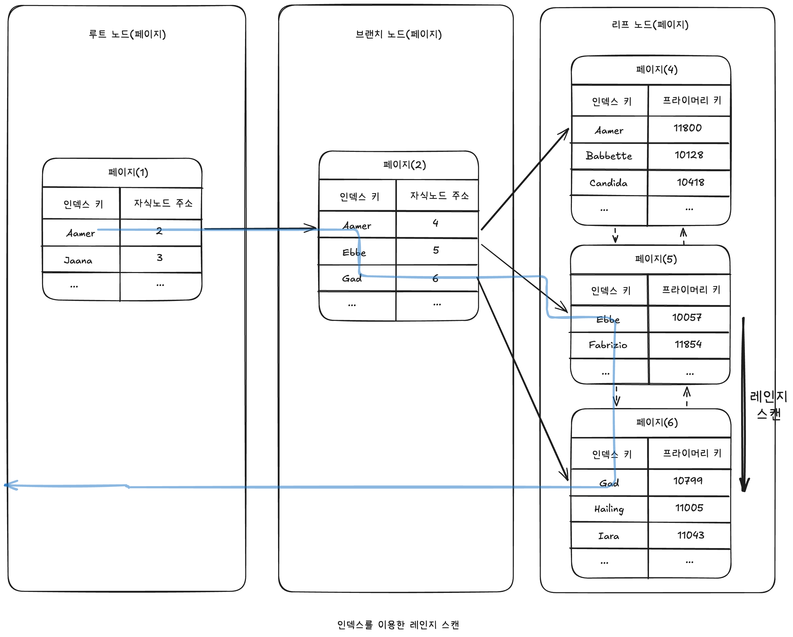

> [!IMPORTANT]
> 인덱스 레인지 스캔은 검색해야 할 인덱스의 범위가 결정됐을 때 사용하는 방식이다.  
> 위 그림을 보면 알 수 있듯이, 루트 노드에서부터 비교를 시작해 브랜치 노드를 거치고 최종적으로 리프 노드까지 찾아 들어가야만 비로소 필요한 레코드의 시작 지점을 찾을 수 있다.  
> 일단 시작해야할 위치를 찾으면 그때부터는 리프 노드의 순서대로 읽으면 된다.    
> ➡️ 만약 스캔하다가 리프 노드의 끝까지 읽으면 리프 노그 간의 링크를 이용해 다름 리프 노드를 찾아서 다시 스캔한다.  
> ➡️ 최종적으로 스캔을 멈춰야 할 위치에 다다르면 지금가지 읽은 레코드를 사용자에게 반환하고 쿼리를 끝낸다.

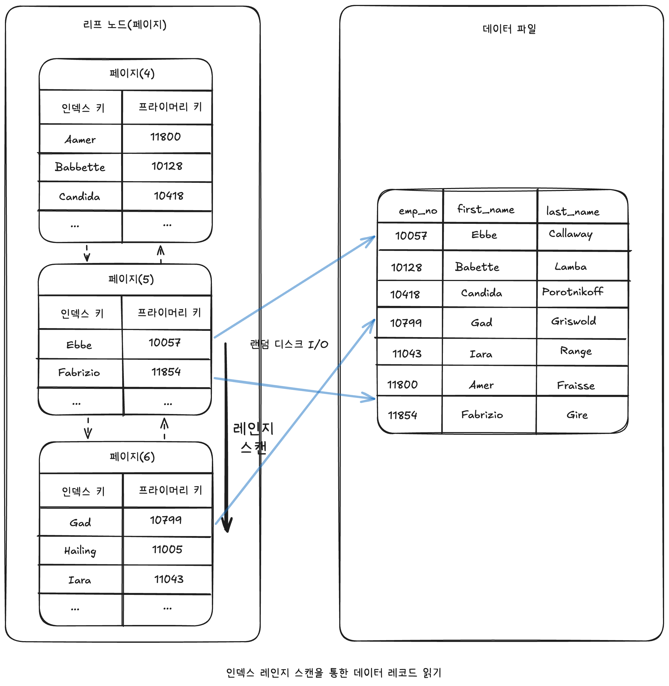

> [!TIP]
> 위 그림을 보면 알 수 있듯이, B-Tree 인덱스에서 루트와 브랜치 노드를 이용해 스캔 시작 위치를 검색하고, 그 지점부터 필요한 방향(오름차순 또는 내림차순)으로 인덱스를 읽어나간다.  
> 인덱스 자체의 정렬 특성 때문에 정렬된 상태로 레코드를 가져온다.

> [!IMPORTANT]
> 리프 노드에서 검색 조건에 일치하는 건들은 데이터 파일에서 레코드를 읽어오는 과정이 필요하다.  
> 이때 리프 노드에 저장된 레코드 주소로 데이터 파일의 레코드를 읽어오는데, 레코드 한 건 한 건 단위로 랜덤 I/O가 한 번씩 일어난다.  
> 💡 위 그림의 경우, 랜덤 I/O가 최소 3번이 필요한 것이다.  
> 그래서 인덱스를 통해 데이터 레코드를 읽는 작업은 비용이 많이 드는 작업으로 분류된다.  
> ❗️ 인덱스를 통해 읽어야 할 데이터 레코드가 20~25%를 넘으면 인덱스를 통한 읽기보다 테이블의 데이터를 직접 읽는 것이 더 효율적인 처리 방식이 된다.

<br>

> [!TIP]
> 정리하자면, 인덱스 레인지 스캔은 다음과 같은 3단계를 거친다.
> 1. 인덱스에서 조건을 만족하는 값이 저장된 위치를 찾는다.  
>    ➡️ 이 과정을 인덱스 탐색(index seek)이라고 한다.
> 2. 1번에서 탐색된 위치부터 필요한 만큼 인덱스를 차례대로 쭉 읽는다.
> 3. 2번에서 읽어들인 인덱스 키와 레코드 주소를 이용해 레코드가 저장된 페이지를 가져오고, 최종 레코드를 읽어온다.
> 
> 쿼리가 필요로 하는 데이터에 따라 3번 과정은 필요하지 않을 수도 있는데, 이를 커버링 인덱스라고 한다.  
> 위 그림의 경우, `SELECT *`로 쿼리를 날리는 게 아닌, `SELECT first_name`으로 쿼리를 날리면 커버링 인덱스로 처리가 된다.  
> ➡️ 커버링 인덱스로 처리되는 쿼리는 디스크의 레코드를 읽지 않아도 되기 때문에 랜덤 읽기가 상당히 줄어들고 성능은 그만큼 빨라진다.

<br>

```mysql
mysql> SHOW STATUS LIKE 'Handler_%';
+----------------------------+-------+
| Variable_name              | Value |
+----------------------------+-------+
| Handler_commit             | 0     |
| Handler_delete             | 0     |
| Handler_discover           | 0     |
| Handler_external_lock      | 0     |
| Handler_mrr_init           | 0     |
| Handler_prepare            | 0     |
| Handler_read_first         | 0     |
| Handler_read_key           | 0     |
| Handler_read_last          | 0     |
| Handler_read_next          | 0     |
| Handler_read_prev          | 0     |
| Handler_read_rnd           | 0     |
| Handler_read_rnd_next      | 0     |
| Handler_rollback           | 0     |
| Handler_savepoint          | 0     |
| Handler_savepoint_rollback | 0     |
| Handler_update             | 0     |
| Handler_write              | 0     |
+----------------------------+-------+
18 rows in set (0.03 sec)
```
- `Handler_read_key`: 1번 단계가 실행된 횟수
- `Handler_read_next`, `Handler_read_prev`: 2번 단계로 읽은 레코드 건수
- `Handler_read_first`, `Handler_read_last`: 인덱스의 첫 번째 레코드와 마지막 레코드를 읽은 횟수

<br>

### 🧑🏻‍💻 인덱스 풀 스캔
> [!NOTE]
> 인덱스 레인지 스캔과 마찬가지로 인덱스를 사용하지만 인덱스 레인지 스캔과는 달리 인덱스의 처음부터 끝까지 모두 읽는 방식을 인덱스 풀 스캔이라고 한다.  
> 대표적으로 쿼리의 조건절에 사용되는 컬럼이 인덱스의 첫 번째 컬럼이 아닌 경우 풀 스캔 방식이 사용된다.  
> ➡️ 예를 들어, 인덱스는 (A, B, C) 컬럼의 순서로 만들어져 있지만 쿼리의 조건절은 B 컬럼이나 C 컬럼으로 검색하는 경우다.

> [!CAUTION]
> 일반적으로 인덱스의 크기는 테이블의 크기보다 작으므로 직접 테이블을 처음부터 끝까지 읽는 것보다는 인덱스만 읽는 것이 효율적이다.  
> 쿼리가 인덱스에 명시된 컬럼만으로 조건을 처리할 수 있는 경우 주로 이 방식이 사용된다.  
> ❗️ 인덱스뿐만 아니라 데이터 레코드까지 모두 읽어야 한다면 절대 이 방식으로 처리되지 않는다.

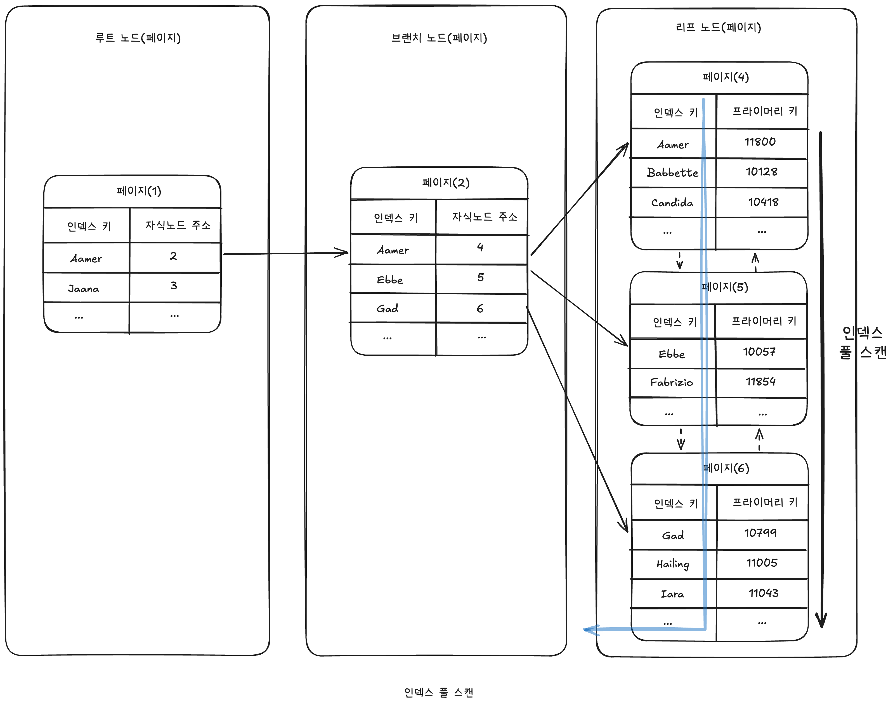

> [!TIP]
> 이 방식은 인덱스 레인지 스캔보다는 빠르지 않지만 테이블 풀 스캔보다는 효율적이다.  
> ➡️ 인덱스에 포함된 컬럼만으로 쿼리를 처리할 수 있는 경우, 테이블의 레코드를 읽을 필요가 없기 때문이다.  
> 인덱스의 전체 크기는 테이블 자체의 크기보다는 훨씬 작으므로 인덱스 풀 스캔은 테이블 전체를 읽는 것보다는 적은 디스크 I/O로 쿼리를 처리할 수 있다.

<br>

### 🧑🏻‍💻 루스 인덱스 스캔
> [!TIP]
> 오라클과 같은 DBMS에서의 "인덱스 스킵 스캔"이 MySQL에서는 "루스(Loose) 인덱스 스캔"이다.  
> 위에서 다룬 "인덱스 레인지 스캔"과 "인덱스 풀 스캔"은 루스 인덱스 스캔과 상반된다는 의미에서 "Tight 인덱스 스캔"으로 분류한다.  
> ➡️ 루스 인덱스 스캔이란 말 그대로 느슨하게 인덱스를 읽는 것을 의미한다.


> [!IMPORTANT]
> 루스 인덱스 스캔은 중간에 필요치 않은 인덱스 키 값은 무시(Skip)하고 다음으로 넘어가는 형태로 처리한다.  
> 일반적으로 `GROUP BY` 또는 집합 함수 가운데 `MAX()` 또는 `MIN()` 함수에 대해 최적화를 하는 경우에 사용된다.


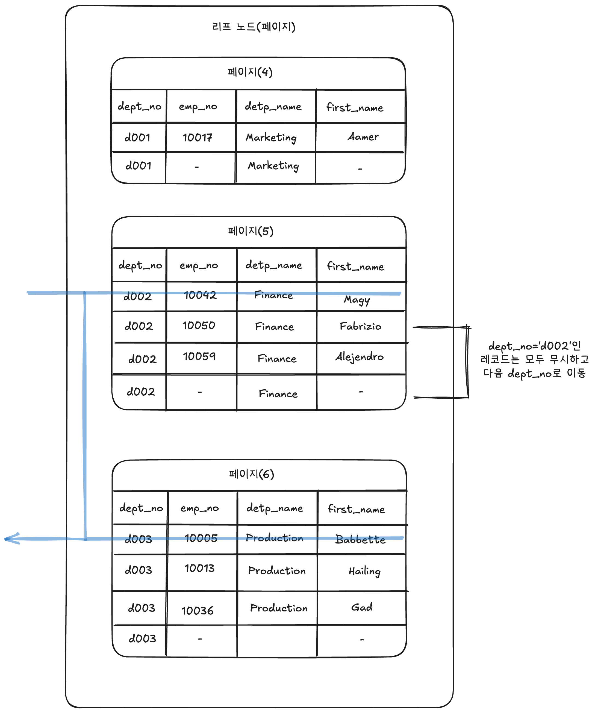

```mysql
mysql> SELECT dept_no, MIN(emp_no)
       FROM dept_emp
       WHERE dep_no BETWEEN 'd002' AND 'd004'
       GROUP BY dept_no;
```

> [!NOTE]
> 이 쿼리에서 사용된 `dept_emp` 테이블은 `dept_no`와 `emp_no`라는 두 개의 컬럼으로 인덱스가 생성되어 있다.  
> 또한 이 인덱스는 (dept_no, emp_no) 조합으로 정렬까지 돼 있어서 위 그림과 같이 `dept_no` 그룹별로 첫 번째 레코드의 `emp_no` 값만 읽으면 된다.  
> 즉 인덱스에서 WHERE 조건을 만족하는 범위 전체를 다 스캔할 필요가 없다는 것을 옵티마이저는 알고 있기 때문에 조건에 만족하지 않는 레코드는 무시하고 다음 레코드로 이동한다.


<br>


출처  
- [2023-CS-Study](https://github.com/devSquad-study/2023-CS-Study/blob/main/DB/db_index.md)  
- [기본 인덱스 (primary index)와 보조 인덱스 (secondary index)의 차이점](https://m.blog.naver.com/remocon33/221037713789)  
- [Real MySQL 8.0](https://product.kyobobook.co.kr/detail/S000001766482)
- [🗄️DB 인덱스와 커버링 인덱스](https://velog.io/@789456jang/DB-%EC%9D%B8%EB%8D%B1%EC%8A%A4%EC%99%80-%EC%BB%A4%EB%B2%84%EB%A7%81-%EC%9D%B8%EB%8D%B1%EC%8A%A4)
