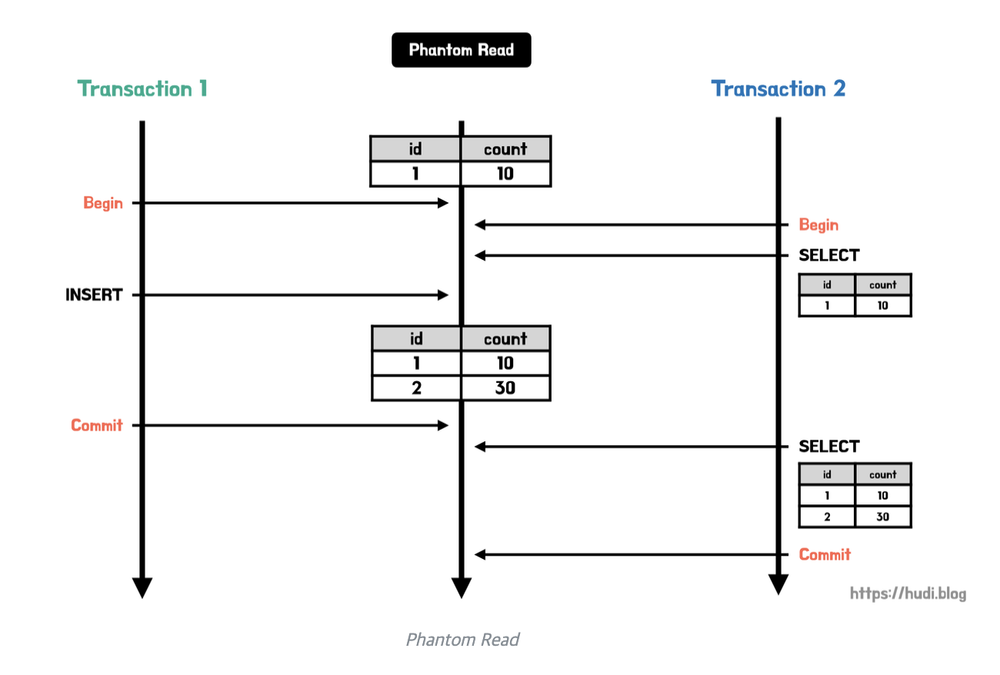

# 격리 수준(Isolation Level)

## 트랜잭션 격리수준

---
- 정의
    - 동시에 여러 트랜잭션이 처리될 때, 트랜잭션끼리 얼마나 서로 고립되어 있는지를 나타내는 것이다.
    - 즉, 간단하게 말해 특정 트랜잭션이 다른 트랜잭션에 변경한 데이터를 볼 수 있도록 허용할지 말지를 결정하는 것이다.
- 격리수준 4가지
    - READ UNCOMMITTED
    - READ COMMITTED
    - REPEATABLE READ
    - SERIALIZABLE

> 아래로 내려갈수록 트랜잭션간 고립 정도가 높아지며, 성능이 떨어지는 것이 일반적이다.
>
> 일반적인 온라인 서비스에서는 READ COMMITTED나 REPEATABLE READ 중 하나를 사용한다.
> 
> (oracle = READ COMMITTED, mysql = REPEATABLE READ)

## **READ UNCOMMITTED**

---
- 정의
    - READ UNCOMMITTED 격리수준에서는 어떤 트랜잭션의 변경내용이 COMMIT이나 ROLLBACK과 상관없이 다른 트랜잭션에서 보여진다.
- 발생할 수 있는 문제점 : **DIRTY READ**
    1. A 트랜잭션에서 10번 사원의 나이를 27살에서 28살로 바꿈
    2. 아직 커밋하지 않음
    3. B 트랜잭션에서 10번 사원의 나이를 조회함
    4. 28살이 조회됨
    5. A 트랜잭션에서 문제가 발생해 ROLLBACK함
    6. B 트랜잭션은 10번 사원이 여전히 28살이라고 생각하고 로직을 수행함

## **READ COMMITTED**

---

- 정의
    - 어떤 트랜잭션의 변경 내용이 COMMIT 되어야만 다른 트랜잭션에서 조회할 수 있다.
    - 오라클 DBMS에서 기본으로 사용하고 있고, 온라인 서비스에서 가장 많이 선택되는 격리수준이다.
- 위의 예시
    1. A 트랜잭션에서 10번 사원의 나이를 27살에서 28살로 바꿈
    2. 아직 커밋하지 않음
    3. B 트랜잭션에서 10번 사원의 나이를 조회함
    4. **27살이 조회된다.(커밋되지 않았기 때문에)**
        - (이는 언두(UNDO) 영역에 저장된 데이터이다. )
    5. A 트랜잭션에서 최종 커밋하면 B 트랜잭션에서 28살 이라는 값을 받아볼 수 있다.
- 발생할 수 있는 문제점 : **NON-REPETABLE READ**
    1. B 트랜잭션에서 10번 사원의 나이를 조회
    2. 27살이 조회됨
    3. A 트랜잭션에서 10번 사원의 나이를 27살에서 28살로 바꾸고 커밋
    4. B 트랜잭션에서 10번 사원의 나이를 다시 조회(변경되지 않은 이름이 조회됨)
    5. **28살이 조회됨**
- 현실적으로
    - 일반적인 웹 어플리케이션에서는 크게 문제되지 않지만, 작업이 금전적인 처리와 연결되어 있다면 문제가 발생할 수 있다.
    - 예를 들어 여러 트랜잭션에서 입금/출금 처리가 계속 진행되는 트랜잭션들이 있고 오늘의 입금 총 합을 보여주는 트랜잭션이 있다고하면, 총합을 계산하는 SELECT 쿼리는 실행될 때마다 다른 결과값을 가져올 것이다.

## **REPETABLE READ**

---

- 정의
    - REPETABLE READ 격리수준은 간단하게 말해서 **트랜잭션이 시작되기 전에 커밋된 내용에 대해서만 조회할 수 있는 격리수준**이다.
    - MySQL DBMS에서 기본으로 사용하고 있고, 이 격리수준에서는 NON-REPETABLE READ 부정합이 발생하지 않는다.
- 예제
    1. 10번 트랜잭션이 500000번 사원을 조회
    2. 12번 트랜잭션이 500000번 사원의 이름을 변경하고 커밋
    3. 10번 트랜잭션이 500000번 사원을 다시 조회
    4. 언두 영역에 백업된 데이터 반환
- 즉, 간단하게 말해서 **자신의 트랜잭션 번호보다 낮은 트랜잭션 번호에서 변경된(+커밋된) 것만 보게 되는 것이다.**

> (모든 InnoDB의 트랜잭션은 고유한 트랜잭션 번호(순차적으로 증가하는)를 가지고 있으며, 언두 영역에 백업된 모든 레코드는 변경을 발생시킨 트랜잭션의 번호가 포함되어 있다.)
>

### 발생할 수 있는 문제점

1. **UPDATE 부정합**

    ```sql
    START TRANSACTION; -- transaction id : 1
    SELECT * FROM Member WHERE name='junyoung';
    
        START TRANSACTION; -- transaction id : 2
        SELECT * FROM Member WHERE name = 'junyoung';
        UPDATE Member SET name = 'joont' WHERE name = 'junyoung';
        COMMIT;
    
    UPDATE Member SET name = 'zion.t' WHERE name = 'junyoung'; -- 0 row(s) affected
    COMMIT;
    ```

   | 명령어 | 트랜잭션 id | DB | UNDO | Commited |
           | --- | --- | --- | --- | --- |
   | Select | 1 | junyoung |  | False |
   | Select | 2 | junyoung |  | False |
   | Update | 2 | joont | junyoung | True |
   | Select | 1 | joont | junyoung | False |
   | Update | 1 | joont | junyoung | True
    0 row(s) affected |
    - 최종 결과 : `name = joont`가 된다.
    - REPETABLE READ이기 때문에
        - 2번 트랜잭션에서 `name = joont`로 변경하고 COMMIT을 하면 `name = junyoung`의 내용을 언두로그에 남겨놔야 한다.
            - ⇒ 그래야 1번 트랜잭션에서 일관되게 데이터를 보는 것을 보장해줄 수 있기 때문이다.
        - 이 상황에서 아래 구문에서 UPDATE 문을 실행하게 되는데, **UPDATE의 경우 변경을 수행할 로우에 대해 잠금이 필요하다**.
        - 하지만 현재 1번 트랜잭션이 바라보고 있는 `name = junyoung` 의 경우 레코드 데이터가 아닌 언두영역의 데이터이고, 언두영역에 있는 데이터에 대해서는 쓰기 잠금을 걸 수가 없다.
        - 그러므로 위의 UPDATE 구문은 레코드에 대해 쓰기 잠금을 시도하려고 하지만 `name = junyoung`인 레코드는 존재하지 않으므로, `0 row(s) affected`가 출력되고, 아무 변경도 일어나지 않게 된다.
        - 그러므로 최종적으로 결과는 `name = joont`가 된다. **자이언티가 되지 못해 아쉽다.**
2. **Phantom READ**
    - 한 트랜잭션 내에서 같은 쿼리를 두 번 실행했는데, 첫 번째 쿼리에서 없던 유령(Phantom) 레코드가 두 번째 쿼리에서 나타나는 현상을 말한다.
    - REPETABLE READ 이하에서만 발생하고(SERIALIZABLE은 발생하지 않음), INSERT에 대해서만 발생한다.

    ```sql
    START TRANSACTION; -- transaction id : 1 
    SELECT * FROM Member; -- 0건 조회
    
        START TRANSACTION; -- transaction id : 2
        INSERT INTO MEMBER VALUES(1,'joont',28);
        COMMIT;
    
    SELECT * FROM Member; -- 여전히 0건 조회 
    UPDATE Member SET name = 'zion.t' WHERE id = 1; -- 1 row(s) affected
    SELECT * FROM Member; -- 1건 조회 
    COMMIT;
    ```

    - REPETABLE READ에 에 의하면 원래 출력되지 않아야 하는데 UPDATE 문의 영향을 받은 후 부터 출력된다.
        - 이 시점에 스냅샷을 적용시키는 것 같다.
    - 참고로 DELETE에 대해서는 적용되지 않는다.

        ```sql
        START TRANSACTION; -- transaction id : 1 
        SELECT * FROM Member; -- 1건 조회
        
            START TRANSACTION; -- transaction id : 2
            DELETE FROM Member WHERE id = 1;
            COMMIT;
        
        SELECT * FROM Member; -- 여전히 1건 조회 
        UPDATE Member SET name = 'zion.t' WHERE id = 1; -- 0 row(s) affected
        SELECT * FROM Member; -- 여전히 1건 조회 
        COMMIT;
        ```

    - 다른 예

      


## **SERIALIZABLE**

---

- 가장 단순하고 가장 엄격한 격리수준이다.
- InnoDB에서 기본적으로 순수한 SELECT 작업은 아무런 잠금을 걸지않고 동작하는데, 격리수준이 SERIALIZABLE일 경우 읽기 작업에도 공유 잠금을 설정하게 되고, 이러면 동시에 다른 트랜잭션에서 이 레코드를 변경하지 못하게 된다.
- 이러한 특성 때문에 동시처리 능력이 다른 격리수준보다 떨어지고, 성능저하가 발생하게 된다.

출처  
[[db] 트랜잭션 격리 수준(isolation level)](https://joont92.github.io/db/트랜잭션-격리-수준-isolation-level/)  
[데이터베이스 트랜잭션 격리 수준과 격리 수준에 따른 문제점](https://hudi.blog/transaction-isolation-level/)