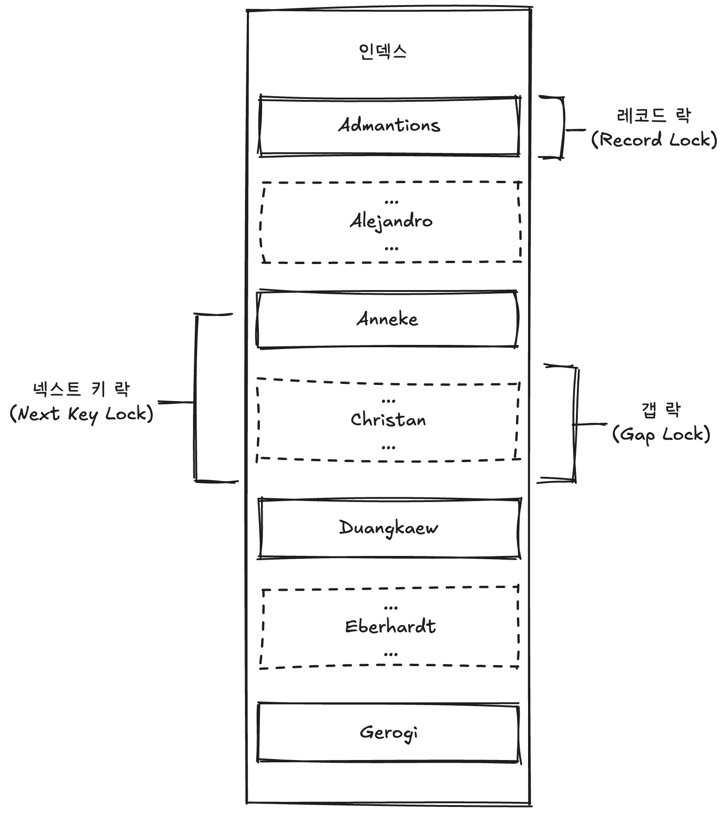

# 🧑🏻‍💻 InnoDB 스토리지 엔진 잠금
<hr>

- [💡 레코드 락](#-레코드-락)
- [💡 갭 락](#-갭-락)
- [💡 넥스트 키 락](#-넥스트-키-락)
- [💡 자동 증가 락](#-자동-증가-락)
- [✅ 인덱스와 잠금](#-인덱스와-잠금)

> [!NOTE]
> InnoDB 스토리지 엔진은 레코드 기반의 잠금 기능을 제공하며, 잠금 정보가 상당히 작은 공간으로 관리되기 때문에 레코드 락이 페이지 락으로, 또는 테이블 락으로 레벨업되는 경우는 없다.  
> 일반 사용 DBMS와는 조금 다르게 InnoDB 스토리지 엔진에서는 레코드 락뿐 아니라 레코드와 레코드 사이의 간격을 잠그는 갭(GAP) 락이라는 것이 존재한다.

  

<br>

### 💡 레코드 락
<hr>

> [!NOTE]
> 레코드 자체만을 잠가는 것을 레코드 락(Record Lock, Record Only Lock)이라고 하며, 다른 상용 DBMS의 레코드 락과 동일한 역할을 한다.  
> 한 가지 중요한 차이는 InnoDB는 스토리지 엔진은 레코드 자체가 아니라 인덱스의 레코드를 잠근다는 점이다.  

<br>

> [!TIP]
> InnoDB에서는 대부분 보조 인덱스를 이용한 변경 작업은 넥스트 키 락(Next Key Lock) 또는 갭 락(Gap Lock)을 사용하지만, 프라이머리 키 또는 유니크 인덱스에 의한 변경 작업에서는 갭(Gap) 락에 대해서는 잠그지 않고 레코드 자체에 대해서만 락을 건다.

<br>

### 💡 갭 락
<hr>

> [!TIP]
> 다른 DBMS와의 또 다른 차이가 바로 갭 락(Gap Lock)이다.  
> 갭 락은 레코드 자체가 아니라 레코드와 바로 인접한 레코드 사이의 간격만을 잠그는 락이다.  
> ➡️ 갭 락의 역할은 레코드와 레코드 사이의 간격에 새로운 레코드가 생성(INSERT)되는 것을 제어하는 것이다.

<br>

### 💡 넥스트 키 락
<hr>

> [!NOTE]
> 레코드 락과 랩 락을 합쳐 놓은 형태의 잠금을 넥스트 키 락(Next Key Lock)이라고 한다.  
> ❗️ STATEMENT 포맷의 바이너리 로그를 사용하는 MySQL 서버에서는 REPEATABLE READ 격리 수준을 사용해야 한다.  
> 또한 `innodb_locks_unsafe_for_binlog` 시스템 변수가 비활성화되면(0으로 설정되면) 변경을 위해 검색하는 레코드에는 넥스트 키 락 방식으로 잠금이 걸린다.  
> 
> 그런데 의외로 넥스트 키 락과 갭 락으로 인해 데드락이 발생하거나 다른 트랜잭션을 기다리게 만드는 일이 자주 말생한다.  
> ➡️ 가능하다면 바이너리 로그 포맷을 ROW 형태로 바꿔서 넥스트 키 락이나 갭 락을 줄이는 것이 좋다.

<br>

### 💡 자동 증가 락
<hr>

> [!NOTE]
> MySQL에서는 자동 증가하는 숫자 값을 추출하기 위해 `AUTO_INCREMENT`라는 컬럼 속성을 제공한다.  
> `AUTO_INCREMENT` 컬럼이 사용되는 테이블에 동시에 여러 레코드가 INSERT되는 경우, 저장되는 각 레코드는 중복되지 않고 저장된 순서대로 증가하는 일련번호 값을 가져야 한다.  
> ➡️ InnoDB 스토리지 엔진에서는 이를 위해 내부적으로 AUTO_INCREMENT 락이라고 하는 테이블 수준의 잠금을 사용한다.

<br>

> [!TIP]
> - AUTO_INCREMENT 락은 INSERT와 REPLACE 쿼리 문장과 같이 새로운 레코드를 저장하는 쿼리에서만 필요하며, UPDATE나 DELETE 등의 쿼리에서는 걸리지 않는다.  
> - InnoDB의 다른 잠금과는 달리 AUTO_INCREMENT 락은 트랜잭션과 상관없이 INSERT나 REPLACE 문장에서 AUTO_INCREMENT 값을 가져오는 순간만 락이 걸렸다가 즉시 해제된다.
> - AUTO_INCREMENT 락은 테이블에 단 하나만 존재하기 때문에 두 개의 INSERT 쿼리가 동시에 실행되는 경우 하나의 쿼리가 AUTO_INCREMENT 락을 걸면 나머지 쿼리는 AUTO_INCREMENT 락을 기다려야 한다.

<br>

> [!CAUTION]
> AUTO_INCREMENT 락을 명시적으로 획득하고 해제하는 방법은 없다.  
> AUTO_INCREMENT 락은 아주 짧은 시간 동안 걸렸다가 해제되는 잠금이라서 대부분의 경우 문제가 되지 않는다.

<br>

> [!NOTE]
> `innodb_autoinc_lock_mode` 시스템 변수
> - `innodb_autoinc_lock_mode=0`
>   - 모든 INSERT 문장은 AUTO_INCREMENT 락을 사용한다.
> - `innodb_autoinc_lock_mode=1`
>   - 단순히 한 건 또는 여러 건의 레코드를 INSERT하는 SQL 중에서 MySQL 서버가 INSERT되는 레코드의 건수를 정확히 측정할 수 있을 때는 AUTO_INCREMENT 락을 사용하지 않고, 훨씬 가볍고 빠른 래치(뮤텍스)를 이용해 처리한다.
>     - 개선된 래치는 AUTO_INCREMENT 락과는 달리 아주 짧은 시간 동안만 잠금을 걸고 필요한 자동 증가 값을 가져오면 즉시 잠금이 해제된다.
>   - 하지만 `INSERT ... SELECT`와 같이 건수를 예측할 수 없을 때는 AUTO_INCREMENT 락을 사용한다.  
>     ➡️ INSERT 문장이 완료되기 전까지는 AUTO_INCREMENT 락이 해제되지 않기 때문에 다른 커넥션에서는 INSERT를 실행하지 못하고 대기하게 된다.
>   - `INSERT ... SELECT`와 같이 대량 INSERT되는 레코드는 여러 개의 자동 증가 값을 한 번에 할당받아서 INSERT되는 레코드에 사용한다.  
>     ➡️ 대량 INSERT되는 레코드는 자동 증가 값이 누락되지 않고 연속되게 INSERT된다.
>   - 한 번에 할당받은 자동 증가 값이 남아서 사용되지 못하면 폐기하므로 대량 INSERT 문장이 실행된 이후에 INSERT되는 레코드의 자동 증가 값은 연속되지 않고 누락된 값이 발생할 수 있다.
> - `innodb_autoinc_lock_mode=2`
>   - 절대 AUTO_INCREMENT 락을 걸지 않고 경량화된 래치(뮤텍스)를 사용한다.
>   - 하나의 INSERT되는 레코드라고 하더라도 연속된 자동 증가 값을 보장하지 않는다.  
>     ➡️ 인터리빙 모드(Interleaved mode)라고도 한다.
>   - 이 설정에서는 자동 증가 기능은 유니크한 값이 생성된다는 것만 보장한다.
>   - STATEMENT 포맷의 바이너리 로그를 사용하는 복제에서는 소스 서버와 레플리카 서버의 자동 증가 값이 달라질 수도 있기 때문에 주의해야 한다.

<br>

> [!TIP]
> MySQL 5.7 버전까지는 `innodb_autoinc_lock_mode`의 기본값이 1이었지만, MySQL 8.0 버전부터는 `innodb_autoinc_lock_mode`의 기본값이 2로 바뀌었다.  
> 이는 MySQL 8.0에서 바이너리 로그 포맷이 ROW 포맷으로 기본값이 됐기 때문이다.  
> ➡️ MySQL 8.0에서 STATEMENT 포맷의 바이너리 로그를 사용한다면 `innodb_autoinc_lock_mode=1`로 변경해서 사용할 것을 권장한다.

<br>

## ✅ 인덱스와 잠금
<hr>

```mysql
-- // 예제 데이터베이스의 employees 테이블에는 first_name 컬럼만 멤버로 담긴 ix_firstname이라는 인덱스가 준비돼있다.
-- // KEY ix_firstname (first_name)
mysql> SELECT COUNT(*) FROM employees WHERE first_name='Georgi';
253

mysql> SELECT COUNT(*) FROM employees WHERE first_name='Georgi' AND last_name='Klassen';
1

mysql> UPDATE employees SET hire_date=NOW() WHERE first_name='Georgi' AND last_name='Klassen';
```

> [!IMPORTANT]
> 위 UPDATE 문장이 실행되면 1건의 레코드가 업데이트될 것이다.  
> 하지만 이 1건의 업데이트를 위해 253건의 레코드가 모두 잠긴다.  
> ➡️ UPDATE 문장을 위해 적절히 인덱스가 준비돼있지 않다면 각 클라이언트 간의 동시성이 상당히 떨어져서 한 세션에서 UPDATE 작업을 하는 중에는 다른 클라이언트는 그 테이블을 업데이트하지 못하고 기다려야 하는 상황이 발생할 것이다.

<br>

> [!NOTE]
> 이 테이블에 인덱스가 하나도 없다면, 테이블을 풀 스캔하면서 UPDATE 작업을 하는데, 이 과정에서 테이블에 있는 30여만 건의 모든 레코드를 잠그게 된다.  
> ➡️ 이것이 MySQL의 방식이며, InnoDB에서 인덱스 설계가 중요한 이유이다.


<br>

**출처**  
[Real MySQL 8.0](https://product.kyobobook.co.kr/detail/S000001766482)