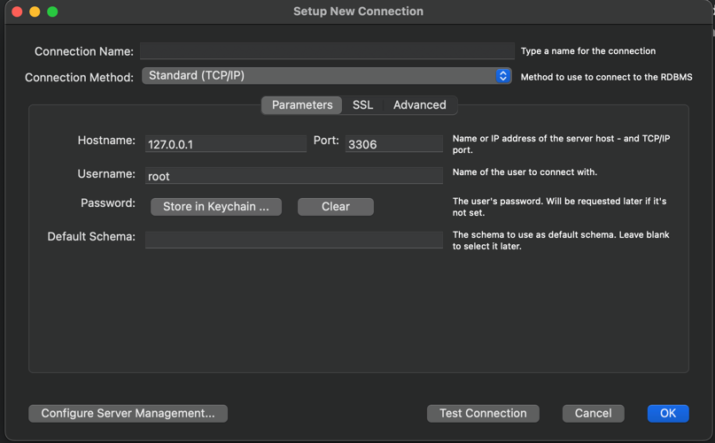

# MySql 설정 관련 해결하기 - Mac OS
<hr>

## HomeBrew로 설치하기
<hr>

```text
brew install mysql
```
root 계정으로 접속하기
```text
mysql -u root -p
```
> 이때 root 계정에 입력했던 암호를 입력해야한다.

### mysql 명령어가 terminal에 먹지 않는다면?
1. 환경변수 설정을 안 하고 싶다면 `cd/usr/local/mysql/bin`으로 이동 후 `./mysql`을 해주면 접속이 가능하다. 
    ```text
    cd /usr/local/mysql/bin 
    ./mysql
    ```
2. 환경변수 설정 하려면 `/etc`로 이동해서 `profile`을 수정한다.
   - `/etc`로 이동하기
      ```text
      cd /etc
      sudo vi profile
      ```
   - `profile` 수정하기
     - `i`를 누르는 순간 수정이 가능해진다.
     - 환경변수 설정을 작성한다.
        ```text
        export DB_HOME=/usr/local/mysql
        export PATH="$PATH:/usr/local/mysql/bin"
        ```
     - ESC나 ^c를 누른 후 `:wq!` 입력 => 저장 후 종료
   - 마지막으로 설정을 반영시켜주는 명령어 입력
     ```text
     source /etc/profile 
     ```

## 계정 다루기
<hr>

### 계정 생성하기
```mysql
CREATE USER '{username}'@'%' IDENTIFIED BY '{password}';
```
```mysql
CREATE USER '{username}'@'localhost' IDENTIFIED BY '{password}';
```
위 둘 중 하나로 설정하면 된다.
- %: 모든 클라이언트에서 접근이 가능하다는 뜻
- localhost: 해당 컴퓨터에서만 접근이 가능하다는 뜻
- 그리고, username과 password에 작은 따옴표는 포함해서 작성하면 실행이 된다.
  ```mysql
  # 예를 들어
  CREATE USER 'charles'@'localhost' IDENTIFIED BY 'mypwd';
  ```
### 현재 생성된 계정 목록 조회하기
```mysql
select user, ssafy from mysql.user;
```
그러면 user와 host로 나눠서 목록이 나오게 된다.

### 계정 삭제하기
```mysql
drop user '{username}'@'%';
```
```mysql
drop user '{username}'@'localhost';
```

## DB 다루기
<hr>

### DB 생성하기
```mysql
create database {dbname};
```
예를 들어
```mysql
create database testdb;
```

> 만약 `ERROR 1410 (42000): You are not allowed to create a user with GRANT` 에러가 발생했다면 host가 %인 계정이 없기 때문에 발생할 수 있다.  
> 나의 경우 root 계정을 % host로 추가 생성하였다.

### 생성된 DB 목록 조회하기
```mysql
show databases;
```
> 참고로 데이터베이"시스"다.

### 원하는 DB 관련 권한을 원하는 계정에다가 부여하기
**모든 권한 부여하기**
```mysql
grant ALL PRIVILEGES on {databaseName}.* to {userName};
```
해당 계정에 해당 DB에 대한 모든 권한을 준다.

**참조 권한 부여하기**
```mysql
grant REFERENCES PRIVILEGES on {databaseName}.* to {userName};
```
해당 계정에 해당 DB에 대한 참조 권한을 준다.
> 사실 위에 All Privileges 권한을 준 것만으로 충분하지만 참조 권한이 안 먹는 경우 시도해보자.

**work bench에서 권한 조회하는 권한 부여하기**
```mysql
GRANT ALL PRIVILEGES ON *.* TO {userName}@localhost;
```
사실 이 권한까지는 불필요할 수 있다. root에서 참조하기 귀찮을 때 사용하면 된다. 
### Work Bench에 연결하기

- connection name: 아무 이름 넣으면 된다.
- hostname: 그냥 냅둔다.
    > 127.0.0.1이란  
    > loopback 혹은 localhost라고도 불린다.  
    > 네트워크 계층에서 패킷을 외부로 전송하지 않고 자신이 다시 받은 것처럼 처리한다.  
    > 따라서 localhost라고 입력해도 정상 작동한다.
- username: 설정한 계정 이름
- password: 설정한 비밀번호

### 계정에 적용된 권한 조회하기
```mysql
show grants for {userName}@localhost;
```
물론 localhost 대신 %를 넣어도 된다.

