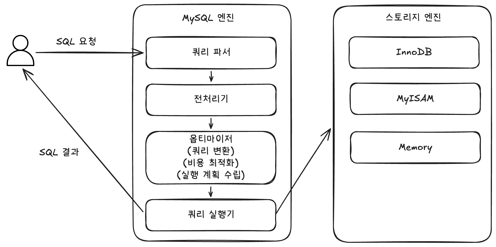

# 🧑🏻‍💻 쿼리 실행 구조

- 쿼리 파서
  - 사용자 요청으로 들어온 쿼리 문장을 토큰으로 분리해 트리 형태의 구조로 만들어내는 작업
  - 쿼리 문장의 기본 문법 오류는 이 과정에서 발견하고 오류 메시지를 전달한다.
- 전처리기
  - 파서 과정에서 만들어진 파서 트리를 기반으로 쿼리 문장에 문제점이 있는지 확인한다.
  - 각 토큰을 테이블 이름이나 컬럼 이름, 또는 내장 함수와 같은 개체를 매핑해 해당 객체의 존재 여부와 객체의 접근 권한 등을 확인하는 과정을 이 단계에서 수행한다.
  - 실제 존재하지 않거나 권한상 사용할 수 없는 개체의 토큰은 이 단계에서 걸러진다.
- 옵티마이저
  - 사용자의 요청으로 들어온 쿼리 문장을 저렴한 비용으로 가장 빠르게 처리할지를 결정하는 역할을 담당한다.
  - DBMS의 두뇌에 해당한다고 볼 수 있다.
- 실행 엔진
  - 옵티마이저가 두뇌라면, 실행 엔진과 핸들러는 손과 발에 해당한다고 볼 수 있다.
  - 만들어진 계획대로 각 핸들러에게 요청해서 받은 결과를 또 다른 핸들러 요청의 입력으로 연결하는 역할을 수행한다.
- 핸들러(스토리지 엔진)
  - MySQL 서버의 가장 밑단에서 MySQL 실행 엔진의 요청에 따라 데이터를 디스크로 저장하고 디스크로부터 읽어오는 역할을 담당한다.

 

**출처**  
[Real MySQL 8.0](https://product.kyobobook.co.kr/detail/S000001766482)
