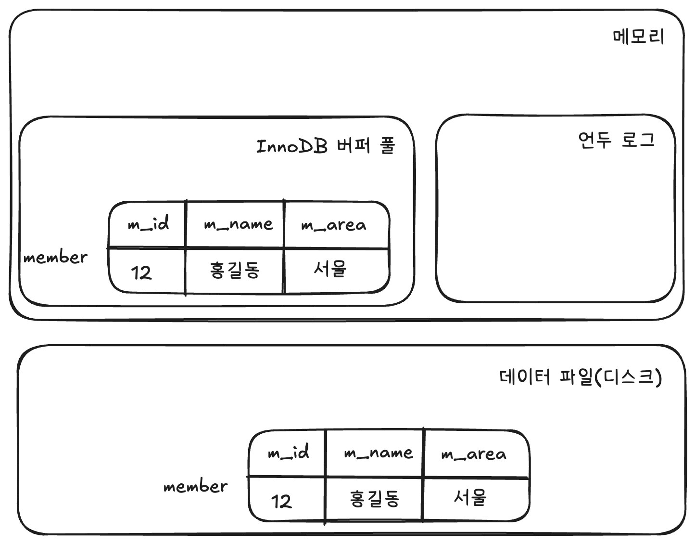
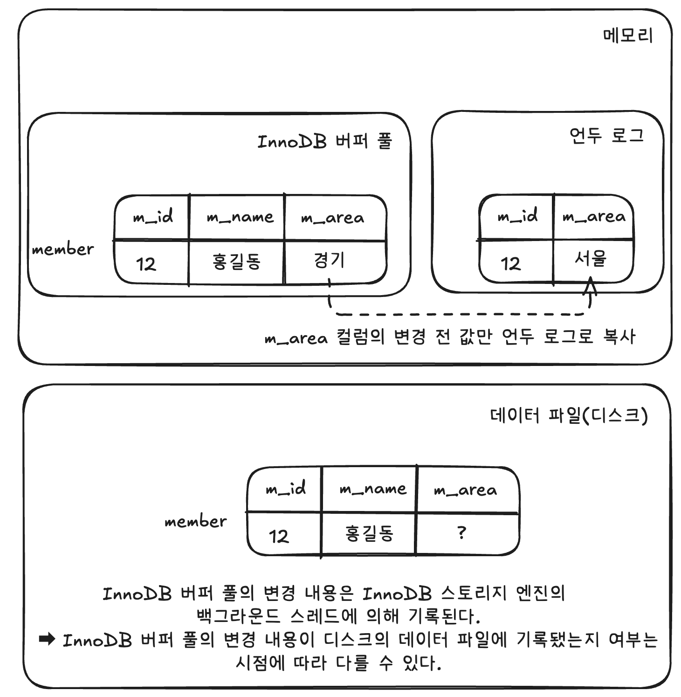
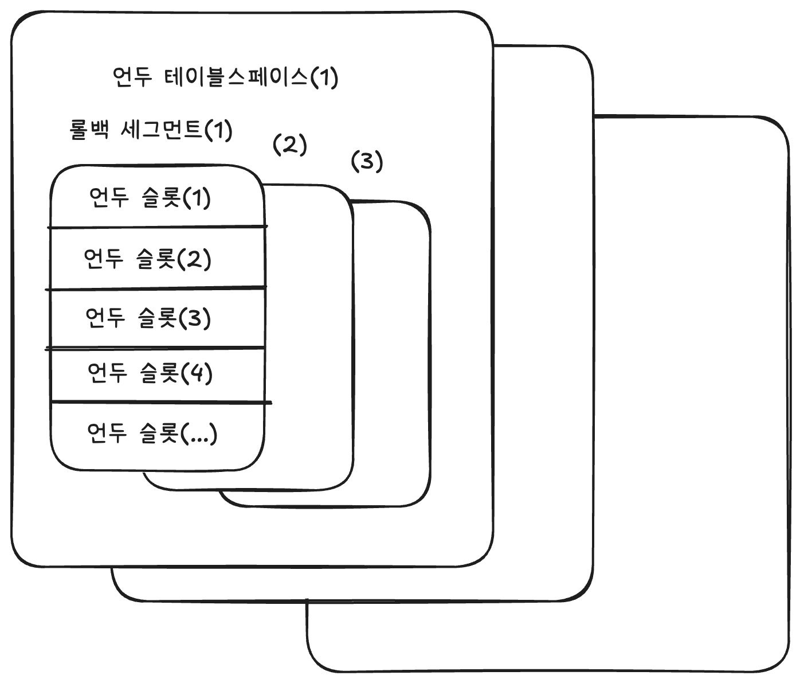

# 🧑🏻‍💻 InnoDB 스토리지 엔진 아키텍처
<hr>

- [✅ 프라이머리 키에 의한 클러스터링](#-프라이머리-키에-의한-클러스터링)
- [✅ 외래 키 지원](#-외래-키-지원)
- [✅ MVCC(Multi Version Concurrency Control)](#-mvccmulti-version-concurrency-control)
- [✅ 잠금 없는 일관된 읽기(Non-Locking Consistent READ)](#-잠금-없는-일관된-읽기non-locking-consistent-read)
- [✅ 자동 데드락 감지](#-자동-데드락-감지)
- [✅ InnoDB 버퍼 풀](https://github.com/kyeoungchan/note/tree/main/database/mysql/architecture/storage-engine/innodb-storage-engine-architecture/innodb-buffer-pool)
- [✅ 언두 로그](#-언두-로그)
- [✅ 리두 로그 및 로그 버퍼](#-리두-로그-및-로그-버퍼)
- [✅ 어댑티브 해시 인덱스](#-어댑티브-해시-인덱스)
- [✅ InnoDB와 MyISAM, MEMORY 스토리지 엔진 비교](#-innodb와-myisam-memory-스토리지-엔진-비교)

## ✅ 프라이머리 키에 의한 클러스터링
InnoDB의 모든 테이블은 기본적으로 프라이머리 키를 기준으로 클러스터링되어 저장된다.  
➡ 프라이머리 키 값 순서대로 디스크에 저장  
➡ 모든 세컨더리 인덱스는 레코드의 주소 대신 프라이머리 키의 값을 논리적인 주소로 사용

❗️ 프라이머리 키가 클러스터링 인덱스이기 때문에 프라이머리 키를 이용한 레인지 스캔은 상당히 빨리 처리될 수 있다.

<br>

## ✅ 외래 키 지원
외래 키에 대한 지원은 InnoDB 스토리지 엔진 레벨에서 지원하는 기능으로, MyISAM이나 MEMORY 테이블에서는 사용할 수 없다.  
InnoDB에서 외래 키는 부모 테이블과 자식 테이블 모두 해당 컬럼에 인덱스 생성이 필요하고, 변경 시에는 반드시 부모 테이블이나 자식 테이블에 데이터가 있는지 체크하는 작업을 진행한다.  
➡ 잠금이 여러 테이블로 전파되고, 그로 인해 데드락이 발생할 때가 많으므로 개발할 때도 외래 키의 존재에 주의하는 것이 좋다.

<br>

수동으로 데이터를 적재하거나 스키마 변경 등의 관리 작업이 실패할 수 있다.  
물론, 부모 테이블과 자식 테이블의 관계를 명확히 파악해서 순서대로 작업한다면 문제없이 실행할 수 있지만 외래 키가 복잡하게 얽힌 경우에는 그렇게 간단하지 않다.  
➡ 이런 경우에는 `foreign_key_checks` 시스템 변수를 OFF로 설정하면 외래 키 관계에 대한 체크 작업을 일시적으로 멈출 수 있다. 

```mysql
-- // 글로벌, 세션 모두 설정 가능한 변수이므로 현재 작업을 실행하는 세션에서만 외래 키 체크 기능을 비활성화시켜야 한다.
mysql> SET SESSION foreign_key_checks=OFF;
Query OK, 0 rows affected (0.00 sec)

mysql> SET SESSION foreign_key_checks=ON;
Query OK, 0 rows affected (0.00 sec)
```

❗️ 외래 키 체크를 일시적으로 중지한 상태에서 외래 키 관계를 가진 부모 테이블의 레코드를 삭제했다면 반드시 자식 테이블의 레코드도 삭제해서 일관성을 맞춘 후 다시 외래 키 체크 기능을 활성화해야 한다.  
❗️ `foreign_key_checks`가 비활성화되면 외래 키 관계의 부모 테이블에 대한 작업(`ON DELETE CASCADE`와 `ON UPDATE CASCADE` 옵션)도 무시하게 된다.

<br>

## ✅ MVCC(Multi Version Concurrency Control)
MVCC의 가장 큰 목적은 잠금을 사용하지 않는 일관된 읽기를 제공하는 데 있다.  
여기서 멀티 버전이라 함은 하나의 레코드에 대해 여러 개의 버전이 동시에 관리된다는 뜻이다.  
➡ InnoDB는 언두 로그(Undo log)를 이용해 이 기능을 구현한다.

<br>

```mysql
mysql> CREATE TABLE member (
    m_id   INT          NOT NULL,
    m_name VARCHAR(20)  NOT NULL,
    m_area VARCHAR(100) NOT NULL,
    PRIMARY KEY (m_id),
    INDEX ix_area (m_area)
);


mysql> INSERT INTO member (m_id, m_name, m_area)
       VALUES (12, '홍길동', '서울');

mysql>
COMMIT;
```

<br>

Insert문이 실행되고 나면 아래와 같은 상황이 되어 있을 것이다.


<br>

```mysql
mysql> UPDATE member SET m_area='경기' WHERE m_id=12;
```

<br>



UPDATE 문장이 실행되면 커밋 실행 여부와 관계없이 InnoDB의 버퍼 풀은 새로운 값인 '경기'로 업데이트 된다.  
그리고 디스크의 데이터 파일에는 체크 포인트나 InnoDB의 Write 스레드에 의해 새로운 값으로 업데이트됐을 수도 있고 아닐 수도 있다(InnoDB가 ACID를 보장하기 때문에 일반적으로는 InnoDB의 버퍼 풀과 데이터 파일은 동일한 상태라고 가정해도 무방하다).

<br>

🤔 COMMIT이나 ROLLBACK이 되지 않은 상태에서 레코드를 조회하면 어디에 있는 데이터를 조회할까?  
```mysql
mysql> SELECT * FROM member WHERE m_id=12;
```
➡ MySQL 서버의 시스템 변수(`transaction_isolation`)에 설정된 [격리 수준(Isolation level)](https://github.com/kyeoungchan/note/tree/main/database/isolation-level)에 따라 다르다.  
- `READ_UNCOMMITTED`: InnoDB 버퍼 풀이 현재 가지고 있는 변경된 데이터를 읽어서 반환한다.
- `READ_COMMITTED`, `REPEATABLE_READ`, `SERIALIZABLE`: 아직 커밋되지 않았기 때문에 InnoDB 버퍼 풀이나 데이터 파일에 있는 내용 대신 변경되기 이전의 내용을 보관하고 있는 언두 영역의 데이터를 반환한다.

<br>

COMMIT 명령을 실행하면 InnoDB는 더이상의 변경 작업 없이 지금의 상태를 영구적인 데이터로 만들어버린다.  
➡ 커밋이 된다고 언두 영역의 데이터가 바로 삭제되는 것은 아니고, 이 언두 영역을 필요로 하는 트랜잭션이 더는 없을 때 비로소 삭제된다.
ROLLBACK을 실행하면 InnoDB의 언두 영역에 있는 백업된 데이터를 InnoDB 버퍼 풀로 다시 복구하고, COMMIT과 달리 언두 영역의 내용을 삭제해버린다.  


<br>

## ✅ 잠금 없는 일관된 읽기(Non-Locking Consistent READ)
InnoDB 스토리지 엔진은 MVCC 기술을 이용해 잠금을 걸지 않고 읽기 작업을 수행한다.  
특정 사용자가 레코드를 변경하고 아직 커밋을 수행하지 않았다 하더라도 이 변경 트랜잭션이 다른 사용자의 SELECT 작업을 방해하지 않는다.  
➡ 이것을 '잠금 없는 일관된 읽기'라고 표현하며, InnoDB에서는 변경되기 전의 데이터를 읽기 위해 언두 로그를 사용한다.  

❗️ 오랜 시간 동안 활성 상태인 트랜잭션으로 인해 MySQL 서버가 느려지거나 문제가 발생할 때가 가끔 있는데, 바로 일관된 읽기를 위해 언두 로그를 삭제하지 못하고 계속 유지해야 하기 때문에 발생하는 문제다.  
➡ 트랜잭션이 시작됐다면 가능한 한 빨리 롤백이나 커밋을 통해 트랜잭션을 완료하는 것이 좋다.

<br>

## ✅ 자동 데드락 감지
InnoDB 스토리지 엔진은 내부적으로 잠금이 교착 상태에 빠지지 않았는지 체크하기 위해 잠금 대기 목록을 그래프(Wait-for List) 형태로 관리한다.  
InnoDB 스토리지 엔진은 데드락 감지 스레드를 가지고 있어서 데드락 감지 스레드가 주기적으로 잠금 대기 그래프를 검사해 교착 상태에 빠진 트랜잭션들을 찾아서 그중 하나를 강제 종료한다.  
➡ 이때 어느 트랜잭션을 먼저 강제 종료할 것인지를 판단하는 기준은 트랜잭션의 언두 로그양이며, 언두 로그 레코드를 더 적게 가진 트랜잭션이 일반적으로 롤백의 대상이 된다.

> 참고로 InnoDB 스토리지 엔진은 상위 레이어인 MySQL 엔진에서 관리되는 테이블 잠금(LOCK TABLES 명령으로 잠긴 테이블)은 볼 수가 없어 데드락 감지가 불확실할 수 있는데, `innodb_table_locks` 시스템 변수를 활성화하면 테이블 레벨의 잠금까지 감지할 수 있다.  
> ➡ 특별한 이유가 없다면 `innodb_table_locks` 시스템 변수를 활성화시켜놓자.

<br>

동시 처리 스레드가 매우 많아지거나 각 트랜잭션이 가진 잠금의 개수가 많아지면 데드락 감지 스레드가 느려진다.  
➡ 데드락 감지 스레드는 잠금 목록을 검사해야 하기 때문에 잠금 상태가 변경되지 않도록 잠금 목록이 저장된 리스트(잠금 테이블)에 새로운 잠금을 걸고 데드락 스레드를 찾게 된다.  
➡ 데드락 감지 스레드가 느려지면 서비스 쿼리를 처리 중인 스레드는 더는 작업을 진행하지 못하고 대기하면서 서비스에 악영향을 미치게 된다.  

💡 이런 문제점을 해결하기 위해 MySQL 서버는 `innodb_deadlock_detect` 시스템 변수를 제공하며, OFF로 설정하면 데드락 감지 스레드는 더는 작동하지 않게 된다.  
➡ InnoDB 스토리지 엔진 내부에서 2개 이상의 트랜잭션이 상대방이 가진 잠금을 요구하는 상황인 데드락이 발생해도 누군가 중재해주지 않기 때문에 무한정 대기하게 될 것이다.  
➡ `innodb_lock_wait_timeout` 시스템 변수를 활성화하면 데드락 상황에서 일정 시간이 지나면 자동으로 요청이 실패하고 에러 메시지를 반환하게 된다.  
❗️ `innodb_deadlock_detect` 시스템 변수를 비활성화 한다면, `innodb_lock_wait_timeout` 시스템 변수의 기본값인 50초보다 훨씬 낮은 시간으로 변경해서 사용할 것을 권장한다.

<br>

## ✅ 언두 로그
트랜잭션과 격리 수준을 보장하기 위해 DML(INSERT, UPDATE, DELETE)로 변경되기 이전 버전의 데이터를 별도로 백업한 데이터를 언두 로그(Undo Log)라고 한다.  
- 트랜잭션 보장
  - 트랜잭션이 롤백되면 트랜잭션 도중 변경된 데이터를 변경 전 데이터로 복구해야 하는데, 이때 언두 로그에 백업해둔 이전 버전의 데이터를 이용해 복구한다.
- 격리 수준 보장
  - 특정 커넥션에서 데이터를 변경하는 도중에 다른 커넥션에서 데이터를 조회하면 트랜잭션 격리 수준에 맞게 변경 중인 레코드를 읽지 않고, **언두 로그에 백업해둔 데이터**를 읽어서 반환하기도 한다.

### ✏️ 언두 로그 모니터링
> MySQL 5.5 이전 버전의 MySQL 서버에서는 한 번 증가한 언두 로그 공간은 다시 줄어들지 않았다.  
> 예를 들어, 1억 건의 레코드가 저장된 100GB 크기의 테이블을 DELETE한다면, 1억 건의 레코드가 언두 로그로 복사되어야 한다.  
> 즉, 테이블의 크기만큼 언두 로그의 공간 사용량이 늘어나 결국 로그 공간이 100GB가 되는 것이다.

대용량의 데이터를 처리하는 트랜잭션뿐만 아니라, 트랜잭션이 오랜 시간 동안 실행될 때도 언두 로그의 양은 급격히 증가할 수 있다.  
❗️ 트랜잭션이 완료됐다고 해서 해당 트랜잭션이 생성한 언두 로그를 즉시 삭제할 수 있는 것은 아니다.  
➡️ SELECT를 한 상태에서 커밋을 하지 않은 데이터가 오랫동안 존재한다면 그 동안 해당 데이터를 변경한 트랜잭션이 커밋을 마치면 언두 로그에 반영한 채로 대기하고 있어야 한다.

🤦🏻‍♂️ 일반적으로 응용 프로그램에서 트랜잭션 관리가 잘못된 경우 발생할 수도 있지만, 사용자의 실수로 인해 더 자주 문제가 되곤 한다.  
➡️ 트랜잭션을 완료시키지 않은 상태에서 쭉 방치하면, 디스크의 언두 로그 저장 공간은 계속 증가하게 된다.  
그러면 변경된 레코드를 조회하는 쿼리가 실행되면 InnoDB 스토리지 엔진은 언두 로그의 이력을 필요한 만큼 스캔해야만 필요한 레코드를 찾을 수 있기 때문에, 쿼리의 성능이 전반적으로 떨어지게 된다.

<br>

MySQL 8.0부터는 언두 로그를 돌아가면서 순차적으로 사용해 디스크 공간을 줄이는 것이 가능해졌다.  

```mysql
-- // MySQL 서버의 언두 로그 건수 확인
mysql> SHOW ENGINE INNODB STATUS \G
...
------------
TRANSACTIONS
------------
Trx id counter 778762
Purge done for trx's n:o < 778759 undo n:o < 0 state: running but idle
History list length 0
...
      
mysql> SELECT count
       FROM information_schema.innodb_metrics
       WHERE SUBSYSTEM='transaction' AND NAME='trx_rseg_history_len';
+-------+
| count |
+-------+
|     0 |
+-------+
1 row in set (0.01 sec)
```

<br>

### ✏️ 언두 테이블스페이스 관리
> [!TIP]
> 언두 로그가 저장되는 공간을 **언두 테이블스페이스(Undo Tablespace)** 라고 한다.  
> MySQL 8.0부터는 언두 로그는 항상 시스템 테이블스페이스 외부의 별도 로그 파일에 기록되도록 개선됐다.

  

> [!NOTE]
> - 하나의 언두 테이블스페이스에 1개 이상, 128개 이하의 롤백 세그먼트를 가진다.
> - 롤백 세그먼트는 1개 이상의 언두 슬롯(Undo Slot)을 가진다.
> - 하나의 롤백 세그먼트는 InnoDB 페이지 크기를 16Byte로 나눈 값의 개수만큼 언두 슬롯을 가진다.  
  ➡️ InnoDB 페이지 크기가 16KB라면, 하나의 롤백 세그먼트는 1024개의 언두 슬롯을 갖게 된다.

> [!TIP]
> 하나의 트랜잭션이 필요로 하는 언두 슬롯의 개수는 트랜잭션이 실행하는 INSERT, UPDATE, DELETE 문장 특성에 따라 최대 4개까지 언두 슬롯을 사용하게 된다.  
> 🤔 일반적으로는 트랜잭션이 임시 테이블을 사용하지 않으므로 하나의 트랜잭션은 대략 2개 정도의 언두 슬롯을 필요로 한다고 가정하면 된다.    
> ❗️ 따라서 최대 동시 처리 가능한 트랜잭션의 개수는 다음 수식으로 예측해볼 수 있다.
```text
최대 동시 트랜잭션 개수 = (InnoDB 페이지 크기) / 16 * (롤백 세그먼트 개수) * (언두 테이블스페이스 개수) / 2  
```

<br>

가장 일반적인 설정인 16KB InnoDB에서 기본 설정(`innodb_undo_tablespaces=2`, `innodb_rollback_segments=128`) 사용시 다음과 같다.  
```text
131,072 = 16 * 1024 / 16 * 128 * 2 / 2
```
> 일반적인 서비스에서 이 정도까지 동시 트랜잭션이 필요하진 않겠지만 크게 문제될 것은 없으므로 기본값으로 유지해두자.

<br>

호옥시나 언두 로그 관련 시스템 변수를 변경해야한다면 MySQL 8.0 버전부터는 `CREATE UNDO TABLESPACE`나 `DROP TABLESPACE` 같은 명령으로 새로운 언두 테이블 스페이스를 동적으로 추가하고 삭제할 수 있게 개선됐다.
```mysql
mysql> SELECT TABLESPACE_NAME, FILE_NAME
       FROM information_schema.FILES
       WHERE FILES.FILE_TYPE LIKE 'UNDO LOG';
+-----------------+------------+
| TABLESPACE_NAME | FILE_NAME  |
+-----------------+------------+
| innodb_undo_001 | ./undo_001 |
| innodb_undo_002 | ./undo_002 |
+-----------------+------------+
2 rows in set (0.04 sec)
              
mysql> CREATE UNDO TABLESPACE extra_undo_003 ADD DATAFILE '/data/undo_dir/undo_003.ibu';

mysql> SELECT TABLESPACE_NAME, FILE_NAME
       FROM information_schema.FILES
       WHERE FILES.FILE_TYPE LIKE 'UNDO LOG';
+-----------------+-----------------------------+
| TABLESPACE_NAME | FILE_NAME                   |
+-----------------+-----------------------------+
| innodb_undo_001 | ./undo_001                  |
| innodb_undo_002 | ./undo_002                  |
| extra_undo_003  | /data/undo_dir/undo_003.ibu |
+-----------------+-----------------------------+

-- // 언두 테이블스페이스 비활성화
mysql> ALTER UNDO TABLESPACE extra_undo_003 SET INACTIVE;

-- // 비활성화된 테이블스페이스 삭제
mysql> DROP UNDO TABLESPACE extra_undo_003;
```

<br>

## ✅ 리두 로그 및 로그 버퍼
> [!TIP]
> 리두 로그(Redo Log)는 트랜잭션의 4가지 요소인 ACID 중에서 D(Durable)에 해당하는 영속성과 가장 밀접하게 연관돼 있다.  
> 리두 로그는 하드웨어나 소프트웨어 등 여러 가지 문제점으로 인해 MySQL 서버가 비정상적으로 종료됐을 때 데이터 파일에 기록되지 못한 데이터를 잃지 않게 해주는 안전 장치다.

> [!IMPORTANT]  
> MySQL 서버를 포함한 대부분 데이터베이스 서버는 데이터 변경 내용을 로그로 먼저 기록한다.  
> ➡️ 일부 DBMS에서는 리두 로그는 WAL(Write Ahead Log) 로그라고도 한다.  
> 데이터베이스 서버는 ACID도 중요하지만 성능도 중요하기 때문에 데이터 파일뿐만 아니라 리두 로그도 버퍼링할 수 있는 InnoDB 버퍼 풀이나 리두 로그를 버퍼링할 수 있는 로그 버퍼와 같은 자료 구조도 가지고 있다.

1. 커밋됐지만 데이터 파일에 기록되지 않은 데이터
   - 리두 로그에 저장된 데이터를 데이터 파일에 다시 복사하기만 하면 된다.
2. 롤백됐지만 데이터 파일에 이미 기록된 데이터
   - 리두 로그로는 해결할 수 없는데, 이때는 **변경되기 전 데이터를 가진 언두 로그**의 내용을 가져와 데이터 파일에 복사하면 된다.
   - 그 변경이 커밋됐는지, 롤백됐는지, 트랜잭션의 실행 중간 상태였는지 확인하기 위해서라도, 리두 로그가 전혀 필요하지 않은 것은 아니다.

> [!NOTE]
> 데이터베이스 서버에서 리두 로그는 트랜잭션이 커밋되면 즉시 디스크로 기록되도록 시스템 변수를 설정하는 것을 권장한다.  
> ➡️ 그래야 서버가 비정상적으로 종료됐을 때 직전까지의 트랜잭션 커밋 내용이 리두 로그에 기록될 수 있고, 그 리두 로그를 이용해 장애 직전 시점까지의 복구가 가능해진다.  
> 그러나 트랜잭션이 커밋될 때마다 리두 로그를 디스크에 기록하는 작업은 많은 부하를 유발한다.


> [!TIP]  
> 여기에서 기록(write) vs 동기화(sync)  
> - write
>   - InnoDB 로그 버퍼 ➡ OS 커널의 페이지 캐시로 데이터 복사
>   - 메모리 간 복사이므로 빠름
>   - 물리 디스크에는 기록되지 않은 상태
>   - MySQL 프로세스가 죽어도 OS 버퍼에 있으므로 데이터 안전
>   - OS나 하드웨어가 죽으면 데이터 유실
> - sync
>   - OS 페이지 캐시 ➡ 물리 디스크로 강제 플러시
>   - 실제 디스크 I/O가 발생하므로 느림
>   - 전원이 꺼져도 데이터 보존

- `innodb_flush_log_at_trx_commit = 0`
  - 1초에 한 번씩 리두 로그를 디스크로 기록(write)하고 동기화(sync)를 실행한다.
  - 최대 1초 동안의 트랜잭션은 커밋됐다 하더라도 변경한 데이터가 사라질 수 있다.
- `innodb_flush_log_at_trx_commit = 1`
  - 매번 트랜잭션이 커밋될 때마다 디스크로 기록되고 동기화까지 수행한다.
  - 트랜잭션이 일단 커밋되면 해당 트랜잭션에서 변경한 데이터는 버퍼에서 사라진다.
- `innodb_flush_log_at_trx_commit = 2`
  - 매번 트랜잭션이 커밋될 때마다 디스크로 기록은 되지만, 실질적인 동기화는 1초에 한 번씩 실행된다.
  - 일단 트랜잭션이 커밋되면 변경 내용이 운영체제의 메모리 버퍼로 기록된다.
  - MySQL 서버와 운영체제 모두 비정상적으로 종료되면 최대 1초 동안의 트랜잭션 데이터는 사라질 수 있다. 

> [!TIP]  
> `innodb_flush_log_at_trx_commit`이 0이나 2여도, 디스크 동기화 작업이 항상 1인 것은 아니다.  
> 스키마 변경을 위한 DDL이 실행되면 1초보다 간격이 작을 수 있다.

<br>

로그 버퍼의 크기는 기본값인 16MB 수준에서 설정하는 것이 적합한데, BLOB이나 TEXT와 같이 큰 데이터를 자주 변경하는 경우에는 더 크게 설정하는 것이 좋다.

<br>


### 💡 리두 로그 활성화 및 비활성화

> [!TIP]
> 데이터를 복구하거나 대용량 데이터를 한 번에 적재하는 경우 다음과 같이 리두 로그를 비활성화해서 데이터의 적재 시간을 단축키실 수 있다.

```mysql
mysql> ALTER INSTANCE DISABLE INNODB REDO_LOG;

-- // 리두 로그를 비활성화한 후 대량 데이터 적재 실행
             
mysql> ALTER INSTANCE ENABLE INNODB REDO_LOG;

-- // 리두 로그 활성 비활성화 상태 확인
mysql> SHOW GLOBAL STATUS LIKE 'Innodb_redo_log_enabled';
```

> [!IMPORTANT]  
> 리두 로그를 비활성화하고 데이터 적재 작업을 실행했다면 데이터 적재 완료 후 리두 로그를 다시 활성화하는 것을 잊지 말자.  
> 리두 로그가 비활성화된 상태에서 MySQL 서버가 비정상적으로 종료된다면 마지막 체크포인트 이후 시점의 데이터를 모두 복구하지 못하는 것은 물론이고, 더 심각한 경우 데이터가 일관된 상태가 아니라 다양한 시점의 데이터를 골고루 갖게 될 수도 있다.

<br>

## ✅ 어댑티브 해시 인덱스

> [!NOTE]
> B-Tree 인덱스에서 특정 값을 찾는 과정은 매우 빠르게 처리된다고 많은 사람이 생각한다.  
> B-Tree 인덱스에서 특정 값을 찾기 위해서는 B-Tree의 루트 노드를 거쳐서 브랜치 노드, 그리고 최종적으로 리프 노드까지 찾아가야 원하는 레코드를 읽을 수 있다.  
> 적당한 사양의 컴퓨터에서 이런 작업을 동시에 몇 개 실행한다고 해서 성능 저하가 보이지는 않을 것이다.  
> 하지만 이런 작업을 동시에 몇천 개의 스레드로 실행하면 컴퓨터의 CPU는 엄청난 프로세스 스케줄링을 하게 되고 자연히 퀴리의 성능은 줄게 된다.

어댑티브 해시 인덱스는 B-Tree 검색 시간을 줄여주기 위해 도입된 기능이다.  

> [!IMPORTANT]
> 해시 인덱스는 '인덱스 키 값'과 인덱스 키 값이 저장된 '데이터 페이지 주소'의 쌍으로 관리된다.  
> ➡️ 어댑티브 해시 인덱스의 키 값은 InnoDB 스토리지 엔진에서 어댑티브 해시 인덱스는 하나만 존재한다.


> [!TIP]
> 어댑티브 해시 인덱스가 성능 향상에 크게 도움이 되지 않는 경우
> - 디스크 읽기가 많은 경우
> - 특정 패턴의 쿼리가 많은 경우
> - 매우 큰 데이터를 가진 테이블의 레코드를 폭넓게 읽는 경우

> [!TIP]
> 어댑티브 해시 인덱스가 성능 향상에 많은 도움이 되는 경우
> - 디스크의 데이터가 InnoDB 버퍼 풀 크기와 비슷한 경우(디스크 읽기가 많지 않은 경우)
> - 동등 조건 검색(동등 비교와 IN 연산자)이 많은 경우
> - 쿼리가 데이터 중에서 일부 데이터에만 집중되는 경우

> [!IMPORTANT]
> 어댑티브 해시 인덱스 또한 메모리를 사용하며, 때로는 상당히 큰 메모리 공간을 사용할 수 있다.  
> 어댑티브 해시 인덱스는 테이블의 삭제 작업에도 많은 영향을 미친다.  
> ➡️ 어댑티브 해시 인덱스의 도움을 많이 받을수록 테이블 삭제 또는 변경 작업은 더 치명적인 작업이 된다.


<br>

## ✅ InnoDB와 MyISAM, MEMORY 스토리지 엔진 비교

### ✴️ MyISAM 스토리지 엔진과 비교

> [!TIP]
> 이전에는 MyISAM이 기본 스토리지 엔진으로 사용되는 경우가 많았다.  
> 전문 검색이나 공간 좌표 검색 기능은 MyISAM 테이블에서만 지원됐기 때문이다.  
> ➡️ MySQL 8.0부터는 MySQL 서버의 모든 시스템 테이블이 InnoDB 스토리지 엔진으로 교체됐고, 공간 좌표 검색이나 전문 검색 기능이 모두 InnoDB 스토리지 엔진에서 지원하도록 개선됐다.  

> [!IMPORTANT]
> MySQL 8.0부터는 MySQL 서버의 모든 기능이 InnoDB 스토리지 엔진 기반으로 재편됐고, MyISAM 스토리지 엔진만이 가지는 장점이 없는 상태다.  
> ➡️ 이후 버전에서는 MyISAM 스토리지 엔진은 없어질 것으로 예상된다.

### ✴️ MEMORY 스토리지 엔진과 비교

> [!TIP]
> MEMORY 스토리지 엔진이 'MEMORY'라는 이름 때문에 과대평가를 받는 경우가 있지만, MEMORY 스토리지 엔진 또한 동시 처리 성능에 있어서 InnoDB 스토리지 엔진을 따라갈 수 없다.  

> [!IMPORTANT]
> MEMORY 스토리지 엔진은 모든 처리를 메모리에서만 수행하니 빠를 것이라고 예상할 수 있지만, 하나의 스레드에서만 데이터를 읽고 쓴다면 InnoDB보다 빠를 수 있다.  
> 하지만 MySQL 서버가 사용되는 온라인 트랜잭션 처리는 동시 처리 성능이 매우 중요하다.  
> 동시에 몇십 또는 몇백 개의 클라이언트에서 쿼리 요청이 실행되는 경우라면 MEMORY 스토리지 엔진은 테이블 수준의 잠금으로 인해 제대로 된 성능을 내지 못할 것이다.


<br>


**출처**  
[Real MySQL 8.0](https://product.kyobobook.co.kr/detail/S000001766482)
