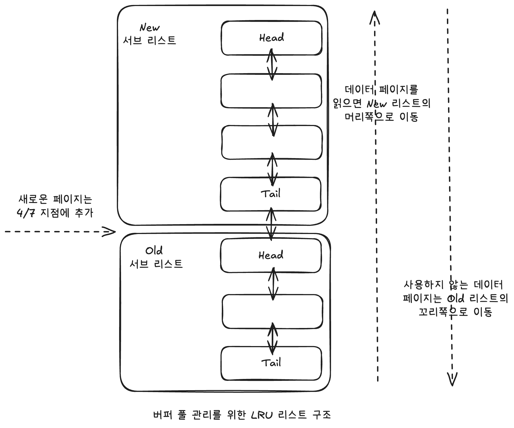
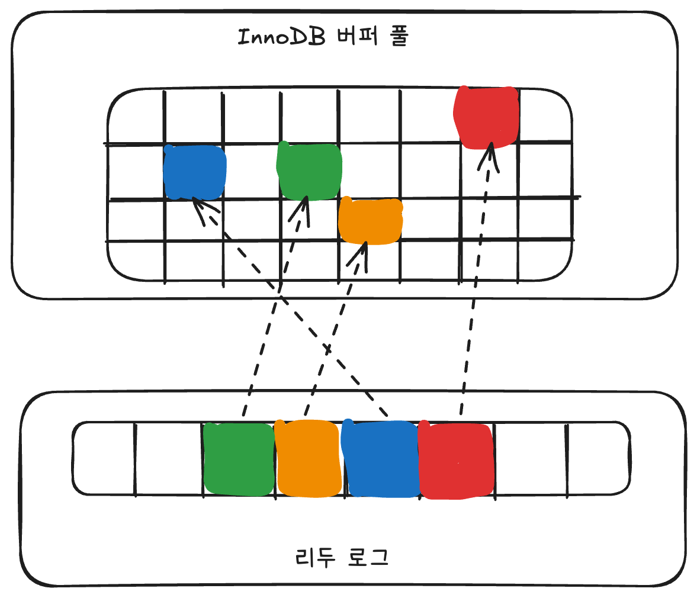

# 🧑🏻‍💻 InnoDB 버퍼 풀
<hr>

- [✅ 버퍼 풀의 크기 설정](#-버퍼-풀의-크기-설정)
- [✅ 버퍼 풀의 구조](#-버퍼-풀의-크기-설정)
- [✅ 버퍼 풀과 리두 로그](#-버퍼-풀과-리두-로그)
- [✅ 버퍼 풀 플러시(Buffer Pool Flush)](#-버퍼-풀-플러시buffer-pool-flush)
- [✅ 버퍼 풀 상태 백업 및 복구](#-버퍼-풀-상태-백업-및-복구)

InnoDB 스토리 엔진에서 가장 핵심적인 부분으로, 디스크의 데이터 파일이나 인덱스 정보를 메모리에 캐시해 두는 공간이다.  
쓰기 작업을 지연시켜 일괄 작업으로 처리할수 있게 해주는 버퍼 역할도 같이 한다.

<br>

## ✅ 버퍼 풀의 크기 설정
<hr>

일반적으로 전체 물리 메모리의 80% 정도를 InnoDB 버퍼 풀로 설정하라는 내용의 게시물도 있는데, 그렇게 단순하게 설정해서 되는 값은 아니며, 운영체제와 각 클라이언트 스레드가 사용할 메모리도 충분히 고려해서 설정해야 한다.

💡 MySQL 서버 내에서 메모리를 필요로 하는 부분은 크게 없지만, 아주 독특한 경우 레코드 버퍼가 상당한 메모리를 사용하기도 한다.  
➡ 레코드 버퍼란, 각 클라이언트 세션에서 테이블의 레코드를 읽고 쓸 때 버퍼로 사용하는 공간을 말하는데, 커넥션이 많고 사용하는 테이블도 많다면 레코드 버퍼 용도로 사용되는 메모리 공간이 꽤 많이 필요해질 수도 있다.  
➡ MySQL 서버가 사용하는 레코드 버퍼 공간은 별도로 설정할 수 없고, 전체 커넥션 개수와 커넥션에서 읽고 쓰는 테이블의 개수에 따라 동적으로 결정되기 때문에, 정확히 필요한 메모리 공간의 크기를 계산할 수 없다.

가능하면 InnoDB 버퍼 풀의 크기를 적절히 작은 값으로 설정해서 조금씩 상황을 봐 가면서 증가시키는 방법이 최적이다.  
일반적으로 회사에서 이미 MySQL 서버를 사용하고 있다면 그 서버의 메모리 설정을 기준으로 InnoDB 버퍼 풀의 크기를 조정하면 된다.

❗️ 하지만 처음으로 MySQL 서버를 준비한다면 운영체제의 전체 메모리 공간이 8GB 미만이라면 50% 정도만 InnoDB 버퍼 풀로 설정하고 나머지 메모리 공간은 MySQL 서버와 운영체제, 그리고 다른 프로그램이 사용할 수 있는 공간으로 확보해주는 것이 좋다.  
전체 메모리 공간이 그 이상이라면 InnoDB 버퍼 풀의 크기를 전체 메모리의 50%에서 시작해서 조금씩 올려가면서 최적점을 찾는다.  
운영체제의 전체 메모리 공간이 50GB 이상이라면, 대략 15~30GB 정도를 운영체제와 다른 응용 프로그램을 위해서 남겨두고, 나머지를 InnoDB 버퍼 풀로 할당하자.


<br>

❗️ InnoDB 버퍼 풀은 `innodb_buffer_pool_size` 시스템 변수로 크기를 설정할 수 있으며, 동적으로 버퍼 풀의 크기를 확장할 수 있다.  
하지만 버퍼 풀의 크기 변경은 크리티컬한 변경이므로 가능하면 MySQL 서버가 한가한 시점을 골라서 진행하면 좋다.

<br>

## ✅ 버퍼 풀의 구조
<hr>

InnoDB 스토리지 엔진은 버퍼 풀이라는 거대한 메모리 공간을 페이지 크기(`innodb_page_size` 시스템 변수에 설정)의 조각으로 쪼개어 InnoDB 스토리 엔진이 데이터를 필요로 할 때 해당 데이터 페이지를 읽어서 각 조각에 저장한다.  

➡ 버퍼 풀의 페이지 크기 조각을 관리하기 위한 3개 자료구조
1. LRU(Least Recently Used) 리스트
2. 플러시 리스트
3. 프리(Free) 리스트
   - InnoDB 버퍼 풀에서 실제 사용자 데이터로 채워지지 않은 비어 있는 페이지들의 목록
   - 사용자의 쿼리가 새롭게 디스크의 데이터 페이지를 읽어와야 하는 경우 사용된다.





LRU 리스트는 엄밀하게 LRU와 MRU(Most Recently Used) 리스트가 결합된 형태라고 보면 된다.  
➡ 'Old 서브 리스트' 영역은 LRU, 'New 서브리스트' 영역은 MRU 정도다.

<br>

> [!IMPORTANT]
> InnoDB 스토리지 엔진에서 데이터를 찾는 과정은 대략 다음과 같다.
> 1. 필요한 레코드가 저장된 데이터 페이지가 버퍼 풀에 있는지 검사
>    1. InnoDB 어댑티브 해시 인덱스를 이용해 페이지를 검색(O(1))
>    2. 해당 테이블의 인덱스(B-Tree)를 이용해 버퍼 풀에서 페이지를 검색(O(logN))
>    3. 버퍼 풀에 이미 데이터 페이지가 있었다면 해당 페이지의 포인터를 MRU 방향으로 승급
> 2. 디스크에서 필요한 데이터 페이지를 버퍼 풀에 적재하고, 적재된 페이지에 대한 포인터를 LRU 헤더 부분에 추가
> 3. 버퍼 풀의 LRU 헤더 부분에 적재된 데이터 페이지가 실제로 읽히면 MRU 헤더 부분으로 이동(Read Ahead와 같이 대량 읽기의 경우 디스크의 데이터 페이지가 버퍼 풀로 적재는 되지만 실제 쿼리에서 사용되지는 않을 수도 있으며, 이런 경우에는 MRU로 이동되지 않음)
> 4. 버퍼 풀에 상주하는 데이터 페이지는 사용자 쿼리가 얼마나 최근에 접근했었는지에 따라 나이(Age)가 부여되며, 버퍼 풀에 상주하는 동안 쿼리에서 오랫동안 사용되지 않으면 데이터 페이지에 부여된 나이가 오래되고('Aging'이라고 함), 결국 해당 페이지는 버퍼 풀에서 제거된다.  
>    버퍼 풀의 데이터 페이지가 쿼리에 의해 사용되면 나이가 초기화되어 다시 젊어지고 MRU의 헤더 부분으로 옮겨진다.
> 5. 필요한 데이터가 자주 접근됐다면 해당 페이지의 인덱스 키를 어댑티브 해시 인덱스에 추가


<br>

> [!NOTE]
> 플러시 리스트는 디스크로 동기화되지 않은 데이터를 가진 데이터 페이지(더티 페이지)의 변경 시점 수준의 페이지 목록을 관리한다.  
> ➡ 디스크에서 읽은 상태 그대로 전혀 변경이 없다면 플러시 리스트에 관리되지 않지만, 일단 한 번 데이터 변경이 가해진 데이터 페이지는 플러시 리스트에 관리되고 특정 시점이 되면 디스크로 기록돼야 한다.  
> 데이터가 변경되면 InnoDB는 변경 내용을 리두 로그에 기록하고 버퍼 풀의 데이터 페이지에도 변경 내용을 반영한다.  
> ➡ 리두 로그의 각 엔트리는 특정 데이터 페이지와 연결된다.  
> 하지만 리두 로그가 디스크로 기록됐다고 해서 데이터 페이지가 디스크로 기록이 됐다는 것을 항상 보장하지는 않는다.  
> ➡ InnoDB 스토리지 엔진은 체크포인트를 발생시켜 디스크의 리두 로그와 데이터 페이지의 상태를 동기화하게 된다.

<br>

## ✅ 버퍼 풀과 리두 로그
<hr>

> [!TIP]
> InnoDB의 버퍼 풀은 서버의 메모리가 허용하는 만큼 크게 설정하면 할수록 쿼리의 성능은 빨라진다.  
> ❗️ 물론 이미 디스크의 모든 데이터 파일이 버퍼 풀에 적재될 정도의 버퍼 풀 공간이라면 더는 버퍼 풀 크기를 늘려도 성능에 도움이 되지 않는다.  
> InnoDB 버퍼 풀은 데이터베이스 서버의 성능 향상을 위해 데이터 캐시와 쓰기 버퍼링이라는 2가지 용도가 있는데, **버퍼 풀의 메모리 공간만 단순히 늘리는 것은 데이터 캐시 기능만 향상시키는 것이다.**  
> ➡ InnoDB 버퍼 풀의 쓰기 버퍼링 기능까지 향상시키려면 InnoDB 버퍼 풀과 리두 로그와의 관계를 이해해야 한다.

<br>



> [!NOTE]
> ✔️ InnoDB 버퍼 풀은 디스크에서 읽은 상태로 전혀 변경되지 않은 클린 페이지(Clean Page)와, INSERT, UPDATE, DELETE 명령으로 변경된 데이터를 가진 더티 페이지(Dirty Page)도 가지고 있다.  
> 더티 페이지는 디스크와 메모리(버퍼 풀)의 데이터 상태가 다르기 때문에 언젠가는 디스크로 기록돼야 한다.  
➡ 하지만 더티 페이지는 버퍼 풀에 무한정 머무를 수 있는 것은 아니다.
> 
> 
> ✔️ InnoDB 스토리지 엔진에서 리두 로그는 1개 이상의 고정 크기 파일을 연결해서 순환 고리처럼 사용한다.  
> ➡ 데이터 변경이 계속 발생하면 리두 로그 파일에 기록됐던 로그 엔트리는 어느 순간 다시 새로운 로그 엔트리로 덮어쓰인다.  
> ➡ 재사용 불가능한 공간을 활성 리두 로그(Active Redo Log)라고 하는데, 위 그림에서 화살표를 가진 엔트리들이 활성 리두 로그 공간이다.

<br>

> [!NOTE]
> 리두 로그 파일의 공간은 계속 순환되어 재사용되지만 매번 기록될 때마다 로그 포지션은 계속 증가된 값을 갖게 되는데, 이를 LSN(Log Sequence Number)이라고 한다.  
> InnoDB 스토리지 엔진은 주기적으로 체크포인트 이벤트를 발생시켜 리두 로그와 버퍼 풀의 더티 페이지를 디스크로 동기화하는데, 이렇게 발생한 체크포인트 중 가장 최근 체크포인트 지점의 LSN이 활성 리두 로그 공간의 시작점이 된다.  
> 활성 리두 로그 공간의 마지막은 계속해서 증가하기 때문에 체크포인트와 무관하다.  
> ❗️ 가장 최근 체크포인트의 LSN과 마지막 리두 로그 엔트리의 LSN의 차이를 체크포인트 에이지(Checkpoint Age)라고 한다.  
> ➡ 체크포인트 에이지(Checkpoint Age)는 활성 리두 로그 공간의 크기를 일컫는다.

> ➡ 체크포인트가 발생하면 체크포인트 LSN보다 작은 리두 로그 엔트리와 관련된 더티 페이지는 모두 디스크로 동기화돼야 한다.  
> ➡ 물론 당연히 체크포인트 LSN보다 작은 LSN 값을 가진 리두 로그 엔트리도 디스크로 동기화돼야 한다.  
> 동기화 과정은 아래에 [✏️ 플러시 리스트 플러시](#-플러시-리스트-플러시)를 참고하자.

<br>

### 🤔 예제
<hr>

1. InnoDB 버퍼 풀은 100GB이며, 리두 로그 파일의 전체 크기는 100MB인 경우
2. InnoDB 버퍼 풀은 100MB이며, 리두 로그 파일의 전체 크기는 100GB인 경우

> [!NOTE]
> ❗️ 1번의 경우, 리두 로그 파일의 크기가 100MB밖에 안 된다.  
> ➡ 체크포인트 에이지(Checkpoint Age)도 최대 100MB만 허용  
> ➡ 평균 리두 로그 엔트리가 4KB였다면, 25600개(100MB/4KB) 정도의 더티 페이지만 버퍼 풀에 보관할 수 있게 된다.  
> ➡ 데이터 페이지가 16KB라고 가정한다면, 허용 가능한 전체 더티 페이지의 크기는 400MB(16KB * 25600개) 수준밖에 안 되는 것이다.  
> 💡 결국 버퍼 풀의 크기는 매우 크지만 실제 쓰기 버퍼링을 위한 효과는 거의 못 보는 상황인 것이다.  

> [!NOTE]
> ❗️ 2번의 경우, 리두 로그만 놓고 봤을 때는 대략 400GB(100GB / 4KB * 16KB) 정도의 더티 페이지를 가질 수 있다.  
> ➡ 그러나 버퍼 풀의 크기가 100MB이기 때문에 최대 허용 가능한 더티 페이지는 100MB 크기가 된다.

<br>

> [!TIP]
> 1번의 경우에는 잘못된 설정이라는 것을 쉽게 알 수 있다.  

> [!TIP]
> 2번의 경우, 이론적으로는 아무 문제가 없어 보이지만, 실제 이 상태로 서비스를 운영하다보면 급작스러운 디스크 쓰기가 발생할 가능성이 높다.  
> ➡ 버퍼 풀에 더티 페이지의 비율이 너무 높은 상태에서 갑자기 버퍼 풀이 필요해지는 상황이 오면 InnoDB 스토리지 엔진은 매우 많은 더티 페이지를 한 번에 기록해야 하는 상황이 온다.  

<br>

> [!IMPORTANT]
> 💡 처음부터 리두 로그 파일의 크기를 적절히 선택하기 어렵다면 버퍼 풀의 크기가 100GB 이하의 MySQL 서버에서는 리두 로그 파일의 전체 크기를 대략 5~10GB 수준으로 선택하고 필요할 때마다 조금씩 늘려가면서 최적값을 선택하는 것이 좋다.
> 
> 💡 당연한 이야기지만 버퍼 풀의 크기가 100GB라고 해서 리두 로그 공간이 100GB가 돼야 하는 것은 아니다.  
> ➡ 일반적으로 리두 로그는 **변경분만** 가지고 버퍼 풀은 **데이터 페이지를 통째로** 가지기 때문에 데이터 변경이 발생해도 리두 로그는 훨씬 작은 공간만 있으면 된다.

<br>

## ✅ 버퍼 풀 플러시(Buffer Pool Flush)
<hr>

> MySQL 5.6 버전까지는 InnoDB 스토리지 더티 페이지 플러시 기능이 그다지 부드럽게 처리되지 않았다.  
> 예를 들어, 급작스럽게 디스크 기록이 폭증해서 MySQL 서버의 사용자 쿼리 처리 성능에 영향을 받는 경우가 많았다.  
> MySQL 8.0 버전으로 업그레이드 되면서 예전과 같은 디스크 쓰기 폭증 현상은 발생하지 않았다.  
> 여기서 InnoDB 스토리지 엔진의 더티 페이지의 디스크 쓰기 동기화와 관련된 시스템 설정을 살펴보겠지만 특별히 서비스를 운영할 때 성능 문제가 발생하지 않는 상태라면 굳이 이 시스템 변수들을 조정할 필요는 없다.

InnoDB 스토리지 엔진은 버퍼 풀에서 아직 디스크로 기록되지 않은 더티 페이지들을 성능상의 악영향 없이 디스크에 동기화하기 위해 2개의 플러시 기능을 백그라운드로 실행한다.
1. 플러시 리스트(Flush_list) 플러시
2. LRU 리스트(LRU_list) 플러시

### ✏️ 플러시 리스트 플러시
InnoDB 스토리지 엔진은 리두 로그 공간의 재활용을 위해 주기적으로 오래된 리두 로그 엔트리가 사용하는 공간을 비워야 한다.  
❗️ 리두 로그 공간이 지워지려면 반드시 InnoDB 버퍼 풀의 더티 페이지가 먼저 디스크로 동기화돼야 한다.  
➡️ 이를 위해 InnoDB 스토리지 엔진은 주기적으로 플러시 리스트(Flush_list) 플러시 함수를 호출해서 플러시 리스트에서 오래전에 변경된 데이터 페이지 순서대로 디스크에 동기화하는 작업을 수행한다.  
➡️ 언제부터 얼마나 많은 더티 페이지를 한 번에 디스크로 기록하느냐에 따라 사용자의 쿼리 처리가 악영향을 받지 않으면서 부드럽게 처리되고, 그것과 관련하여 InnoDB 스토리지 엔진은 다음과 같은 시스템 변수들을 제공한다.

<br>

- `innodb_page_cleaners`
  - 클리너 스레드: 더티 페이지를 디스크로 동기화 하는 스레드
  - `innodb_page_cleaners`는 클리너 스레드의 개수를 조정하는 시스템 변수다.
  - 클리너 스레드 수가 InnoDB 버퍼 풀 인스턴스 개수보다 많으면 클리너 스레드 수를 자동으로 InnoDB 버퍼 풀 인스턴스 개수(`innodb_buffer_pool_instances`)에 맞춘다.
  - 가능하면 `innodb_page_cleaners` 설정값은 `innodb_buffer_pool_instances` 설정값과 맞추자. 
- `innodb_max_dirty_pages_pct`
  - InnoDB 버퍼 풀은 당연히 한계가 있기 때문에 무한정 더티 페이지를 그대로 유지할 수 없다.
  - 기본적으로 InnoDB 스토리지 엔진은 전체 버퍼 풀이 가진 페이지의 90%까지 더티 페이지를 가질 수 있는데, 때로는 이 값이 너무 높을 수도 있다.  
    ➡ `innodb_max_dirty_pages_pct` 시스템 변수로 더티 페이지의 비율을 조정할 수 있다.
  - 일반적으로 InnoDB 버퍼 풀은 더티 페이지를 많이 가지고 있을수록 디스크 쓰기 작업을 버퍼링함으로써 한 번에 디스크 쓰기를 하는 효과를 극대화 할 수 있기 때문에 기본값을 유지하는 것이 좋다.
- `innodb_max_dirty_pages_pct_lwn`
  - ❗️ InnoDB 버퍼 풀에 더티 페이지가 많으면 많을수록 디스크 쓰기 폭발(Disk IO Burst) 현상이 발생할 가능성이 높아진다. 
    - 디스크로 기록되는 더티 페이지 개수보다 발생되는 더티 페이지가 더 많아지면, 버퍼 풀에 더티 페이지가 계속 쌓이고, 더티 페이지의 비율이 90%를 넘어가면 InnoDB 스토리지 엔진은 급작스럽게 더티 페이지를 디스크로 기록해야 한다고 판단한다.
  - `innodb_max_dirty_pages_pct_lwn` 시스템 변수를 이용해 일정 수준 이상의 더티 페이지가 발생하면 조금씩 더티 페이지를 디스크로 기록하게 하고 있다.
    - 기본값은 10%수준인데, 조금 더 높은 값으로 조정하는 것도 디스크 쓰기 횟수를 줄이는 효과를 얻을 수 있다.
- `innodb_io_capacity`
  - **일반적인 상황에서** 초당 디스크 읽고 쓰기를 처리할 수 있는 수준의 값을 설정하며, 더티 페이지 쓰기 실행 기준이 된다.
- `innodb_io_capacity_max`
  - **디스크가 최대의 성능을 발휘할 때** 어느 정도의 초당 디스크 읽고 쓰기가 가능한지를 설정한다.
- `innodb_adaptive_flushing`
   - 어댑티브 플러시 기능이 활성화되면 InnoDB 스토리지 엔진은 단순히 버퍼 풀의 더티 페이지 비율이나 `innodb_io_capacity`, `innodb_io_capacity_max` 설정값에 의존하지 않고 새로운 알고리즘을 사용한다.
   - 더티 페이지를 어느 정도 디스크로 기록해야할지는 ➡ 어느 정도 속도로 더티 페이지가 생성되는지가 결정하고 ➡ 리두 로그의 증가 속도를 분석하는 것과 같다.
- `innodb_adaptive_flushing_lwn`
   - 기본값은 10%로, 리두 로그 공간에서 활성 리두 로그 공간이 10% 미만이면 어댑티브 플러시가 작동하지 않다가, 10%를 넘어가면 그때부터 어댑티브 플러시 알고리즘이 작동하게 된다. 
- `innodb_flush_neighbors`
  - 더티 페이지를 디스크에 기록할 때 물리적으로 디스크에서 근접한 페이지가 있다면 함께 묶어서 디스크에 기록하게 해주는 기능을 활성할지 여부를 결정한다.
  - 데이터 저장을 하드디스크로 하고 있다면 1 또는 2로 설정해서 활성화하는 것이 좋다.
  - 하지만 요즘에는 대부분 솔리드 스테이트 드라이브(SSD)를 사용하기 때문에 기본값인 비활성화 상태를 유지하는 것이 좋다.

<br>

### ✏️ LRU 리스트 플러시
InnoDB 스토리지 엔진은 LRU 리스트의 끝부분부터 시작해서 최대 `innodb_lru_scan_depth` 시스템 변수에 설정된 개수만큼의 페이지들을 스캔한다.  
➡️ 더티 페이지는 디스크에 동기화하게 하고, 클린 페이지는 Free 리스트로 페이지를 옮긴다.  

❗️ InnoDB 스토리지 엔진은 InnoDB 버퍼 풀 인스턴스별로 최대 `innodb_lru_scan_depth` 개수만큼 스캔하기 때문에 실질적으로 `innodb_buffer_pool_instances` * `innodb_lru_scan_depth` 수만큼 수행한다.

<br>

### 🤔 플러시 리스트 vs LRU 리스트
하나의 더티 페이지가 LRU 리스트와 플러시 리스트 양쪽에 동시에 존재한다.

#### 두 리스트의 역할

|리스트|관리대상|정렬 기준|
|---|---|---|
|LRU 리스트|모든 페이지 (클린 + 더티)|최근 접근 시간|
|플러시 리스트|더티 페이지만|최초 변경 시간 (오래된 순)|


#### 데이터 변경 시 흐름
0. 데이터 변경 발생
1. 리두 로그에 변경 내용 기록
2. 버퍼 풀의 해당 페이지를 더티 페이지로 표시
3. LRU 리스트: 해당 페이지를 MRU 방향으로 승급 (접근됐으므로)
4. 플러시 리스트: 해당 더티 페이지를 추가 (변경 시점 기록)

#### 두 플러시의 목적

플러시 리스트 플러시
- 목적: 리두 로그 공간 재활용
- 플러시 리스트에서 오래 전에 변경된 순서로 디스크에 기록

LRU 리스트 플러시
- 목적: Free 리스트 확보 (새 페이지를 적재할 빈 공간 만들기)
- LRU 리스트의 꼬리(가장 오래 전에 접근된 쪽)를 스캔
- 클린 페이지 → Free 리스트로 바로 이동
- 더티 페이지 → 디스크에 기록한 후 Free 리스트로 이동 (바로 못 버리니까)

<br>

## ✅ 버퍼 풀 상태 백업 및 복구
<hr>

InnoDB 서버의 버퍼 풀은 쿼리의 성능에 매우 밀접하게 연결돼 있다.  
➡️ 디스크의 데이터가 버퍼 풀에 적재돼있는 상태를 워밍업이라고 표현하는데, 버퍼 풀이 잘 워밍업된 상태에서는 그렇지 않은 경우보다 몇십 배의 쿼리 처리 속도를 보이는 것이 일반적이다.

<br>

❗️ MySQL 5.6 버전부터는 버퍼 풀 덤프 및 적재 기능이 도입됐다.  
`innodb_buffer_pool_dump_now` 시스템 변수를 이용해 MySQL 서버가 재시작하기 전 InnoDB 버퍼 풀의 상태를 백업할 수 있다.


```mysql
-- // MySQL 서버 셧다운 전에 버퍼 풀의 상태 백업
mysql> SET GLOBAL innodb_buffer_pool_dump_now=ON;
Query OK, 0 rows affected (0.01 sec)

-- // MySQL 서버 재시작 후, 백업된 버퍼 풀의 상태 복구
mysql> SET GLOBAL innodb_buffer_pool_load_now=ON;
Query OK, 0 rows affected (0.00 sec)
```

<br>

InnoDB 버퍼 풀의 백업은 데이터 디렉터리에 `ib_buffer_pool`이라는 이름의 파일로 생성되는데, 실제 이 파일의 크기를 보면 아무리 InnoDB 버퍼 풀이 크다 하더라도 몇십 MB 이하다.  
➡️ InnoDB 스토리지 엔진이 버퍼 풀의 LRU 리스트에서 적재된 데이터 페이지의 메타 정보만 가져와서 저장하기 때문이다.  
따라서 백업은 굉장히 빨리 된다.  
❗️ 하지만 백업된 버퍼 풀의 내용을 다시 버퍼 풀로 복구하는 과정은 각 테이블의 데이터 페이지를 디스크에서 읽어오는 과정이기 때문에 상당한 시간이 걸릴 수 있다.  
➡️ 버퍼 풀로 다시 복구하는 과정이 어느 정도 진행됐는지 확인할 수 있다.
```mysql
mysql> SHOW STATUS LIKE 'Innodb_buffer_pool_dump_status'\G
*************************** 1. row ***************************
Variable_name: Innodb_buffer_pool_dump_status
        Value: Buffer pool(s) dump completed at 260222 22:37:13
1 row in set (0.05 sec)
```


<br>

만약 버퍼 풀 복구 도중에 급히 서비스를 시작해야해서 버퍼 풀 복구를 멈춰야한다면 다음과 같이 하면 된다.
```mysql
mysql> SET GLOBAL innodb_buffer_pool_load_abort=ON;
```

<br>

- ❗️ 버퍼 풀의 백업 자동화: `innodb_buffer_pool_dump_at_shutdown`
- ❗️ 버퍼 풀의 복구 자동화: `innodb_buffer_pool_load_at_startup`


<br>

## ✅ 버퍼 풀의 적재 내용 확인
<hr>

> MySQL 5.6 버전부터 MySQL 서버의 `information_schema` 데이터베이스의 `innodb_buffer_page` 테이블을 이용해 InnoDB 버퍼 풀의 메모리에 어떤 테이블의 페이지들이 적재돼 있는지 확인할 수 있었다.  
> 하지만 InnoDB 버퍼 풀이 큰 경우에는 이 테이블 조회가 상당히 큰 부하를 일으키면서 서비스 쿼리가 많이 느려지는 문제가 있었다.  
> ➡ 실제 서비스용으로 사용되는 MySQL 서버에서는 버퍼 풀의 상태를 확인하는 것이 불가능해졌다.

MySQL 8.0 버전에서는 `information_schema` 데이터베이스에 `innodb_cached_indexes` 테이블이 새로 추가됐다.  
➡ 이 테이블을 이용하면 테이블의 인덱스별로 데이터 페이지가 얼마나 InnoDB 버퍼 풀에 적재돼 있는지 확인할 수 있다.

```mysql
mysql>
SELECT it.name table_name, ii.name index_name, ici.n_cached_pages n_cached_pages
FROM information_schema.innodb_tables it
         INNER JOIN information_schema.innodb_indexes ii ON ii.table_id = it.table_id
         INNER JOIN information_schema.innodb_cached_indexes ici ON ici.index_id = ii.index_id
WHERE it.name = CONCAT('employees', '/', 'employees');
```

조금만 응용하면 테이블 전체(인덱스 포함) 페이지 중에서 대략 어느 정도 비율이 InnoDB 버퍼 풀에 적재돼 있는지 다음과 같이 확인해볼 수 있다.  
```mysql
SELECT (SELECT SUM(ici.n_cached_pages) n_cached_pages
        FROM information_schema.INNODB_TABLES it
                INNER JOIN information_schema.INNODB_INDEXES ii ON ii.TABLE_ID = it.TABLE_ID
                INNER JOIN information_schema.INNODB_CACHED_INDEXES ici ON ici.INDEX_ID = ii.INDEX_ID
        WHERE it.NAME = CONCAT(t.table_schema, '/', t.TABLE_NAME))           as total_cached_pages,
       ((t.DATA_LENGTH + t.INDEX_LENGTH - t.DATA_FREE) / @@innodb_page_size) as total_pages
FROM information_schema.tables t
WHERE t.TABLE_SCHEMA = 'employees'
  AND t.TABLE_NAME = 'employees';
```


<br>


**출처**  
[Real MySQL 8.0](https://product.kyobobook.co.kr/detail/S000001766482)
