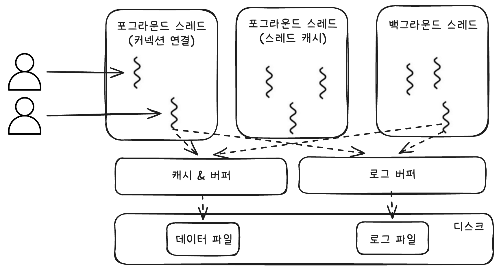

# 🧑🏻‍💻 MySQL 스레딩 구조
<hr>

- [💡 포그라운드 스레드(클라이언트 스레드)](#-포그라운드-스레드클라이언트-스레드)
- [💡 백그라운드 스레드](#-백그라운드-스레드)



MySQL 서버는 프로세스 기반이 아니라 스레드 기반으로 작동한다.  
➡ `BACKGROUND`와 `FOREGROUND` 타입으로 나뉜다.

```mysql
mysql> SELECT thread_id, name, type, processlist_user, processlist_host 
    -> FROM performance_schema.threads 
    -> ORDER BY type, thread_id;
+-----------+---------------------------------------------+------------+------------------+------------------+
| thread_id | name                                        | type       | processlist_user | processlist_host |
+-----------+---------------------------------------------+------------+------------------+------------------+
|         1 | thread/sql/main                             | BACKGROUND | NULL             | NULL             |
|         2 | thread/mysys/thread_timer_notifier          | BACKGROUND | NULL             | NULL             |
|         4 | thread/innodb/io_ibuf_thread                | BACKGROUND | NULL             | NULL             |
|         5 | thread/innodb/io_read_thread                | BACKGROUND | NULL             | NULL             |
|         6 | thread/innodb/io_read_thread                | BACKGROUND | NULL             | NULL             |
|         7 | thread/innodb/io_read_thread                | BACKGROUND | NULL             | NULL             |
|         8 | thread/innodb/io_read_thread                | BACKGROUND | NULL             | NULL             |
|         9 | thread/innodb/io_write_thread               | BACKGROUND | NULL             | NULL             |
|        10 | thread/innodb/io_write_thread               | BACKGROUND | NULL             | NULL             |
|        11 | thread/innodb/io_write_thread               | BACKGROUND | NULL             | NULL             |
|        12 | thread/innodb/io_write_thread               | BACKGROUND | NULL             | NULL             |
|        13 | thread/innodb/page_flush_coordinator_thread | BACKGROUND | NULL             | NULL             |
|        14 | thread/innodb/log_checkpointer_thread       | BACKGROUND | NULL             | NULL             |
|        15 | thread/innodb/log_flush_notifier_thread     | BACKGROUND | NULL             | NULL             |
|        16 | thread/innodb/log_flusher_thread            | BACKGROUND | NULL             | NULL             |
|        17 | thread/innodb/log_write_notifier_thread     | BACKGROUND | NULL             | NULL             |
|        18 | thread/innodb/log_writer_thread             | BACKGROUND | NULL             | NULL             |
|        19 | thread/innodb/log_files_governor_thread     | BACKGROUND | NULL             | NULL             |
|        24 | thread/innodb/srv_lock_timeout_thread       | BACKGROUND | NULL             | NULL             |
|        25 | thread/innodb/srv_error_monitor_thread      | BACKGROUND | NULL             | NULL             |
|        26 | thread/innodb/srv_monitor_thread            | BACKGROUND | NULL             | NULL             |
|        27 | thread/innodb/buf_resize_thread             | BACKGROUND | NULL             | NULL             |
|        28 | thread/innodb/srv_master_thread             | BACKGROUND | NULL             | NULL             |
|        29 | thread/innodb/dict_stats_thread             | BACKGROUND | NULL             | NULL             |
|        30 | thread/innodb/fts_optimize_thread           | BACKGROUND | NULL             | NULL             |
|        31 | thread/mysqlx/worker                        | BACKGROUND | NULL             | NULL             |
|        32 | thread/mysqlx/worker                        | BACKGROUND | NULL             | NULL             |
|        37 | thread/innodb/buf_dump_thread               | BACKGROUND | NULL             | NULL             |
|        38 | thread/innodb/clone_gtid_thread             | BACKGROUND | NULL             | NULL             |
|        39 | thread/innodb/srv_purge_thread              | BACKGROUND | NULL             | NULL             |
|        40 | thread/innodb/srv_worker_thread             | BACKGROUND | NULL             | NULL             |
|        41 | thread/innodb/srv_worker_thread             | BACKGROUND | NULL             | NULL             |
|        42 | thread/innodb/srv_worker_thread             | BACKGROUND | NULL             | NULL             |
|        44 | thread/sql/signal_handler                   | BACKGROUND | NULL             | NULL             |
|        45 | thread/mysqlx/acceptor_network              | BACKGROUND | NULL             | NULL             |
|        46 | thread/mysqlx/acceptor_network              | BACKGROUND | NULL             | NULL             |
|        43 | thread/sql/event_scheduler                  | FOREGROUND | event_scheduler  | localhost        |
|        47 | thread/sql/compress_gtid_table              | FOREGROUND | NULL             | NULL             |
|        48 | thread/sql/one_connection                   | FOREGROUND | root             | localhost        |
+-----------+---------------------------------------------+------------+------------------+------------------+
39 rows in set (0.05 sec)

```

- `FOREGROUND` 타입은 마지막 3개밖에 없다.
- 동일한 이름의 스레드가 2개 이상씩 보이는 경우는 MySQL 서버의 설정 내용에 의해 여러 스레드가 동일 작업을 병렬로 처리하는 경우다.

<br>

## ✅ 포그라운드 스레드(클라이언트 스레드)
포그라운드 스레드는 최소한 MySQL 서버에 접속된 클라이언트의 수만큼 존재하며, 주로 각 클라이언트 사용자가 요청하는 쿼리 문장을 처리한다.  
➡ 클라이언트가 작업을 마치고 커넥션을 종료하면 해당 스레드는 다시 스레드 캐시(Thread Cache)로 되돌아간다.  
➡ 이미 스레드 캐시에 대기 중인 스레드가 일정 이상의 개수가 있다면, 스레드 캐시에 넣지 않고 스레드를 종료시킨다.  
➡ `thread_cache_size` 시스템 변수로 스레드 캐시에 넣을 수 있는 스레드 개수를 정한다.

<br>

포그라운드 스레드는 데이터를 `데이터 버퍼`나 `캐시`로부터 가져오고, 없다면 직접 `디스크`의 데이터나 인덱스 파일로부터 데이터를 읽어와서 작업을 처리한다.  
➡ MyISAM 테이블은 디스크 쓰기 작업까지 포그라운드 캐시가 처리한다.  
➡ InnoDB 테이블은 데이터 버퍼나 캐시까지만 포그라운드 스레드가 처리하고, 버퍼로부터 디스크까지 기록하는 작업은 백그라운드 스레드가 처리한다.


<br>

## ✅ 백그라운드 스레드
MyISAM의 경우에는 별로 해당사항이 없지만, InnoDB의 경우에는 다음과 같은 작업을 백그라운드로 처리한다.
- `Insert Buffer`를 병합하는 스레드
- 로그를 디스크로 기록하는 스레드
- InnoDB 버퍼 풀의 데이터를 디스크에 기록하는 스레드
- 데이터를 버퍼로 읽어오는 스레드
- 잠금이나 데드락을 모니터링하는 스레드

데이터 쓰기 스레드 개수 지정 ➡ `innodb_write_io_threads`  
데이터 읽기 스레드 개수 지정 ➡ `innodb_read_io_threads`

읽기 작업은 주로 클라이언트 스레드에서 처리되기 때문에 읽기 스레드는 많이 설정할 필요는 없지만, 쓰기 스레드는 아주 많은 작업을 백그라운드로 처리한다.  
➡ 쓰기 스레드를 일반적인 내장 디스크를 사용할 때는 2~4 정도, DAS나 SAN과 같은 스토리지를 사용할 때는 디스크를 최적으로 사용할 수 있을 만큼 충분히 설정하는 것이 좋다.

<br>

데이터의 읽기 작업은 절대 지연될 수 없다.
InnoDB의 경우, 데이터의 쓰기 작업을 버퍼링해서 일괄 처리하는 기능이 탑재돼있어, 데이터가 디스크의 데이터 파일로 완전히 저장될 때까지 기다리지 않아도 된다.  
MyISAM의 경우, 일반적인 쿼리는 쓰기 버퍼링 기능을 사용할 수 없고, 사용자 스레드가 쓰기 작업까지 함께 처리하도록 되어있다.


<br>


**출처**  
[Real MySQL 8.0](https://product.kyobobook.co.kr/detail/S000001766482)
