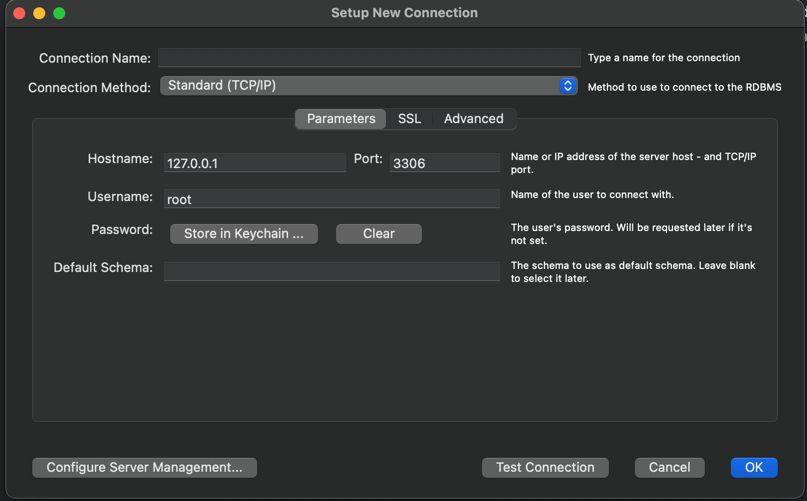
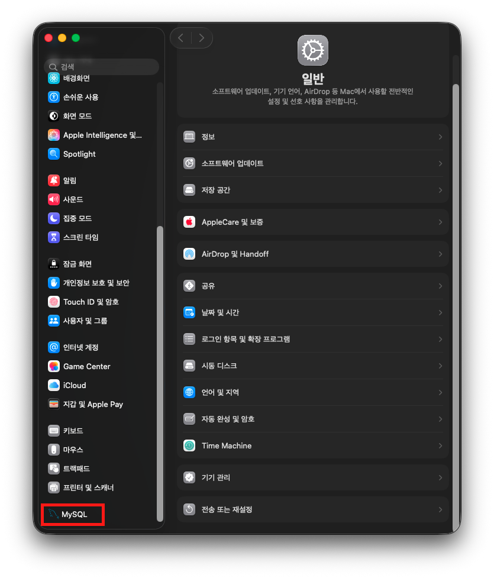

# MySql 설정 관련 해결하기 - Mac OS
<hr>

- [root 계정으로 접속하기](#-root-계정으로-접속하기)
- [계정 다루기](#계정-다루기)
- [DB 다루기](#db-다루기)
- [스프링부트와 연동하기](#-스프링부트와-연동하기)
- [MySQL 시작 및 종료](#-mysql-시작-및-종료)
- [서버 설정](#-서버-설정)

## HomeBrew로 설치하기
<hr>

```text
brew install mysql
```

<br>


## 🧑🏻‍💻 root 계정으로 접속하기
<hr>

```shell
# 소켓 파일을 이용해 접속하는 방법
mysql -uroot -p --host=localhost --socket=/tmp/mysql.sock

# TCP/IP를 통해 127.0.0.1(localhost)로 접속하는 방법
mysql -uroot -p --host=127.0.0.1 --port=3306

# 가장 기본 방식으로, 첫번째와 같은 명령어가 수행되게 된다.
mysql -u root -p
```
> 이때 root 계정에 입력했던 암호를 입력해야한다.

> 참고로 로컬 서버에 설치된 MySQL이 아니라 원격 호스트에 있는 MySQL 서버에 접속할 때는 반드시 두 번째 방법을 통해 접속해야 한다.  
> - `--host=localhost`: MySQL 클라이언트 프로그램은 항상 소켓 파일을 통해 MySQL 서버에 접속하게 되는데, 'Unix domain socker'을 이용하는 방식으로, TCP/IP를 통한 통신이 아니라 유닉스의 프로세스 간 통신(IPC; Inter Process Communication)의 일종이다.  
> - `--host=127.0.0.1`: 자기 서버를 가리키는 루프백(loop back) IP이기는 하지만 TCP/IP 통신 방식을 사용하는 것이다.

### mysql 명령어가 terminal에 먹지 않는다면?
1. 환경변수 설정을 안 하고 싶다면 `cd/usr/local/mysql/bin`으로 이동 후 `./mysql`을 해주면 접속이 가능하다. 
    ```text
    cd /usr/local/mysql/bin 
    ./mysql
    ```
2. 환경변수 설정 하려면 `/etc`로 이동해서 `profile`을 수정한다.
   - `/etc`로 이동하기
      ```text
      cd /etc
      sudo vi profile
      ```
   - `profile` 수정하기
     - `i`를 누르는 순간 수정이 가능해진다.
     - 환경변수 설정을 작성한다.
        ```text
        export DB_HOME=/usr/local/mysql
        export PATH="$PATH:/usr/local/mysql/bin"
        ```
     - ESC나 ^c를 누른 후 `:wq!` 입력 => 저장 후 종료
   - 마지막으로 설정을 반영시켜주는 명령어 입력
     ```text
     source /etc/profile 
     ```

## 계정 다루기
<hr>

### 계정 생성하기
```mysql
CREATE USER '{username}'@'%' IDENTIFIED BY '{password}';
```
```mysql
CREATE USER '{username}'@'localhost' IDENTIFIED BY '{password}';
```
위 둘 중 하나로 설정하면 된다.
- %: 모든 클라이언트에서 접근이 가능하다는 뜻
- localhost: 해당 컴퓨터에서만 접근이 가능하다는 뜻
- 그리고, username과 password에 작은 따옴표는 포함해서 작성하면 실행이 된다.
  ```mysql
  # 예를 들어
  CREATE USER 'charles'@'localhost' IDENTIFIED BY 'mypwd';
  ```
### 현재 생성된 계정 목록 조회하기
```mysql
select user, host from mysql.user;
```
그러면 user와 host로 나눠서 목록이 나오게 된다.

### 계정 삭제하기
```mysql
drop user '{username}'@'%';
```
```mysql
drop user '{username}'@'localhost';
```

## DB 다루기
<hr>

### DB 생성하기
```mysql
create database {dbname};
```
예를 들어
```mysql
create database testdb;
```

> 만약 `ERROR 1410 (42000): You are not allowed to create a user with GRANT` 에러가 발생했다면 host가 %인 계정이 없기 때문에 발생할 수 있다.  
> 나의 경우 root 계정을 % host로 추가 생성하였다.

### 생성된 DB 목록 조회하기
```mysql
show databases;
```
> 참고로 데이터베이"시스"다.

### 원하는 DB 관련 권한을 원하는 계정에다가 부여하기
**모든 권한 부여하기**
```mysql
grant ALL PRIVILEGES on {databaseName}.* to {userName};
```
해당 계정에 해당 DB에 대한 모든 권한을 준다.

**참조 권한 부여하기**
```mysql
grant REFERENCES PRIVILEGES on {databaseName}.* to {userName};
```
해당 계정에 해당 DB에 대한 참조 권한을 준다.
> 사실 위에 All Privileges 권한을 준 것만으로 충분하지만 참조 권한이 안 먹는 경우 시도해보자.

**work bench에서 권한 조회하는 권한 부여하기**
```mysql
GRANT ALL PRIVILEGES ON *.* TO {userName}@localhost;
```
사실 이 권한까지는 불필요할 수 있다. root에서 참조하기 귀찮을 때 사용하면 된다. 
### Work Bench에 연결하기

- connection name: 아무 이름 넣으면 된다.
- hostname: 그냥 냅둔다.
    > 127.0.0.1이란  
      loopback 혹은 localhost라고도 불린다.  
      네트워크 계층에서 패킷을 외부로 전송하지 않고 자신이 다시 받은 것처럼 처리한다.  
      따라서 localhost라고 입력해도 정상 작동한다.
- username: 설정한 계정 이름
- password: 설정한 비밀번호

### 계정에 적용된 권한 조회하기
```mysql
show grants for {userName}@localhost;
```
물론 localhost 대신 %를 넣어도 된다.

<br>

## 💻 스프링부트와 연동하기

```text
mysql -u root -p
```
mysql에 root 계정으로 접속

<br>

```text
create database {database 명};
```
데이터베이스 생성

<br>

```text
show databases;
``` 
생성된 데이터베이스 목록 조회(잘 생성됐는지 확인)

<br>

**application.properties**에 작성
```properties
spring.datasource.driver-class-name=com.mysql.cj.jdbc.Driver
spring.datasource.url=jdbc:mysql://localhost:3306/database명?serverTimezone=UTC
# url은 mysql:// [데이터베이스 URL] : [포트 번호] / [데이터베이스 이름]?serverTimezone=UTC으로 설정한다.
spring.datasource.username=root
spring.datasource.password=1234
```
- 포트 번호를 건드리지 않고 mysql을 설치했다면 데이터베이스 포트 번호는 3306일 것이다.(Work Bench에 들어가서 확인할 수 있다.)
- mysql에 로그인 하기 위한 username과 그에 해당하는 비밀번호도 적어준다.

<br>

## 🚀 MySQL 시작 및 종료
<hr>

- [서버 재시작 후 변경된 내역이 안 남는 경우 - 클린 셧다운](#-서버-재시작-후-변경된-내역이-안-남는-경우---클린-셧다운)
> Mac 환경 기준이다.  

  
다음과 같이 시스템 환경설정에 들어가면 MySQL을 수행할 수 있다.

<br>


만약 터미널로 실행하거나 종료하고 싶다면 아래의 명령어를 참조하자.  
```shell
# MySQL 서버 시작
sudo sudo launchctl bootstrap system /Library/LaunchDaemons/com.oracle.oss.mysql.mysqld.plist

# MySQL 서버 종료
sudo launchctl bootout system /Library/LaunchDaemons/com.oracle.oss.mysql.mysqld.plist
```

<br>

MySQL이 잘 작동 중인지 확인

```shell
sudo launchctl list | grep mysql
563	0	com.oracle.oss.mysql.mysqld
```
> - 563: MySQL 프로세스 ID (PID)
> - 0: 종료 코드 (0 = 정상 실행 중)
> - com.oracle.oss.mysql.mysqld: MySQL 서비스 이름

<br>

```shell
launchctl print system/com.oracle.oss.mysql.mysqld
system/com.oracle.oss.mysql.mysqld = {
	active count = 1
	path = /Library/LaunchDaemons/com.oracle.oss.mysql.mysqld.plist
	type = LaunchDaemon
	state = running
	...
```

<br>

MySQL 내부에서 원격으로 종료할 수도 있다.
```shell
mysql> shutdown;
Query OK, 0 rows affected (0.00 sec)
```
> 이렇게 원격으로 MySQL 서버를 셧다운하려면 SHUTDOWN 권한(Privileges)을 가지고 있어야 한다.

<br>

### 🧑🏻‍💻 서버 재시작 후 변경된 내역이 안 남는 경우 - 클린 셧다운
MySQL 서버에서는 실제 트랜잭션이 정상적으로 커밋되어도 데이터 파일에 번경된 내용이 기록되지 않고 로그 파일(리두 로그)에만 기록돼 있을 수 있다.  
심지어 MySQL 서버가 종료되고 다시 시작된 이후에도 계속 이 상태로 남아 있을 수도 있다.  
사용량이 많은 MySQL 서버에서는 더 일반적인 상황인데, 결코 **비정상적인 상황이 아니다.**  

<br>

다음과 같이 MySQL 서버의 옵셔을 변경하고 MySQL 서버를 종료하면 MySQL 서버가 종료될 때 모든 커밋된 내용을 데이터 파일에 기록하고 종료하게 할 수 있다.  

```shell
mysql> SET GLOBAL innodb_fast_shutdown=0;
mac> sudo launchctl bootout system /Library/LaunchDaemons/com.oracle.oss.mysql.mysqld.plist

# 또는 원격으로 MySQL 종료 시
mysql> SET GLOBAL innodb_fast_shutdown=0;
mysql> SHUTDOWN;
```

이와 같이 모든 커밋된 데이터를 데이터 파일에 적용하고 종료하는 것을 **클린 셧다운(Clean Shutdown)** 이라고 표현한다.  
➡ 다시 MySQL 서버가 기동할 때 별도의 트랜잭션 복구 과정을 진행하지 않기 때문에 빠르게 시작할 수 있다.

<br>

## 🧑🏻‍💻 서버 설정
> 일반적으로 MySQL 서버는 단 하나의 설정 파일을 사용하는데,  
> 리눅스를 포함한 유닉스 계열에서는 my.cnf라는 이름을 사용하고, 윈도우 계열에서는 my.ini라는 이름을 사용한다.  

```shell
# 설치된 MySQL 서버가 어느 디렉터리에서 my.cnf를 읽는지 확인
mysqld --verbose --help
...
Default options are read from the following files in the given order:
/etc/my.cnf /etc/mysql/my.cnf /opt/homebrew/etc/my.cnf ~/.my.cnf 
...
```
위 명령어 결과를 봤을 때, `my.cnf` 파일을 참조하는 순서가 나와있다.
1. `/etc/my.cnf`
2. `/etc/mysql/my.cnf`
3. `/opt/homebrew/etc/my.cnf`
4. `~/.my.cnf`

1, 2, 4번 파일은 어느 MySQL에서나 동일하게 검색하는 경로이고, 3번 파일은 컴파일될 때 MySQL 프로그램에 내장된 경로다.  

> MySQL 서버용 설정 파일은 주로 1번이나 2번을 사용하는데, 하나의 장비(서버 머신)에 2개 이상의 MySQL 서버(인스턴스)를 실행하는 경우에는 1번과 2번은 충돌이 발생할 수 있으므로 공유된 디렉터리가 아닌 별도 디렉터리에 설정 파일을 준비하고 MySQL 시작 스크립트의 내용을 변경하는 방법을 사용한다.

<br>

```shell
vi /opt/homebrew/etc/my.cnf

# Default Homebrew MySQL server config
[mysqld]
# Only allow connections from localhost
bind-address = 127.0.0.1
mysqlx-bind-address = 127.0.0.1
```

이 설정 파일이 MySQL 서버만을 위한 설정 파일이라면 `[mysqld]` 그룹만 명시해도 무방하다.  
하지만 MySQL 서버뿐 아니라 MySQL 클라이언트나 백업을 위한 `mysqldump` 프로그램이 실행될 때도 이 설정 파일을 공용으로 사용하고 싶다면 `[mysql]` 또는 `[mysqldump]` 등의 그룹을 함께 설정해둘 수 있다.

<br>


**출처**  
[[Spring] 스프링 mysql 데이터베이스와 jpa 연동](https://growth-coder.tistory.com/111)  
[Real MySQL 8.0](https://product.kyobobook.co.kr/detail/S000001766482)
