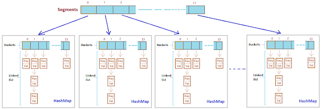

# 💻 HashMap vs HashTable vs ConcurrentHashMap vs LinkedHashMap

## ✅ HashMap
- 데이터를 저장할 때 키-값 쌍으로 저장한다.
- 키는 중복되지 않으며, `null`을 허용한다.(즉, `null` 키도 하나만 저장될 수 있다.)
- 값은 중복되어도 상관없으며, `null`도 허용한다.
- `HashMap`은 동기화가 되어있지 않기 때문에 멀티스레드 환경에서 사용할 때는 주의가 필요하다.

### 💡 HashMap에서 여러 쓰레드가 동시접근할 때 생기는 문제점
1. 해시 충돌이 발생하는 경우, 같은 인덱스에 여러 데이터가 중복되어 저장될 수 있다.
   - 이때는 `LinkedList`를 이용하여 데이터를 추가로 연결하는데, 데이터가 많이 쌓이면 검색 속도가 느려지게 된다.
   - 이런 상황에서 `HashMap`은 일정 길이 이상의 `LinkedList`를 가지게 되면, 해당 인덱스에 대한 모든 데이터를 새로운 위치로 이동시켜야하는 데이터의 재비치(rehashing)가 발생하게 된다. 
2. 한 쓰레드가 HashMap의 값을 수정하는 도중 다른 쓰레드가 같은 위치에 있는 값을 수정한다면, 값이 덮어써지는 문제가 발생할 수 있다.
3. 여러 쓰레드에서 동시에 `HashMap`에 데이터를 추가하면, 배열의 크기가 늘어나야하는 상황에서도 여러 쓰레드가 동시에 배열의 크기를 조정하려고 할 수 있다.
   - 이런 경우 서로 다른 쓰레드가 동시에 배열의 크기를 증가시키려고 할 수 있으며, 이로 인해 배열의 크기가 너무 커져서 데이터의 재배치(rehashing)가 자주 발생하게 된다.

> 재배치(rehashing)이란?  
> HashMap은 내부적으로 배열과 링크드 리스트를 사용하여 데이터를 저장한다.  
> 이때 배열의 크기는 HashMap의 초기 크기와 로드 팩터(Load Factor)에 따라 결정된다.
> 만약 배열의 크기가 초기에 설정된 값보다 작아지면, 배열의 크기를 늘리고 모든 데이터를 새로운 배열에 다시 해싱해야 한다.  
> 이 작업이 바로 데이터의 재배치(rehashing)이다.

이러한 문제를 해결하기 위해서는 `ConcurrentHashMap`을 사용하거나, `HashMap`을 동기화하는 방법을 사용해야 한다.  
`ConcurrentHashMap`은 동시에 여러 쓰레드가 접근해도 안전하게 데이터를 관리할 수 있도록 동기화를 제공한다.  
또한, `HashMap`을 동기화할 경우에는 동기화된 블록으로 `HashMap`의 접근을 제어하여 데이터의 일관성을 보장할 수 있다.

<br>

## ✅ HashTable
- `HashMap`과 유사한 해시 테이블 구조를 사용하지만, `HashMap`과 달리 동기화(Synchronization)을 제공한다.
- 즉, 멀티쓰레드 환경에서 안전하게 사용할 수 있다.
- 하지만 동기화를 제공하므로 성능면에서는 `HashMap`보다 떨어지는 경우가 있다.
- 또한, `null` 값을 허용하지 않는다.

### 💡 HashTable이 어떤식으로 동기화를 제공하는가?
- `HashTable`은 모든 메서드에 `synchronized` 키워드를 사용하여, 쓰레드 간에 동기화를 제공한다.
  - `synchronized` 키워드를 사용하면, 한 번에 하나의 쓰레드만 해당 메서드에 접근할 수 있도록 제한한다.
  - 따라서, 동기화를 제공함으로써 멀티쓰레드 환경에서 데이터 일관성 문제를 방지할 수 있다.
- 하지만, `synchronized` 키워드를 사용하면 성능이 저하될 수 있기 때문에, Java 1.5부터는 `ConcurrentHashMap`이나 `Collections.synchronizedMap` 메서드를 사용하여 동시성을 보장하는 Map 자료구조를 사용하는 것이 권장된다.
  - 이러한 자료구조들은 `HashTable`과 달리, 락(lock)을 더욱 세분화하여 성능을 향상시킨다.

<br>

## ✅ ConcurrentHashMap
- `ConcurrentHashMap`은 멀티쓰레드 환경에서 안전하게 사용할 수 있는 해시 테이블 구조다.
- `HashMap`과 비슷하지만, 동기화를 적용하는 대신 세분화된 락(lock)을 사용하여 성능을 향상시켰다.

### 💡 ConcurrentHashMap은 어떤식으로 Lock을 사용하는가?
1. 세그먼트 락(Segment Lock)
   - `ConcurrentHashMap`은 내부적으로 여러 개의 세그먼트(Segment)로 나뉘어져 있다.
   - 각 세그먼트는 자체적으로 락을 가지고 있으며, 서로 독립적으로 작동한다.
   - 이를 통해 여러 쓰레드가 동시에 접근해도 서로 다른 세그먼트에서 작업하므로, 락 충돌이 발생할 확률을 줄일 수 있다.
2. 엔트리 락(Entry Lock)
   - `ConcurrentHashMap`은 각 엔드리(Entry)에 대해 락을 가질 수 있다.
   - 각 세그먼트는 엔트리 락을 사용하여, 해당 세그먼트 내에서 동시에 접근하려는 여러 쓰레드 간의 경쟁을 제어한다.
   - 엔트리 락은 세그먼트 락보다 작은 범위에서 락 충돌이 발생할 확률을 줄일 수 있다.

### 💡 해시버켓과 세그먼트
`ConcurrentHashMap`가 여러 쓰레드에서 안전하게 사용할 수 있게 해주는 방법 중 하나는, 내부적으로 여러 개의 해시 버킷을 여러 개의 세그먼트(Segment)로 분할하여 관리하는 것이다.  
각 세그먼트는 자체적으로 동기화 되어있으므로, 여러 쓰레드에서 동시에 접근해도 안전하게 데이터를 처리할 수 있다.


**해시버킷**  
해시 테이블에서 데이터를 저장하는 공간이다.  
해시버킷은 일반적으로 `LinkedList` 혹은 `Tree` 구조로 구성되어 있다.  
각각의 해시버킷은 배열의 한 인덱스에 해당하며, 버킷 내부에는 키(Key)와 값(Value) 쌍을 저장하는 엔트리(Entry) 객체가 저장된다.  
해시 함수에 의해 계산된 해시 값이 버킷의 인덱스로 사용된다.

<br>

**여러 개의 세그먼트(segment)로 분할**  
`ConcurrentHashMap`은 내부적으로 세그먼트라는 작은 해시 테이블을 여러 개 만들어서 관리한다.  
전체 해시 테이블을 하나의 큰 해시 버킷으로 관리하는 것이 아니라, 작은 세그먼트 단위로 분할하여 병렬성을 높이는 것이다.  

```java
ConcurrentHashMap<String, Integer> map = new ConcurrentHashMap<>(16, 0.75f, 4);
// 초기 크기: 16, 로드 팩터(load factor): 0.75, 세그먼트 개수: 4

map.put("apple", 1);
map.put("banana", 2);
map.put("cherry", 3);
map.put("date", 4);
map.put("eggplant", 5);
map.put("fig", 6);
map.put("grape", 7);
map.put("honeydew", 8);
```
> 예를 들어, "apple"의 해시 값이 0이면, 0번 세그먼트에 저장되고, "banana"의 해시 값이 1이면, 1번 세그먼트에 저장된다.  
> 각각의 세그먼트는 독립적으로 잠금을 가지고 있으므로, 여러 쓰레드에서 동시에 접근하더라도 세그먼트 간의 충돌이나 경합 없이 안전하게 작업을 처리할 수 있다.


<br>

## ✅ LinkedHashMap
`LinkedHashMap`은 데이터의 삽입 순서를 유지하는 해시 테이블과 연결 리스트를 결합한 자료구조다.  
데이터를 저장할 때 순서대로 저장하기 때문에, 데이터의 순서가 중요한 상황에서 사용하기 적합하다.  
`LinkedHashMap`은 동기화 되어있지 않기 때문에 멀티 쓰레드 환경에서 사용할 때는 주의가 필요하다.

<br>


**출처**  
[[JAVA] HashMap, HashTable, ConcurrentHashMap,LinkedHashMap 차이](https://peonyf.tistory.com/entry/JAVA-HashMap%EC%99%80-Enum)