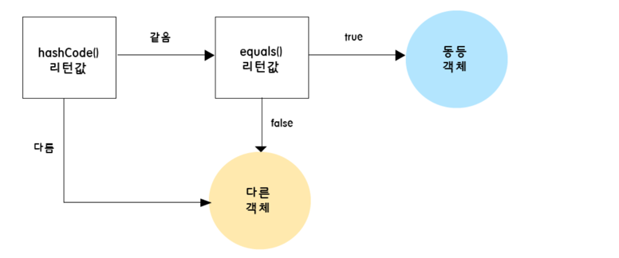
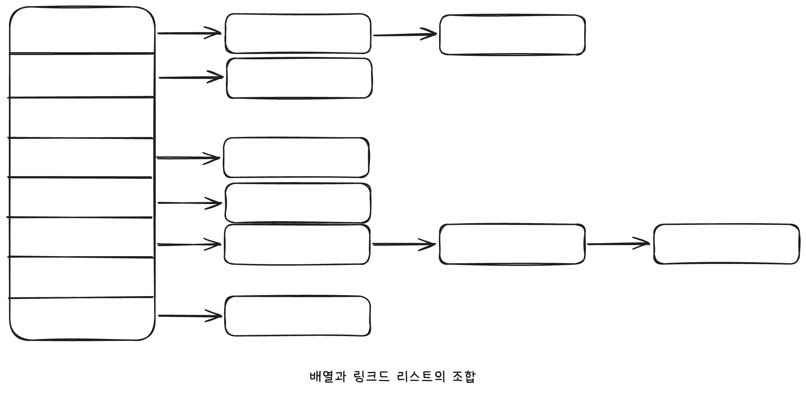
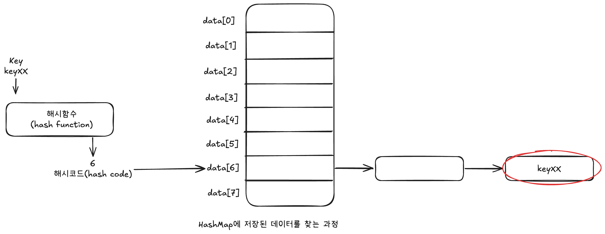
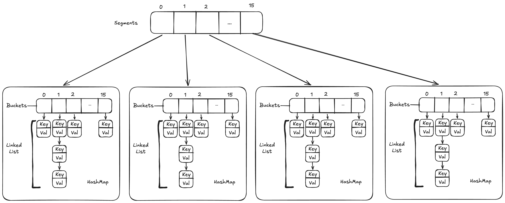

# 💻 HashMap vs HashTable vs ConcurrentHashMap vs LinkedHashMap
<hr>

- [✅ `equals()`와 `hashCode()` 메서드](#-equals와-hashcode-메서드)
- [✅ 해싱과 해싱함수](#-해싱과-해싱함수)
- [✅ HashMap](#-hashmap)
- [✅ Hashtable](#-hashtable)
- [✅ ConcurrentHashMap](#-concurrenthashmap)
- [✅ LinkedHashMap](#-linkedhashmap)


## ✅ `equals()`와 `hashCode()` 메서드
<hr>

### 💡 `equals()`

> [!NOTE]
> `equals()`는 두 참조 변수의 값이 같은지 다른지 동등 여부를 비교할 때 사용한다.  
> 클래스 자료형의 객체 데이터일 경우, 객체의 주소를 이용하여 비교한다.

> [!IMPORTANT]
> `new` 연산을 이용해 생성한 서로 다른 객체는 컴퓨터 입장에서는 힙 영역에 따로 저장해두고 있기 때문에 객체의 주소가 같지 않아 무조건 다른 데이터로 인식한다.  
> ➡️ 데이터적인 입장에서, 같은 데이터를 갖고 있으면 같은 객체로 인식하게 하고싶을 때 사용하는 것이 `equals()` 메서드다.

```java
import java.util.Objects;

public class Main {
    public static void main(String[] args) {
        Person p1 = new Person("홍길동");
        Person p2 = new Person("홍길동");
        System.out.println("p1.equals(p2) = " + p1.equals(p2)); // p1.equals(p2) = true
    }
}

class Person {
    private String name;

    public Person(String name) {
        this.name = name;
    }

    @Override
    public boolean equals(Object o) {
        if (o == null || getClass() != o.getClass()) return false;
        Person person = (Person) o;
        return Objects.equals(name, person.name);
    }
}
```

> [!TIP]
> `Objects` 클래스는 `java.util.` 패키지에 있는 클래스다.  
> 객체 비교, 해시 코드 생성, null 여부, 객체 문자열 리턴 등의 연산을 수행하는 정적 메서드들로 구성되어 있으며, 개발자가 가져가 쓰기 편하게 하기 위해서 구현되어있다.

<br>

### 💡 `hashCode()`

> [!NOTE]
> `hashCode()` 메서드는 객체의 주소값을 이용해서 해싱(hashing) 기법을 통해 해시 코드로 만든 후 반환하다.  
> 엄밀히 말하자면 해시코드는 주소값은 아니고, 주소값으로 만든 고유한 숫자값이다.


```java
import java.util.HashSet;
import java.util.Objects;
import java.util.Set;

public class Main {
    public static void main(String[] args) {
        Person p1 = new Person("홍길동");
        Person p2 = new Person("홍길동");
        System.out.println("p1.equals(p2) = " + p1.equals(p2)); // p1.equals(p2) = true

        Set<Person> set = new HashSet<>();
        set.add(p1);
        set.add(p2);

        System.out.println("set.size() = " + set.size()); // set.size() = 2
    }
}

class Person {
    private String name;

    public Person(String name) {
        this.name = name;
    }

    @Override
    public boolean equals(Object o) {
        if (o == null || getClass() != o.getClass()) return false;
        Person person = (Person) o;
        return Objects.equals(name, person.name);
    }
}

```


> [!IMPORTANT]
> 아래에서 다루게 될 Collection(HashSet, HashMap, HashTable)은 객체가 논리적으로 같은지 비교할 때 아래 그림과 같은 과정을 거친다.



> [!NOTE]
> 따라서 위 예제 코드에서 `hashCode()` 메서드가 재정의되어 있지 않기 때문에 Object 클래스의 `hashCode()` 메서드가 사용되었고, 객체마다 다른 값을 리턴하였다.  
> ➡️ `p1`과 `p2` 객체는 `equals()`로 비교도 하기 전에 서로 다른 `hashCode()` 메서드의 리턴 값으로 인해 서로 다른 객체로 판단되어 컬렉션에 추가로 적재된 것이다.


<br>

> [!IMPORTANT]
> `Objects.hashCode()` 메서드는 매개변수로 주어진 값들을 이용해서 고유한 해시코드를 생성한다.  
> 클래스가 `hashCode()` 메서드를 재정의할 때 리턴값을 생성하기 위해서 사용된다(다만 속도가 느리다).

```java
import java.util.HashSet;
import java.util.Objects;
import java.util.Set;

public class Main {
    public static void main(String[] args) {
        Person p1 = new Person("홍길동");
        Person p2 = new Person("홍길동");
        System.out.println("p1.equals(p2) = " + p1.equals(p2)); // p1.equals(p2) = true

        System.out.println("p1.hashCode() = " + p1.hashCode()); // p1.hashCode() = 54150062
        System.out.println("p2.hashCode() = " + p2.hashCode()); // p2.hashCode() = 54150062
        
        Set<Person> set = new HashSet<>();
        set.add(p1);
        set.add(p2);

        System.out.println("set.size() = " + set.size()); // set.size() = 1
    }
}

class Person {
    private String name;

    public Person(String name) {
        this.name = name;
    }

    @Override
    public boolean equals(Object o) {
        if (o == null || getClass() != o.getClass()) return false;
        Person person = (Person) o;
        return Objects.equals(name, person.name);
    }

    @Override
    public int hashCode() {
        return Objects.hashCode(name);
    }
}
```

> [!TIP]
> 위와 같이 `equals()`와 `hashCode()` 메서드를 오버라이딩해버리면, 객체 자체의 주소값(해시코드)를 얻어야할 상황이 오면 난감할 수 있다.  
> ➡️ JAVA에서는 원조 해시코드를 반환해주는 또다른 메서드인 `identityHashCode()`를 만들었다.

```java
import java.util.HashSet;
import java.util.Objects;
import java.util.Set;

public class Main {
    public static void main(String[] args) {
        Person p1 = new Person("홍길동");
        Person p2 = new Person("홍길동");
        System.out.println("p1.equals(p2) = " + p1.equals(p2)); // p1.equals(p2) = true

        System.out.println("p1.hashCode() = " + p1.hashCode()); // p1.hashCode() = 54150062
        System.out.println("p2.hashCode() = " + p2.hashCode()); // p2.hashCode() = 54150062
        
        Set<Person> set = new HashSet<>();
        set.add(p1);
        set.add(p2);

        System.out.println("set.size() = " + set.size()); // set.size() = 1

        System.out.println("System.identityHashCode(p1) = " + System.identityHashCode(p1)); // System.identityHashCode(p1) = 1496724653
        System.out.println("System.identityHashCode(p2) = " + System.identityHashCode(p2)); // System.identityHashCode(p2) = 553264065
    }
}

class Person {
    private String name;

    public Person(String name) {
        this.name = name;
    }

    @Override
    public boolean equals(Object o) {
        if (o == null || getClass() != o.getClass()) return false;
        Person person = (Person) o;
        return Objects.equals(name, person.name);
    }

    @Override
    public int hashCode() {
        return Objects.hashCode(name);
    }
}
```

<br>

## ✅ 해싱과 해싱함수
<hr>

> [!IMPORTANT]
> 해싱이란 해시함수(hash function)를 이용해서 데이터를 해시테이블(hash table)에 저장하고 검색하는 기법을 말한다.  
> 해시함수는 데이터가 저장되어있는 곳을 알려주기 때문에 다량의 데이터 중에서도 원하는 데이터를 빠르게 찾을 수 있다.


해싱에서 사용하는 자료구조는 다음과 같이 배열과 링크드 리스트의 조합으로 되어 있다.



> [!NOTE]
> 저장할 데이터의 키를 해시함수에 넣으면 배열의 한 요소를 얻게 되고, 다시 그곳에 연결되어 있는 링크드 리스트에 저장하게 된다.


1. 검색하고자 하는 값의 키로 해시함수를 호출한다.
2. 해시함수의 계산결과(해시코드)로 해당 값이 저장되어 있는 링크드 리스트를 찾는다.
3. 링크드 리스트에서 검색한 키와 일치한 데이터를 찾는다.

<br>

> [!IMPORTANT]
> 링크드 리스트는 검색에 불리한 자료구조이기 때문에 링크드 리스트의 크기가 커질수록 검색속도가 떨어진다.  
> 배열은 배열의 크기가 커져도, 원하는 요소가 몇 번째에 있는지만 알면 빠르게 원하는 값을 찾을 수 있다.  
> ➡️ Object 클래스에 정의된 `hashCode()` 메서드는 객체의 주소를 이용하는 알고리즘으로 해시코드를 만들어내기 때문에 모든 객체에 대해 `hashCode()`를 호출한 결과가 서로 유일한 훌륭한 방법으로, 성능이 좋다.


<br>


## ✅ HashMap
<hr>

> [!NOTE]
> `HashTable`과 `HashMap`의 관계는 `Vector`와 `ArrayList`의 관계와 같아서, 새로운 버전인 `HashMap`을 사용하는 것이 권장된다.  
> key와 value를 묶어서 하나의 entry로 저장하는 특징을 갖고 있고, 해싱을 사용하기 때문에 많은 양의 데이터를 검색하는 데 있어서 뛰어난 성능을 보인다.

> [!TIP]
> - 데이터를 저장할 때 키-값 쌍으로 저장한다.
> - 키는 중복되지 않으며, `null`을 허용한다.(즉, `null` 키도 하나만 저장될 수 있다.)
> - 값은 중복되어도 상관없으며, `null`도 허용한다.
    >   - `HashTable`은 key나 value에 `null`을 허용하지 않는다.
> - `HashMap`은 동기화가 되어있지 않기 때문에 멀티스레드 환경에서 사용할 때는 주의가 필요하다.

### 💡 HashMap에서 여러 쓰레드가 동시접근할 때 생기는 문제점
> [!IMPORTANT]
> 1. 해시 충돌이 발생하는 경우, 같은 인덱스에 여러 데이터가 중복되어 저장될 수 있다.
     >    - 이때는 `LinkedList`를 이용하여 데이터를 추가로 연결하는데, 데이터가 많이 쌓이면 검색 속도가 느려지게 된다.
>    - 이런 상황에서 `HashMap`은 일정 길이 이상의 `LinkedList`를 가지게 되면, 해당 인덱스에 대한 모든 데이터를 새로운 위치로 이동시켜야하는 데이터의 재배치(`rehashing`)가 발생하게 된다.
> 2. 한 쓰레드가 `HashMap`의 값을 수정하는 도중 다른 쓰레드가 같은 위치에 있는 값을 수정한다면, 값이 덮어써지는 문제가 발생할 수 있다.
> 3. 여러 쓰레드에서 동시에 `HashMap`에 데이터를 추가하면, 배열의 크기가 늘어나야하는 상황에서도 여러 쓰레드가 동시에 배열의 크기를 조정하려고 할 수 있다.
     >    - 이런 경우 서로 다른 쓰레드가 동시에 배열의 크기를 증가시키려고 할 수 있으며, 이로 인해 배열의 크기가 너무 커져서 데이터의 재배치(`rehashing`)가 자주 발생하게 된다.


> [!TIP]
> 재배치(`rehashing`)이란?  
> `HashMap`은 내부적으로 배열과 링크드 리스트를 사용하여 데이터를 저장한다.  
> 이때 배열의 크기는 `HashMap`의 초기 크기와 로드 팩터(`Load Factor`)에 따라 결정된다.
> 만약 배열의 크기가 초기에 설정된 값보다 작아지면, 배열의 크기를 늘리고 모든 데이터를 새로운 배열에 다시 해싱해야 한다.  
> 이 작업이 바로 데이터의 재배치(`rehashing`)이다.

> [!TIP]
> `Load Factor`는 컬렉션 클래스에 저장공간이 가득 차기 전에 미리 용량을 확보하기 위한 것으로, 이 값을 0.8로 지정하면, 저장 공간의 80%가 채워졌을 때 용량이 2배로 늘어난다.  
> 기본값은 0.75, 즉 75%다.  
> Java의 컬렉션 클래스(`HashSet`, `HashMap` 등)의 생성자의 매개변수로 설정할 수 있다.


> [!IMPORTANT]
> 이러한 문제를 해결하기 위해서는 `ConcurrentHashMap`을 사용하거나, `HashMap`을 동기화하는 방법을 사용해야 한다.  
> `ConcurrentHashMap`은 동시에 여러 쓰레드가 접근해도 안전하게 데이터를 관리할 수 있도록 동기화를 제공한다.  
> 또한, `HashMap`을 동기화할 경우에는 동기화된 블록으로 `HashMap`의 접근을 제어하여 데이터의 일관성을 보장할 수 있다.

```java
public class HashMap<K,V> extends AbstractMap<K,V>
    implements Map<K,V>, Cloneable, Serializable {

    public V get(Object key) {}
    public V put(K key, V value) {}
}
```

<br>

## ✅ HashTable
<hr>

> [!TIP]
> - `HashMap`과 유사한 해시 테이블 구조를 사용하지만, `HashMap`과 달리 동기화(Synchronization)을 제공한다.
> - 즉, 멀티쓰레드 환경에서 안전하게 사용할 수 있다.
> - 하지만 동기화를 제공하므로 성능면에서는 `HashMap`보다 떨어지는 경우가 있다.
> - 또한, `null` 값을 허용하지 않는다.

### 💡 HashTable은 어떤식으로 동기화를 제공하는가?
> [!IMPORTANT]
> - `Hashtable`은 모든 메서드에 `synchronized` 키워드를 사용하여, 쓰레드 간에 동기화를 제공한다.
    >   - `synchronized` 키워드를 사용하면, 한 번에 하나의 쓰레드만 해당 메서드에 접근할 수 있도록 제한한다.
>   - 따라서, 동기화를 제공함으로써 멀티쓰레드 환경에서 데이터 일관성 문제를 방지할 수 있다.
> - 하지만, `synchronized` 키워드를 사용하면 성능이 저하될 수 있기 때문에, Java 1.5부터는 `ConcurrentHashMap`이나 `Collections.synchronizedMap` 메서드를 사용하여 동시성을 보장하는 Map 자료구조를 사용하는 것이 권장된다.
    >   - 이러한 자료구조들은 `Hashtable`과 달리, 락(lock)을 더욱 세분화하여 성능을 향상시킨다.

```java
public class Hashtable<K,V>
    extends Dictionary<K,V>
    implements Map<K,V>, Cloneable, java.io.Serializable {

    public synchronized int size() { }

    @SuppressWarnings("unchecked")
    public synchronized V get(Object key) { }

    public synchronized V put(K key, V value) { }
}
```

<br>

## ✅ ConcurrentHashMap
<hr>

> [!TIP]
> - `ConcurrentHashMap`은 멀티쓰레드 환경에서 안전하게 사용할 수 있는 해시 테이블 구조다.
> - `HashMap`과 비슷하지만, 동기화를 적용하는 대신 세분화된 락(lock)을 사용하여 성능을 향상시켰다.

### 💡 ConcurrentHashMap은 어떤식으로 Lock을 사용하는가?
> [!IMPORTANT]
> 1. 세그먼트 락(Segment Lock)
     >    - `ConcurrentHashMap`은 내부적으로 여러 개의 세그먼트(Segment)로 나뉘어져 있다.
>    - 각 세그먼트는 자체적으로 락을 가지고 있으며, 서로 독립적으로 작동한다.
>    - 이를 통해 여러 쓰레드가 동시에 접근해도 서로 다른 세그먼트에서 작업하므로, 락 충돌이 발생할 확률을 줄일 수 있다.
> 2. 엔트리 락(Entry Lock)
     >    - `ConcurrentHashMap`은 각 엔드리(Entry)에 대해 락을 가질 수 있다.
>    - 각 세그먼트는 엔트리 락을 사용하여, 해당 세그먼트 내에서 동시에 접근하려는 여러 쓰레드 간의 경쟁을 제어한다.
>    - 엔트리 락은 세그먼트 락보다 작은 범위에서 락 충돌이 발생할 확률을 줄일 수 있다.

### 💡 해시버킷과 세그먼트
> [!IMPORTANT]
> `ConcurrentHashMap`가 여러 쓰레드에서 안전하게 사용할 수 있게 해주는 방법 중 하나는, 내부적으로 여러 개의 해시 버킷을 여러 개의 세그먼트(Segment)로 분할하여 관리하는 것이다.  
> 각 세그먼트는 자체적으로 동기화 되어있으므로, 여러 쓰레드에서 동시에 접근해도 안전하게 데이터를 처리할 수 있다.



**해시버킷**  
해시 테이블에서 데이터를 저장하는 공간이다.  
해시버킷은 일반적으로 `LinkedList` 혹은 `Tree` 구조로 구성되어 있다.  
각각의 해시버킷은 배열의 한 인덱스에 해당하며, 버킷 내부에는 키(Key)와 값(Value) 쌍을 저장하는 엔트리(Entry) 객체가 저장된다.  
해시 함수에 의해 계산된 해시 값이 버킷의 인덱스로 사용된다.

<br>

**여러 개의 세그먼트(segment)로 분할**  
`ConcurrentHashMap`은 내부적으로 세그먼트라는 작은 해시 테이블을 여러 개 만들어서 관리한다.  
전체 해시 테이블을 하나의 큰 해시 버킷으로 관리하는 것이 아니라, 작은 세그먼트 단위로 분할하여 병렬성을 높이는 것이다.  

```java
ConcurrentHashMap<String, Integer> map = new ConcurrentHashMap<>(16, 0.75f, 4);
// 초기 크기: 16, 로드 팩터(load factor): 0.75, 세그먼트 개수: 4

map.put("apple", 1);
map.put("banana", 2);
map.put("cherry", 3);
map.put("date", 4);
map.put("eggplant", 5);
map.put("fig", 6);
map.put("grape", 7);
map.put("honeydew", 8);
```
> 예를 들어, "apple"의 해시 값이 0이면, 0번 세그먼트에 저장되고, "banana"의 해시 값이 1이면, 1번 세그먼트에 저장된다.  
> 각각의 세그먼트는 독립적으로 잠금을 가지고 있으므로, 여러 쓰레드에서 동시에 접근하더라도 세그먼트 간의 충돌이나 경합 없이 안전하게 작업을 처리할 수 있다.

```java
final V putVal(K key, V value, boolean onlyIfAbsent) {
    // 키와 값이 null일 수 없으므로 NullPointerException을 던집니다.
    if (key == null || value == null) throw new NullPointerException();
    
    // 키의 해시코드를 계산하고 이를 스프레드(spread)하여 해시 테이블에서의 위치를 분산시킵니다.
    int hash = spread(key.hashCode());
    int binCount = 0;

    // 해시 테이블이 초기화되었는지, 그리고 각 버킷을 처리할 수 있는지 확인합니다.
    for (Node<K,V>[] tab = table;;) {
        Node<K,V> f; int n, i, fh; K fk; V fv;
        // 해시 테이블이 아직 초기화되지 않았거나 크기가 0이면 초기화합니다.
        if (tab == null || (n = tab.length) == 0)
            tab = initTable();
        // 계산된 인덱스의 버킷이 비어 있으면 CAS(Compare-And-Swap)로 새로운 노드를 추가합니다.
        else if ((f = tabAt(tab, i = (n - 1) & hash)) == null) {
            if (casTabAt(tab, i, null, new Node<K,V>(hash, key, value)))
                break;  // 락 없이 빈 버킷에 노드를 추가한 경우 반복을 종료합니다.
        }
        // 버킷이 리사이징 중인 경우 해당 버킷을 리사이징 작업에 참여시킵니다.
        else if ((fh = f.hash) == MOVED)
            tab = helpTransfer(tab, f);
        // 락 없이 첫 번째 노드를 확인하여 조건부로 노드를 삽입할 수 있는지 확인합니다.
        else if (onlyIfAbsent 
                 && fh == hash
                 && ((fk = f.key) == key || (fk != null && key.equals(fk)))
                 && (fv = f.val) != null)
            return fv; // 조건에 맞는 기존 값을 반환합니다.
        else {
            V oldVal = null;
            // 첫 번째 노드가 비어있지 않다면, 노드를 수정하기 위해 해당 버킷을 동기화합니다.
            synchronized (f) {
                if (tabAt(tab, i) == f) {
                    if (fh >= 0) {
                        binCount = 1;
                        // 연결 리스트를 순회하여 키가 존재하는지 확인하고, 값을 갱신하거나 새 노드를 추가합니다.
                        for (Node<K,V> e = f;; ++binCount) {
                            K ek;
                            if (e.hash == hash &&
                                ((ek = e.key) == key ||
                                 (ek != null && key.equals(ek)))) {
                                oldVal = e.val;
                                if (!onlyIfAbsent)
                                    e.val = value; // 기존 값이 존재하면 덮어씁니다.
                                break;
                            }
                            Node<K,V> pred = e;
                            if ((e = e.next) == null) {
                                pred.next = new Node<K,V>(hash, key, value);
                                break; // 새 노드를 연결 리스트에 추가합니다.
                            }
                        }
                    }
                    // 노드가 트리 구조인 경우 트리 노드에 대해 처리합니다.
                    else if (f instanceof TreeBin) {
                        Node<K,V> p;
                        binCount = 2;
                        if ((p = ((TreeBin<K,V>)f).putTreeVal(hash, key, value)) != null) {
                            oldVal = p.val;
                            if (!onlyIfAbsent)
                                p.val = value; // 트리 노드의 값을 갱신합니다.
                        }
                    }
                    // 예약된 노드에 대한 재귀적 업데이트 오류를 방지합니다.
                    else if (f instanceof ReservationNode)
                        throw new IllegalStateException("Recursive update");
                }
            }
            if (binCount != 0) {
                // 노드 수가 특정 임계치(TREEIFY_THRESHOLD)를 초과하면 연결 리스트를 트리 구조로 변환합니다.
                if (binCount >= TREEIFY_THRESHOLD)
                    treeifyBin(tab, i);
                if (oldVal != null)
                    return oldVal; // 기존 값을 반환합니다.
                break;
            }
        }
    }
    // 전체 노드 수를 증가시키고, 필요 시 테이블을 리사이징합니다.
    addCount(1L, binCount);
    return null; // 새로운 값을 추가한 경우 null을 반환합니다.
}
```

<br>

## ✅ LinkedHashMap
<hr>

> [!NOTE]
> `LinkedHashMap`은 데이터의 삽입 순서를 유지하는 해시 테이블과 연결 리스트를 결합한 자료구조다.  
> 데이터를 저장할 때 순서대로 저장하기 때문에, 데이터의 순서가 중요한 상황에서 사용하기 적합하다.  
> `LinkedHashMap`은 동기화 되어있지 않기 때문에 멀티 쓰레드 환경에서 사용할 때는 주의가 필요하다.

<br>


**출처**  
- [[JAVA] HashMap, HashTable, ConcurrentHashMap,LinkedHashMap 차이](https://peonyf.tistory.com/entry/JAVA-HashMap%EC%99%80-Enum)  
- [[Java] ConcurrentHashMap 이란 무엇일까?](https://devlog-wjdrbs96.tistory.com/269)  
[ConcurrentHashMap에 대해 알아보자](https://parkmuhyeun.github.io/woowacourse/2023-09-09-Concurrent-Hashmap/)
- [Java의 정석](https://product.kyobobook.co.kr/detail/S000001550352)
- [☕ 자바 equals / hashCode 오버라이딩 - 완벽 이해하기](https://inpa.tistory.com/entry/JAVA-☕-equals-hashCode-메서드-개념-활용-파헤치기)
