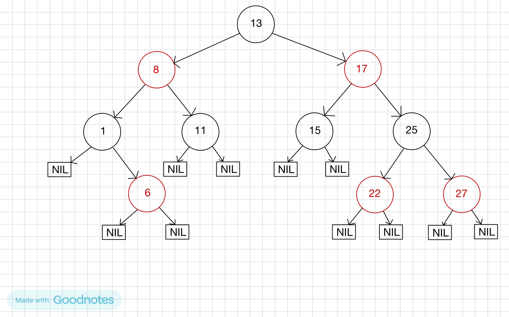
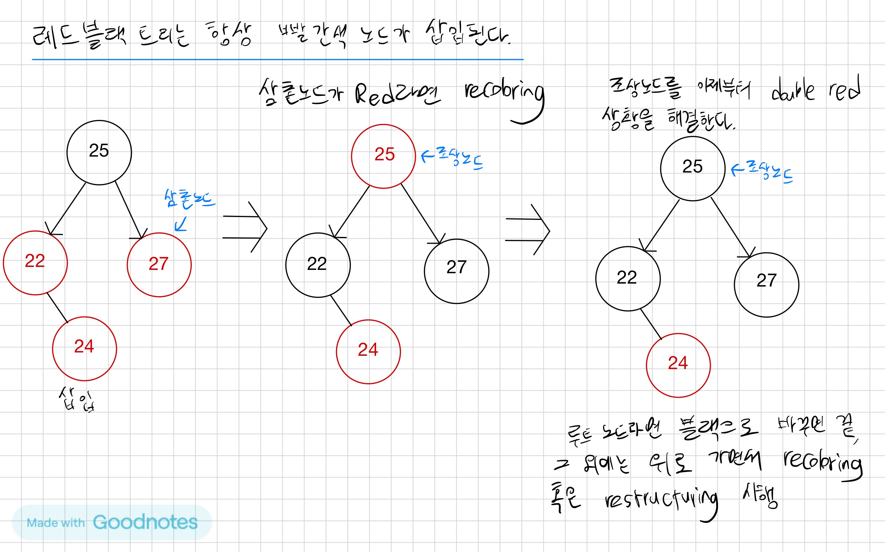
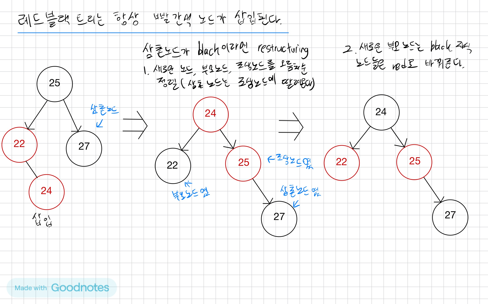

# 레드-블랙 트리
- 레드-블랙 트리(red-black tree)는 자가 균형 이진 탐색 트리(self-balancing binary search tree)로서, 대표적으로는 연관 배열 등을 구현하는 데 쓰이는 자료구조다.
- 레드-블랙 트리는 이진 트리의 특수한 형태로서, 컴퓨터 공학 분야에서 숫자 등의 비교 가능한 자료를 정리하는 데 쓰이는 자료구조이다.
- 삽입, 삭제시 O(log n)만큼의 시간이 필요하다.
### 레드-블랙 트리의 특징
1. 노드는 레드 혹은 블랙 중의 하나이다.
2. 루트 노드는 블랙이다.
3. 모든 리프 노드들(NIL)은 블랙이다.
4. 레드 노드의 자식노드 양쪽은 언제나 모두 블랙이다. (즉, 레드 노드는 연달아 나타날 수 없으며, 블랙 노드만이 레드 노드의 부모 노드가 될 수 있다)
5. 어떤 노드로부터 시작되어 그에 속한 하위 리프 노드에 도달하는 모든 경로에는 리프 노드를 제외하면 모두 같은 개수의 블랙 노드가 있다.

출처: 위키백과  

### 레드-블랙 트리 삽입
1. Recoloring

2. Restructuring

