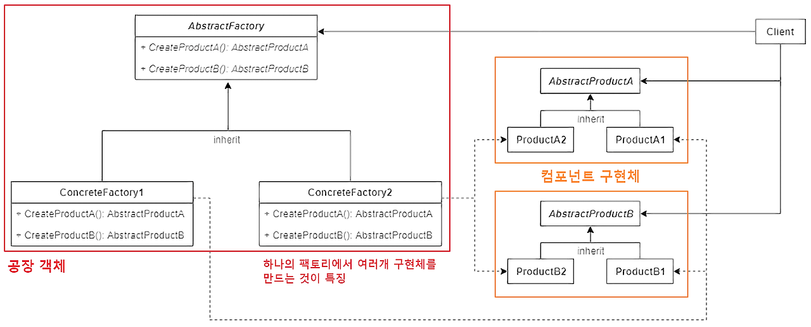
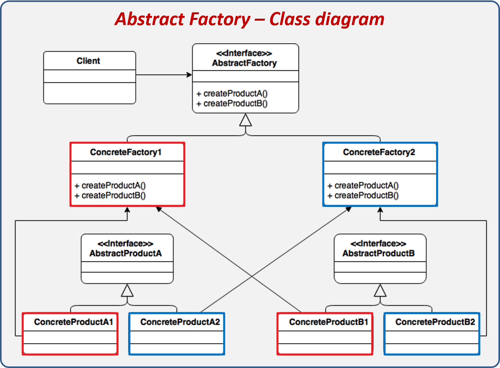
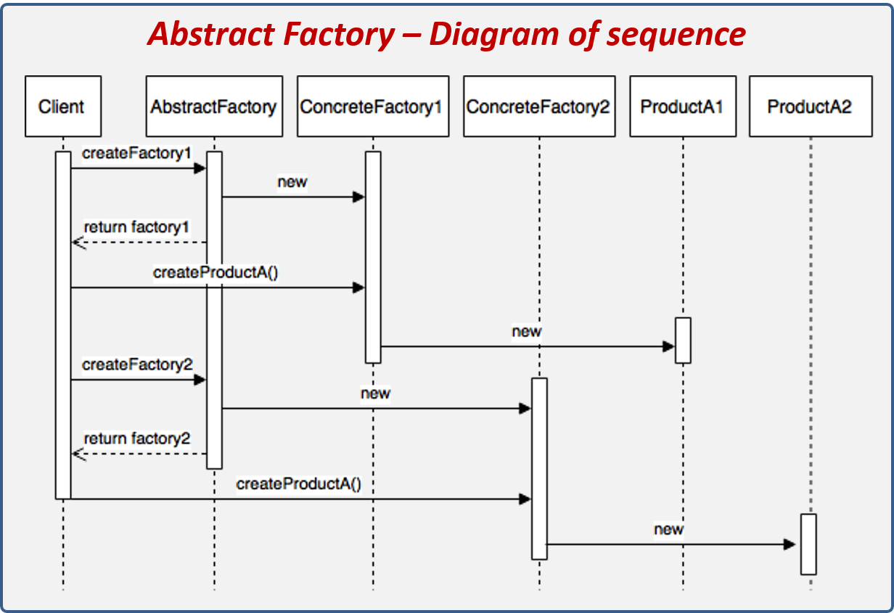
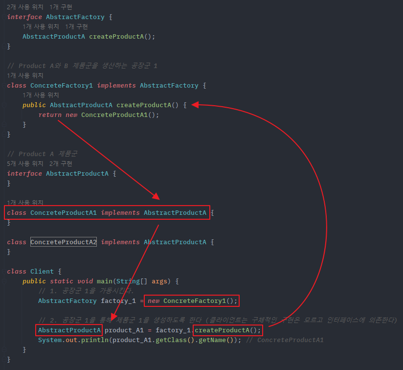

# 💻 추상 팩토리 패턴(Abstract Factory Pattern)
> 추상 팩토리 패턴이란, 연관성이 있는 객체 군이 여러 개 있을 경우 이들을 묶어 추상화하고, 어떤 구체적인 상황이 주어지면 팩토리 객체에서 집합으로 묶은 객체 군을 구현화하는 생성 패턴이다.  
> 추상 팩토리의 핵심은 **제품 '군' 집합**을 타입별로 찍어낼 수 있다는 점이 포인트다.  
> 예를 들어, 모니터, 마우스, 키보드를 묶은 전자 제품군이 있는데 이들을 또 삼성 제품군이냐 애플 제품군이냐 로지텍 제품군이냐에 따라 브랜드 명으로 나뉘게 될 때, 복잡하게 묶이는 이러한 제품군들을 관리와 확장하기 용이하게 패턴화한 것이 추상 팩토리이다.

<br>

## ✅ 추상 팩토리 패턴 구조

1. `AbstractFactory`: 최상위 공장 클래스. 여러 개의 제품들을 생성하는 여러 메서드들을 추상화한다.
2. `ConcreteFactory`: 서브 공장 클래스들은 타입에 맞는 제품 객체를 반환하도록 메소드들을 재정의한다.
3. `AbstractProduct`: 각 타입의 제품들을 추상화한 인터페이스
4. `ConcreteProduct`(ProductA ~ ProductB): 각 타입의 제품 구현제들. 이들은 팩토리 객체로부터 생성된다.
5. `Client`: Client는 추상화된 인터페이스만을 이용하여 제품을 받기 때문에, 구체적인 제품, 공장에 대해서는 모른다.

<br>

## 🤔 Abstract Factory vs. Factory Method
공통점
- 둘다 팩토리 객체를 통해 구체적인 타입을 감추고 객체 생성에 관여하는 패턴 임이 동일하다.
- 공장 클래스가 제품 클래스를 각각 나누어 느슨한 결합 구조를 구성하는 모습 역시 둘이 유사하다.
주의할 점
- 추상 팩토리 패턴이 팩토리 메서드 패턴의 상위 호환이 아니라는 점이 중요하다.
- 두 패턴의 차이는 명확하기 때문에 상황에 따라 적절한 선택을 해야한다.
> 이 둘을 유사점과 차이점을 조합해 복합 패턴을 구성하는 것도 가능하다.

<table>
<tr>
<th></th>
<th>팩토리 메서드 패턴</th>
<th>추상 팩토리 패턴</th>
</tr>
<tr>
<td>공통점</td>
<td colspan="2">객체 생성 과정을 추상화한 인터페이스를 제공 <br> 객체 생성을 캡슐화함으로써 구체적인 타입을 감추고 느슨한 결합 구조를 표방</td>
</tr>
<tr>
<td rowspan="3">차이점</td>
<td>구체적인 객체 생성과정을 하위 또는 구체적인 클래스로 옮기는 것이 목적</td>
<td>관련 있는 여러 객체를 구체적인 클래스에 의존하지 않고 만들 수 있게 하는 것이 목적</td>
</tr>
<tr>
<td>한 Factory 당 한 종류의 객체 생성 지원</td>
<td>한 Factory에서 서로 연관된 여러 종류의 객체 생성을 지원(제품군 생성 지원)</td>
</tr>
<tr>
<td>메서드 레벨에서 포커스를 맞춤으로써, 클라이언트의 ConcreteProduct 인스턴스의 생성 및 구성에 대한 의존을 감소</td>
<td>클래스(Factory) 레벨에서 포커스를 맞춤으로써, 클라이언트의 ConcreteProduct 인스턴스 군의 생성 및 구성에 대한 의존을 감소</td>
</tr>
</table>

즉, 팩토리 메서드 패턴은 **객체 생성 이후 해야할 일의 공통점**을 정의하는 데 초점을 맞추는 반면, 추상 팩토리 패턴은 생성해야 할 **객체 집합 군의 공통점**에 초점을 맞춘다.

<br>

## ✅ 추상 팩토리 패턴 흐름


### 제품(Product) 클래스
```java
// Product A 제품군
interface AbstractProductA {}

// Product A - 1
class ConcreteProductA1 implements AbstractProductA {}

// Product A - 2
class ConcreteProductA2 implements AbstractProductA {}
```
```java
// Product B 제품군
interface AbstractProductB {}

// Product B - 1
class ConcreteProductB1 implements AbstractProductB {}

// Product B - 2
class ConcreteProductB2 implements AbstractProductB {}
```

### 공장(Factory) 클래스

```java
interface AbstractFactory {
    AbstractProductA createProductA();

    AbstractProductB createProductB();
}

// Product A1과 B1 제품군을 생성하는 공장군 1
class ConcreteFactory1 implements AbstractFactory {
    @Override
    public AbstractProductA createProductA() {
        return new ConcreteProductA1();
    }

    @Override
    public AbstractProductB createProductB() {
        return new ConcreteProductB1();
    }
}

// Product A2와 B2 제품군을 생산하는 공장군 2
class ConcreteFactory2 implements AbstractFactory {
    @Override
    public AbstractProductA createProductA() {
        return new ConcreteProductA2();
    }

    @Override
    public AbstractProductB createProductB() {
        return new ConcreteProductB2();
    }
} 
```

## ✅ 클래스 흐름

```java
class Client {
    public static void main(String[] args) {
        AbstractFacotry factory = null;
        
        // 1. 공장군 1을 가동시킨다.
        factory = new ConcreteFactory1();
        
        // 2. 공장군 1을 통해 제품군 A1을 생성하도록 한다.
        AbstractProductA productA1 = factory.createProductA1();
        System.out.println(productA1.getClass().getName()); // ConcreteProductA1
        // 클라이언트는 구체적인 구현은 모르고, 인터페이스에 의존한다.
        
        // 3. 공장군 2를 가동시킨다.
        factory = new ConcreteFactory2();
        
        // 4. 공장군 2를 통해 제품군 A2를 생성하도록 한다.
        AbstractProductA productA2 = factory.createProductA();
        System.out.println(productA2.getClass().getName());
    }
}
```
코드를 보면 똑같은 `createProductA()` 메서드를 호출하고 있지만 어떤 팩토리 객체냐에 따라 반환되는 제품군이 다르게 된다.


<br>

## ✅ 추상 팩토리 패턴 특징
### 패턴 사용 시기
- 관련 제품의 **다양한 제품 군과 함께 작동해야 할 때**, 해당 제품의 구체적인 클래스에 의존하고 싶지 않은 경우
- 여러 제품군 중 하나를 선택해서 시스템을 설정해야하고, 한 번 구성한 제품을 **다른 것으로 대체할 수도 있을 때**
- 제품에 대한 클래스 라이브러리를 제공하고, 그들의 구현이 아닌 인터페이스를 노출시키고 싶을 때

### 패턴 장점
- 객체를 생성하는 코드를 분리하여 클라이언트 코드와 결합도를 낮출 수 있다.
- 제품군을 쉽게 대체할 수 있다.
- 단일 책임 원칙 준수
- 개방 / 폐쇄 원칙 준수
> 참고: [객체지향 설계](https://github.com/kyeoungchan/note/tree/main/software_engineering/object-oriented-programming)

### 패턴 단점
- 각 구헌체마다 팩토리 객체들을 모두 구현해주어야하기 때문에 객체가 늘어날 때마다 클래스가 증가하여 코드의 복잡성이 증가한다. (팩토리 패턴의 공통적인 문제점)
- 기존 추상 팩토리의 세부사항이 변경되면 모든 팩토리에 대한 수정이 필요해진다.
  - 이는 추상 팩토리와 모든 서브클래스의 수정을 가져온다.
- 새로운 종류의 제품을 지원하는 것이 어렵다.
  - 새로운 제품이 추가되면 팩토리 구현 로직 자체를 변경해야 한다.


<br>

## ❗️ 실무에서 찾아보는 추상 팩토리 패턴
### JAVA - DocumentBuilderFactory의 newInstance()
- Java는 xml 형식의 문서를 객체화시켜 살펴볼 수 있는 DocumentBuilder 객체를 제공하는데 이 객체는 바로 DocumentBuilderFactory로부터 얻어올 수 있다.
- `newInstance`를 통해 얻어오는 DocumentBuilderFactory 타입의 객체가 ConcreteFactory에 해당하고 ConcreteFactory가 제공하는 DocumentBuilder가 추상화된 객체(제품)에 해당하게 된다.

```java
import java.io.IOException;
import javax.xml.parsers.DocumentBuilderFactory;
import javax.xml.parsers.ParserConfigurationException;
import org.w3c.dom.Document;
import org.xml.sax.SAXException;

public static void main(String[] args) throws ParserConfigurationException, IOException, SAXException {
    // 1. 공장 객체 생성
    DocumentBuilderFactory factory = DocumentBuilderFactory.newInstance();

    // 2. 공장 객체를 통해 추상화된 제품 객체 생성
    Document builder = factory.newDocumentBuilder();

    // 3. 구현체 메서드 실행
    Document document = builder.parse("src/main/resources/config.xml");
    System.out.println(document.getDocumentElement());
}
```

### Spring Framework - FactoryBean
- FactoryBean은 스프링이 제공하는 인터페이스로, 기본으로 제공되는 스프링 구문으로는 생성 및 관리할 수 없는 객체를 Bean으로 활용할 수 있게끔 어댑터 역할을 한다.
- 여기서 생성 및 관리할 수 없는 객체란 생성자가 private한 싱글톤 객체 혹은 [정적 팩토리 메서드](https://github.com/kyeoungchan/note/tree/main/design-pattern/static-factory-method-pattern)를 통해 얻어오는 객체가 이에 해당한다.

예를 들면, 아래 Ship 클래스는 싱글톤 처리된 객체다.
```java
public class Ship {
    private static final Ship INSTANCE = new Ship();

    private String name = "Singleton_TurtleShip";
    private String color = "green";
    private String logo = "\uD83D\uDc22";
    
    private Ship() {}
    
    public static Sip getInstance() {
        return INSTANCE;
    }
}
```

만약 싱글톤 객체를 Bean으로 활용하고 싶다면 FactoryBean을 이용해 등록할 수 있다.  
FactoryBean의 구현체(ShipFactory)를 만들고 구현체를 Bean으로 등록하면, ShipFactory의 getObject()에서 반환하는 객체가 최종적으로 Bean으로 등록되게 된다.

즉, 여기서 FactoryBean은 추상 팩토리의 AbstractFactory에 해당하고, ShipFactory는 ConcreteFactory에 해당한다.

```java
public class ShipFactory implements FactoryBean<Ship> {
    @Override
    public Ship getObject() throws Exception {
        return Ship.getInstance();
    }

    @Override
    public Class<?> getObjectType() {
        return Ship.class;
    }
}
```

클라이언트에서 실행해보면 xml에 등록된 정보에 따라 ApplicationContext로부터 가져올 때 ShipFactory가 제공하는 싱글톤 객체를 얻어오게 된다.
```xml
<!-- config.xml -->
<bean id="myShip" class="ShipFactory">
    
</bean>
```
```java
public static void main(String[] args) throws Exception {
    ApplicationContext applicationContext = new ClassPathXmlApplicationContext("config.xml");

    Ship myShip = applicationContext.getBean("myShip");
    System.out.println(myShip);
}
```


**출처**  
[추상 팩토리(Abstract Factory) 패턴 - 완벽 마스터하기](https://inpa.tistory.com/entry/GOF-💠-추상-팩토리Abstract-Factory-패턴-제대로-배워보자)
