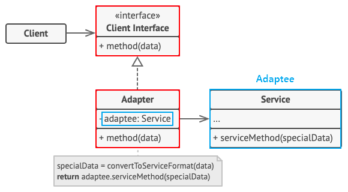
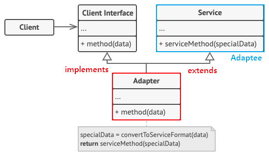

# 💻 어댑터 패턴(Adapter Pattern)
> 한 클래스의 인터페이스를 클라이언트에서 사용하고자하는 다른 인터페이스로 변환한다.  
> 어댑터를 이용하면 인터페이스 호환성 문제 때문에 같이 쓸 수 없는 클래스들을 연결해서 쓸 수 있다. 즉, 호환되지 않는 인터페이스를 사용하는 클라이언트를 그대로 사용할 수 있게 해준다.  
> 어댑터가 Legacy 인터페이스를 감싸서 새로운 인터페이스로 변환하기 때문에 Wrapper 패턴이라고도 불린다.

```java
public interface Duck {
    void quack();
    void fly();
}
```

```java
public class MallardDuck implements Duck {
    @Override
    public void quack() {
        System.out.println("Quack");
    }
    
    @Override
    public void fly() {
        System.out.println("I'm flying");
    }
}
```

```java
public interface Turkey {
    void gobble();
    void fly();
}
```

```java
public class WildTurkey implements Turkey {
    @Override
    public void gobble() {
        System.out.println("Gobble gobble");
    }
    
    @Override
    public void fly() {
        System.out.println("I'm flying a short distance");
    }
}
```

> `Duck` 객체가 모자라서 `Turkey` 객체를 사용해야하는 상황이라고 가정해보자.  
> 인터페이스가 다르기 때문에 `Turkey` 객체를 바로 사용할 수 없으므로 어댑터를 만들어야한다.

```java
public class TurkeyAdapter implements Duck {
    Turkey turkey;

    public TurkeyAdapter(Turkey turkey) {
        this.turkey = turkey;
    }
    
    @Override
    public void quack() {
        turkey.gobble();
    }
    
    @Override
    public void fly() {
        turkey.fly();
    }
}
```
## ❗️ 어댑터 패턴 구조
> 기존 시스템의 클래스를 상속(Inheritance)해서 호환 작업을 해주냐, 합성(Composition)해서 호환 작업을 해주냐에 따라, 두 가지 패턴 방법으로 나뉘게 된다.

### ✅ 객체 어댑터(Object Adapter)
- 합성(Composition)된 멤버에게 위임을 이용한 어댑터 패턴
- 자기가 해야할 일을 **클래스 멤버 객체의 메소드**에게 다시 시킴으로써 목적을 달성하는 것을 위임이라고 한다.
- 합성을 활용했기 때문에 런타임 중에 Adaptee(Service)가 결정되어 유연하다.
- 그러나 `Adaptee(Service)` 객체를 필드 변수로 저장해야되기 때문에 공간 차지 비용이 든다.

- `Adaptee(Service)`: 어댑터 대상 객체. 기존 시스템 / 외부 시스템 / 써드파티 라이브러리
- `Target(Client Interface)`: `Adapter`가 구현하는 인터페이스
- `Adapter`: `Client`와 `Adaptee(Service)` 중간에서 호환성이 없는 둘을 연결시켜주는 역할을 담당.
  - 합성을 이용해 구성한다.
  - Adaptee(Service)를 따로 클래스 멤버로 설정하고 위임을 통해 동작을 매치시킨다.
- `Client`: 기존 시스템을 어댑터를 통해 이용하려는 쪽. `Client Interface`를 통하여 `Service`를 이용할 수 있게 된다.
```java
// Adaptee: 클라이언트에서 사용하고 싶은 기존의 서비스(하지만 호환이 안돼서 바로 사용 불가능)
class Service {
    void specificMethod(int specialData) {
        System.out.println("기존 서비스 기능 호출 + " + specialData);
    }
}

// Client Interface: 클라이언트가 접근해서 사용할 고수준의 어댑터 모듈
interface Target {
    void method(int data);
}

// Adapter: Adaptee 서비스를 클라이언트에서 사용하게 할 수 있도록 호환처리 해주는 어댑터
class Adapter implements Target {
    Service adaptee; // composition으로 Service 객체를 클래스 필드로

    // 어댑터가 인스턴스화되면 호환시킬 기존 서비스를 설정
    public Adapter(Service adaptee) {
        this.adaptee = adaptee;
    }

    // 어댑터의 메소드가 호출되면, Adaptee의 메소드를 호출하도록
    @Override
    public void method(int data) {
        adaptee.specificMethod(data); // 위임
    }
}
```
```java
class Client {
    public static void main(String[] args) {
        // 1. 어댑터 생성 (기존 서비스를 인자로 받아 호환 작업 처리)
        Target adapter = new Adapter(new Service());
        
        // 2. Client Interface의 스펙에 따라 메소드를 실행하면 기존 서비스의 메소드가 실행된다.
        adapter.method(1);
    }
}
```

실행 결과
```text
기존 서비스 기능 호출 + 1
```

<br>

### ✅클래스 어댑터(Class Adapter)
- 클래스 상속을 이용한 어댑터 패턴
- Adaptee(Service)를 상속했기 때문에 따로 객체 구현없이 바로 코드 재사용이 가능하다.
- 상속은 대표적으로 기존에 구현된 코드를 재사용하는 방식이지만, Java에서는 **다중 상속 불가 문제 때문에** 전반적으로 권장하지 않는 방법이다.


- `Adaptee(Service)`: 어댑터 가상 객체. 기존 시스템 / 외부 시스템 / 써드파티 라이브러리
- `Target(Client Interface)`: Adapter가 구현하는 인터페이스
- `Adapter`: `Client`와 `Adaptee(Service)` 중간에서 호환성이 없는 둘을 연결시켜주는 역할을 담당.
  - 상속을 이용해 구성한다.
  - Existing Class와 Adaptee(Service)를 동시에 implements, extends하여 구현한다.
- `Client`: 기존 시스템을 어댑터를 통해 이용하려는 쪽. `Client Interface`를 통하여 `Service`를 이용할 수 있게 된다.

```java
// Adaptee: 클라이언트에서 사용하고 싶은 기존의 서비스(하지만 호환이 안돼서 바로 사용 불가능)
class Service {
    void specificMethod(int specialData) {
        System.out.println("기존 서비스 기능 호출 + " + specialData);
    }
}

// Client Interface: 클라이언트가 접근해서 사용할 고수준의 어댑터 모듈
interface Target {
    void method(int data);
}

// Adapter: Adaptee 서비스를 클라이언트에서 사용하게 할 수 있도록 호환처리 해주는 어댑터
class Adapter extends Service implements Target {

    // 어댑터의 메소드가 호출되면, 부모 클래스 Adaptee의 메소드를 호출하도록
    @Override
    public void method(int data) {
        specificMethod(data);
    }
}
```
```java
class Client {
    public static void main(String[] args) {
        // 1. 어댑터 생성
        Target adapter = new Adapter();
        
        // 2. Client Interface의 스펙에 따라 메소드를 실행하면 기존 서비스의 메소드가 실행된다.
        adapter.method(1);
    }
}
```
실행 결과
```text
기존 서비스 기능 호출 + 1
```

## ⭐️ 어댑터 패턴 특징
### ✅ 패턴 사용 시기
1. 레거시 코드를 사용하고 싶지만 새로운 인터페이스가 레거시 코드와 호환되지 않을 때
2. 이미 만든 것을 재사용하고자하나 이 재사용 가능한 라이브러리를 수정할 수 없을 때
3. 이미 만들어진 클래스를 새로운 인터페이스(API)에 맞게 개조할 때
4. 소프트웨어의 구버전과 신버전을 공존시키고 싶을 때

### ✅ 패턴 장점
1. 프로그램의 기본 비즈니스 로직에서 인터페이스 또는 데이터 변환 코드를 분리할 수 있기 때문에 단일 책임 원칙(SRP)을 만족한다.
2. 기존 클래스 코드를 건들지 않고 클라이언트 인터페이스를 통해 어댑터와 작동하기 때문에 개방 폐쇄 원칙(OCP)을 만족한다.
3. 만일 추가로 필요한 메소드가 있다면 어댑터에 빠르게 추가할 수 있다.
   - 만약 버그가 발생해도 기존의 클래스에는 버그가 없으므로 Adapter 역할의 클래스를 중점적으로 조사하면 되고, 프로그램 검사도 쉬워진다.

### ✅ 패턴 단점
1. 새로운 인터페이스와 어댑터 클래스 세트를 도입해야하기 때문에 코드의 복잡성이 증가한다.
2. 때로는 직접 서비스(Adaptee) 클래스를 변경하는 것이 간단할 수 있기 때문에 신중히 선택해야 한다.

출처  
[디자인패턴 - 어댑터 패턴 (adapter pattern)](https://jusungpark.tistory.com/22)  
[어댑터(Adaptor) 패턴 - 완벽 마스터하기](https://inpa.tistory.com/entry/GOF-%F0%9F%92%A0-%EC%96%B4%EB%8C%91%ED%84%B0Adaptor-%ED%8C%A8%ED%84%B4-%EC%A0%9C%EB%8C%80%EB%A1%9C-%EB%B0%B0%EC%9B%8C%EB%B3%B4%EC%9E%90)
