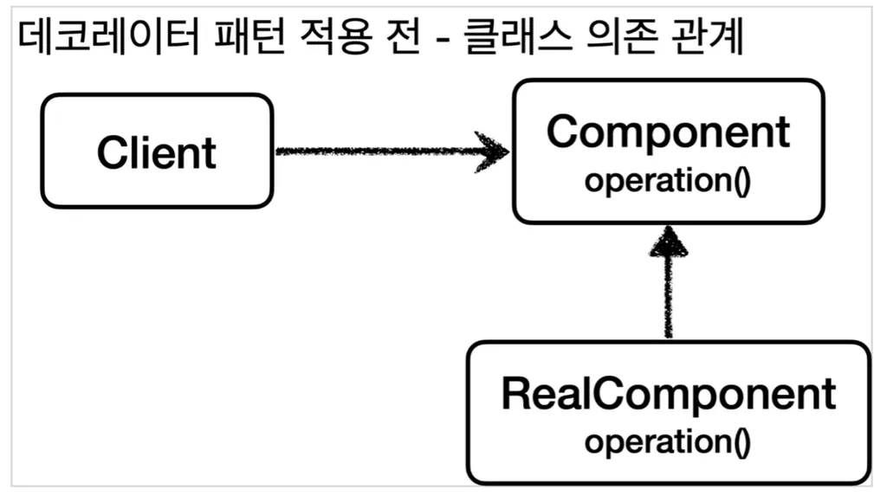
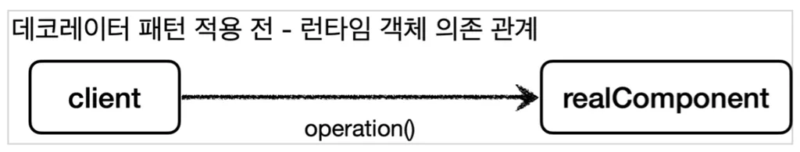
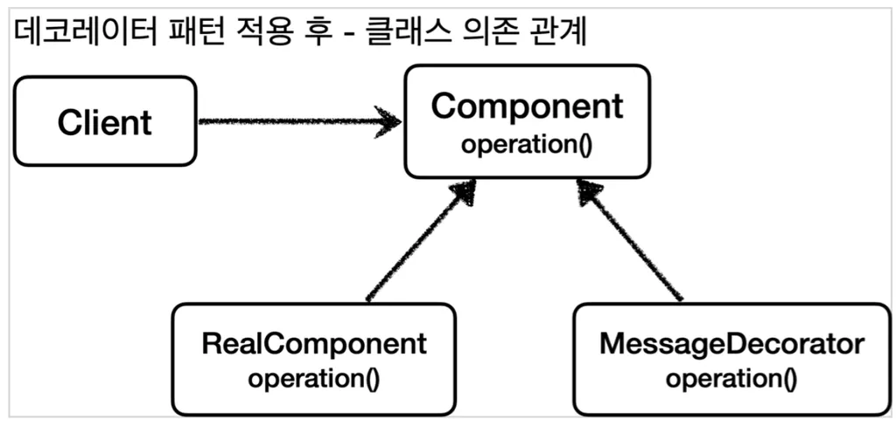
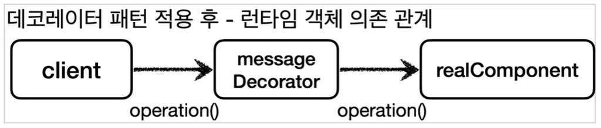
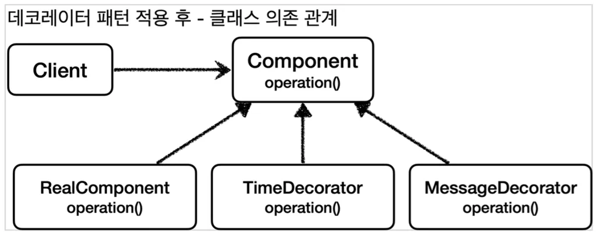
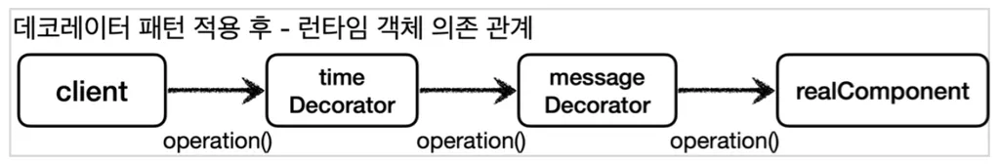

# 📚 데코레이터 패턴

- 클라이언트가 버서를 직접 호출하고, 직접 처리 결과를 받는 것을 직접 호출이라 한다.
- 클라이언트가 요청한 결과를 서버에 직접 요청하는 것이 아니라 어떤 대리자를 통해서 대신 간접적으로 서버에 요청할 수 있다(위의 사진은 간접호출의 구조다).
- 대리자를 영어로 프록시(Proxy)라 한다.

### 📑 프록시의 주요 기능
프록시를 통해서 할 수 있는 일은 크게 2가지로 구분할 수 있다.
1. 접근제어
   - 권한에 따른 접근 차단
   - 캐싱
   - 지연 로딩
2. 부가 기능 추가
   - 원래 서버가 제공하는 기능에 더해서 부가 기능을 수행한다.
   - ex) 요청 값이나, 응답 값을 중간에 변형한다.
   - ex) 실행 시간을 측정해서 추가 로그를 남긴다.

### 📙 GOF 디자인 패턴
GOF 디자인 패턴에서는 이 둘을 의도(intent)에 따라서 구분한다.
1. 프록시 패턴: 접근 제어가 목적
2. 데코레이터 패턴: 새로운 기능 추가가 목적
> 프록시 패턴만 프록시를 사용하는 것이 아니다. 데코레이터 패턴도 프록시를 사용한다.

## 💻 데코레이터 패턴 예제


```java
package hello.proxy.pureproxy.decorator.code;

public interface Component {
    String operation();
}
```
```java
package hello.proxy.pureproxy.decorator.code;

import lombok.extern.slf4j.Slf4j;

@Slf4j
public class RealComponent implements Component {
    @Override
    public String operation() {
        log.info("RealComponent 실행");
        return "data";
    }
}
```
```java
package hello.proxy.pureproxy.decorator.code;

import lombok.extern.slf4j.Slf4j;

@Slf4j
public class DecoratorPatternClient {

    private Component component;

    public DecoratorPatternClient(Component component) {
        this.component = component;
    }

    public void execute() {
        String result = component.operation();
        log.info("result={}", result);
    }
}
```
```java
package hello.proxy.pureproxy.decorator;

import hello.proxy.pureproxy.decorator.code.DecoratorPatternClient;
import hello.proxy.pureproxy.decorator.code.RealComponent;
import lombok.extern.slf4j.Slf4j;
import org.junit.jupiter.api.Test;

@Slf4j
public class DecoratorPatternTest {

    @Test
    void noDecorator() {
        RealComponent realComponent = new RealComponent();
        DecoratorPatternClient client = new DecoratorPatternClient(realComponent);
        client.execute();
    }
}
```
실행결과
```
RealComponent - RealComponent 실행
DecoratorPatternClient - result=data
```
### 🌠 응답 값을 꾸며주는 데코레이터


```java
package hello.proxy.pureproxy.decorator.code;

import lombok.extern.slf4j.Slf4j;

@Slf4j
public class MessageDecorator implements Component {

    private Component component;

    public MessageDecorator(Component component) {
        this.component = component;
    }

    @Override
    public String operation() {
        log.info("MessageDecorator 실행");

        // data -> *****data*****
        String result = component.operation();
        String decoResult = "*****" + result + "*****";
        log.info("MessageDecorator 꾸미기 적용 전={}, 적용 후={}", result, decoResult);
        return decoResult;
    }
}
```
```java
package hello.proxy.pureproxy.decorator;

import hello.proxy.pureproxy.decorator.code.DecoratorPatternClient;
import hello.proxy.pureproxy.decorator.code.RealComponent;
import lombok.extern.slf4j.Slf4j;
import org.junit.jupiter.api.Test;

@Slf4j
public class DecoratorPatternTest {

    @Test
    void noDecorator() {
        RealComponent realComponent = new RealComponent();
        DecoratorPatternClient client = new DecoratorPatternClient(realComponent);
        client.execute();
    }

    // 추가된 코드
    @Test
    void decorator1() {
       Component realComponent = new RealComponent();
       Component messageDecorator = new MessageDecorator(realComponent);
       DecoratorPatternClient client = new DecoratorPatternClient(messageDecorator);
       client.execute();
    }
}
```
실행 결과
```
MessageDecorator - MessageDecorator 실행
RealComponent - RealComponent 실행
MessageDecorator - MessageDecorator 꾸미기 적용 전=data, 적용 후=*****data*****
DecoratorPatternClient - result=*****data*****
```



```java
package hello.proxy.pureproxy.decorator.code;

import lombok.extern.slf4j.Slf4j;

@Slf4j
public class TimeDecorator implements Component {

    private Component component;

    public TimeDecorator(Component component) {
        this.component = component;
    }

    @Override
    public String operation() {
        log.info("TimeDecorator 실행");
        long startTime = System.currentTimeMillis();

        String result = component.operation();

        long endTime = System.currentTimeMillis();
        long resultTime = endTime - startTime;
        log.info("TimeDecorator 종료 resultTime={}ms", resultTime);
        return result;
    }
}
```
```java
package hello.proxy.pureproxy.decorator;

import hello.proxy.pureproxy.decorator.code.DecoratorPatternClient;
import hello.proxy.pureproxy.decorator.code.RealComponent;
import lombok.extern.slf4j.Slf4j;
import org.junit.jupiter.api.Test;

@Slf4j
public class DecoratorPatternTest {

    @Test
    void noDecorator() {
        RealComponent realComponent = new RealComponent();
        DecoratorPatternClient client = new DecoratorPatternClient(realComponent);
        client.execute();
    }

    @Test
    void decorator1() {
       Component realComponent = new RealComponent();
       Component messageDecorator = new MessageDecorator(realComponent);
       DecoratorPatternClient client = new DecoratorPatternClient(messageDecorator);
       client.execute();
    }

    // 추가된 코드
    @Test
    void decorator2() {
       Component realComponent = new RealComponent();
       Component messageDecorator = new MessageDecorator(realComponent);
       TimeDecorator timeDecorator = new TimeDecorator(messageDecorator);
       DecoratorPatternClient client = new DecoratorPatternClient(timeDecorator);
       client.execute();
    }
}
```
실행 결과
```
TimeDecorator 실행
MessageDecorator 실행
RealComponent 실행
MessageDecorator 꾸미기 적용 전=data, 적용 후=*****data*****
TimeDecorator 종료 resultTime=7ms
result=*****data*****
```

### 🖋️ 그래서 데코레이터 패턴이란?
- **객체의 결합**을 통해 **기능을 동적으로 유연하게 확장**할 수 있는 패턴이다.
- 즉, 기본 기능에 추가할수 있는 기능의 종류가 많은 경우에 **각 추가 기능을 Decorator 클래스로 정의**한 후, 필요한 Decorator 객체를 조합함으로써 **추가 기능의 조합을 설계**하는 방식이다.


> 프록시 패턴 vs. 데코레이터 패턴  
> 결론적으로 말하자면, 프록시를 사용하고 해당 프록시가 접근 제어가 목적이라면 프록시 패턴이고, 새로운 기능을 추가하는 것이 목적이라면 데코레이터 패턴이 된다.

출처
- [스프링 핵심 원리 - 고급편](https://www.inflearn.com/course/%EC%8A%A4%ED%94%84%EB%A7%81-%ED%95%B5%EC%8B%AC-%EC%9B%90%EB%A6%AC-%EA%B3%A0%EA%B8%89%ED%8E%B8)
- [프록시패턴과 데코레이터패턴](https://polished-consonant-730.notion.site/c0d023a8bcd04f029be1706e8848687b?pvs=4)
- [[Design Pattern] 데코레이터 패턴이란](https://gmlwjd9405.github.io/2018/07/09/decorator-pattern.html)