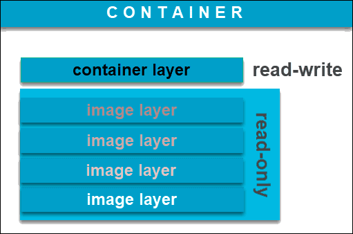
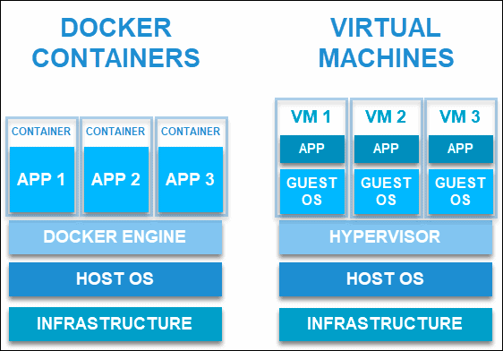

# Docker
- 애플리케이션 구축, 구현 및 테스트를 위해 격리된 가상화 환경을 생성하는 서비스형 플랫폼이다.
  - Docker는 컨테이너 엔진으로 리눅스 커널 기능을 사용하여 운영체제 위에 컨테이너를 만든다.
  - Docker 자체는 서비스의 컨테이너를 관리하는 데몬으로 실행된다.
    - 데몬: 멀티태스킹 운영체제에서 사용자가 직접적으로 제어하지 않고, 백그라운드에서 돌면서 여러 작업을 하는 프로그램
- Backend에서 Resource를 사용함에 있어서 재사용성이 뛰어나고, 효율적이고, 보안적으로 독립적인 프로세스로 동작시키기 위해 사용된다.
## Docker 이미지란
- 파일로 애플리케이션 실행에 필요한 독립적인 환경을 포함하는 런타임 환경을 위한 일종의 템플릿이다.
- 소스코드, 라이브러리, 종속성, 도구 및 응용 프로그램을 실행하는 데 필요한 기타 파일을 포함하는 불변 파일이다.
- 스냅샷이라고도 하고, 특정 시점의 애플리케이션과 가상 환경을 나타낸다.
- 일관성
  - Docker의 큰 특징 중 하나다.
  - 개발자가 안정적이고 균일한 조건에서 소프트웨어를 테스트하고 실험할 수 있도록 한다.

- 컨테이너를 생성하는 이미지 베이스는 별도로 존재하며, 변경할 수 없다.
- 기본적으로 컨테이너 내부에 해당 파일 시스템(즉, Docker 이미지)의 읽기-쓰기 가능한 복사본을 만든다.
  - 이것이 이미지 복사본을 수정할 수 있는 container layer다.
- 하나의 베이스 이미지에서 Docker 이미지를 무제한으로 생성할 수 있다.
  - 이미지의 초기 상태를 변경하고 기존 상태를 저장할 때마다 추가된 container layer가 있는 새 템플릿을 만든다.
- Docker image 생성하기
  `docker build -t=myimage .`

## Docker container란
- 사용자가 기본 시스템에서 애플리케이션을 분리할 수 있는 가상화된 런타임 환경이다.
- 중요 기능: 컨테이너 내부에서 실행되는 컴퓨팅 환경의 표준화 => 응용 프로그램이 동일한 환경에서 작동하도록 하고, 다른 사람과의 공유도 단순화한다.
- 격리(strong isolation): 자율적이어서 서로 방해하지 않는다.

- VM과의 차이점
  - VM
    - 하드웨어 수준에서 가상화가 이루어진다.
  - Docker container
    - 애플리케이션 층에서 가상화가 이루어진다.
    - 하나의 머신을 활용하고 커널을 공유한다.
    - 컨테이너가 매우 가벼워져 리소스를 많이 사용하지 않을 수 있다.
- Docker container 생성하기
  `docker run -d --name mycontainer -p 8080:8080 myimage`

## Docker Image vs Docker Container
- Container는 Image가 있어야 존재할 수 있지만, Image는 Container가 없어도 존재할 수 있다.
  - 즉, Container는 Image에 종속되어 런타임 환경을 구성하고 애플리케이션을 실행하는 데 사용된다.
- Docker Image는 Docker Container에서 코드를 실행한다. => 실행 중인 Container를 만들려면 Docker Image에 핵심 기능의 쓰기 가능 계층을 추가한다.(Writable Container)
- Cocker Container는 실행 중인 Image Container로 간주한다.
  - 동일한 Image에서 여러 개의 Container를 만들 수 있다.
  - 다시 한 번 강죠하자면, Docker Container의 채택 이유는 개발, 운영 및 테스트의 표준화 및 단순화다.

## Docker file이란
- 환경 정보를 저장하는 파일
  - image를 빌드하는 방법을 정의하는 스크립트
  - container의 구동에 필요한 정보가 담긴 스크립트

출처
https://sunrise-min.tistory.com/entry/Docker-Container%EC%99%80-Image%EB%9E%80-%EB%AC%B4%EC%97%87%EC%9D%B8%EA%B0%80