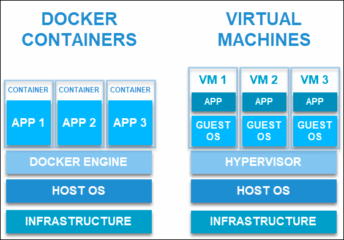
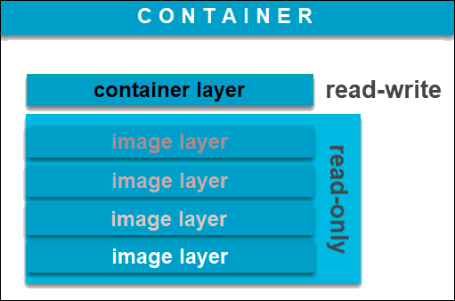
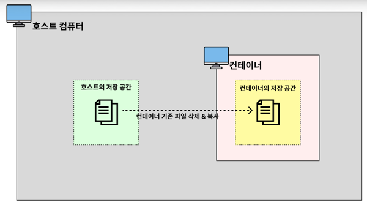
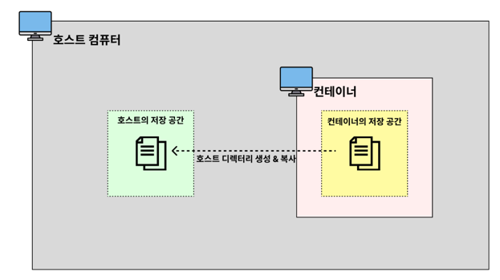

# 🧑🏻‍💻 Docker

---

- [✅ Docker Container란](#-docker-container란)
- [✅ Docker 이미지란](#-docker-이미지란)
- [✅ Docker Image vs Docker Container](#-docker-image-vs-docker-container)
- [✅ Docker Volume이란](#-docker-volume이란)
- [✅ Docker File이란](#-docker-file이란)

> [!TIP]
> Docker를 쓰는 핵심 장점은 특정 프로그램을 다른 곳으로 쉽게 옮겨서 설치 및 실행할 수 있는 특성인 이식성이다.  
> Docker를 사용하면 명령어 한 줄로 어떤 컴퓨터에든 원하는 프로그램을 에러없이 설치하고 실행할 수 있다.  
> 
> - 매번 귀찮은 설치 과정을 일일이 거치지 않아도 된다.
> - 항상 일관되게 프로그램을 설치할 수 있다(버전, 환경 설정, 옵션, 운영체제 등).
> - 각 프로그램이 독립적인 환경에서 실행되기 때문에 프로그램 간에 서로 충돌이 일어나지 않는다.

<br>

> [!NOTE]
> - 컨테이너를 사용하여 각각의 프로그램을 분리된 환경에서 실행 및 관리할수 있는 툴이다.
> - 애플리케이션 구축, 구현 및 테스트를 위해 격리된 가상화 환경을 생성하는 서비스형 플랫폼이다.
>   - Docker는 컨테이너 엔진으로 리눅스 커널 기능을 사용하여 운영체제 위에 컨테이너를 만든다.
>   - Docker 자체는 서비스의 컨테이너를 관리하는 데몬으로 실행된다.
>     - 데몬: 멀티태스킹 운영체제에서 사용자가 직접적으로 제어하지 않고, 백그라운드에서 돌면서 여러 작업을 하는 프로그램
> - Backend에서 Resource를 사용함에 있어서 재사용성이 뛰어나고, 효율적이고, 보안적으로 독립적인 프로세스로 동작시키기 위해 사용된다.


<br>

## ✅ Docker Container란

---

> [!NOTE]
> - 사용자가 기본 시스템에서 애플리케이션을 분리할 수 있는 가상화된 런타임 환경이다.
> - 중요 기능: 컨테이너 내부에서 실행되는 컴퓨팅 환경의 표준화  
>   ➡️ 응용 프로그램이 동일한 환경에서 작동하도록 하고, 다른 사람과의 공유도 단순화한다.
> - 격리(strong isolation): 자율적이어서 서로 방해하지 않는다.


<br>



> [!IMPORTANT]
> - VM과의 차이점
>   - VM
>     - 하드웨어 수준에서 가상화가 이루어진다.
>   - Docker container
>     - 애플리케이션 층에서 가상화가 이루어진다.
>       - 하나의 머신을 활용하고 커널을 공유한다.
>       - 컨테이너가 매우 가벼워져 리소스를 많이 사용하지 않을 수 있다.
> - Docker container 생성하기  
>   `docker run -d --name mycontainer -p 8080:8080 myimage`


<br>

## ✅ Docker 이미지란

---

> [!TIP]
> 닌텐도에 여러가지 칩을 꽂아서 다양한 게임을 즐길 수 있는데, Docker에서 닌텐도의 칩과 같은 역할을 하는 것이 이미지(Image)다.
> - Node.js 기반의 Express.js 서버 프로젝트를 이미지로 만들었다고 가정해보자.
>   - 이 이미지를 Docker로 실행시키면 Express.js 서버 프로젝트가 컨테이너(Container) 환경에서 실행된다.
> - MySQL 서버를 이미지로 만들었다면, 이 이미지를 Docker로 실행시키는 순간 MySQL 서버가 컨테이너 환경에서 실행된다.
>   - MySQL을 일일이 설치할 필요 없이 MySQL 데이터베이스를 사용할 수 있게 된다.

<br>


> [!NOTE]
> - 파일로 애플리케이션 실행에 필요한 독립적인 환경을 포함하는 런타임 환경을 위한 일종의 템플릿이다.
> - 소스코드, 라이브러리, 종속성, 도구 및 응용 프로그램을 실행하는 데 필요한 기타 파일을 모두 포함하는 불변 파일이다.
> - 스냅샷이라고도 하고, 특정 시점의 애플리케이션과 가상 환경을 나타낸다.
> - 일관성
>   - Docker의 큰 특징 중 하나다.
>   - 개발자가 안정적이고 균일한 조건에서 소프트웨어를 테스트하고 실험할 수 있도록 한다.  


<br>

## ✅ Docker Image vs Docker Container

---
> - [!NOTE]
> - Container는 Image가 있어야 존재할 수 있지만, Image는 Container가 없어도 존재할 수 있다.
>   - 즉, Container는 Image에 종속되어 런타임 환경을 구성하고 애플리케이션을 실행하는 데 사용된다.
> - Docker Image는 Docker Container에서 코드를 실행한다.  
>   - 실행 중인 Container를 만들려면 Docker Image에 핵심 기능의 쓰기 가능 계층을 추가한다.(Writable Container)
>   - 즉, Image를 바로 실행하는 것이 아니라 Image 레이어에 쓰기 레이어를 합쳐야 Container가 되는 것이다.
> - Docker Container는 실행 중인 Image Container로 간주한다.  
>   ➡️ Image가 설계도/칩이라면, Container는 실제로 동작하는 인스턴스다.
>   - 동일한 Image에서 그것을 기반으로 한 여러 개의 Container를 만들 수 있다.
>   - 다시 한 번 강조하자면, Docker Container의 채택 이유는 개발, 운영 및 테스트의 표준화 및 단순화다.


<br>



> [!TIP]
> - 컨테이너를 생성하는 이미지 베이스는 별도로 존재하며, 변경할 수 없다.
> - 기본적으로 컨테이너 내부에 해당 파일 시스템(즉, Docker 이미지)의 읽기-쓰기 가능한 복사본을 만든다.
>   - 이것이 이미지 복사본을 수정할 수 있는 container layer(위에서 적은 Writable Layer)다.
> - 하나의 베이스 이미지에서 Docker 이미지를 무제한으로 생성할 수 있다.
>   - 이미지의 초기 상태를 변경하고 기존 상태를 저장할 때마다 추가된 container layer가 있는 새 템플릿을 만든다.
> - Docker image 생성하기  
>   `docker build -t=myimage .`
> - Container가 삭제되면 Container Layer도 같이 사라지고, Image Layer들은 그대로 남아있는다.

<br>

## ✅ Docker Volume이란

---

<br>

> [!TIP]
> Docker를 활용한 프로그램에 새로운 기능이 추가되면 새로운 이미지를 만들어서 Container를 실행시켜야 한다.  
> 이때, Docker는 기존 컨테이너에서 변경된 부분을 수정하지 않고, 새로운 Container를 만들어서 통째로 갈아끼우는 방식으로 교체한다.
>
> 이때 Container 내부에 있던 데이터도 같이 삭제가 되어버리기 때문에, 데이터가 삭제되면 안 되는 경우에 Volume이라는 개념을 활용해야 한다.

<br>

> [!NOTE]
> Docker Volume이란 Docker Container에서 데이터를 영속적으로 저장하기 위한 방법이다.  
> Volume은 Container 자체의 저장 공간을 사용하지 않고, 호스트 자체의 저장 공간을 공유해서 사용하는 형태다.

기존에 호스트 디렉토리가 존재하는 경우  


<br>

기존에 호스트 디렉토리가 존재하지 않는 경우  


<br>


## ✅ Docker File이란

---

> [!NOTE]
> - 환경 정보를 저장하는 파일
>   - image를 빌드하는 방법을 정의하는 스크립트
>   - container의 구동에 필요한 정보가 담긴 스크립트
> - Docker 이미지를 만들게 해주는 파일이라고 보면 된다.

<br>

```dockerfile
# jdk 17 이미지
FROM eclipse-temurin:17-jdk

# 작업 디렉터리 설정
WORKDIR /my-spring-server

# jar 라이브러리 app.jar 파일로 복사. 경로는 WORKDIR
COPY build/libs/*SNAPSHOT.jar app.jar

# 이미지 생성 시 git 설치
RUN apt update && apt install -y git

# 8080 포트에서 사용됨을 명시(기능 동작에는 영향 X)
EXPOSE 8080

# 컨테이너 실행 시 jar 실행
ENTRYPOINT ["java", "-jar", "/app.jar"]
```

<br>

> [!NOTE]
> `FROM`은 베이스 이미지를 생성하는 역할을 한다.
>   - Docker 컨테이너를 특정 초기 이미지를 기반으로 추가적인 세팅을 할 수 있다.
>   - 누군가는 JDK가 깔려있는 컴퓨터 환경이 셋팅되기를 바랄 수 있고, 누군가는 Node가 깔려있는 컴퓨터 환경이 셋팅되기를 바랄 수 있다.

```dockerfile
# 태그명이 없으면 이미지의 최신 버전을 사용한다.
FROM [이미지명]
FROM [이미지명]:[태그명]
```


> [!NOTE]
> `ENTRYPOINT`는 컨테이너가 생성되고 최초로 실행할 때 수행되는 명령어를 뜻한다.

<br>

> [!TIP]
> `RUN` VS `ENTRYPOINT`
> - `RUN`: 이미지 생성 과정에서 필요한 명령어를 실행할 때 사용한다.
> - `ENTRYPOINT`: 생성된 이미지를 기반으로 컨테이너를 생성한 직후에 명령어를 실행시킬 때 사용한다.

<br>

> [!NOTE]
> `EXPOSE`는 컨테이너 내부에서 어떤 프로그램이 실행되는지를 문서화하는 역할을 한다.  

```dockerfile
# 단순히 포트 번호가 몇번인지 알려만 주고, 실제 기능에 영향을 주지는 않는다.
EXPOSE [포트 번호]
```

<br>

## ✅ Docker Compose란

---

> [!NOTE]
> 여러 개의 Docker Container들을 하나의 서비스로 정의하고 구성해 하나의 묶음으로 관리할 수 있게 도와주는 툴이다.  
> 
> 1. 여러 개의 Container를 편하게 관리한다.  
> 2. 복잡한 명령어로 실행시키던 걸 간소화시킬 수 있다.  
>    `docker compose up`

<br>


**출처**
- [Docker Container와 Image란 무엇인가?](https://sunrise-min.tistory.com/entry/Docker-Container%EC%99%80-Image%EB%9E%80-%EB%AC%B4%EC%97%87%EC%9D%B8%EA%B0%80)
- [비전공자도 이해할 수 있는 Docker 입문/실전](https://www.inflearn.com/course/%EB%B9%84%EC%A0%84%EA%B3%B5%EC%9E%90-docker-%EC%9E%85%EB%AC%B8-%EC%8B%A4%EC%A0%84/dashboard?cid=334085)