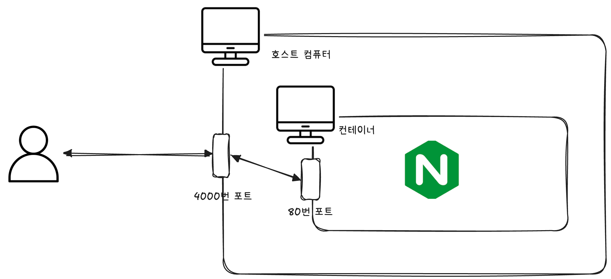

# 🧑🏻‍💻 Docker Command

---

```shell
# docker image 목록
docker image ls
```

<br>

```shell
# 최신 버전의 이미지 다운로드
docker pull nginx

# 위와 같은 명령어다.
docker pull nginx:latest

# 특정 버전(태그)의 이미지 다운로드(docker hub에서 찾아올 수 있다)
docker pull nginx:1.30
```

<br>

```shell
# 특정 ID의 이미지 삭제 - container에서 미사용 중인 이미지만 삭제 가능
docker image rm {image_id}
docker image rm {image_name}

# 중단된 컨테이너에서 사용 중인 이미지더라도 강제로 삭제 - 실행 중인 컨테이너에서 사용 중이면 삭제 X
docker image rm -f {image_id}
docker image rm -f {image_name}

# 컨테이너에서 사용 중이지 않은 전체 이미지들 삭제
docker image rm $(docker images -q)
```

<br>


```shell
# nginx 이미지를 기반으로 컨테이너 생성
docker create nginx
```

<br>

```shell
# 특정 컨테이너 실행
docker start {container_id}
```

<br>

```shell
# docker create + start 같이 데몬으로 실행
docker run -d nginx 

# docker name도 부여하여 데몬으로 실행
docker run -d --name my-web-server nginx

# host 포트 4000번과 컨테이너 포트 80으로 연결하여 실행
docker run -d -p 4000:80 nginx
```




<br>

```shell
# 중지된 컨테이너 전체 삭제 (볼륨은 건드리지 않는다.)
docker container prune
```


<br>

```shell
# docker-compose.yml 백그라운드로 실행. 로그를 확인하면서 실행하고 싶다면 -d 옵션 생략
docker compose up -d

# 특정 컨테이너만 실행
docker-compose up -d {container_name}
```

```shell
# 컨테이너 실행
docker exec -it {container_name} bash
```

```shell
# docker-compose 종료
docker compose down
```

```shell
# docker 재실행
docker compose restart {container_name}
```

```shell
# docker 로그 실시간 확인
docker logs -f {container_name}
```