# 🧑🏻‍💻 Docker 배포

---

- [✅ Ubuntu에서 Docker 설치 커맨드](#-ubuntu에서-docker-설치-커맨드)
- [✅ AWS ECR(Elastic Container Registry)](#-aws-ecrelastic-container-registry)
- [✅ AWS ECR 셋팅](#-aws-ecr-셋팅)

## ✅ Ubuntu에서 Docker 설치 커맨드
```shell
# ubuntu에서 docker 설치 명령어
sudo apt-get update && \
sudo apt-get install -y apt-transport-https ca-certificates curl software-properties-common gnupg && \
sudo install -m 0755 -d /etc/apt/keyrings && \
curl -fsSL https://download.docker.com/linux/ubuntu/gpg | \
  sudo gpg --dearmor -o /etc/apt/keyrings/docker.gpg && \
sudo chmod a+r /etc/apt/keyrings/docker.gpg && \
echo "deb [arch=amd64 signed-by=/etc/apt/keyrings/docker.gpg] https://download.docker.com/linux/ubuntu $(lsb_release -cs) stable" | \
  sudo tee /etc/apt/sources.list.d/docker.list > /dev/null && \
sudo apt-get update && \
sudo apt-get install -y docker-ce && \
sudo usermod -aG docker ubuntu && \
sudo curl -L "https://github.com/docker/compose/releases/download/2.27.1/docker-compose-$(uname -s)-$(uname -m)" \
  -o /usr/local/bin/docker-compose && \
sudo chmod +x /usr/local/bin/docker-compose && \
sudo ln -sf /usr/local/bin/docker-compose /usr/bin/docker-compose && \
newgrp docker
```
```shell
$ docker -v # Docker 버전 확인
$ docker compose version # Docker Compose 버전 확인
```

<br>

## ✅ AWS ECR(Elastic Container Registry)

---

> [!NOTE]
> AWS ECR이란, Dockerhub와 같이 이미지를 저장 및 다운로드 받을 수 있는 저장소 역할을 하는 것이다.  
> AWS 클라우드 환경에서 인프라를 구축하면서 AWS ECR을 사용하면 다른 AWS Resource와의 연동이 편하고, AWS 내에서 한 번에 관리할 수 있다는 장점이 있다.  

<br>

> [!TIP]
> Docker를 사용하지 않았을 때 많은 사람들이 사용하는 배포 전략은 Github를 활용하는 방법이다.  
> ➡ 이 방식은 프로젝트 코드 전체를 EC2로 이동시켜야하며, 프로젝트 코드를 실행시킬 런타임 환경(Node, JDK 등)도 설치돼있어야만 실행이 된다.
> 
> Docker의 가장 큰 장점은 이식성이다.  
> Docker만 깔려있으면 어디에서든 내가 원하는 프로젝트를 실행시킬 수 있다는 장점이다.

<br>

## ✅ AWS ECR 셋팅

---

### 💡 AWS CLI 설치

```shell
# Mac 환경
brew install awscli
aws --version # 잘 출력된다면 정상 설치된 상태
```

```shell
# ubuntu 환경
sudo apt install unzip
curl "https://awscli.amazonaws.com/awscli-exe-linux-x86_64.zip" -o "awscliv2.zip"
unzip awscliv2.zip
sudo ./aws/install
aws --version # 잘 출력된다면 정상 설치된 상태
```

### 💡 IAM 생성하기
> [!TIP]
> IAM은 ECR에 접근하기 위한 접근 권한을 얻기 위해 생성한다.

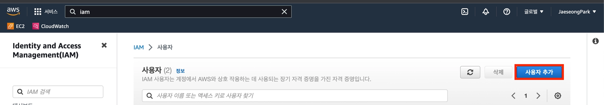
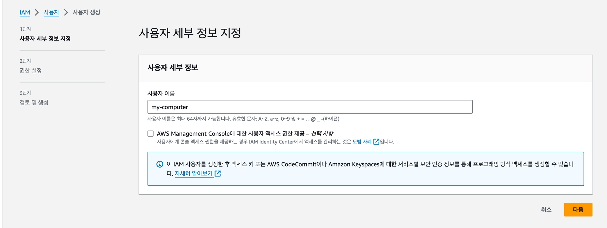
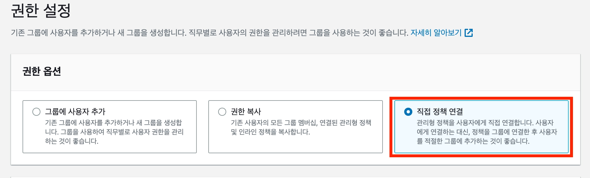
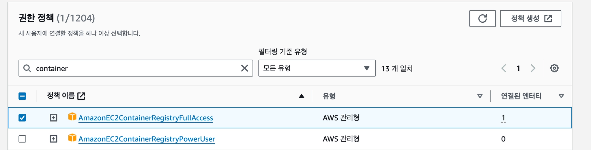
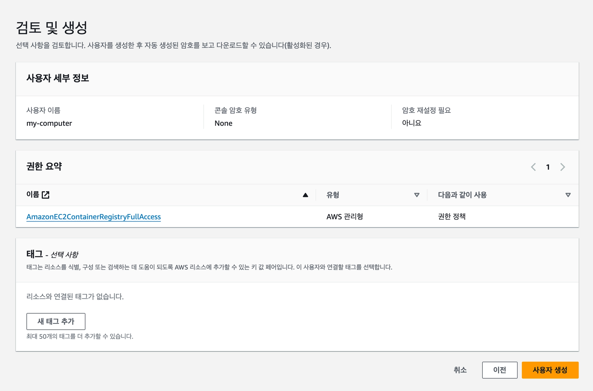

<br>

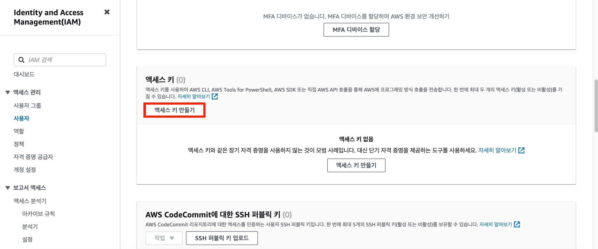
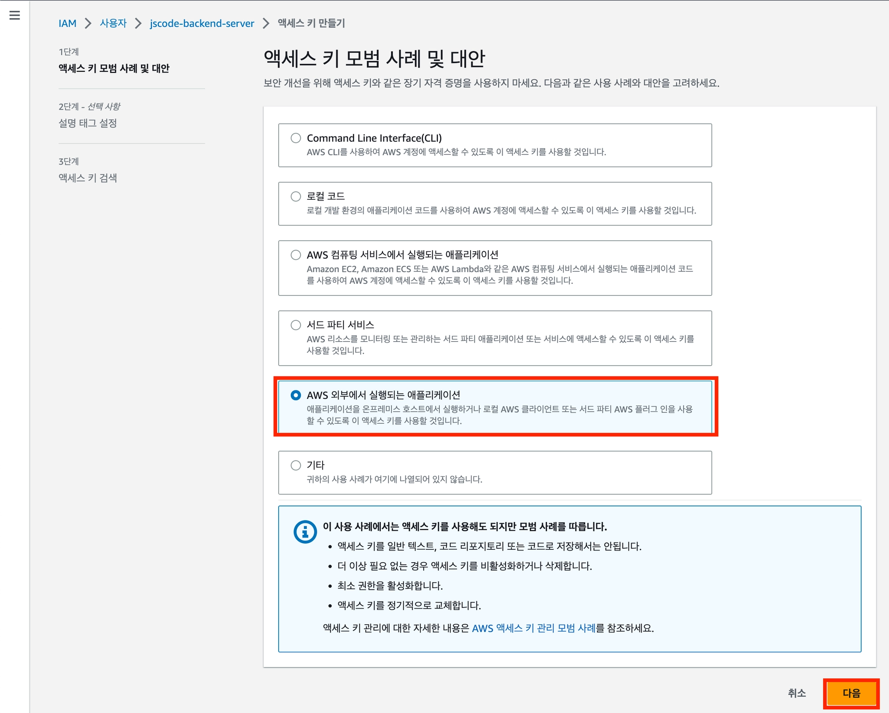
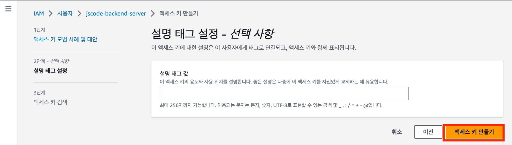
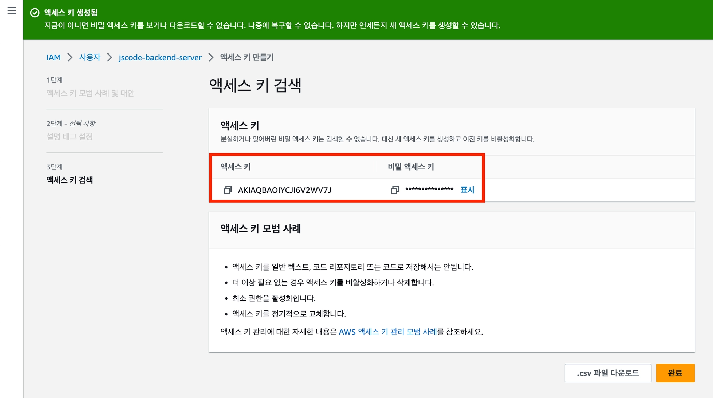

```shell
# MAC과 ubuntu 환경 모두 각각 셋팅한다.
# AWS CLI로 액세스 키 등록하는 과정이다.
$ aws configure
AWS Access Key ID [None]: <위에서 발급한 Key id>
AWS Secret Access Key [None]: <위에서 발급한 Secret Access Key>
Default region name [None]: ap-northeast-2
Default output format [None]:
```

### 💡 AWS ECR(Elastic Container Registry) 셋팅하기
> [!TIP]
> 하나의 ECR 리포지토리에는 하나의 이미지만 저장한다.

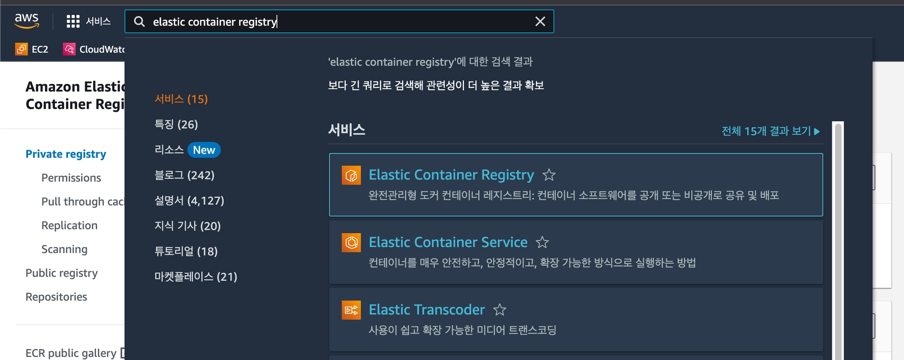
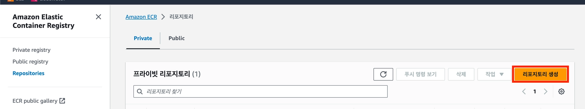
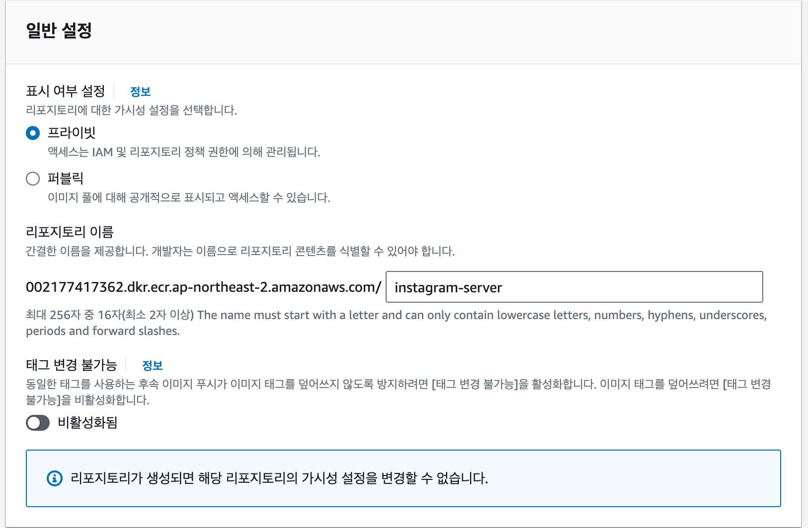

<br>

## ✅ 이미지 빌드해서 AWS ECR에 Push, Pull 해보기

---

```dockerfile
# Dockerfile 작성
FROM eclipse-temurin:17-jdk
WORKDIR /charles-commerce
COPY build/libs/*SNAPSHOT.jar server.jar
ENTRYPOINT ["java", "-jar", "server.jar"]
```

### 💡 이미지 빌드 및 push
```shell
./gradlew clean build -x test
```
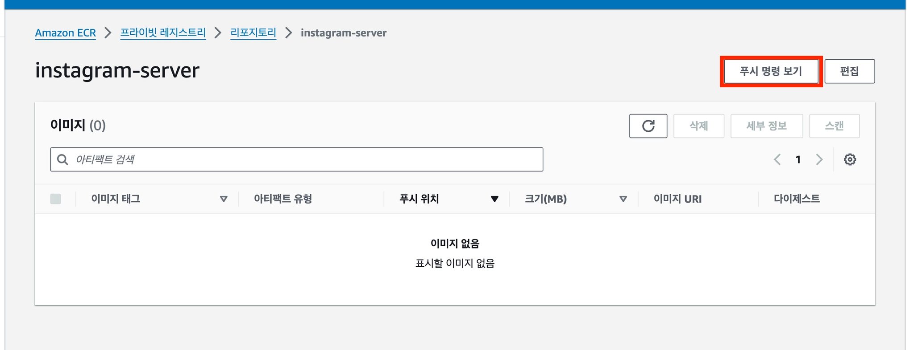
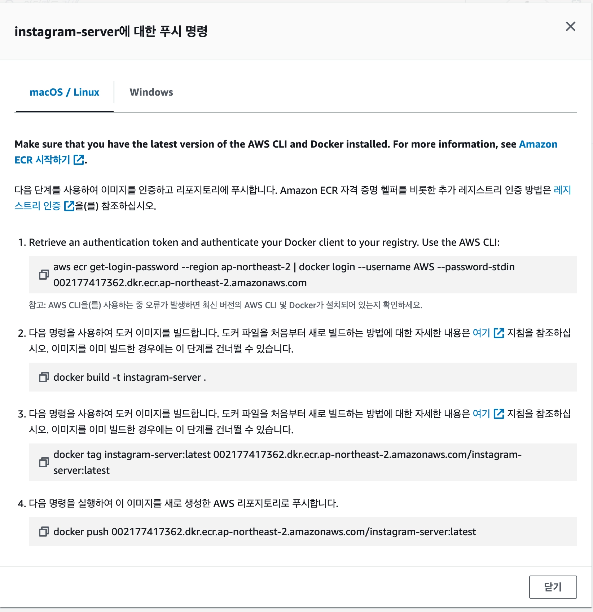
> [!WARN]
> CPU 환경이 다를 때는 빌드를 할 때 옵션을 다르게 설정해야 한다.  
> pull하는 AWS EC2의 CPU 아키텍처가 x86_64(linux/amd64)라면  
> 빌드를 할 때 다음과 같은 명령어로 빌드한다.
> 
> `docker build --platform linux/amd64 -t instagram-server .`

### 💡 이미지 pull
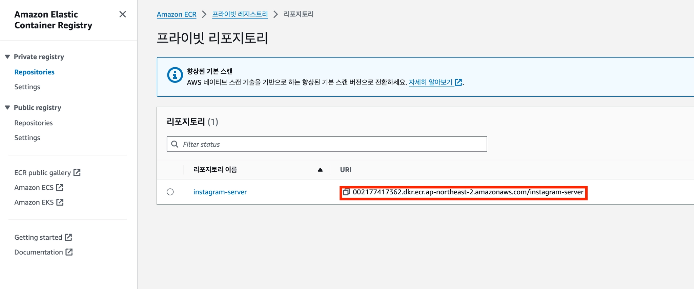
```shell
$ docker image rm -f [Container ID] # 기존 갖고있던 이미지 지우기
$ docker pull 002177417362.dkr.ecr.ap-northeast-2.amazonaws.com/instagram-server
$ docker image ls
```

<br>

## ✅ 다운받은 이미지 컨테이너로 띄우기

---

### 💡 Docker CLI로 배포
```shell
# pull까지 한 상태에서 이미지 URI를 실행
docker run -d -p 8080:8080 002177417362.dkr.ecr.ap-northeast-2.amazonaws.com/instagram-server
```

<br>

### 💡 Docker Compose로 배포
```shell
mkdir instagram-server
cd instagram-server
vi compose.yml
```
```yaml
services:
  instagram-server:
    image: 002177417362.dkr.ecr.ap-northeast-2.amazonaws.com/instagram-server:latest
    ports:
      - 8080:8080
```
```shell
# 만약 Docker 이미지에 업데이트된 내용이 있다면
docker compose pull

# docker compose 실행
docker compose up --build -d
```

<br>

**출처**  
[비전공자도 이해할 수 있는 Docker 입문/실전](https://www.inflearn.com/course/%EB%B9%84%EC%A0%84%EA%B3%B5%EC%9E%90-docker-%EC%9E%85%EB%AC%B8-%EC%8B%A4%EC%A0%84/dashboard?cid=334085)