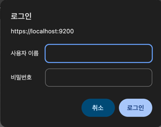
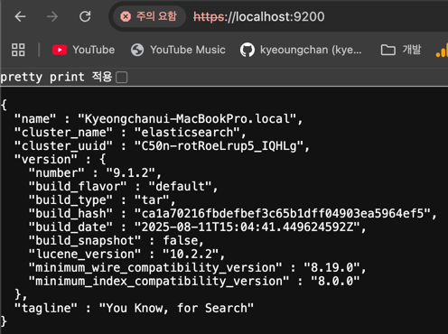
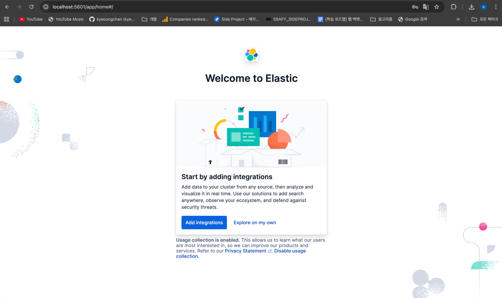

# 💻 Elastic Search 설치 및 실행

## ✅ 다운로드
Download URL: https://www.elastic.co/kr/downloads/elasticsearch  
→ 참고로 내 맥 환경을 알고 싶다면?
```text
$ arch
arm64 # 결과
```

<br>

→ elasticsearch-9.1.2-darwin-aarch64.tar.gz 압축 파일이 다운로드 된다.  
압축 풀기  
```text
$ tar -xvf elasticsearch-9.1.2-darwin-aarch64.tar.gz
```

<br>

## ✅ 실행
그리고 이렇게 하면 실행이 된다.  
```text
$ ./elasticsearch-9.1.2/bin/elasticsearch
```

그리고.. Elasticsearch 8.x 이상부터는 기본적으로 HTTPS(SSL/TLS)만 허용한다.  
따라서 https://localhost:9200 으로 들어가야 정상 접속된다.  

<br>

  

갑자기 사용자 이름이랑 비밀번호를 입력하라고 뜬다.  
처음에 엘라스틱 서치를 실행시켰을 때 `user` 와 `password`를 알려준다.  
초기 `user`는 `elastic`이고, 비밀번호는 까먹지 않게 기록해두면 좋다.  
아니면 비밀번호를 재설정할 수 있다.  
```text
./elasticsearch-9.1.2/bin/elasticsearch-reset-password -u elastic
```

<br>

다음과 같이 뜨면 성공이다.  


<br>

# 💻 Kibana 설치 및 실행
## ✅ 다운로드
Download URL: https://www.elastic.co/downloads/kibana

<br>

마찬가지로 압축을 풀고, 홈 화면에 kibana 폴더가 있다는 전제하에 다음과 같은 명령어를 실행시키면 된다.  
그 다음, localhost:5601 에 접속하면 된다.  
단, elastic search 가 구동 중일 때 실행해야 한다.  
```text
$ ./kibana-9.1.3/bin/kibana
```

<br>

참고로, enrollment token을 요구하는데, 이건 elastic search 를 처음 구동시킨 후 30분 이내에 사라진다.  
새로 토큰을 발급받기 위해서는 하기의 명령어를 입력한다.  
```text
./elasticsearch-9.1.2/bin/elasticsearch-create-enrollment-token -s kibana
```

그 다음 코드를 입력하라고 뜨는데, 키바나를 실행시킨 터미널 창에 localhost:5601?code=000000 → 이런식으로 6자리 코드를 준 상태일텐데, 이것을 입력하면 된다.  
  
마지막으로, 로그인을 하라고 하는데, 위에 elastic search를 로그인할 때와 마찬가지로 user: elastic, password: 발급 받은 비밀번호를 입력하면 된다.  

그럼 이렇게 화면 접속에 성공한다.  


<br>

### 🚫 에러 발생
Kibana 로컬 설치를 끝내고 다음날 기분 좋게 재접속하는데 안 되었다.  
에러 로그가 굉장히 많았는데, 이게 핵심이다.  
```text
[ERROR][elasticsearch-service] Unable to retrieve version information from Elasticsearch nodes. Request timed out
```  
ElasticSearch에 연결이 안되는 것인데, kibana.yml을 수정해주면 된다.

<br>

```text
cd kibana-9.1.3/config
vi kibana.yml
```

<br>

그러면 `elasticsearch.hosts:`의 값이 셋팅이 되어있을텐데, 일단 로컬 환경에서 공부가 목적이라면 해당 셋팅은 주석처리하고, 다음과 같이 작성하고 재실행하니 해결되었다.  

```text
#elasticsearch.hosts: [https://XXX.XXX.XX.X:9200]
elasticsearch.hosts: [https://localhost:9200]
```
