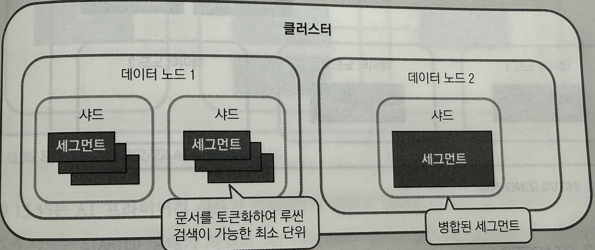
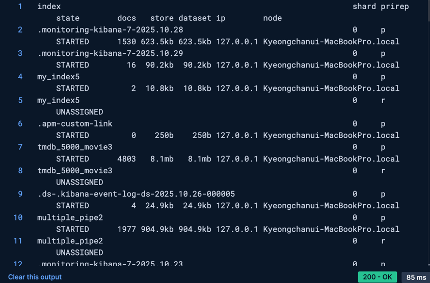
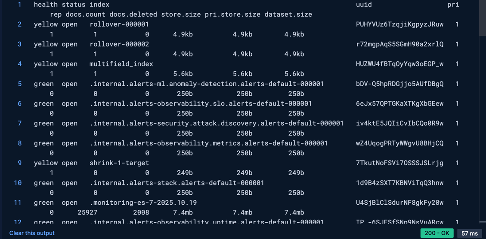
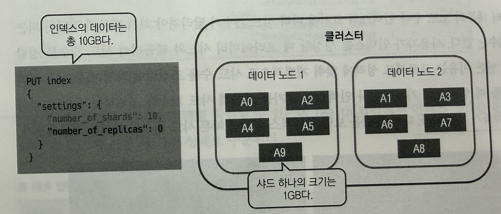

# 💻 클러스터

## ✅ 클러스터란
여러 대의 컴퓨터를 병렬로 연결해 하나의 시스템을 구성하는 것을 말한다.
- 시스템 장애를 대비한 고가용성(high availability)을 높일 수 있다.
- 시스템 성능도 높일 수 있다.
    - 엘라스틱서치가 여느 검색 엔진보다 빅데이터 시대에 앞서갈 수 있는 이유는 클러스터에 속한 여러 노드에 필요한 작업을 나눠서 수행하는 분산 처리를 지원하여 엄청나게 큰 데이터를 다룰 수 있었기 때문이다.

<br>

## ✅ 클러스터 백업
엘라스틱서치는 데이터 백업을 위해 스냅샷을 지원한다.  
스냅샷을 위한 저장소는 리포지토리라고 하는데, 스냅샷을 찍기 전에 먼저 리포지토리부터 지정해야 한다.  


### 💡 리포지토리 등록
리포지토리는 클러스터를 구성하는 마스터 노드와 데이터 노드가 동일한 위치를 공유해야 하기 때문에 노드 설정 파일 `elasticsearch.yml`에 리포지토리 경로를 먼저 지정해야 한다.  
> 참고로, elasticsearch 9.X 버전부터는 기본 경로(내 PC 환경 기준 `/Users/kyeongchanwoo/elasticsearch-9.1.4`)가 read-only이기 때문에 외부에 새로운 snapshot 저장 위치를 설정해야 한다.  
> 따라서 다음과 같은 예시로 먼저 디렉토리를 생성 후 진행해야 한다.  
> `mkdir /Users/kyeongchanwoo/es-snapshots`  

```yml
# elasticsearch.yml에 하기 내용을 추가했다.
path.repo: ["/Users/kyeongchanwoo/es_snapshots"]
```

엘라스틱서치는 snapshot API를 제공하므로 이제 리포지토리 등록 API를 호출할 수 있다.
```json
# 리포지토리 등록
PUT _snapshot/fsrepo
{
    "type": "fs",
    "settings": {
        "location": "/Users/kyeongchanwoo/es_snapshots"
    }
}
```
리포지토리 등록은 type에 따라 사용법이 달라진다.
- fs: 파일 시스템
- hdfs: 빅데이터 파일시스템
- s3: 아마존
- azure: 마이크로소프트 애저
- gcs: 구글 클라우드 스토리지

<br>

### 💡 스냅샷 찍기
```json
# 현재 등록된 리포지토리 확인
GET _snapshot
```
```json
# 결과
{
"fsrepo": {
      "type": "fs",
      "uuid": "************",
      "settings": {
      "location": "/Users/kyeongchanwoo/es_snapshots"
    }
  }
}
```

<br>

```json
# 스냅샷 찍기 요청
# 모든 인덱스의 스냅샷을 찍는다.
PUT _snapshot/fsrepo/snapshot1

# 특정 인덱스의 스냅샷 찍기 요청
# indices는 배열 형태, 혹은 와일드 카드 형식으로 지정할 수 있다.
# ignore_unavailable을 true로 지정하면 활성화되지 않은 인덱스의 스냅샷은 찍지 않는다.
PUT _snapshot/fsrepo/snapshot2
{
  "indices": "kibana_sample_data_*",
  "ignore_unavailable": true
}
```

<br>

### 💡 스냅샷 복원
```json
# 특정 인덱스만 복원
POST _snapshot/fsrepo/snapshot1/_restore
{
  "indices": "kibana_sample_data_*",
  "ignore_unavailable": true,
  "rename_pattern": "kibana_sample_data_(.+)",
  "rename_replacement": "restored-kibana_sample_data_$1"
}
```
인덱스를 복원할 때 인덱스 이름을 변경해야한다.  
이미 존재하는 인덱스와 이름이 겹치기 때문이다.  
- `rename_pattern`: 변경하려는 인덱스 이름
- `rename_replacement`: 변경되는 인덱스 이름

```json
GET _cat/indices
```
위의 API를 통해 인덱스를 확인해보면 복원된 인덱스를 확인할 수 있다.
```json
# 결과
...
yellow open restored-kibana_sample_data_ecommerce ...
```

스냅샷을 찍을 때는 기존 데이터 대비 변경사항만 추가 반영되는 구조이기 때문에 스냅샷을 자주 찍는다고 해서 가끔씩 찍는 것에 비해 특별히 용량이 크게 늘어나지 않으므로 가능하면 자주 스냅샷을 찍어주는 방식을 권장한다.  
실제 운영 과정에서는 스냅샷 수명 주기를 관리하는 기능인 SLM(Snapshot Lifecycle Management)이 스냅샷 빈도나 관리를 자동화해줄 수 있다.

<br>

## ✅ 샤드
분산 처리 시스템인 엘라스틱서치는 여러 대의 노드를 효율적으로 활용하기 위해 데이터를 샤드라는 단위로 나눠 분산 저장한다.  
데이터를 분산 저장하면 클러스터의 수평적인 확장이 가능하고, 작업을 분산 처리해 성능과 처리량을 높일 수 있다.  

> 실제로 인덱스는 가상의 논리적 단위이고, 실제 도큐먼트의 인덱싱과 검색은 샤드에서 일어나게 된다.


여기에 `my_index`는 샤드를 5개 만든다.  
인덱스를 만들 때 샤드 개수를 정할 수 있다.  
5개 샤드는 3개의 노드에 적절히 분배되고, `xxx` 도큐먼트가 인덱싱되면 도큐먼트는 5개의 샤드 중 하나에 저장된다.  
이때 코디네이터 노드, 즉 최초 요청을 수신한 노드는 문서에 별도의 ID가 주어지지 않는다면 랜덤 ID를 생성한다.  
`_routing` 파라미터가 명시되지 않았다면 ID를 이용해 도큐먼트가 인덱싱될 샤드를 결정한다.  

> 샤드를 선택하는 공식  
> shard = hash(_routing) % 프라이머리 샤드 개수

<br>

### 💡 프라이머리 샤드와 레플리카 샤드
엘라스틱 서치는 인덱스를 샤드 단위로 나누어 노드들에 분산 저장해 클러스터 내의 컴퓨팅 리소스를 최대한 활용할 수 있도록 만든다.  
하지만 데이터가 여러 대의 물리 장비에 분산되어 있는 만큼 노드 하나만 클러스터를 이탈해도 데이터가 손실되어 시스템의 정합성이 떨어질 우려가 있다.  
➡️ 데이터의 원본을 **프라이머리(Primary) 샤드**에 저장하는 한편, 유실을 방지하고 가용성을 확보하기 위한 데이터 복제본, 즉 **레플리카(Replica) 샤드**를 만들어 사용한다.

<br>

```json
PUT index
{
  "settings": {
    "number_of_shards": 3,
    "number_of_replicas": 2
  }
}
```

> 엘라스틱서치 프라이머리 샤드와 레플리캬 샤드의 기본 개수는 1이다.  
> 인덱스를 생성할 때 `number_of_shards`나 `number_of_replicas` 같은 설정값을 명시적으로 지정하지 않으면 모두 1이다.

<br>

❗**레플리카 샤드의 필요성**️  
- 고가용성
  - 고가용성은 시스템이 오랜 기간 동안 지속적으로 운영할 수 있는 성질을 말한다.
  - 위 그림에서 데이터 노드1에서 장애가 발생하더라도 프라이머리 샤드와 레플리카 샤드를 생성하고 노드에 적절히 분산시켰기 때문에 어떤 노드에 접근해도 A0,A1,A2 샤드를 얻을 수 있다.
- 처리속도 향상
  - 샤드가 균형 있게 분산되어 있으면 응답성이 좋은 샤드를 취사선책해 리소스 활용량을 최적화할 수 있다.
  - 만약 데이터 노드1에 위치한 다른 인덱스의 검색 부하가 심해 노드의 반응이 느리다면,
  - 레클리카 샤드가 없다면 마지막 샤드의 응답이 올 때까지 기다리게 되고, 총 검색 소요 시간에 영향을 미치게 된다.
  - 하지만 레플리카 샤드가 있다면 데이터 노드2나 3에 대신 요청해 좀 더 빠른 검색을 수행할 수 있다.
  - 즉, 이미 부하 상태에 놓인 노드에 추가적인 부하를 방지해 클러스터 전체 처리 성능의 안정성에 기여한다.

<br>

❗️ **세그먼트**  

- 샤드는 하나의 루씬 인스턴스이며, 여러 개의 세그먼트를 포함하고 있다.
- 도큐먼트가 저장될 때 정확히는 샤드 내의 세그먼트에 저장된다.
- 세그먼트: 엘라스틱서치에서 인덱스가 물리적으로 저장되는 가장 작은 단위
- 읽기에 최적화된 형태이며, 수정은 불가능하다.
- 세그먼트는 자체적으로 루씬 검색이 가능한 구조이며, 토큰화된 역인덱스 데이터와 소스 데이터가 들어있다.
  - 루씬에서 인덱스 검색을 요청하면 각각의 세그먼트들로부터 검색하고 이를 통합해 최종 결과가 나온다.
- 세그먼트는 리프레시(refresh)될 때마다 생기는데, 리프레시는 클러스터의 모든 샤드에서 기본적으로 1초마다 발생하며, 리프레시가 되어야 새로 추가된 도큐먼트 검색이 가능하다.
  - 너무 작은 세그먼트들이 만들어지면 읽기 성능이 저하되므로 이를 방지하기 위해 내부적으로 틈틈이 세그먼트들을 병합한다.
- 엘라스틱서치의 기본 데이터 검색, 저장 방식이 루씬을 기초로 했기 때문에 세그먼트의 병합 과정을 이해해야 시스템 성능 튜닝이 가능해진다.

<br>

## ✅ 샤드 상태 모니터링
```json
# 샤드 상태
GET _cat/shards?v
# v는 헤더 컬럼을 보여준다.
```

- 프라이머리(p), 레플리카(r)
- 샤드 상태(STARTED, UNASSIGNED)
  - r로 되어있는 레플리카 샤드가 UNASSIGNED 상태인 이유는 실습 환경이 단일 노드이기 때문이다.
  - 레플리카 샤드는 프라이머리 샤드와 같은 노드에 위치해 있으면 고가용성이나 성능적 이점을 전혀 보지 못하고 단순히 저장공간만 2배를 사용하기 때문에 레플리카 샤드를 만들지 않는다. 

<br>

```json
# 인덱스 상태 확인
GET _cat/indices?v
```


싱글 노드이기 때문에 레플리카 샤드가 할당되지 않은 인덱스들은 yellow 상태로 보인다.  
green으로 떠있는 인덱스는 아예 레플리카가 없는 인덱스들이다.


<br>

## ✅ 샤드 개수와 크기 구성 가이드
인덱스 생성 시 설정하는 샤드의 개수는 성능에 영향을 미친다.  
1. 샤드가 늘어나면 ➡️ 더 많은 스레드를 활용해 인덱스를 병렬 검색할 수 있을 것이다.
2. 샤드가 적으면 ➡️ 그만큼 요청을 분배하고 취합하기 위한 비용이 줄어들 것이다.

샤드는 반드시 많다고, 혹은 적다고 좋은 것이 아니며, 적절한 샤드 수를 선정할 필요가 있다.

### 💡 샤드 개수 가이드
총 샤드 개수: `number_of_shards * (number_of_replicas + 1)`  
오버샤딩: 샤드를 잘게 나누어 필요 이상의 많은 리소스를 사용하게 하는 문제다.  

<br>


예제 상황
- 10GB 크기의 인덱스
- 10개의 프라이머리 샤드


위의 경우 오버샤딩이 되는데, 샤드 하나가 1GB인데 크기가 너무 작고, 노드 수에 비해 프라이머리 샤드가 너무 많기 때문이다.

<br>

오버샤딩의 문제점
1. 각 샤드는 개별적으로 리소스를 소비한다.
   1. CPU
   2. 메모리
   3. 루씬 인덱스의 인덱스
2. 인덱스를 검색하기 위해서는 인덱스가 저장된 모든 샤드에 접근해야 한다.

<br>

공식적으로 권장하는 방법은 실 데이터를 가지고 샤드 수를 조정하면서 벤치마크하는 것이다.  
클러스터에서 제공하는 CPU 코어 개수에 따라서 샤드 개수를 결정하기도 하지만, 적절한 샤드 수는 프로젝트 성격이나 시스템 구성에 따라 바뀌는 것이지, 한 가지 요인만으로 결정되는 것이 아니다.

<br>

### 💡 샤드 크기 가이드
- 샤드가 너무 크면 ➡️ 성능 문제가 발생한다.
- 샤드가 너무 작으면 ➡️ 담을 수 있는 도큐먼트가 작아진다.

따라서 직접 테스트를 해보면서 가장 알맞은 샤드 크기를 찾아야 한다.  
검색이 많은 시스템인지, 저장이 중요한 시스템인지에 따라 샤드 크기는 변경될 수 있다.  
노드의 리소스 상태도 영향을 미친다.  
> 엘라스틱에서는 통계적으로 볼 때 샤드 하나의 크기가 10GB~40GB 정도로 관리하는 것이 좋다고 권고한다.

인덱스를 생성하고 인덱스 내부에 도큐먼트를 무한정 집어넣는다면 샤드의 크기는 커질 수밖에 없다.  
샤드가 무한대로 커지면 성능 문제가 발생하기 때문에 일반적으로 특정 조건을 기준으로 인덱스를 나누는 작업을 한다.  
요즘은 ILM(Index Lifecycle Management)을 통해 인덱스를 관리하는데, 여기서는 rollover API와 shrink API를 사용한다.

<br>

❗️ **rollover API**  
rollover API는 인덱스가 특정 조건에 도달했을 때 새로운 인덱스를 생성하는 API다.  
요청이 있을 경우만 발생하고 요청 전까지는 샤드 크기가 아무리 커져도 새로운 인덱스가 생성되지 않는다.  
자동화 기능은 ILM이 제공한다.


<br>

❗️ **shrink API**  
shrink API는 기존 인덱스의 프라이머리 샤드 개수를 줄이는 데 사용한다.  
또한 자주 사용되지 않아 핫 노드에서 웜 노드로 이동하는 인덱스에도 shrink API를 사용할 수 있다.

<br>


**출처**  
[엘라스틱 스택 개발부터 운영까지](https://product.kyobobook.co.kr/detail/S000001932755)