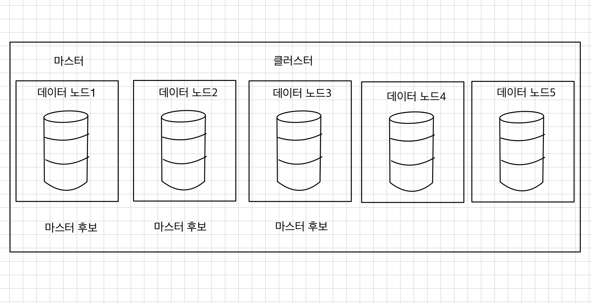

# 💻 노드

## ✅ 노드란
- 엘라스틱서치에서 [클러스터](https://github.com/kyeoungchan/note/tree/main/elastic-stack/cluster-node/cluster)를 구성하는 요소를 노드(node)라고 한다(하나의 인스턴스다).  
- 클러스터는 여러 노드의 집합인데, 노드는 엘라스틱서치가 설치되는 물리적 혹은 논리적 단위다.
  - 일반적으로 하나의 컴퓨터(혹은 서버)에 하나의 노드를 구성하는데, 물리적인 서버뿐만 아니라 논리 혹은 가상 서버로도 노드를 구분한다.
- 물리적인 서버 하나에 노드 하나를 구성하는 방식을 권장하지만, 단일 서버에 복수의 노드를 설치할 수도 있다.
- 클러스터에 참여하는 노드 이름은 중복돼서는 안 된다.
- 하나의 노드가 여러 역할을 할 수 있다.

<br>

### 💡 마스터 노드
클러스터는 반드시 하나의 마스터 노드(master node)를 가져야 한다.

<br>

아래를 포함하여 클러스터의 모든 상태 정보를 관리한다.
1. 인덱스의 설정
2. 매핑 정보
3. 물리적 위치
4. 클러스터 설정 정보
5. 인덱스 템플릿 정보

<br>

각 노드들과 통신하면서 클러스터의 변화를 모니터링한다.

마스터 노드가 없으면 클러스터가 멈춘다.  
→ 다수의 마스터 후보 노드가 투표를 통해 결정한다.  
→ 사용자는 마스터 후보 노드(master-eligible node)만 지정할 수 있다.
→ 클러스터 내부에서 N/2 + 1(N은 마스터 후보 노드 수) 표를 얻은 마스터 후보 노드가 과반수에 의해 마스터 노드가 된다.


<br>

### 💡 투표 전용 노드
7.3 버전부터 마스터 후보 노드 중에서 마스터 노드를 선정하는 투표에는 참여하지만 실제 마스터 노드가 되지 않는 노드들이 추가되었다.  
투표에만 참여하는 노드라는 것이 무슨 의미가 있을까? 🤔

<br>

**❗️ 마스터 후보 노드 부족으로 마스터 노드를 선출하지 못하는 경우**  

퍼블릭 클라우드 환경에서는 물리적인 거리 제한 없이 아시아, 유럽, 북미에 노드를 구성해 클러스터를 만들 수 있다.  
이때 지진으로 서버 오류가 발생해 아시아존에 있던 모든 노드가 동작하지 않는 상황에서 투표 전용 노드(voting only node)를 이용해 시스템을 정상으로 유지하는 방법을 알아보자.  


위의 상황에서는 최소 마스터 후보 노드 수가 부족해서 클러스터는 마스터 노드를 선출할 수 없고 시스템은 중단된다.

<br>


노드1이 마스터 노드가 되었고 아시아존에 문제가 발생했지만 클러스터는 동작한다.

<br>

### 💡 데이터 노드
데이터 노드(data node)는 인덱싱한 도큐먼트를 샤드 형태로 저장하여 데이터의 CRUD 작업과 검색, 집계 작업을 한다.  
실질적인 데이터 프로세싱 작업이 일어나기 때문에 일반적으로 노드 중 가장 많은 부하를 받는다.  
→ 여유가 된다면 클러스터를 구성할 때 마스터 노드와 데이터 노드 역할을 구분하는 방식도 좋다.  
→ 데이터 노드의 부하로 인해 마스터 노드의 성능이 떨어질 경우 클러스터 전체의 안정성에 영향을 미치기 때문이다.

데이터 노드는 컴퓨터 리소스(I/O, CPU, 메모리 등) 사용량에 민감하기 때문에 모니터링하면서 부하 상태를 체크하고 상황에 맞춰 명시적으로 샤드를 재분배하거나 데이터 노드를 추가/변경하는 작업을 해야 한다.  

  
클러스터 내의 4개 데이터 노드를 모니터링해야 하는 이유는 다음과 같다.  
- 노드 1: 이미 리소스 한계에 왔다.
- 노드 2: 한계에 도달하려고 한다.
- 노드 3: 여유가 있다.
- 노드 4: 이제 막 클러스터에 합류했다.

➡ 적당한 리소스 배치를 통해 특정 노드에 부하가 몰리는 것을 막아햐 하는데, 위의 경우 데이터 노드1의 샤드를 데이터 노드4에 재분배하면 된다.

<br>


### 💡 인제스트 노드
인제스트 노드(ingest node)는 도큐먼트의 가공과 정제를 위한 인제스트 파이프라인이 실행되는 노드다.  
인제스트 노드는 파이프라인을 통해 도큐먼트를 엘라스틱서치에 인덱싱하기 전에 원하는 형태로 변형할 수 있다.  
> 로그스태시의 필터와 기능적으로 유사하지만 몇 가지 차이점이 있다.
> - 인제스트 노드는 실행 주체가 엘라스틱서치라는 점과 지원되는 기능에 일부 차이가 있다.
> - 로그스태시 설치 없이 비츠만 설치해 데이터를 수집하고, 인제스트 파이프라인을 이용해 이를 가공할 수 있다.
> - 가볍고 간단한 수집 프로세스라면 비츠와 인제스트 노드의 조합만으로 충분하고,
> - 좀 더 무겁고 복합한 가공이 필요하다면 로그스태시까지 함께 사용하자.


<br>

인제스트 노드는 프로세서와 파이프라인이라는 구성요소를 갖고 있다.  
- 프로세서: 도큐먼트를 변형할 수 있는 기능적으로 구분되는 모듈  
- 파이프라인: 프로세서의 집합  

<br>

```
# 인제스트 노드의 파이프라인 생성 요청
PUT _ingest/pipeline/mypipe
{
    "description": "my description",
    "processors": [
        {
            "set": {
                "field": "status",
                "value": "low",

                "on_failure": [
                    {
                        "set": {
                            "field": "error",
                            "value": "set processor error"
                        }
                    }
                ]
            }
        }
    ],
    "on_failure": [
        {
            "set": {
                "field": "error",
                "value": "pipeline1"
            }
        }
    ]
}
```

- `mypipe`: 파이프라인 이름
- `set`: 프로세서 종류
- `status`라는 필드가 없다면 새로 만들고 값을 `low`로 할당, 이미 있다면 값을 `low`로 수정한다.
- `on_failure`는 2개가 있는데, 프로세서 동작 중에 발생하는 예외를 처리하는 것과 파이프라인에서 발생하는 오류에 대한 예외를 처리하는 것으로 나뉜다.

<br>

```json
# 파이프라인을 적용하여 도큐먼트 저장 요청
PUT my_index/_doc/1?pipeline=mypipe
{
    "name": "id1",
    "status": "high"
}
# status: low
GET my_index/_search
```

```json
# my_index2 인덱스 생성과 도큐먼트 인덱싱 요청
PUT my_index2/_doc/1
{
    "name": "id1",
    "status": "high"
}
PUT my_index2/_doc/2
{
    "name": "id2"
}

# update_by_query API를 사용해 기존 인덱스에 파이프라인 적용 요청
POST my_index2/_update_by_query?pipeline=mypipe
```

```json
# reindex API를 사용해 새로운 인덱스에 파이프라인 적용 요청
POST _reindex
{
    "source": {
        "index": "my_index2"
    },
    "dest": {
        "index": "my_index3",
        "pipeline": "mypipe"
    }
}
```
> 수정해야하는 도큐먼트가 많다면 update API를 사용해 도큐먼트를 일일이 수정하는 방식(my_index2) 대신 리인덱싱과 파이프라인을 조합해 새로운 인덱스를 생성하는 방식(my_index3)이 성능상 유리할 수 있다.  
> 업데이트는 내부적으로 검색, 해당 도큐먼트 삭제, 수정된 도큐먼트 리인덱싱의 순서로 작업이 일어나는데, 삭제된 도큐먼트는 세그먼트 머지가 발생하기 전까지 ID만 내부적으로 기록해뒀다가 검색 시 필터링 하는 방식이어서 ➡ 성능에 나쁜 영향을 미치기 때문에 도큐먼트 업데이트는 가급적 피하는 것이 좋다.

```json
# 인덱스 설정에서 파이프라인 적용 요청
PUT my_index4
{
    "settings": {
        "default_pipeline": "mypipe"
    }
}
```

<br>

**프로세서 종류와 예시**
1. `date`: 날짜/시간 데이터를 파싱한다. 다음 예시의 경우 `my_field` 필드에 있는 데이터가 `formats`에 있는 날짜/시간 포맷일 경우 `timestamp`에 날짜 객체를 저장한다.
    ```json
    {
      "date": {
        "field": "my_field",
        "target_field": "timestamp",
        "formats": ["dd/MM/yyyy hh:mm:ss"]
      }
    }
    ```
2. `drop`: 특정 도큐먼트를 저장하고 싶지 않을 때 사용한다. 주로 `if` 옵션을 이용해 조건을 지정한다.
    ```json
    {
      "drop": {
        "if": "ctx.my_field == 'Guest'"
      }
    }
    ```
3. `grok`: 고수준의 정규식 패턴인 grok을 이용해 특정 필드를 구조화된 필드들로 만들 수 있다.
4. `set`: 특정 필드에 값을 지정한다. 필드가 이미 있다면 변경하고, 없다면 새로 추가된다.
    ```json
    {
      "set": {
        "field": "my_index",
        "value": "failed"
      }
    }
    ```
5. `split`: 필드를 구분 기호를 이용해 분리한다. 분리된 필드는 배열 형태의 값을 갖는다.
    ```json
    {
      "split": {
        "field": "my_index",
        "separator": ","
      }
    }
    ```

<br>

프로세서는 사용 방법이 제각각이지만 모든 프로세서에는 `if`, `tag`, `on_failure`라는 공통의 파라미터가 존재한다.

<br>

### 💡 코디네이터 노드
코디네이터 노드(coordinator node)는 REST API 요청을 처리하는 역할을 하는데, 기본적으로 모든 노드가 코디네이터 노드 역할을 수행할 수 있다.

코디네이터 작업이 많은 서비스의 경우 전용 코디네이터 노드를 두어 데이터 노드의 부하를 줄이고, 검색 효율을 높이는 것이 좋다.  


<br>

**❗️전용노드 설정값**

|   노드 타입   |       node.roles        |
|:---------:|:-----------------------:|
| 마스터 전용 노드 |       [ master ]        |
|투표 전용 노드| [ master, voting_only ] |
|데이터 전용 노드|        [ data ]         |
|인제스트 전용 노드|       [ ingest ]        |
|머신러닝 전용 노드|         [ ml ]          |
|코디네이터 전용 노드|           [ ]           |


<br>

**❗️전용노드 권장 하드웨어 사양**

||CPU|메모리|저장장치|
|:-:|:---:|:---:|:---:|
|마스터 후보 전용 노드|저사양|저사양|저사양|
|데이터 전용 노드|고사양|고사양|고사양|
|인제스트 전용 노드|고사양|중간 사양|저사양|
|코디네이터 전용 노드|저사양|중간 사양|저사양|

- 마스터 후보 전용 노드: 클러스터의 상태 관리가 주 역할이기 때문에 하드웨어 성능이 중요하지 않다.
- 데이터 전용 노드: 클라이언트 요청을 처리하기 위해 빈번한 I/O 작업과 연산 작업이 필요하기 때문에 고사양의 하드웨어로 구성하고, 가능하면 전용 노드로 사용하는 것을 권장한다.
- 인제스트 전용 노드: 데이터 수집이 목적이기 때문에 연산 작업에 비해 저장장치는 크게 중요하지 않다.
- 코디네이터 전용 노드: API 요청의 부하를 분산하는 역할이기 때문에 일반적으로는 특별히 고사양의 하드웨어가 필요하지 않다. 다만 요청량이 많을 경우에는 메모리를, 무거운 집계 요청이 잦은 경우에는 CPU를 더 많이 할당하면 도움이 된다. 


<br>

## ✅ 노드 구성과 시스템 구성
시스템 규모가 커지면 노드들의 성격에 따라 전용 노드를 구성하고 그에 맞는 하드워어와 운영 방식이 필요하다.  
또한 시스템의 가용성을 높이기 위한 HA(High Availability) 방안도 고민해야하는데 마스터 후보 전용 노드는 가능하면 1, 3, 5, 7 같은 홀수 배열로 구성하며, 나머지 노드들은 하트비트 같은 도구를 통해 주기적으로 상태 검사를 수행해 문제 여부를 판단하고 빠르게 복구할 수 있는 구조로 시스템을 구성하는 것이 중요하다.

<br>

### 💡 소규모 클러스터
싱글 노드: 노드가 하나인 시스템, 즉 노드 하나가 모든 역할을 하는 것으로, 노드 설정을 하나도 하지 않았다면 싱글 노드 환경이다.

지금 말하는 소규모 클러스터는 하나의 노드가 아니라 적어도 3~5대 정도의 노드가 있는 경우다.  



- 노드 5대를 이용한 소규모 클러스터 구성이다.
- 노드 개수가 부족하여 다양한 전용 노드를 구성하기 힘들다.
- 우선 마스터 노드는 반드시 필요하기 때문에 3개의 노드를 마스터 후보 노드로 설정했다.
  - 과반수 공식에 의해 마스터 노드를 선출할 것이며, 짝수로 지정할 경우 문제가 발생할 수 있으므로 마스터 후보 노드 개수는 홀수 개로 지정했다.
- 데이터 노드는 디스크, 메모리, I/O 모두 많은 리소스를 필요로 하기 때문에 가능한 데이터 노드는 많을수록 좋다.
  - 현재 소규모 클러스터는 노드 개수가 적기 때문에 모두 데이터 노드가 되도록 구성했다.

<br>

### 💡 대규모 클러스터

대규모 클러스터는 노드들을 효율적으로 관리하기 위해 전용 노드를 잘 활용하는 것이 중요하다.  
- 마스터 후보 노드: 하드웨어 성능은 비교적 중요하지 않지만 최소 3대를 준비하고 가능한 한 클라이언트의 요청을 받지 않도록 구성한다.
- 데이터 전용 노드: 온전히 데이터 작업만 진행하고 클러스터에서 가장 많이 배치해야한다.
- 인제스트 전용 노드: 데이터 정제 작업에 집중한다.
- 코디네이터 전용 노드: 검색이나 집계 작업 취합을 담당한다.

위 그림의 경우 참고 목적으로, 정답이 아니다.  
대규모 클러스터를 구성할 때 마스터 후보 전용 노드와 데이터 전용 노드를 나누는 것이 중요하다.  
마스터 노드의 불안정은 클러스터 전체의 불안정으로 이어지므로 마스터와 데이터 노드는 되도록 역할을 분리하고, 마스터 노드는 클라이언트의 요청이나 데이터 작업에 참여하지 않고 클러스터 관리에 집중시키는 것이 좋다.

<br>

### 💡 핫/웜/콜드 노드 구성
데이터 노드는 저장하는 데이터의 성격에 따라 핫(hot)/웜(warm)/콜드(cold) 노드로 구분할 수 있다.  
자주 사용하는 노드에 더 좋은 리소슬르 할당하고 자주 사용하지 않는 노드에 리소스를 줄이는 식으로 비용을 절감할 수 있다.  
- 핫노드: 활발하게 인덱싱과 검색이 일어나는 인덱스들을 위치시키고, 충분한 리소스의 하드웨어를 할당해준다.
- 웜 노드: 자주 사용하지 않는 데이터를 저장하는데, 쿼리의 빈도가 낮고 인덱싱은 일어나지 않는 인덱스들이 이에 해당된다.
  - 핫 노드에 비해 성능이 좋은 디스크나 큰 메모리는 필요 없지만 많은 데이터를 저장하기 위해 대용량 디스크를 사용한다.
- 콜 노드: 평상시에는 메모리에 띄워놓지 않는 인덱스들을 저장하고, 메모리 공간이 필요하지는 않다.
  - 검색 요청이 올 때 인덱스 파일을 오픈하기 때문에 검색 시간이 많이 소요된다.
  - 데이터 보존 기간 정책상 보관해야만 하는 데이터들이 이에 해당된다.
  - 가용성을 위한 시스템 구성은 굳이 필요로 하지 않는다.


<br>

**출처**  
[엘라스틱 스택 개발부터 운영까지](https://product.kyobobook.co.kr/detail/S000001932755)