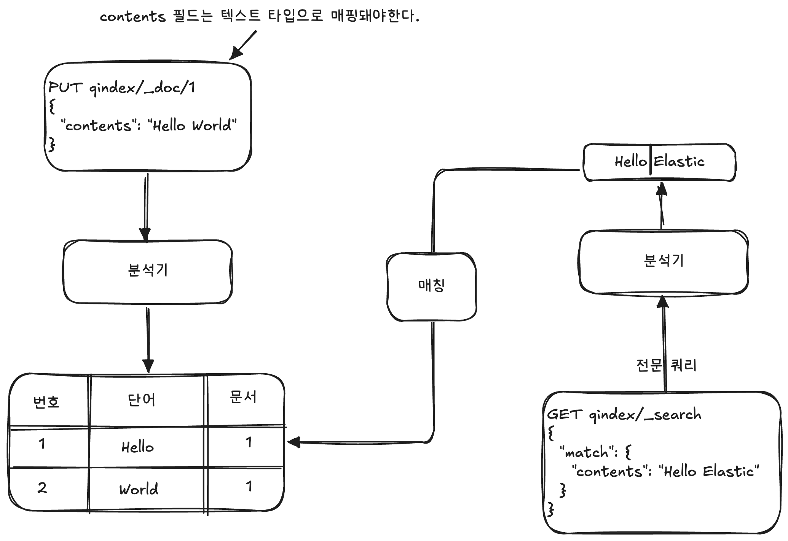
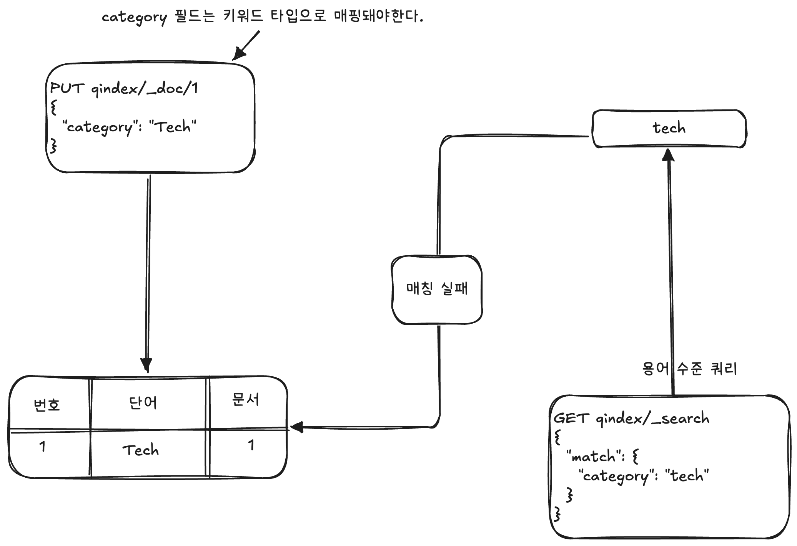

# 🧑🏻‍💻 Elasticsearch 쿼리

---

- [✅ 전문 쿼리](#-전문-쿼리)
- [✅ 용어 수준 쿼리](#-용어-수준-쿼리)

> [!TIP]
> Elasticsearch의 검색은 크게 쿼리 컨텍스트(Query Context)와 필터 컨텍스트(Filter Context)로 구분된다.  
> - 쿼리 컨텍스트: 질의에 대한 유사도를 계산해 이를 기준으로 더 정확한 결과를 먼저 보여준다.
> - 필터 컨텍스트: 유사도를 계산하지 않고 일치 여부에 따른 결과만을 반환한다.
>   - 스코어를 계산하지 않기 때문에 전체적인 쿼리 속도를 올릴 수 있다.
>   - 스코어 계산을 하지 않기 때문에 ➡ 결과에 대한 업데이트가 매번 수행될 피룡가 없어 캐시를 이용할 수 있다.

<br>

```json
// 쿼리 컨텍스트 실행
GET kibana_sample_data_ecommerce/_search
{
  "query": {
    "match": {
      "category": "clothing"
    }
  }
}
```

```json
// 결과
...
},
"hits": {
  "total": {
      "value": 3927,
      "relation": "eq"
  },
  "max_score": 0.20545526,
  "hits": [
    {
        "_index": "kibana_sample_data_ecommerce",
        "_id": "H-6H-J0Bh0KE5oDrQUsZ",
        "_score": 0.20545526,
        "_source": {
            "category": [
              "Men's Clothing"
            ],
            "currency": "EUR",
            "customer_first_name": "Eddie",
            "customer_full_name": "Eddie Underwood",
            "customer_gender": "MALE",
            "customer_id": 38,
            "customer_last_name": "Underwood",
            "customer_phone": "",
            "day_of_week": "Monday",
            "day_of_week_i": 0,
            "email": "eddie@underwood-family.zzz",
            "manufacturer": [
              "Elitelligence",
...
```

<br>

```json
// 필터 컨텍스트 실행
GET kibana_sample_data_ecommerce/_search
{
  "query": {
    "bool": {
      "filter": {
        "term": {
          "day_of_week": "Friday"
        }
      }
    }
  }
}
```
```json
// 결과
"hits": {
    "total": {
        "value": 770,
        "relation": "eq"
    },
    "max_score": 0,
    "hits": [
        {
            "_index": "kibana_sample_data_ecommerce",
            "_id": "Ne6H-J0Bh0KE5oDrQUsZ",
            "_score": 0,
            "_source": {
                "category": [
                    "Women's Shoes",
                    "Women's Clothing"

```

<br>

> [!NOTE]
> Elasticsearch의 검색을 위한 쿼리는 다음과 같이 나뉠 수 있다.
> - 리프 쿼리(leaf query): 특정 필드에서 용어를 찾는 쿼리
>   - match 쿼리
>   - term 쿼리
>   - range 쿼리
> - 복합 쿼리(compound query): 쿼리를 조합해 사용되는 쿼리
>   - bool(논리) 쿼리

<br>

## ✅ 전문 쿼리

---

> [!NOTE]
> 전문 검색을 하기 위해 사용되며, 전문 검색을 할 필드는 인덱스 매핑 시 텍스트 타입으로 매핑해야 한다.

<br>




> [!NOTE]
> 텍스트 타입으로 매핑된 문자열은 분석기에 의해 [Hello, World]로 토큰화된다.  
> 검색어인 "Hello Elastic" 역시 분석기에 의해 분리되어 [Hello, Elastic]으로 토큰화된다.  
> 전문 쿼리는 일반적으로 블로그처럼 텍스트가 많은 필드에서 특정 용어를 검색할 때 사용된다.

<br>

> [!IMPORTANT]
> 매치 쿼리에서 토큰으로 인해 나누어진 용어들 간 공백은 기본적으로 OR로 인식한다.  
> AND를 사용하고 싶다면 `operator` 파라미터를 변경하면 된다.

```json
GET kibana_sample_data_ecommerce/_search
{
  "_source": ["customer_full_name"],
  "query": {
    "match": {
      "customer_full_name": {
        "query": "mary bailey",
        "operator": "and"
      }
    }
  }
}
```

```json
// 결과
{
  "took": 12,
  "timed_out": false,
  "_shards": {
    "total": 1,
    "successful": 1,
    "skipped": 0,
    "failed": 0
  },
  "hits": {
    "total": {
      "value": 3,
      "relation": "eq"
    },
    "max_score": 9.155506,
    "hits": [
      {
        "_index": "kibana_sample_data_ecommerce",
        "_id": "IO6H-J0Bh0KE5oDrQUsZ",
        "_score": 9.155506,
        "_source": {
          "customer_full_name": "Mary Bailey"
        }
      },
      {
        "_index": "kibana_sample_data_ecommerce",
        "_id": "u-6H-J0Bh0KE5oDrQUsZ",
        "_score": 9.155506,
        "_source": {
          "customer_full_name": "Mary Bailey"
        }
      },
      {
        "_index": "kibana_sample_data_ecommerce",
        "_id": "eu6H-J0Bh0KE5oDrRFqw",
        "_score": 9.155506,
        "_source": {
          "customer_full_name": "Mary Bailey"
        }
      }
    ]
  }
}
```

<br>

## ✅ 용어 수준 쿼리

---

> [!NOTE]
> 용어 수준 쿼리는 정확히 일치하는 용어를 찾기 위해 사용되며, 인덱스 매핑 시 필드를 키워드 타입으로 매핑해야 한다.



<br>

**참고 자료**  
[엘라스틱 스택 개발부터 운영까지](https://product.kyobobook.co.kr/detail/S000001932755)