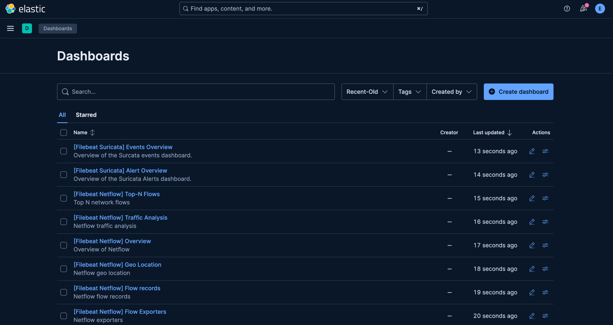

# 💻 Elastic Search 설치 및 실행

## ✅ 다운로드
Download URL: https://www.elastic.co/kr/downloads/elasticsearch  
→ 참고로 내 맥 환경을 알고 싶다면?
```text
$ arch
arm64 # 결과
```

<br>

→ elasticsearch-9.1.2-darwin-aarch64.tar.gz 압축 파일이 다운로드 된다.  
압축 풀기  
```text
$ tar -xvf elasticsearch-9.1.2-darwin-aarch64.tar.gz
```

<br>

## ✅ 실행
그리고 이렇게 하면 실행이 된다.  
```text
$ ./elasticsearch-9.1.2/bin/elasticsearch
```

그리고.. Elasticsearch 8.x 이상부터는 기본적으로 HTTPS(SSL/TLS)만 허용한다.  
따라서 https://localhost:9200 으로 들어가야 정상 접속된다.  

<br>

  

갑자기 사용자 이름이랑 비밀번호를 입력하라고 뜬다.  
처음에 엘라스틱 서치를 실행시켰을 때 `user` 와 `password`를 알려준다.  
초기 `user`는 `elastic`이고, 비밀번호는 까먹지 않게 기록해두면 좋다.  
아니면 비밀번호를 재설정할 수 있다.  
```text
./elasticsearch-9.1.2/bin/elasticsearch-reset-password -u elastic
```

<br>

다음과 같이 뜨면 성공이다.  


<br>

### 🚫 `libvec.dylib` 네이티브 라이브러리 불러오지 못하는 에러
Mac OS arm64 환경에서 elasticsearch를 실행하다보면 `libvec.dylib`를 mac에서 자동으로 차단했다는 경고가 뜬다.  
이것을 해결하지 않으면 `zstd` 네이티브 라이브러리 초기화가 실패돼서 추후에 파일비트 연결할 때 `NullPointerException`이 발생하게 된다.

<br>

**`Gatekeeper` 허용 처리**를 해보자.  
```shell
# 보안 격리 해제 (Gatekeeper quarantine 제거)
cd /Users/kyeongchanwoo/elasticsearch-9.1.4/lib/platform/darwin-aarch64
xattr -d com.apple.quarantine libvec.dylib
xattr -d com.apple.quarantine libzstd.dylib
```
`xattr -l 파일명` 하면 현재 보안 속성이 걸려있는지 확인할 수 있다.
> `xattr`: 확장속성  
> `-d`: 특정 속성 제거


<br>

```shell
# 재서명 (codesign)
codesign --force --deep --sign - libvec.dylib
codesign --force --deep --sign - libzstd.dylib
```
> `codesign`: 서명을 하는 명령어  
> `--force`: 이미 서명된 파일을 강제로 다시 서명한다.  
> `--deep`: 앱 번들 내의 모든 하위 구성요소를 재귀적으로 서명한다.  

그 후 Elasticsearch 재시작을 하면 경고창이 뜨지 않는다.


# 💻 Kibana 설치 및 실행
## ✅ 다운로드
Download URL: https://www.elastic.co/downloads/kibana

<br>

마찬가지로 압축을 풀고, 홈 화면에 kibana 폴더가 있다는 전제하에 다음과 같은 명령어를 실행시키면 된다.  
그 다음, localhost:5601 에 접속하면 된다.  
단, elastic search 가 구동 중일 때 실행해야 한다.  
```text
$ ./kibana-9.1.3/bin/kibana
```

<br>

참고로, enrollment token을 요구하는데, 이건 elastic search 를 처음 구동시킨 후 30분 이내에 사라진다.  
새로 토큰을 발급받기 위해서는 하기의 명령어를 입력한다.  
```text
./elasticsearch-9.1.2/bin/elasticsearch-create-enrollment-token -s kibana
```

그 다음 코드를 입력하라고 뜨는데, 키바나를 실행시킨 터미널 창에 localhost:5601?code=000000 → 이런식으로 6자리 코드를 준 상태일텐데, 이것을 입력하면 된다.  
  
마지막으로, 로그인을 하라고 하는데, 위에 elastic search를 로그인할 때와 마찬가지로 user: elastic, password: 발급 받은 비밀번호를 입력하면 된다.  

그럼 이렇게 화면 접속에 성공한다.  


<br>

### 🚫 에러 발생
Kibana 로컬 설치를 끝내고 다음날 기분 좋게 재접속하는데 안 되었다.  
에러 로그가 굉장히 많았는데, 이게 핵심이다.  
```text
[ERROR][elasticsearch-service] Unable to retrieve version information from Elasticsearch nodes. Request timed out
```  
ElasticSearch에 연결이 안되는 것인데, kibana.yml을 수정해주면 된다.

<br>

```text
cd kibana-9.1.3/config
vi kibana.yml
```

<br>

그러면 `elasticsearch.hosts:`의 값이 셋팅이 되어있을텐데, 일단 로컬 환경에서 공부가 목적이라면 해당 셋팅은 주석처리하고, 다음과 같이 작성하고 재실행하니 해결되었다.  

```text
#elasticsearch.hosts: [https://XXX.XXX.XX.X:9200]
elasticsearch.hosts: [https://localhost:9200]
```

<br>

# 💻 logstash 에서 elasticsearch 출력 플러그인 연결
- Mac 환경  
- elasticsearch: 9.1.2 버전    
- logstash: 9.1.3 버전  

<br>

**`logstash-test.conf`** 파일 작성  
> logstash-test.conf 파일 위치: /logstash-9.1.3/config
```text
input {
  file {
    path => "{원하는 디렉토리 위치}/logstash-9.1.3/config/filter-example.log"
    start_position => "beginning"
    sincedb_path => "/dev/null"
  }
}

output {
  file {
    path => "{원하는 디렉토리 위치}/logstash-9.1.3/config/output.json"
  }
  elasticsearch {
    hosts => ["https://127.0.0.1:9200"]
    index => "output"
    user => "elastic"
    password => "비밀번호"
    ssl_enabled => true
    ssl_certificate_authorities => ["{원하는 디렉토리 위치}/elasticsearch-9.1.2/config/certs/http_ca.crt"]
  }
}
```

<br>

이후 logstash를 다음의 명령어와 함께 실행한다.  
```shell
$ ./logstash-9.1.3/bin/logstash -f config/logstash-test.conf
```  

<br>

다음과 같이 엘라스틱서치 output 인덱스를 확인할 수 있다.
```shell
$ curl -kX GET https://localhost:9200/output -u elastic:비밀번호
```  
결과  
```json
{"output":{"aliases":{},"mappings":{"properties":{"@timestamp":{"type":"date"},"@version":{"type":"text","fields":{"keyword":{"type":"keyword","ignore_above":256}}},"event":{"properties":{"original":{"type":"text","fields":{"keyword":{"type":"keyword","ignore_above":256}}}}},"host":{"properties":{"name":{"type":"text","fields":{"keyword":{"type":"keyword","ignore_above":256}}}}},"log":{"properties":{"file":{"properties":{"path":{"type":"text","fields":{"keyword":{"type":"keyword","ignore_above":256}}}}}}},"message":{"type":"text","fields":{"keyword":{"type":"keyword","ignore_above":256}}}}},"settings":{"index":{"routing":{"allocation":{"include":{"_tier_preference":"data_content"}}},"number_of_shards":"1","provided_name":"output","creation_date":"1757751555078","number_of_replicas":"1","uuid":"rEp-EdDWQW6cTY-P_LFytQ","version":{"created":"9033000"}}}}}
```

<br>

그리고 {원하는 디렉토리 위치}/logstash-9.1.3/config에 들어가보면 `output.json` 파일이 생성된 것도 확인할 수 있다.  
```shell
$ cd ~/logstash-9.1.3/config
$ ls -arlth


# 결과 중 하나
2.1K  9 13 17:19 output.json
```


<br>

# 💻 파일 비트 셋업
파일 비트를 설치하고 압축해제를 한 뒤, `filebeat.yml`을 다음과 같이 수정해준다.
```yml
# ============================== Filebeat inputs ===============================

filebeat.inputs:

  # Each - is an input. Most options can be set at the input level, so
  # you can use different inputs for various configurations.
  # Below are the input-specific configurations.

  # filestream is an input for collecting log messages from files.
  
  # log로 하면 deprecated 되었다고 뜬다.
- type: filestream

  # Unique ID among all inputs, an ID is required.
  id: my-filestream-id

  # Change to true to enable this input configuration.
  enabled: true

  # Paths that should be crawled and fetched. Glob based paths.
  paths:
    - /Users/kyeongchanwoo/elasticsearch-9.1.2/logs/*.log

# =================================== Kibana ===================================
setup.kibana:

  # Kibana Host
  # Scheme and port can be left out and will be set to the default (http and 5601)
  # In case you specify and additional path, the scheme is required: http://localhost:5601/path
  # IPv6 addresses should always be defined as: https://[2001:db8::1]:5601
  host: "localhost:5601"

# ---------------------------- Elasticsearch Output ----------------------------
output.elasticsearch:
  # Array of hosts to connect to.
  hosts: ["localhost:9200"]

  # Performance preset - one of "balanced", "throughput", "scale",
  # "latency", or "custom".
  preset: balanced

  # Protocol - either `http` (default) or `https`.
  protocol: "https"

  # Authentication credentials - either API key or username/password.
  #api_key: "id:api_key"
  username: "elastic"
  password: "패스워드"
  ssl.certificate_authorities: ["/Users/kyeongchanwoo/elasticsearch-9.1.2/config/certs/http_ca.crt"]
```

<br>

그리고 다음과 같이 setup 옵션을 실행시켜준다.(물론 엘라스틱서치와 키바나도 모두 실행시킨 상태여야한다)  
```shell
Kyeongchanui-MacBookPro:filebeat-9.1.3-darwin-aarch64 kyeongchanwoo$ ./filebeat setup -e
```
> -e는 모니터에 오류나 로그를 보여주는 옵션이다.

<br>

성공하면 로그의 마지막에 `Loaded Ingest pipelines`가 뜬다.

<br>

키바나의 Dashboards 는 다음과 같이 된다.  


<br>


**참고 자료**  
[엘라스틱 스택 개발부터 운영까지](https://product.kyobobook.co.kr/detail/S000001932755)