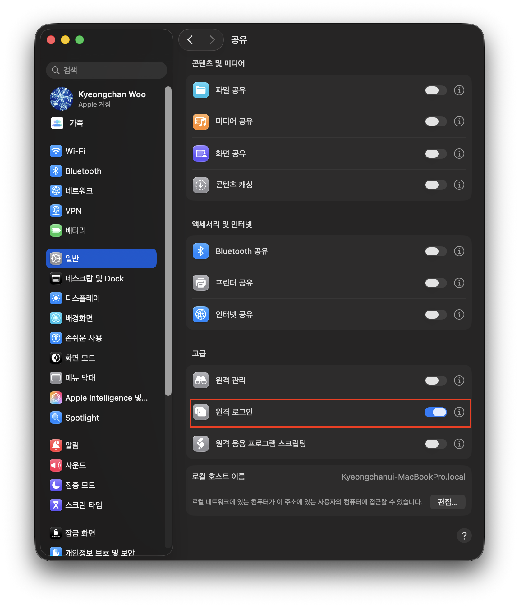

# 🧑🏻‍💻 하둡 설치 가이드
```shell
# homebrew 자체 최신화
$ brew update

# 하둡 설치
$ brew install hadoop
```

<br>

하둡을 실행할 때 기본 파일 시스템을 하둡으로 설정하기 위해 `fs.defaultFS` 값을 `hdfs://localhost:9000`으로 설정하여 실행한다.  
하둡 경로의 `core-site.xml`에 다음과 같이 옵션을 넣으면 된다.  
경로: `/opt/homebrew/Cellar/hadoop/3.4.2(버전)/libexec/etc/hadoop`

```xml
<configuration>
    <property>
        <name>fs.defaultFS</name>
        <value>hdfs://localhost:9000</value>
    </property>
</configuration>
```

<br>

### 🧑🏻‍💻 하둡 실행
먼저, Mac에서는 ssh 클라이언트만 떠있지, ssh 서버는 떠있지 않은데, Hadoop은 로컬이든, 분산이든 무조건 SSH로 데몬을 띄운다.  
따라서 SSH 서버를 먼저 띄워야 한다.  
그러기 위해서는 아래와 같이 원격 로그인을 활성화 하고, 그러면 SSH 서버가 활성화된다.  
  

```shell
# 이렇게 SSH 서버가 켜졌는지 확인할 수 있다.
$ ssh localhost
```

<br>

```shell
# SSH 키 생성
# 쭉 그냥 엔터
# ed25519는 SSH 키를 만들 때 사용하는 암호 알고리즘 이름이다.
$ ssh-keygen -t ed25519 -C "hadoop-local"

# 내 계정만 허용
$ cat ~/.ssh/id_ed25519.pub >> ~/.ssh/authorized_keys
$ chmod 600 ~/.ssh/authorized_keys

# 비밀번호 입력하지 않고도 테스트 가능
$ ssh localhost
```

```shell
# 원격 로그인 보안 강화를 위해 /etc/ssh/sshd_config 수정
$ sudo vi /etc/ssh/sshd_config
```
```text
# root 로그인 허용 X
PermitRootLogin no
# 비밀번호 로그인 허용 X
PasswordAuthentication no
ChallengeResponseAuthentication no
# 내 계정만 허용
UsePAM yes
AllowUsers kyeongchanwoo
```

<br>

```shell
# 적용
$ sudo launchctl stop com.openssh.sshd
$ sudo launchctl start com.openssh.sshd
```

<br>

```shell
# 하둡 실행
$ start-dfs.sh
```

```shell
# 하둡 종료
$ stop-dfs.sh
```

사용 다 했으면 위에서 설정했던 원격 로그인 종료도 해둔다.  
  


