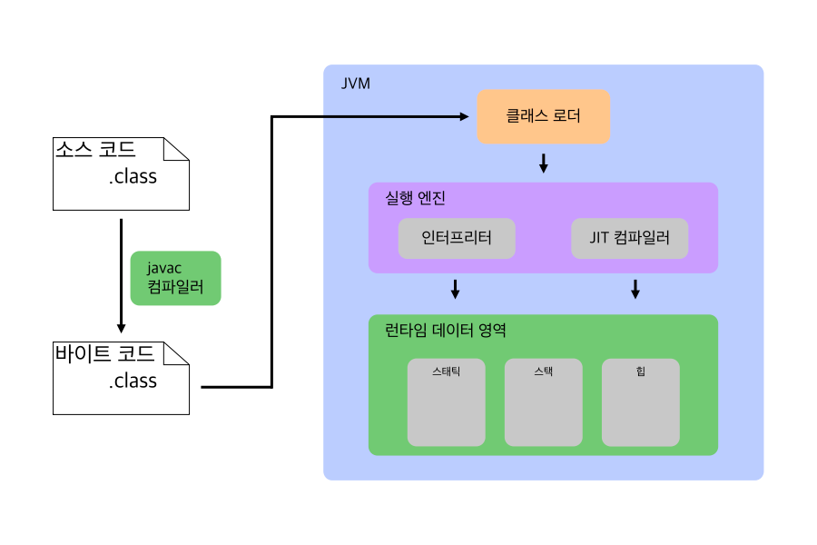
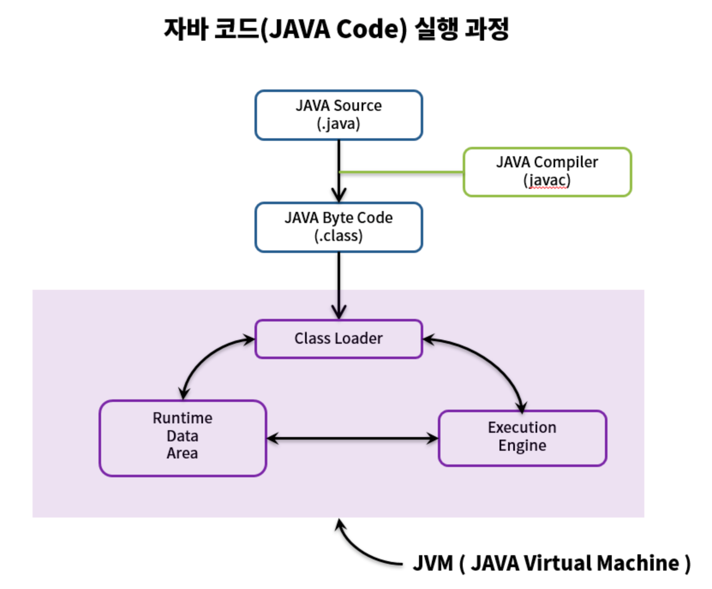

# ⭐️ Java 컴파일 과정
> Java는 OS에 독립적인 특성을 가지고 있다. 그게 가능한 이유는 JVM(Java Virtual Machine) 때문이다.
### ✍🏻 용어 정리
1. 컴파일: 원시코드(소스코드)를 컴퓨터가 이해할 수 있는 목적코드(바이트코드, 기계어)로 바꿔주는 것
2. 링크: 목적코드를 실행파일로 바꿔주는 것
3. 빌드: 소스코드 파일을 하나의 실행파일로 만들어주는 과정을 말하며, 컴파일과 링크 과정을 포함하는 개념이다.

## 💡 Java의 컴파일과 실행과정


1. 작성된 소스코드를 `Java 컴파일러`가 `JVM(자바가상머신)`이 이해할 수 있는 `바이트코드(.class)`로 변환한다.
   - `바이트코드(.class)`는 아직 컴퓨터가 읽을 수 없는 `JVM`이 읽을 수 있는 코드다.
2. 컴파일된 바이트코드를 `JVM` 내부의 `Class Loader`가 가져와 동적 로딩 및 링크를 하여 `JVM 메모리` 상에 적재한다.
   - `JVM 메모리`는 구체적으로 `런타임 데이터 영역(Runtime Data Area의 Method Area)`라고 보면 된다.
3. `JVM 메모리`에 적재된 바이트코드를 `실행엔진`을 통해 실행한다. 이때 `실행엔진`은 두 가지 방식으로 변경한다.
   - `인터프리터`: 바이트코드 명령어를 **하나씩 읽어서 해석**하고 실행한다. 하나하나의 실행은 빠르나, 전체적인 실행 속도가 느리다는 단점을 가진다.
   - `JIT컴파일러`: 인터프리터의 단점을 보완하기 위해 도입된 방식으로, **바이트코드 전체를 컴파일하여 바이너리 코드로 변경**하고, 이후에는 해당 메서드를 더이상 인터프리팅하지 않고 바이너리 코드로 직접 실행하는 방식이다. 전체적인 실행속도는 인터프리팅 방식보다 빠르다.

## 💡 Java 클래스 로더
> 동적 로딩은 `로딩` - `링크` - `초기화` 과정을 거쳐 명령을 실행한다.

**로딩**  
- 바이트코드를 메서드 영역에 적재한다.
- `JVM`은 메서드 영역에 읽어온 바이트 코드들의 정보를 저장한다.
  - 로드된 클래스와 그 부모 클래스 정보
  - 클래스 파일과 Class, Interface, Enum 관련 여부
  - 변수나 메서드 정보

**링크**
- 검증: 읽어온 클래스가 Java 및 JVM 명세에 명시된 대로 잘 구성됐는지 검사한다.
- 준비: 클래스가 필요로 하는 메모리를 할당하고 정의된 클래스, 인터페이스, 필드, 메서드를 나타내는 데이터 구조를 준비한다.
- 분석: 심볼릭 메모리 레퍼런스를 메서드 영역 내 실제 레퍼런스로 바꾼다.

**초기화**
- 클래스 변수들을 적절한 값으로 초기화한다. -> 정적 필드를 설정된 값으로 초기화한다.

### ✅ 종류
1. **부트스트랩 클래스 로더(Bootstrap Class Loader)**
   - 클래스 로더 계층 구조 상 최상의 계층 클래스 로더.
   - Java 클래스를 로드할 수 있는 Java 자체의 클래스 로더와 Object 클래스를 로드한다.
   - 구체적으로
     - ~ Java8
       - `/jre/lib/rt.jar`와 기타 핵심 라이브러리 등 JDK 내부 클래스를 로드한다.
     - Java 9 ~
       - `/rt.jar`가 `/lib` 내에 모듈화되어 포함되어 Java 자체의 클래스 로더만 로드한다.
2. **확장 클래스 로더(Extension Class Loader) -> Java 9부터 Platform Class Loader로 변경**
   - 부트스트랩 클래스 로더의 자식 클래스 로더
   - 확장 Java 클래스를 로드한다.
3. **시스템 클래스 로더 System Class Loader**
   - 사용자가 지정한 `${CLASSPATH}`의 클래스를 로드한다.
4. **사용자 정의 클래스 로더 User-Defined Class Loader**
   - 클래스 로더 중 최하위 계층으로, 애플리케이션 레벨에서 사용자가 직접 정의하고 생성한 클래스 로더

### ✅ 동작 방식
새로운 클래스를 로드할 경우
1. 메서드 영역에 클래스가 적재되어있는지 확인한다.
2. 메서드 영역에서 찾을 수 없는 경우, `시스템 클래스 로더`에 요청하고 `시스템 클래스 로더`는 `확장 클래스 로더`에 요청을 넘긴다.
3. `확장 클래스 로더`는 `부트스트랩 클래스 로더`에 요청을 넘기고, `부트스트랩 클래스 로더`는 `부트스트랩 경로(/jre/lib)`에 해당 클래스가 존재하는지 확인한다.
4. 클래가 없다면 다시 `확장 클래스 로더`로 요청을 넘기고 `확장 클래스 로더`는 `확장 경로(/jre/lib/ext)`에서 찾아본다.
5. `확장 클래스 로더`에서도 찾을 수 없다면 `시스템 클래스 로더`가 `시스템 경로`에서 찾는다. 이때 찾을 수 없다면 `ClassNotFoundException`을 발생시킨다.

### ✅ 클래스 로더 3원칙
1. 위임 원칙
   - 클래스 로더는 리소스를 찾을 때 상위 클래스 로더로 요청을 위임한다.
2. 가시 범위 원칙
   - 하위 클래스 로더는 상위 클래스 로더가 로드한 클래스를 알 수 있지만 상위 클래스 로더는 하위 클래스 로더가 로드한 클래스를 알 수 없다.
   - 상위 클래스 로더에서 로드한 클래스를 하위 클래스 로더가 사용할 수 있다.
3. 유일성 원칙
   - 하위 클래스 로더 상위 클래스 로더가 로드한 클래스를 다시 로드하면 안 된다.
   - 위임 원칙으로 고유한 클래스 로딩을 보장할 수 있다.

### ✅ 동적 로딩
1. **로드타임 동적 로딩**
```java
public class HelloWorld {
    public static void main(String[] args) {
        System.out.println("hello world.");
    }
}
```
- 클래스 로더는 `Object` 클래스와 `HelloWorld` 클래스를 읽고
- 로딩하기 위해 필요한 `String`, `System` 클래스를 로딩한다.
- 여기서 모든 클래스는 `HelloWorld` 클래스가 실행되기 전 로드타임에 동적으로 로드된다.

2. **런타임 동적 로딩**
클래스 로딩을 확인해보려면 터미널을 열고 다음 명령어를 입력해보면 된다.
```text
java classpath ${바이트코드 경로} -verbose:class ${메인클래스 명}
// ex) java classpath ./out/production/hello-world verbose:class Main
```

### ✅ 동적로딩의 장점과 단점
1. **장점**
   - 런타임 전가지 메모리 낭비를 막을 수 있다.
     - 사실 런타임 전까지, 해당 클래스가 사용되는 시점까지 정보를 알 수 없다.
2. **단점**
   - 런타임에어를 조기에 발견하기 어렵다.
     - 실행문이 실행되는 시점까지 가서야 발견할 수 있다.
   - 동적로딩에도 시간비용이 발생하기 때문에 성능저하로 이어질 수 있다.


## ⭐️ Java 실행 엔진
### ✅ 인터프리터(Interpreter)
- 인터프리터는 런타임 시에 JVM 메모리에 올라온 바이트코드를 한 문장씩 실행하는 바이트코드도 기계어가 아니기 때문에 매번 `변환 - 실행` 과정을 거친다.
- 이때문에 C언어처럼 미리 기계어로 컴파일되고 실행하는 언어에 비해 실행 속도가 느려지게 된다.
- 다음과 같은 코드가 있다면 `value++;` 실행문을 10만번 읽고 매번 번역하는 셈이다.
```java
int value = 0;
while (value < 100_000) {
    value++; // 10만번 value++; 실행문을 변환하고 실행한다.    
}
```
### ✅ JIT 컴파일러(Just In Time Compiler)
- 앞서 설명한 인터프리터는 바이트코드를 실행하기 위해 이미 실행했던 실행문도 다시 읽고 번역하는 과정을 거치기 때문에 **프로그램 실행 속도를 저하시킬 수 있다는 치명적인 단점**을 가지게 된다.
- 이런 문제점을 보완하기 위해 고안된 것이 바로 `JIT 컴파일러`다.
- 바이트코드 중 빈번하게 접근하는 영역에 대해 런타임 중 기계어로 컴파일하고 컴파일된 명령어를 캐싱해 같은 부분이 호출되면 캐싱된 데이터로 실행한다.
- 이때, JIT 컴파일 과정은 별도의 스레드에서 진행된다.
> JVM은 미리 정의된 `컴파일 임계값`을 가지는데 바이트코드의 특정 영역에 대한 호출 횟수가 `컴파일 임계값`을 넘길 때 JIT 컴파일을 진행한다.
<br>
출처

[Java 컴파일 과정](https://github.com/devSquad-study/2023-CS-Study/blob/main/java/java_compile_sequence.md)  
[Java 클래스 로더](https://github.com/devSquad-study/2023-CS-Study/blob/main/java/java_class_loader.md)  
[[Java] 자바 컴파일 과정 & JVM 내부 구조](https://velog.io/@minseojo/Java-%EC%9E%90%EB%B0%94-%EC%BB%B4%ED%8C%8C%EC%9D%BC-%EA%B3%BC%EC%A0%95-JVM-%EB%82%B4%EB%B6%80-%EA%B5%AC%EC%A1%B0)