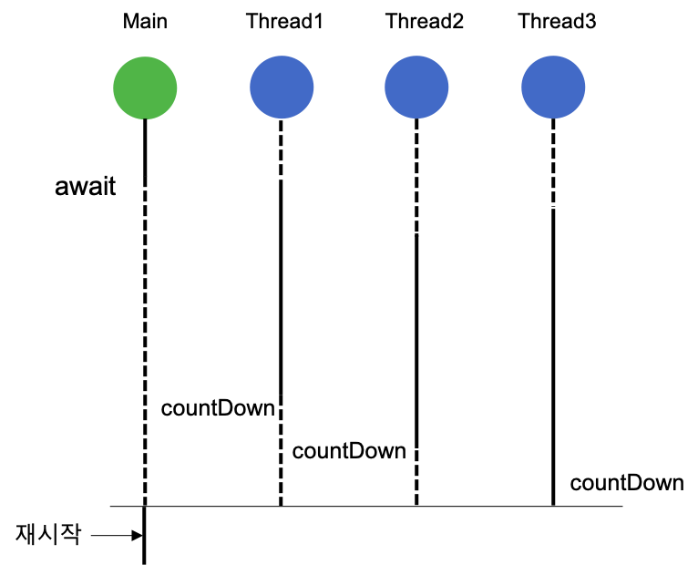
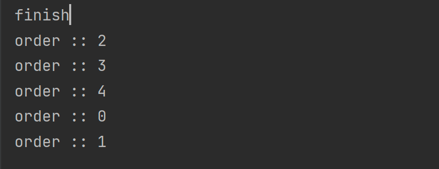
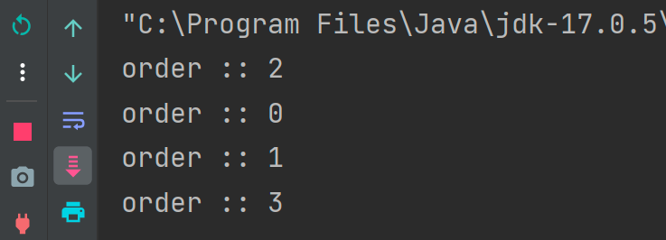
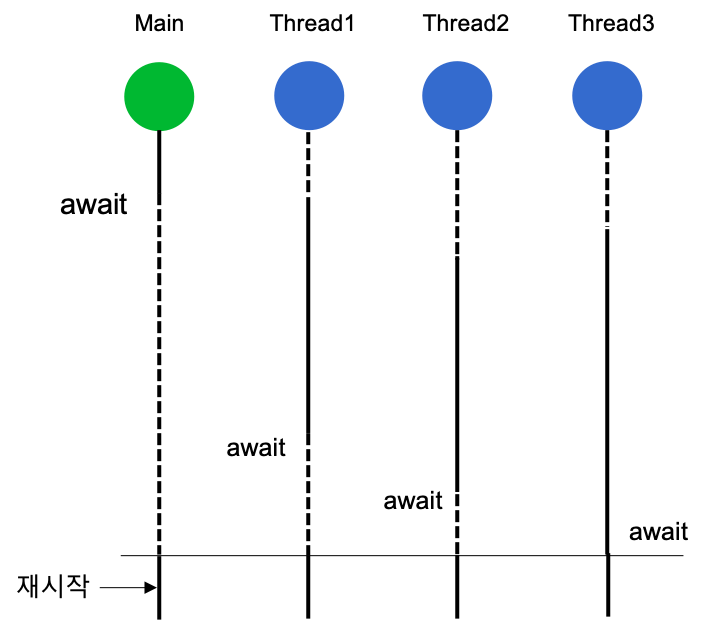
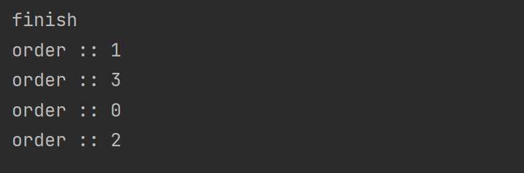

# ⭐️ CountDownLatch vs CyclicBarrier
> `CountDownLatch`와 `CyclicBarrier`는 쓰레드를 관리해주는 클래스다.

## ✅ CountDownLatch
> `CountDownLatch`는 어떤 쓰레드가 다른 쓰레드에서 작업이 완료될 때까지 기다릴 수 있도록 해주는 클래스다.

### 🤔 작동원리
Latch: 걸쇠를 의미한다.
1. 원하는 지점에서 `await()` 메서드를 호출하여 실행을 중단시킨다.
2. 다른 쓰레드들에서 원하는 횟수만큼 `countDown()` 메서드를 호출하여 코드가 진행된다.

```java
CountDownLatch countDownLatch = new CountDownLatch(5);
// 인자로 Latch의 숫자를 전달한다.

countDownLatch.countDown();
// 다음과 같이 countDown()을 호출하면 Latch의 숫자가 1씩 감소한다.

countDownLatch.await();
// Latch의 숫자가 0이 될 때까지 기다리는 코드다.
```
<br>

**예제**
```java
public class ExampleCountDownLatch {

    public static void main(String[] args) throws InterruptedException {
        CountDownLatch countDownLatch = new CountDownLatch(5);

        ExecutorService es = Executors.newFixedThreadPool(5);
        for(int i = 0; i<5; i++){
            int n = i;
            es.execute(() -> {
                countDownLatch.countDown();
                System.out.println("order :: " + n);
            });
        }

        countDownLatch.await();
        es.shutdown();
        System.out.println("finish");
    }
}
```

- `await()`를 통해 메인 쓰레드를 대기 상태로 바꾸고 다른 쓰레드를 실행하여 `countDown()`을 호출한다.
- `countDown()` 메서드를 5번 실행하지 않으면, `await()` 아래의 코드는 실행되지 않는다.

- 만약 위 코드의 for문을 4번으로 바꾸면 나오는 결과물이다.
- `await()` 아래의 코드가 실행되지 않으므로 종료되지 않는다.

## ✅ CyclicBarrier
- `CountDownLatch`와 비슷하지만 다른 쓰레드가 전부 대기 상태가 되었을 때 모든 쓰레드의 대기 상태가 해제가 되고 재사용이 가능해진다.
- `CyclicBarrier`도 `CountDownLatch`처럼 1이상의 인자를 받는다.
- 그리고 각 쓰레드에서 `await()` 메서드를 호출하면 쓰레드는 대기상태로 들어간다.
  - `await()`가 `count`만큼 호출되면, 대기 상태로 있던 쓰레드는 대기 상태가 해제된다.

```java
public class ExampleCyclicBarrier {

    public static void main(String[] args) throws InterruptedException, BrokenBarrierException {
        CyclicBarrier cyclicBarrier = new CyclicBarrier(5);

        ExecutorService es = Executors.newFixedThreadPool(4);
        for(int i = 0; i<4; i++){
            int n = i;
            es.submit(() -> {
                cyclicBarrier.await();
                System.out.println("order :: " + n);
                return 1;
            });
        }

        Thread.sleep(5000);
        cyclicBarrier.await();

        es.shutdown();
        System.out.println("finish");
    }
}
```

메인 쓰레드가 멈추면 다른 쓰레드가 동작을 하는데 각각의 쓰레드가 다 대기 상태에 들어가면 재귀함수처럼 마지막 대기에서부터 출력이 이루어진다.

출처  
[CountdownLatch vs CyclicBarrier](https://github.com/devFancy/2023-CS-Study/blob/main/java/java_countdownlatch_cyclicbarrier.md)