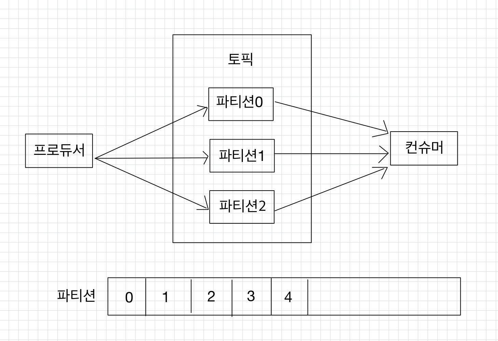
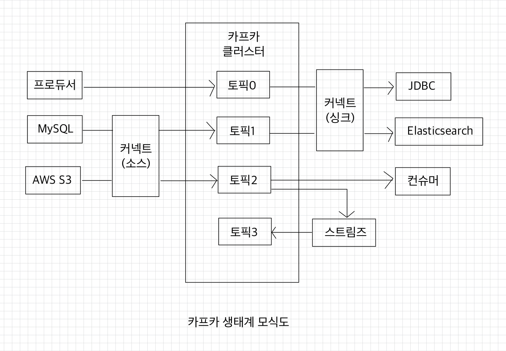
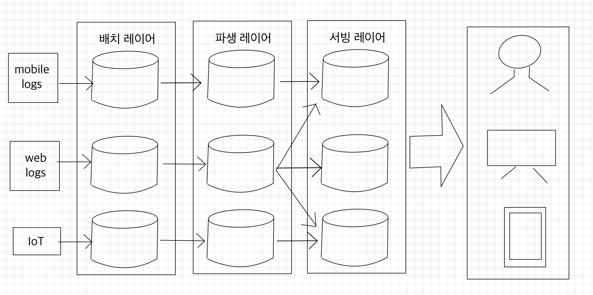
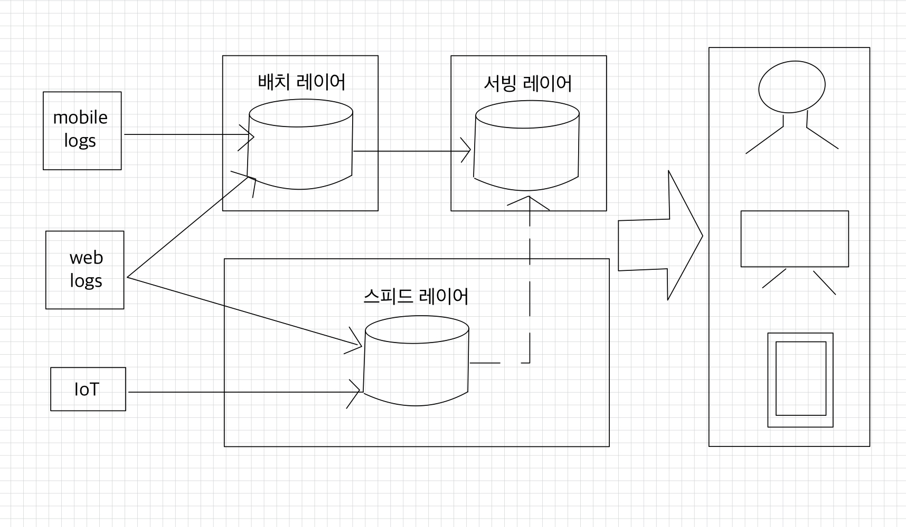
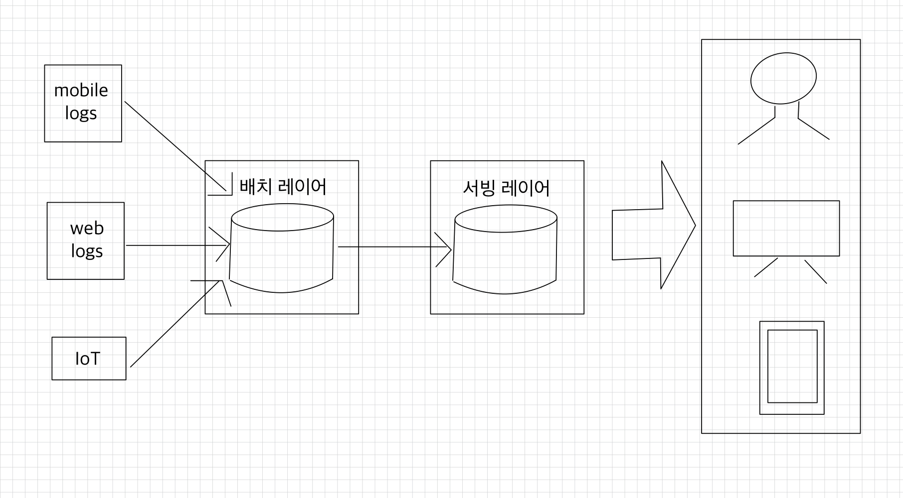
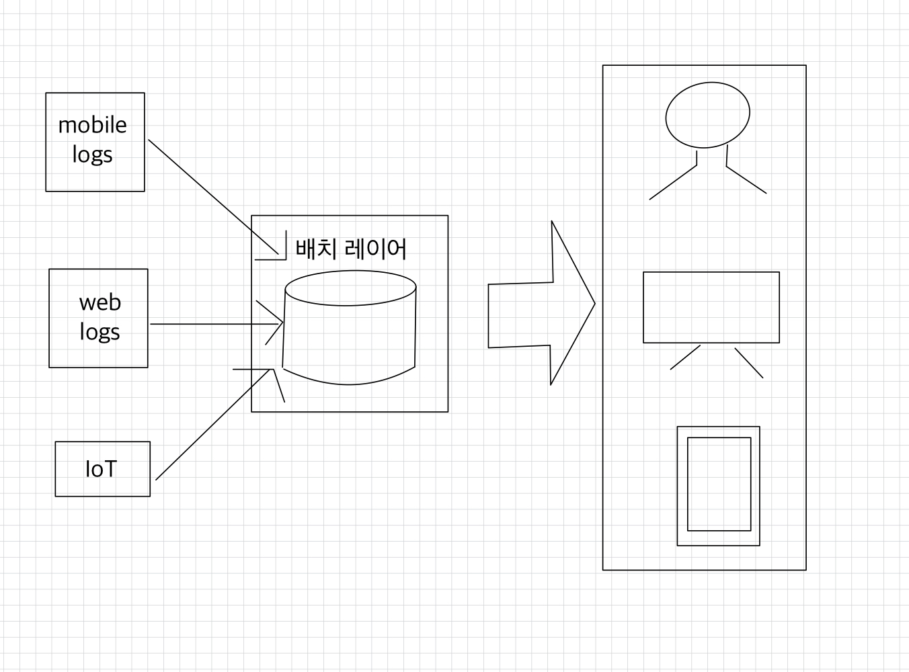

# 💻 캬프카
- [빅데이터 파이프라인에서 카프카의 역할](#-빅데이터-파이프라인에서-카프카의-역할)
  - [높은 처리량](#-높은-처리량)
  - [확장성](#-확장성)
  - [영속성](#-영속성)
  - [고가용성](#-고가용성)
- [데이터 레이크 아키텍처와 카프카의 미래](#-데이터-레이크-아키텍처와-카프카의-미래)

> 링크드인의 데이터 팀이 데이터 파이프라인의 복잡도를 낮추기 위해 만든 신규 시스템이다.  
> 카프카는 기업의 대용량 데이터를 수집하고 이를 사용자들이 실시간 스트림으로 소비할 수 있게 만들어주는 일종의 중추 신경으로 동작한다.

기존에 1:1 매칭으로 개발하고 운영하던 데이터 파이프라인은 커플링으로 인해 한쪽의 이슈가 다른 한쪽의 애플리케이션에 영향을 미쳤다.  
➡ 카프카를 사용하면 소스 애플리케이션에서 생성되는 데이터를 카프카에 일단 넣으면 된다.  

  
카프카 내부에 데이터가 저장되는 파티션의 동작은 FIFO 방식의 큐 자료구조와 유사하다.  
프로듀서: 큐에 데이터를 보내는 쪽  
컨슈머: 큐에서 데이터를 가져가는 쪽  

 

상용 환경에서 카프카는 최소 3대 이상의 서버(브로커)에서 분산 운영하여 프로듀서를 통해 전송받은 데이터를 파일 시스템에 안전하게 보관한다.  
서버 3대 이상으로 이루어진 카프카 클러스터 중 일부 서버에 장애가 발생하더라도 데이터를 지속적으로 복제하기 때문에 안전하게 운영할 수 있다.  
또한, 데이터를 묶음 단위로 처리하는 배치 전송을 통해 낮은 지연과 높은 데이터 처리량도 가지게 되었다.  

 

[💻 카프카 깃허브 저장소](https://github.com/apache/kafka)에서 다운로드하여 내부 동작을 확인할 수 있다.  
기능을 추가하거나 수정하고 싶다면 [KIP(Kafka Improvement Proposal)](http://bit.ly/3aKK2FF)를 통해 카프카를 발전하는 데 기여할 수 있다.  

 

## 💡 빅데이터 파이프라인에서 카프카의 역할
**빅데이터**  
현대의 IT 서비스는 디지털 정보로 기록되는 모든 것을 저장한다.  
쇼핑몰의 결제 내역, 방문한 위치 정보, 소셜 사이트에 남긴 댓글 등  
실시간으로 저장하는 데이터의 양은 최소 테라바이트(Terabyte, TB)를 넘어서 엑사바이트(Exabyte, EB)를 웃돈다.  
빅데이터로 적재되는 데이터 종류는 기존 데이터베이스에서도 사용하기 편리한 스키마(schema) 기반의 정형 데이터부터 일정한 규격이나 형태를 지니지 않은 비정형 데이터까지 있다.  
그림, 영상, 음성과 같은 데이터는 비정형 데이터 중 일부라고 볼 수 있다.  

 

**데이터 레이크(data lake)**  
빅데이터를 저장하고 활용하기 위해 일단 생성되는 데이터를 모두 모으는 개념  
데이터 웨어하우스(data warehouse)와 다르게 필터링되거나 패키지화되지 않은 데이터가 저장된다는 점이 특징이다.  
데이터 레이크로 데이터를 모으는 과정에서 데이터를 추출하고 변경, 적재하는 과정을 묶은 데이터 파이프라인을 구축해야하는데, 데이터 파이프라인을 안정적이고 확장성 높게 운영하기 위한 좋은 방법 중 하나가 바로 아파키 카프카를 활용하는 것이다.  

 

### ✅ 높은 처리량
카프카는 프로듀서가 브로커로 데이터를 보낼 때와 컨슈머가 브로커로부터 데이터를 받을 때 모두 묶어서 전송한다.  
동일한 양의 데이터를 보낼 때 네트워크 통신 횟수를 최소한으로 줄인다면 동일 시간 내에 더 많은 데이터를 전송할 수 있다.  
많은 양의 데이터를 묶음 단위로 처리하는 배치로 빠르게 처리할 수 있기 때문에 대용량의 실시간 로그데이터를 처리하는 데에 적합하다.  
또한, 파티션 단위를 통해 동일 목적의 데이터를 여러 파티션에 분배하고 데이터를 병렬 처리할 수 있다.  
➡ 파티션 개수만큼 컨슈머 개수를 늘려서 동일 시간당 데이터 처리량을 늘리는 것이다.

 

### ✅ 확장성
데이터 파이프라인에서 데이터를 모을 때 데이터가 얼마나 들어올지는 예측하기 어렵다.  
카프카는 가변적인 환경에서 안정적으로 확장 가능하도록 설계되어 있다.
- 데이터가 적을 때는 카프카 클러스터의 브로커를 최소한의 개수로 운영하다가 데이터가 많아지면 클러스터의 브로커 개수를 자연스럽게 늘려 스케일 아웃(scale-out)할 수 있다.  
- 데이터 개수가 적어지고 추가 서버들이 더는 필요없어지면 브로커 개수를 줄여 스케일 인(scale-in)할 수 있다.

➡ 카프카의 스케일 아웃, 스케일 인 과정은 클러스터의 무중단 운영을 지원하므로 365일 24시간 데이터를 처리해야 하는 커머스나 은행 같은 비즈니스 모델에서도 안정적인 운영이 가능하다.  

 

### ✅ 영속성
영속성이란 데이터를 생성한 프로그램이 종료되더라도 사라지지 않은 데이터의 특성을 뜻한다.  
카프카는 다른 메시징 플랫폼과 다르게 전송받은 데이터를 메모리에 저장하지 않고 파일 시스템에 저장한다.  
디스크 기반의 파일 시스템을 활용한 덕분에 브로커 애플리케이션이 장애 발를 인해 급작스럽게 종료되더라도 프로세스를 재시작하여 안전하게 데이터를 다시 처리할 수 있다.
> **🤔 파일 시스템에 데이터 적재하고 사용하는 것은 느리지 않을까?**  
> 카프카는 운영체제 레벨에서 파일 시스템을 최대한 활용하는 방법을 적용하였다.  
> 운영체제에서는 파일 I/O 성능 향상을 위해 페이지 캐시(page cache) 영역을 메모리에 따로 생성하여 사용한다.  
> 페이지 캐시란, OS에서 파일 입출력의 성능 향상을 위해 만들어 놓은 메모리 영역을 뜻한다.  
> 페이지 캐시 메모리 영역을 사용하여 한 번 읽은 파일 내용은 메모리에 저장시켰다가 다시 사용하는 방식이기 때문에 카프카가 파일 시스템에 저장하고 데이터를 저장, 전송하더라도 처리량이 높은 것이다.  
> 만약 페이지 캐시를 사용하지 않았다면 카프카에서 캐시를 직접 구현 ➡ 지속적으로 변경되는 데이터 때문에 가비지 컬렉션이 자주 일어나 속도가 현저히 느려질 것이다.

 

### ✅ 고가용성
3개 이상의 서버들로 운영되는 카프카 클러스터는 일부 서버에 장애가 발생하더라도 무중단으로 안전하고 지속적으로 데이터를 처리할 수 있다.  
클러스터로 이루어진 카프카는 데이터의 복제(replication)를 통해 고가용성의 특징을 가지게 되었다.  
이에 더하여 서버를 직접 운영하는 온프레미스(on-premise) 환경의 서버 랙 또는 퍼블릭 클라우드(public cloud)의 리전 단위 장애에도 데이터를 안전하게 복제할 수 있는 브로커 옵션들이 준비되어 있다.  
> **🤔 카프카 클러스터를 3대 이상의 브로커들로 구성해야 하는 이유**  
> 카프카를 안전하게 운영하기 위해 최소 3대 이상의 브로커로 클러스터를 구성할 것을 추천한다.  
> 카프카 클러스터를 구축할 때 브로커 개수의 제한은 없다.  
> - 1대로 운영할 경우: 브로커의 장애는 서비스 장애로 이어지게 되므로 테스트 목적으로만 사용
> - 2대로 운영할 경우: 브로커 간에 데이터가 복제되는 시간 차이로 인해 일부 데이터가 유실될 가능성이 있다.
> 
> 
> 유실을 막기 위해서는 `min.insync.replicas` 옵션을 2로 설정하면 최소 2개 이상의 브로커에 데이터가 완전히 복제됨을 의미한다.  
> 이 옵션을 2로 사용할 때는 3개 중 1개의 브로커에 장애가 나더라도 지속적으로 데이터를 처리할 수 있게 하기 위해서 브로커를 3대 이상으로 운영해야 한다. ➡ `min.insync.replicas` 옵션값보다 작은 수의 브로커가 존재할 때는 토픽에 더는 데이터를 넣을 수가 없다.

 

높은 처리량, 확장성, 영속성, 고가용성 특징을 가진 카프카는 데이터 파이프라인을 안전하고 확장성 높게 운영할 수 있도록 설계되었다.  
여기에 추가적으로 카프카 주변 생태계를 지탱하는 애플리케이션들은 카프카를 데이터 파이프라인으로 더욱 빠르게 적용시킬 수 있도록 도와준다.  

 

## 💡 데이터 레이크 아키텍처와 카프카의 미래
데이터 레이크 아키텍처의 2가지 종류
1. 람다 아키텍처(lambda architecture)
   - 레거시 데이터 수집 플랫폼을 개선하기 위해 구성한 아키텍처다.
   > 초키 빅데이터 플랫폼은 엔드 투 엔드로 각 서비스 애플리케이션으로부터 데이터를 배치로 모았다.  
     
   > - 데이터를 배치로 모으는 구조는 유연하지 못했으며 실시간으로 생성되는 데이터들에 대한 인사이트를 서비스 애플리케이션이 빠르게 전달하지 못하는 단점이 있다.
   > - 원천 데이터로부터 파생된 데이터의 히스토리를 파악하기 어려웠고, 계속되는 데이터의 가공으로 인해 데이터가 파편화되면서 데이터 거버넌스(data governance: 데이터 표준 및 정책)를 지키기 어려웠다.
   - 기존의 배치 데이터를 처리하는 부분 위에 스피드 레이어(speed layer)라고 불리는 실시간 데이터 ETL(extract, transform, load)작업 영역을 정의한 아키텍처가 바로 람다 아키텍처다.  
       
     - 배치 레이어: 배치 데이터를 모아서 특정 시간, 타이밍마다 일괄 처리한다.
     - 서빙 레이어: 가공된 데이터를 데이터 사용자, 서비스 애플리케이션이 사용할 수 있도록 데이터가 저장된 공간
     - 스피드 레이어: 서비스에서 생성되는 원천 데이터를 실시간으로 분석하는 용도로 사용된다.
       - 배치 데이터에 비해 낮은 지연으로 분석이 필요한 경우 사용
       - 스피드 레이어에서 가공, 분석된 실시간 데이터는 사용자 또는 서비스에서 직접 사용할 수 있지만 필요한 경우에는 서빙 레이어로 데이터를 보내서 저장하고 사용할 수 있다.
       - 람다 아키텍처에서 카프카는 스피드 레이어에 위치한다.
   - 데이터를 배치 처리하는 레이어와 실시간 처리하는 레이어를 분리하여 레이어가 2개로 나뉘기 때문에 생기는 단점이 있다.
     - 데이터를 분석, 처리하는 데에 필요한 로직이 2벌로 각각의 레이어에 따로 존재해야 한다는 점
     - 배치 데이터와 실시간 데이터를 융합하여 처리할 때는 다소 유연하지 못한 파이프라인을 생성해야 한다는 점
2. 카파 아키텍처(kappa architecture)
   - 람다 아키텍처와 유사하지만 배치 레이어를 제거하고 모든 데이터를 스피드 레이어에 넣어서 처리한다는 점이 다르다.  
       
     (위의 그림에서 배치 레이어가 아니라 스피드 레이어다. 오타다.)
   - 스피드 레이어에서 모든 데이터를 처리하므로 서비스에서 생성되는 모든 종류의 데이터를 스트림 처리해야 한다.

 

> 배치 데이터 vs 스트림 데이터  
> - 배치 데이터
>   - 초, 분, 시간, 일 등으로 한정된 기간 단위 데이터를 뜻한다.
>   - 배치 데이터를 일괄 처리(batch processing)하는 것이 특징이다.
>   - 인터넷 쇼핑몰에서 지난 1분 간 주문한 제품 목록, 2025년 신입생 목록
> - 스트림 데이터
>   - 한정되지 않은 데이터로 시작 데이터와 끝 데이터가 명확히 정해지지 않은 데이터를 뜻한다.
>   - 각 지점의 데이터는 보통 작은 단위(KB 단위)로 쪼개져 있으며 웹 사용자의 클릭 로그, 주식 정보, 사물 인터넷의 센서 데이터를 스트림 데이터로 볼 수 있다.

 

카파 아키텍처에서 서빙 레이어는 하둡 파일 시스템(HDFS), 오브젝트 스토리지(S3, minio 등)와 같이 데이터 플랫폼에서 흔히 사용되는 저장소이다.  
스피드 레이어로 사용되는 카프카에 분석과 프로세싱을 완료한 거대한 용량의 데이터를 오랜 기간 저장하고 사용할 수 있다면 서빙 레이어는 제거되어도 되고, 오히려 이중으로 관리되는 운영 리소스를 줄일 수 있다.  
  

 

**참고 자료**  
[아파치 카프카 애플리케이션 프로그래밍 with 자바](https://product.kyobobook.co.kr/detail/S000001842177)