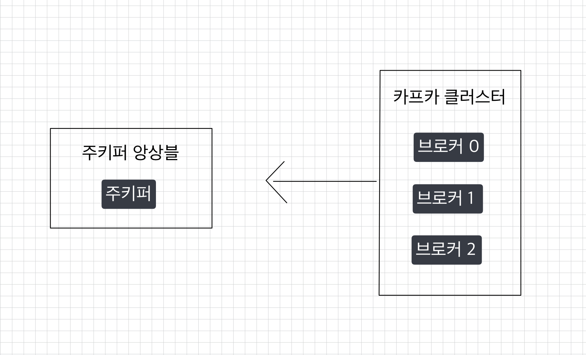
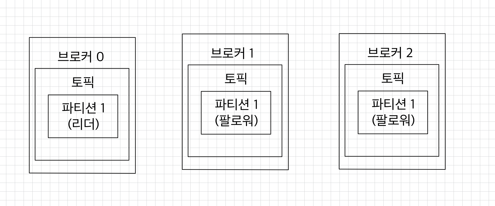
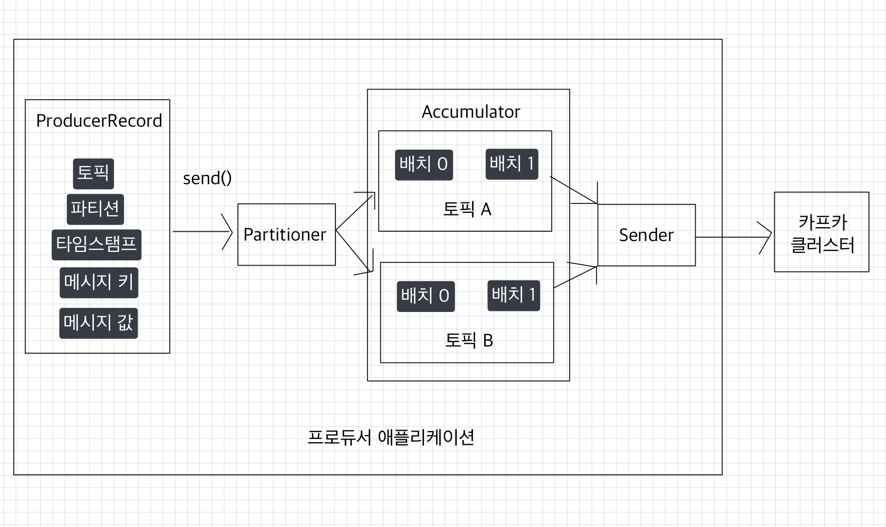
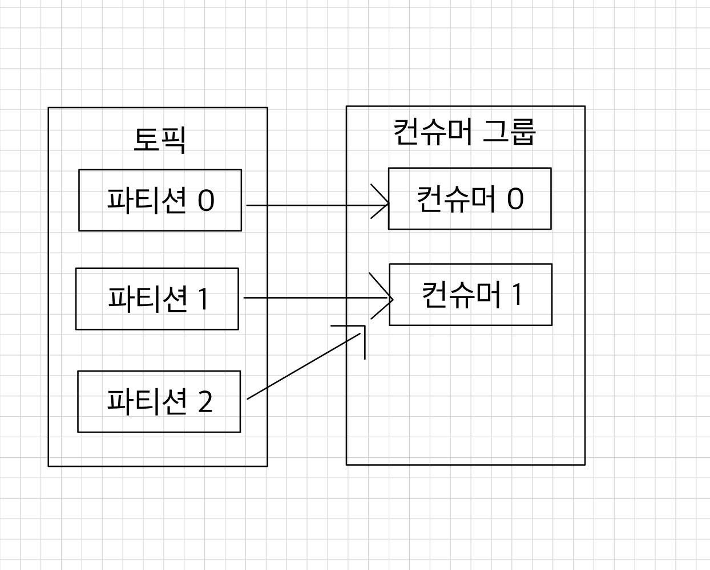
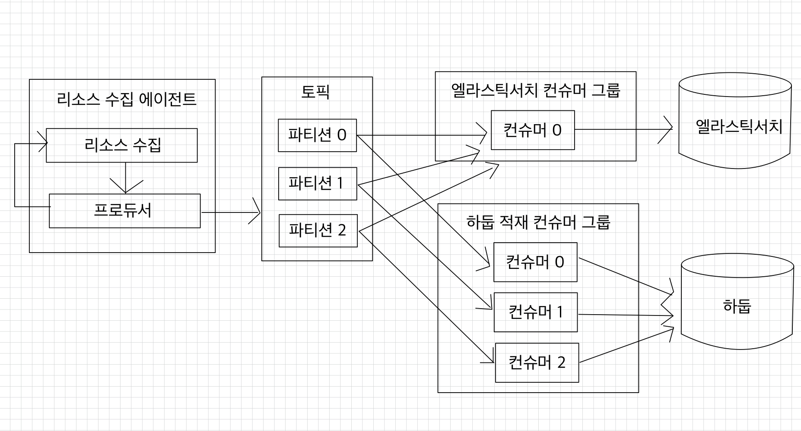
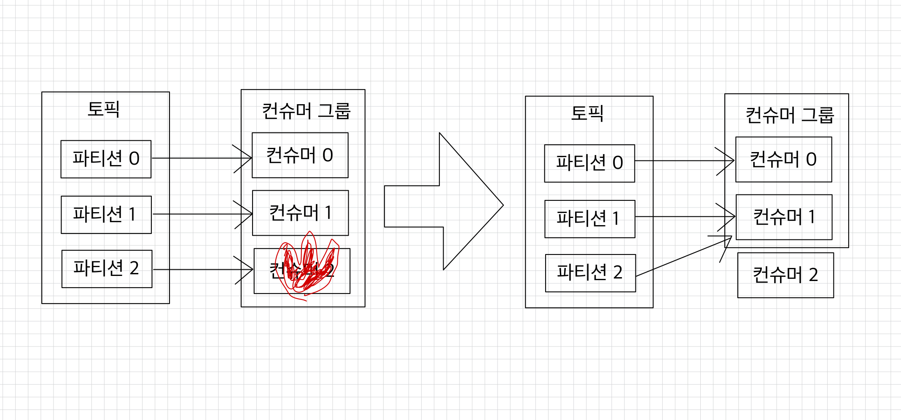
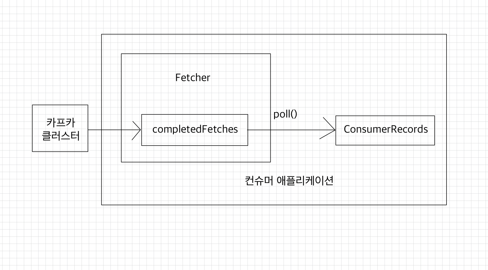

# 💻 카프카 기본 개념
- [카프카 브로커・클러스터・주키퍼](#-카프카-브로커클러스터주키퍼)
  - [데이터 저장, 전송](#-데이터-저장-전송)
  - [데이터 복제, 싱크](#-데이터-복제-싱크)
  - [컨트롤러(controller)](#-컨트롤러controller)
  - [데이터 삭제](#-데이터-삭제)
  - [컨슈머 오프셋 저장](#-컨슈머-오프셋-저장)
  - [코디네이터(coordinator)](#-코디네이터coordinator)
- [토픽과 파티션](#-토픽과-파티션)
  - [토픽 이름 제약 조건](#-토픽-이름-제약-조건)
- [레코드](#-레코드)
- [카프카 클라이언트](#-카프카-클라이언트)
  - [프로듀서 중요 개념](#-프로듀서-중요-개념)
  - [프로듀서 주요 옵션](#-프로듀서-주요-옵션)
  - [컨슈머 중요 개념](#-컨슈머-중요-개념)
  - [컨슈머 주요 옵션](#-컨슈머-주요-옵션)

> 나는 kraft 모드로 주키퍼는 사용하지 않지만, 기본 구조를 파악해야 적용이 가능하므로 주키퍼에 대한 내용도 다룬다.

## ❗️ 카프카 브로커・클러스터・주키퍼
  

- 카프카 브로커는 카프카 클라이언트와 데이터를 주고받기 위해 사용하는 주체이자, 데이터를 분산 저장하여 장애가 발생해도 안전하게 사용할 수 있도록 도와주는 애플리케이션이다.
- 하나의 서버에는 한 개의 카프카 브로커 프로세스가 실행된다.
- 데이터를 안전하게 보관하고 처리하기 위해 3대 이상의 브로커 서버를 1개의 클러스터로 묶어서 운영한다.
- 카프카 클러스터로 묶인 브로커들은 프로듀서가 보낸 데이터를 안전하게 분산 저장하고 복제하는 역할을 한다.

<br>

### ✅ 데이터 저장, 전송
프로듀서로부터 전달된 데이터는 파일 시스템에 저장된다.  

```shell
# EC2 환경
$ ls /tmp/kraft-combined-logs
...
__consumer_offsets-10  __consumer_offsets-2   __consumer_offsets-29  __consumer_offsets-38  __consumer_offsets-47  hello.kafka-0              replication-offset-checkpoint
__consumer_offsets-11  __consumer_offsets-20  __consumer_offsets-3   __consumer_offsets-39  __consumer_offsets-48  hello.kafka-1              verify-test-0
__consumer_offsets-12  __consumer_offsets-21  __consumer_offsets-30  __consumer_offsets-4   __consumer_offsets-49  hello.kafka-2
__consumer_offsets-13  __consumer_offsets-22  __consumer_offsets-31  __consumer_offsets-40  __consumer_offsets-5   hello.kafka-3
__consumer_offsets-14  __consumer_offsets-23  __consumer_offsets-32  __consumer_offsets-41  __consumer_offsets-6   hello.kafka.2-0
__consumer_offsets-15  __consumer_offsets-24  __consumer_offsets-33  __consumer_offsets-42  __consumer_offsets-7   hello.kafka.2-1
__consumer_offsets-16  __consumer_offsets-25  __consumer_offsets-34  __consumer_offsets-43  __consumer_offsets-8   hello.kafka.2-2
```
- `config/kraft/server.properties`의 `log.dir` 옵션에 정의한 디렉토리에 데이터가 존재한다.
  - `hello.kafka`는 4개의 파티션이 있어, 4개의 디렉토리가 존재한다.

<br>

```shell
# EC2 환경
$ ls /tmp/kraft-combined-logs/hello.kafka-0
00000000000000000000.index  00000000000000000000.log  00000000000000000000.timeindex  00000000000000000001.snapshot  leader-epoch-checkpoint  partition.metadata
```
- `hello.kafka` 0번 파티션에 존재하는 데이터를 확인할 수 있다.  
- `log`에는 메시지와 메타데이터를 저장한다.
- `index`에는 메시지의 오프셋을 인덱싱한 정보를 저장한다.
- `timeindex`에는 메시지에 포함된 `timestamp`값을 기준으로 한 인덱싱한 정보를 저장한다.

<br>

### ✅ 데이터 복제, 싱크
데이터 복제(replication)는 카프카를 장애 허용 시스템(fault tolerant system)으로 동작하도록 하는 원동력이다.  
카프카의 데이터 복제는 파티션 단위로 이루어진다.  
➡ 토픽을 생성할 때 파티션의 복제 개수(replication factor)도 같이 설정된다.  
➡ 직접 옵션을 선택하지 않으면 브로커에 설정된 옵션 값을 따라간다.  
복제 개수의 최솟값은 1(복제 없음)이고, 최댓값은 브로커 개수만큼 설정할 수 있다.

<br>

  
- 위 그림은 복제 개수가 3인 경우다.
- 리더: 프로듀서 또는 컨슈머와 직접 통신하는 파티션
- 팔로워: 나머지 복제 데이터를 가지고 있는 파티션
  - 리더의 오프셋과 자신의 오프셋을 비교해 차이가 나는 경우 리더로부터 데이터를 복제해온다.
- 복제 개수만큼 저장 용량이 증가한다는 단점이 있다.
- 그러나 복제를 통해 데이터를 안전하게 사용할 수 있다는 강력한 장점이 있기 때문에 운영 환경에서 2 이상의 복제 개수를 정하는 것이 중요하다.
  - 데이터가 일부 유실되어도 무관하고 데이터 처리 속도가 중요하다면 1 또는 2로 설정한다.
  - 금융권과 같이 유실이 일어나면 안 되는 데이터의 경우 복제 개수를 3으로 설정한다.   
    ➡ 최대 2대의 브로커가 동시에 장애가 발생하더라도 데이터를 안정적으로 유지할 수 있다.

<br>

### ✅ 컨트롤러(controller)
컨트롤러는 다른 브로커들의 상태를 체크하고 브로커가 클러스터에서 빠지는 경우 해당 브로커에 존재하는 리더 파티션을 재분배한다.  
카프카는 실시간 데이터 처리가 핵심이므로 브로커의 상태가 비정상이라면 빠르게 클러스터에서 빼내는 것이 중요하다.  
만약 컨트롤러 역할을 하는 브로커에 장애가 발생한다면 다른 브로커가 컨트롤러 역할을 한다.

<br>

**KRaft 컨트롤러(Controller Quorum)**  
KRaft 컨트롤러의 경우, 기존 컨트롤러보다 책임 범위가 훨씬 크고, 구조도 다르다.  
- 브로커들 중 하나가 controller 역할을 하지 않고, 별도 `Controller Quorum` 노드가 존재한다.
- 메타 데이터를 자체 KRaft 로그로 저장한다.
- 리더 브로커 장애 발생시 Raft 합의 알고리즘 기반으로 리더를 선출한다.(KRaft = Kafka + Raft)
- 기존은 파티션 리더 재할당, 브로커 상태 모니터링만 했지만, KRaft 컨트롤러는 카프카 전체 메타데이터를 관리한다.
  - 토픽
  - 파티션
  - ACL(Access Control List; 접근 제어 목록)


<br>

### ✅ 데이터 삭제
카프카는 다른 메시징 플랫폼과 달리 컨슈머가 데이터를 가져가더라도 토픽의 데이터는 삭제되지 않는다.  
컨슈머나 프로듀서가 데이터 삭제를 요청할 수도 없다.  
오직 브로커만이 데이터를 삭제할 수 있다.  

<br>

데이터 삭제가 이루어지는 단위: 로그 세그먼트(log segment)  
➡ 파일 단위로 이루어진다.  
하나의 세그먼트에 다수의 데이터가 들어 있기 때문에 RDBMS처럼 특정 데이터를 선정해서 삭제할 수 없다.  
- 세그먼트는 데이터가 쌓이는 동안 파일 시스템으로 열려있으며, 카프카 브로커에 `log.segment.bytes` 또는 `log.segment.ms` 옵션 값에 따라서 세그먼트트 파일이 닫힌다.  
  - 디폴트는 1GB 용량에 도달했을 때 닫히게 되어있다.
  - 너무 작은 용량으로 설정하면 데이터들을 저장하는 동안 파일을 너무 자주 여닫음으로써 부하가 발생할 수 있으므로 주의가 필요하다.
- 닫힌 세그먼트 파일은 `log.retention.bytes` 또는 `log.retention.ms` 설정값이 넘으면 삭제된다.
- `log.retention.check.interval.ms` 따라 닫힌 세그먼트 파일을 체크하는 간격이 설정된다.

<br>

### ✅ 컨슈머 오프셋 저장
컨슈머 그룹은 토픽이 특정 파티션으로부터 데이터를 가져가고 처리하고 이 파티션의 어느 레코드까지 가져갔는지 확인하기 위해 오프셋을 커밋한다.  
커밋한 오프셋은 `__consumer_offsets` 토픽에 저장한다.  
해당 오프셋을 토대로 컨슈머 그룹은 다음 레코드를 가져가서 처리한다.  

<br>

### ✅ 코디네이터(coordinator)
클러스터의 다수 브로커 중 한 대는 코디네이터의 역할을 수행한다.  
코디네이터는 컨슈머 그룹의 상태를 체크하고, 파티션을 컨슈머와 매칭하도록 분배하는 역할을 수행한다. (리밸런스; `rebalance`)  


<br>

## ❗️ 토픽과 파티션
- 토픽: 카프카에서 데이터를 구분하기 위해 사용하는 단위
  - 토픽에 1개 이상의 파티션 소유
- 파티션: 프로듀서가 보낸 데이터들이 들어가 저장됨
- 레코드: 파티션에 저장된 데이터

<br>

파티션은 큐와 비슷한 구조지만, 큐는 데이터를 가져가면 레코드를 삭제하는 반면, 카프카에서는 삭제하지 않는다.  
➡ 여러 컨슈머 그룹들이 토픽의 데이터를 여러 번 가져갈 수 있다.

<br>

### ✅ 토픽 이름 제약 조건
- 빈 문자열 X
- `.` 또는 `..` X
- 249자 미만으로 생성되어야 한다.
- 영어 대소문자와 숫자, `.`, `_`, `-` 조합으로 생성할 수 있다.  
  그 외의 문자열이 포함된 토픽 이름은 생성 불가
- 카프카 내부 로직 관리 목적으로 사용되는 토픽(`__consumer_offsets`, `__transaction_state`, `__cluster_metadata`)와 동일한 이름으로는 생성 불가
- 카프카 내부 로직 때문에 `.`와 `_`가 동시에 들어가면 안 된다.
  - 생성은 할 수 있지만 이슈가 발생할 수 있기 때문에 WARNING 메시지가 뜬다.
- 이미 생성된 토픽의 이름과 `.` ➡ `_` 또는 `_` ➡ `.` 로 바뀐 거 외에 동일한 이름으로는 생성할 수 없다.

<br>

토픽 작명의 템플릿과 예시
- <환경>.<팀-명>.<애플리케이션-명>.<메시지-타입>
  - `prd.marketing-team.sms-platform.json`
- <프로젝트-명>.<서비스-명>.<환경>.<이벤트-명>
  - `commerce.payment.prd.notification`
- <환경>.<서비스-명>.<JIRA-번호>.<메시지-타입>
  - `dev.email-sender.jira-1234.email-vo-custom`
- <카프카-클러스터-명>.<환경>.<서비스-명>.<메시지-타입>
  - `aws-kafka.live.marketing-platform.json`

<br>

카프카는 토픽 이름 변경을 지원하지 않으므로 이름을 변경하기 위해서는 삭제 후 다시 생성하는 것 외에는 방법이 없다.  
➡ 다로 까다롭더라도 카프카 클러스터 사용자에게 토픽 생성에 대한 규칙을 인지시키는 것이 중요하다.  
➡ 규칙을 따르지 않은 토픽의 이름이 있을 경우, 실제 사용할 토픽이라면 삭제 후 신규로 토픽을 만드는 것을 권장한다.


<br>

### ✅ 레코드
브로커에 한 번 적재된 레코드는 수정할 수 없고, `log retention` 기간 또는 용량에 따라서만 삭제된다.  
<br>

레코드 구성
- `timestamp`
  - 브로커 기준 유닉스 시간이 설정된다.
  - 프로듀서가 레코드를 생성할 때 임의의 `timestamp`를 설정할 수 있다.
- `message key`
  - `message`를 순서대로 처리하거나 `message` 종류를 나타내기 위해 사용한다.
  - `message key`가 `null`이 아니면 프로듀서가 토픽에 레코드를 전송할 때 `key`의 해시값을 토대로 파티션을 지정한다.  
    ➡ `message key`가 동일하면 동일한 파티션에 들어가게 된다.
  - 어느 파티션에 들어가게 될지는 알 수 없고, 중간에 파티션 개수가 달라지면 `message key`와 파티션 매칭이 달라진다.
- `message value`
  - 실질적으로 처리해야할 데이터가 들어있다.
  - 프로듀서가 직렬화한 형태와 동일한 형태로 컨슈머는 역직렬화를 해야한다.
- `offset`
  - 0 이상의 숫자로 이루어져 있다.
  - `offset`은 컨슈머가 데이터를 가져갈 때 사용된다.

<br>

## ❗️ 카프카 클라이언트

### ✅ 프로듀서 중요 개념

[카프카 프로듀서](https://github.com/kyeoungchan/simple-kafka-producer)를 구현한 애플리케이션을 참고하자.

<br>


프로듀서는 카프카 브로커로 데이터를 전송할 때 내부적으로 파티셔너, 배치 생성 단계를 거친다.

  
- `org.apache.kafka.clients.producer.KafkaProducer` 인스턴스가 `send()` 메서드를 호출하면 `org.apache.kafka.clients.producer.ProducerRecord`는 토픽의 어느 파티션으로 전송될 것인지 정해진다.
- `KafkaProducer` 인스턴스는 생성할 때 파티셔너를 따로 설정하지 않으면 기본값인 `DefaultPartitioner`로 설정되어 파티션이 정해진다.
- 파티셔너에 의해 분리된 레코드는 데이터를 전송하기 전에 `Accumulator`에 데이터를 버퍼로 쌓아놓고 발송한다.
  - 버퍼로 쌓인 데이터는 배치로 묶어서 전송함으로써 카프카의 프로듀서 처리량을 향상시키는 데에 상당한 도움을 준다.

<br>

**Partitioner**  
카프카 클라이언트 라이브러리 3.3.0 이전 버전까지는 파티션을 지정하지 않은 경우 `UniformStickyPatitioner`가 파티셔너로 기본 설정되었다.  
카프카 2.4.0 이전 버전까지는 `RoundRobinPatitioner`가 기본 파티셔너로 설정되었다.  
- `RoundRobinPatitioner`는 `ProducerRecord`가 들어오는 대로 파티션을 순회하면서 전송하기 때문에 배치로 묶이는 빈도가 적다.
- `UniformStickyPatitioner`는 `Accumulator`에서 데이터가 배치로 모두 묶일 때까지 기다렸다가 배치로 묶인 데이터는 모두 동일한 파티션에 전송함으로써 `RoundRobinPatitioner`에 비해 향상된 성능을 갖게 되었다.
- 3.3.0 버전 이후로는 카프카 내부 파티셔너 로직이 사용된다.  
  ➡`UniformStickyPatitioner`가 batch를 모으느라 latency가 증가되는 것을 개선

<br>

`Sender` 스레드는 `Accumulator`에 쌓인 배치 데이터를 가져가 카프카 브로커로 전송한다.  

<br>

### ✅ 프로듀서 주요 옵션
카프카 클라이언트 애플리케이션을 개발할 때 설정하지 않은 선택 옵션의 기본값(default)을 파악해서 운영해야 한다.  

<br>

- 필수 옵션
  - `bootstrap.servers`: 프로듀서가 데이터를 전송할 대상 카프카 클러스터에 속한 브로커의 `host:port`를 1개 이상 작성한다.  
    2개 이상 브로커 정보를 입력하여 일부 브로커에 이슈가 발생하더라도 접속하는 데에 이슈가 없도록 설정 가능하다.
  - `key.serializer`: 레코드의 메시지 `key`를 직렬화하는 클래스를 지정한다.
  - `value.serializer`: 레코드의 메시지 `value`를 직렬화하는 클래스를 지정한다.
- 선택 옵션
  - `acks`: 프로듀서가 전송한 데이터가 브로커들에 정상적으로 저장되었는지 전송 성공 여부를 확인하는 옵션이다.
    - `1`: 리더 파티션에 데이터가 저장되면 전송 성공으로 판단한다. 기본값이다.
    - `0`: 프로듀서가 전송한 즉시 브로커에 데이터 저장 여부와 상관 없이 성공으로 판단한다.
    - `-1` 또는 `all`: 토픽의 `min.insync.replicas` 개수에 해당하는 리더의 파티션과 팔로워 파티션에 데이터가 저장되면 성공하는 것으로 판단한다.
  - `buffer.memory`: 브로커로 전송할 데이터를 배치로 모으기 위해 설정할 버퍼 메모리양을 지정한다. 기본값은 `33554432(32MB)`다.
  - `retries`: 프로듀서가 브로커로부터 에러를 받고 난 뒤 재전송을 시도하는 횟수를 지정한다. 기본값은 `2147483647`이다.
  - `batch.size`: 배치로 전송할 레코드 최대 용량을 지정한다.
    - 너무 작게 설정하면 프로듀서가 브로커로 더 자주 보내기 때문에 네트워크 부담이 있다.
    - 너무 크게 설정하면 메모리를 더 많이 사용하게 된다.
    - 기본값은 `16384`다.
  - `linger.ms`: 배치로 전송하기 전까지 기다리는 최소 시간이다. 기본값은 `0`이다.
  - `partitioner.class`: 레코드를 파티션에 전송할 때 적용하는 파티셔너 클래스를 지정한다.
    - 3.9.0 버전 기준 기본값은 `null`이다. (위에 [프로듀서 중요 개념](#-프로듀서-중요-개념)에서 **Partitioner** 참고)
  - `transactional.id`: 프로듀서가 레코드를 전송할 때 레코드를 트랜잭션 단위로 묶을지 여부를 설정한다.
    - 이 값을 설정하면 트랜잭션 프로듀서로 동작한다.

<br>

### ✅ 컨슈머 중요 개념

[카프카 컨슈머](https://github.com/kyeoungchan/simple-kafka-consumer)를 구현한 애플리케이션을 참고하자.

<br>

토픽의 파티션으로부터 데이터를 가져가기 위해 컨슈머를 운영하는 방법은 크게 2가지다.
1. 1개 이상의 컨슈머로 이루어진 컨슈머 그룹을 운영하는 것
2. 토픽의 특정 파티션만 구독하는 컨슈머를 운영하는 것

**컨슈머와 파티션 매핑**  

    
- 컨슈머 그룹으로 묶인 컨슈머가 토픽을 구독해서 데이터를 가져갈 때, 1개의 파티션은 최대 1개의 컨슈머에 할당 가능하다.
- 1개의 컨슈머는 여러 개의 파티션에 할당될 수 있다.
- 컨슈머 그룹의 컨슈머 개수는 토픽의 파티션 개수보다 같거나 작아야 한다.
- 만약 4개의 컨슈머로 이루어진 컨슈머 그룹으로 3개의 파티션을 가진 토픽에서 데이터를 가져가기 위해 할당하면 1개의 컨슈머는 파티션을 할당받지 못하고 유휴 상태로 남게 된다.  
 ➡ 파티션을 할당받지 못한 컨슈머는 스레드만 차지하고 실질적인 데이터 처리를 못하므로 애플리케이션 실행에 있어 불필요한 스레드로 남게 된다.

<br>

**컨슈머 그룹은 다른 컨슈머 그룹과 격리되는 특징을 가지고 있다.**  
  
예를 들어, 운영 서버의 주요 리소스인 CPU, 메모리 정보를 수집하는 데이터 파이프라인을 구축한다고 가정해보자.  
실시간 리소스를 시간순으로 확인하기 위해 데이터를 엘라스틱서치에 저장하고, 이와 동시에 대용량 적재를 위해 하둡에 적재할 것이다.  
위 그림과 같이 카프카를 활용하지 않고 동기적으로 적재 요청을 한다면, 엘라스틱서치 또는 하둡 둘 중 하나에 장애가 발생한다면 더는 적재가 불가능할 수 있다.

<br>


  
카프카는 이러한 파이프라인을 운영함에 있어 최종 적재되는 저장소의 장애에 유연하게 대응할 수 있도록 각기 다른 저장소에 저장하는 컨슈머를 다른 컨슈머 그룹으로 묶어 각 저장소의 장애에 격리되어 운영할 수 있다.  

<br>

  
컨슈머 그룹 내에 일부 컨슈머가 장애가 발생하면, 장애가 발생한 컨슈머에 할당된 파티션은 장애가 발생하지 않은 컨슈머로 소유권이 넘어간다.(리밸런싱)  
컨슈머 중 1개가 동작을 안 하고 있다면 데이터 처리에 지연이 발생할 수 있으므로 이슈가 발생한 컨슈머를 컨슈머 그룹에서 제외하고 모든 파티션이 지속적으로 데이터를 처리할 수 있도록 가용성을 높여준다.  
리밸런싱은 컨슈머가 데이터를 처리하는 도중에 언제든지 발생할 수 있으므로 데이터 처리 중 발생한 리밸런싱에 대응하는 코드를 작성해야 한다.  

리밸런싱은 가용성을 높여주지만 너무 자주 일어나서는 안 된다.  
리밸런싱이 발생할 때 파티션의 소유권을 컨슈머로 재할당하는 과정에서 해당 컨슈머 그룹의 컨슈머들이 토픽의 데이터를 읽을 수 없기 때문이다.  
그룹 조정자(group coordinator)는 리밸런싱을 발동시키는 역할을 하는데 컨슈머 그룹의 컨슈머가 추가되고 삭제될 때를 감지한다.  
카프카 브로커 중 한 대가 그룹 조정자의 역할을 한다.

<br>

**컨슈머 오프셋**  
위에서 얘기했지만, 컨슈머는 카프카 브로커로부터 데이터를 어디까지 가져갔는지 커밋(commit)을 통해 기록한다.  
특정 토픽의 파티션을 어떤 컨슈머 그룹이 몇 번째 가져갔는지 카프카 브로커 내부에서 사용되는 내부 토픽(`__consumer_offests`)에 기록된다.  

<br>

**비명시 오프셋 커밋**  
오프셋 커밋의 기본 옵션은 `poll()` 메서드가 수행될 때 일정 간격마다 오프셋을 커밋하도록 `enable.auto.commit=true`로 설정되어 있다.  
➡ 일정 간격마다 자동으로 커밋되는 것을 비명시 오프셋 커밋이라고 한다.  

장점: 편리하다.  
단점: `poll()` 메서드 호출 이후에 리밸런싱 또는 컨슈머 강제종료 발생 시 컨슈머가 처리하는 데이터가 중복 또는 유실될 수 있는 가능성이 있다. ➡ 데이터 중복이나 유실을 허용하지 않는 서비스라면 자동 커밋을 사용해서는 안 된다.  
<br>

**명시적 오프셋 커밋**  
`poll()` 메서드를 호출한 후 반환받은 데이터의 처리가 완료되고 `commitSync()` 메서드를 호출하면 된다.  
➡ `commitSync()` 메서드는 `poll()` 메서드가 반환한 레코드의 가장 마지막 오프셋을 기준으로 커밋을 한다.  

브로커에 커밋 요청을 하고 커밋이 정상적으로 처리되었는지 응답하기까지 기다린다.  
➡ 당연히 컨슈머의 처리량에 영향을 끼친다.  

`commitAsync()` 메서드를 사용하면 커밋을 전송하고 응답을 받기 전에 데이터 처리를 수행할 수 있지만, 커밋 요청이 실패했을 경우 현재 처리 중인 데이터의 순서를 보장하지 않으며, 데이터의 중복 처리가 발생할 수 있다.


<br>

**컨슈머 내부 구조**  
  
컨슈머는 `poll()` 메서드를 통해 레코드들을 반환받지만 `poll()` 메서드를 호출하는 시점에 클러스터에서 데이터를 가져오는 것은 아니다.  
1. 컨슈머 애플리케이션 실행
2. 내부에서 `Fetcher` 인스턴스가 생성되어 `poll()` 메서드를 호출하기 전에 미리 레코드들을 내부 큐로 가져온다.
3. `poll()` 메서드를 호출하면 컨슈머는 내부 큐에 있는 레코드들을 반환받아 처리를 수행한다.

<br>

### ✅ 컨슈머 주요 옵션
- 필수 옵션
  - `bootstrap.servers`: 컨슈머가 데이터를 받아올 대상 카프카 클러스터에 속한 브로커의 `host:port`를 1개 이상 작성한다.  
    2개 이상 브로커 정보를 입력하여 일부 브로커에 이슈가 발생하더라도 접속하는 데에 이슈가 없도록 설정 가능하다.
  - `key.deserializer`: 레코드의 메시지 `key`를 역직렬화하는 클래스를 지정한다.
  - `value.deserializer`: 레코드의 메시지 `value`를 역직렬화하는 클래스를 지정한다.
- 선택 옵션
  - `group.id`
    - 컨슈머 그룹 아이디다.  
    - `subscribe()` 메서드로 토픽을 구독하여 사용할 때는 이 옵션을 필수로 넣어야 한다.
    - 기본값은 `null`이다.
  - `auto.offset.reset`
    - 저장된 컨슈머 오프셋이 없을 경우, 어느 오프셋부터 읽을지 선택하는 옵션이다. ➡ 당연히 오프셋이 있다면 무시되는 옵션이다.
    - `latest`: 가장 높은(가장 최근에 넣은) 오프셋부터 읽기 시작한다.
    - `earlist`: 가장 낮은(가장 오래전에 넣은) 오프셋부터 읽기 시작한다.
    - `none`: 컨슈머 그룹이 커밋한 기록이 있는지 찾아보고, 있다면 해당 기록 이후 오프셋부터 읽고, 없다면 오류를 반환한다.
    - 기본값은 `latest`다.
  - `enable.auto.commit`: 자동으로 커밋할지 여부(기본값 `true`)
  - `auto.commit.interval.ms`: 자동 커밋일 경우(`enable.auto.commit=true`) 오프셋 커밋간 간격을 결정한다. (기본값 5000(5초))
  - `max.poll.records`: `poll()` 메서드를 통해 반환되는 레코드 개수를 지정한다.(기본값 500)
  - `session.timeout.ms`
    - 컨슈머가 브로커와 연결이 끊기는 최대 시간
    - 이 시간 내에 하트 비트(heartbeat)를 전송하지 않으면 브로커는 컨슈머에 이슈가 발생했다고 가정하고 리밸런싱을 시작한다.
    - 보통 하트비트 시간 간격의 3배로 설정한다.
    - 기본값은 `10000(10초)`다.
  - `heartbeat.interval.ms`: 하트비트를 전송하는 시간 간격(기본값 3000(3초))
  - `max.poll.interval.ms`
    - `poll()` 메서드를 호출하는 간격의 최대 시간을 지정한다.
    - `poll()` 메서드를 호출한 이후 데이터를 처리하는 데에 시간이 너무 많이 걸리는 경우 비정상으로 판단하고 리밸런싱을 시작한다.
    - 기본값: 300000(5분)
  - `isolation.level`
    - 트랜잭션 프로듀서가 레코드를 트랜잭션 단위로 보낼 경우 사용한다.
    - `read_committed`: 커밋이 완료된 레코드만 읽는다.
    - `read_uncommitted`: 커밋 여부와 관계없이 파티션에 있는 모든 레코드를 읽는다.
    - 기본값: `read_uncommitted`


<br>

**참고 자료**  
[아파치 카프카 애플리케이션 프로그래밍 with 자바](https://product.kyobobook.co.kr/detail/S000001842177)