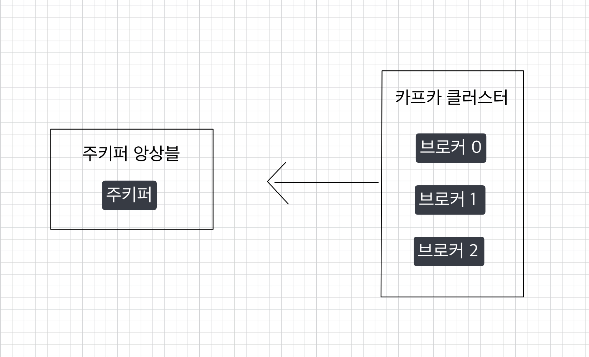
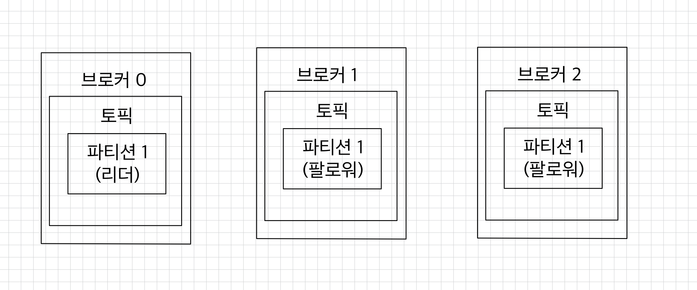

# 🧑🏻‍💻 Broker

---

- [데이터 저장, 전송](#-데이터-저장-전송)
- [데이터 복제, 싱크](#-데이터-복제-싱크)
- [데이터 삭제](#-데이터-삭제)
- [컨슈머 오프셋 저장](#-컨슈머-오프셋-저장)
- [코디네이터(coordinator)](#-코디네이터coordinator)


> [!TIP]
> 나는 kraft 모드로 주키퍼는 사용하지 않지만, 기본 구조를 파악해야 적용이 가능하므로 주키퍼에 대한 내용도 다룬다.

## ❗️ 카프카 브로커・주키퍼


> [!NOTE]
> - 카프카 브로커는 카프카 클라이언트와 데이터를 주고받기 위해 사용하는 주체이자, 데이터를 분산 저장하여 장애가 발생해도 안전하게 사용할 수 있도록 도와주는 애플리케이션이다.
> - 하나의 서버에는 한 개의 카프카 브로커 프로세스가 실행된다.
> - 데이터를 안전하게 보관하고 처리하기 위해 3대 이상의 브로커 서버를 1개의 클러스터로 묶어서 운영한다.
> - 카프카 클러스터로 묶인 브로커들은 프로듀서가 보낸 데이터를 안전하게 분산 저장하고 복제하는 역할을 한다.

<br>

### ✅ 데이터 저장, 전송
> [!IMPORTANT]
> 프로듀서로부터 전달된 데이터는 파일 시스템에 저장된다.

```shell
# EC2 환경
$ ls /tmp/kraft-combined-logs
...
__consumer_offsets-10  __consumer_offsets-2   __consumer_offsets-29  __consumer_offsets-38  __consumer_offsets-47  hello.kafka-0              replication-offset-checkpoint
__consumer_offsets-11  __consumer_offsets-20  __consumer_offsets-3   __consumer_offsets-39  __consumer_offsets-48  hello.kafka-1              verify-test-0
__consumer_offsets-12  __consumer_offsets-21  __consumer_offsets-30  __consumer_offsets-4   __consumer_offsets-49  hello.kafka-2
__consumer_offsets-13  __consumer_offsets-22  __consumer_offsets-31  __consumer_offsets-40  __consumer_offsets-5   hello.kafka-3
__consumer_offsets-14  __consumer_offsets-23  __consumer_offsets-32  __consumer_offsets-41  __consumer_offsets-6   hello.kafka.2-0
__consumer_offsets-15  __consumer_offsets-24  __consumer_offsets-33  __consumer_offsets-42  __consumer_offsets-7   hello.kafka.2-1
__consumer_offsets-16  __consumer_offsets-25  __consumer_offsets-34  __consumer_offsets-43  __consumer_offsets-8   hello.kafka.2-2
```

> [!TIP]
> - `config/kraft/server.properties`의 `log.dir` 옵션에 정의한 디렉토리에 데이터가 존재한다.
>   - `hello.kafka`는 4개의 파티션이 있어, 4개의 디렉토리가 존재한다.

<br>

```shell
# EC2 환경
$ ls /tmp/kraft-combined-logs/hello.kafka-0
00000000000000000000.index  00000000000000000000.log  00000000000000000000.timeindex  00000000000000000001.snapshot  leader-epoch-checkpoint  partition.metadata
```
> [!TIP]
> - `hello.kafka` 0번 파티션에 존재하는 데이터를 확인할 수 있다.
> - `log`에는 메시지와 메타데이터를 저장한다.
> - `index`에는 메시지의 오프셋을 인덱싱한 정보를 저장한다.
> - `timeindex`에는 메시지에 포함된 `timestamp`값을 기준으로 한 인덱싱한 정보를 저장한다.

<br>

### ✅ 데이터 복제, 싱크
> [!NOTE]
> 데이터 복제(replication)는 카프카를 장애 허용 시스템(fault tolerant system)으로 동작하도록 하는 원동력이다.  
> 카프카의 데이터 복제는 파티션 단위로 이루어진다.  
> ➡ 토픽을 생성할 때 파티션의 복제 개수(replication factor)도 같이 설정된다.  
> ➡ 직접 옵션을 선택하지 않으면 브로커에 설정된 옵션 값을 따라간다.  
> 복제 개수의 최솟값은 1(복제 없음)이고, 최댓값은 브로커 개수만큼 설정할 수 있다.

<br>


> [!NOTE]
> - 위 그림은 복제 개수가 3인 경우다.
> - 리더: 프로듀서 또는 컨슈머와 직접 통신하는 파티션
> - 팔로워: 나머지 복제 데이터를 가지고 있는 파티션
>     - 리더의 오프셋과 자신의 오프셋을 비교해 차이가 나는 경우 리더로부터 데이터를 복제해온다.
> - 복제 개수만큼 저장 용량이 증가한다는 단점이 있다.
> - 그러나 복제를 통해 데이터를 안전하게 사용할 수 있다는 강력한 장점이 있기 때문에 운영 환경에서 2 이상의 복제 개수를 정하는 것이 중요하다.
>     - 데이터가 일부 유실되어도 무관하고 데이터 처리 속도가 중요하다면 1 또는 2로 설정한다.
>     - 금융권과 같이 유실이 일어나면 안 되는 데이터의 경우 복제 개수를 3으로 설정한다.   
>       ➡ 최대 2대의 브로커가 동시에 장애가 발생하더라도 데이터를 안정적으로 유지할 수 있다.

<br>

### ✅ 데이터 삭제

> [!TIP]
> 카프카는 다른 메시징 플랫폼과 달리 컨슈머가 데이터를 가져가더라도 토픽의 데이터는 삭제되지 않는다.  
> 컨슈머나 프로듀서가 데이터 삭제를 요청할 수도 없다.  
> 오직 브로커만이 데이터를 삭제할 수 있다.

<br>

> [!IMPORTANT]
> 데이터 삭제가 이루어지는 단위: 로그 세그먼트(log segment)  
> ➡ 파일 단위로 이루어진다.  
> 하나의 세그먼트에 다수의 데이터가 들어 있기 때문에 RDBMS처럼 특정 데이터를 선정해서 삭제할 수 없다.
> - 세그먼트는 데이터가 쌓이는 동안 파일 시스템으로 열려있으며, 카프카 브로커에 `log.segment.bytes` 또는 `log.segment.ms` 옵션 값에 따라서 세그먼트 파일이 닫힌다.
>   - 디폴트는 1GB 용량에 도달했을 때 닫히게 되어있다.
>   - 너무 작은 용량으로 설정하면 데이터들을 저장하는 동안 파일을 너무 자주 여닫음으로써 부하가 발생할 수 있으므로 주의가 필요하다.
> - 닫힌 세그먼트 파일은 `log.retention.bytes` 또는 `log.retention.ms` 설정값이 넘으면 삭제된다.
> - `log.retention.check.interval.ms` 따라 닫힌 세그먼트 파일을 체크하는 간격이 설정된다.


<br>

### ✅ 컨슈머 오프셋 저장
컨슈머 그룹은 토픽이 특정 파티션으로부터 데이터를 가져가고 처리하고 이 파티션의 어느 레코드까지 가져갔는지 확인하기 위해 오프셋을 커밋한다.  
커밋한 오프셋은 `__consumer_offsets` 토픽에 저장한다.  
해당 오프셋을 토대로 컨슈머 그룹은 다음 레코드를 가져가서 처리한다.

<br>

### ✅ 코디네이터(coordinator)
클러스터의 다수 브로커 중 한 대는 코디네이터의 역할을 수행한다.  
코디네이터는 컨슈머 그룹의 상태를 체크하고, 파티션을 컨슈머와 매칭하도록 분배하는 역할을 수행한다. (리밸런스; `rebalance`)


<br>

**참고 자료**  
[아파치 카프카 애플리케이션 프로그래밍 with 자바](https://product.kyobobook.co.kr/detail/S000001842177)