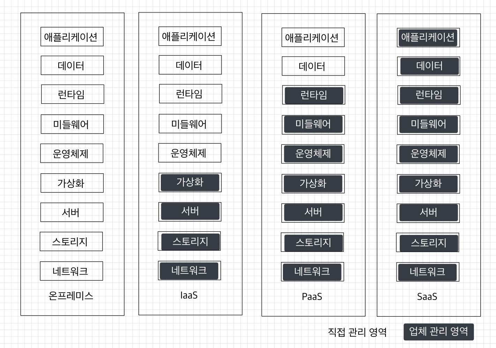

# 🧑🏻‍💻 클라우드 카프카 서비스
- [인프라 관리의 이점](#-인프라-관리의-이점)
- [모니터링 대시보드 제공](#-모니터링-대시보드-제공)

아파치 카프카 클러스터를 서버에 직접 설치하고 운영하는 것은 가장 전통적이고 기본적인 방법이다.  
이 방법으로는 각종 설정을 직접 컨트롤하여 세부적인 서버 설정을 통해 최고의 성능으로 최적의 클러스터를 활용할 수 있다.  
➡ 그러나 그만큼 최적화된 카프카 클러스터를 사용하기 위해서는 노하우가 필요하기 때문에 수많은 시행착오를 거쳐야 한다.  
특히, 각종 보안 설정이나 모니터링 도구를 선택하고 설치, 운영할 때는 수많은 선택지 때문에 어려움을 겪을 수도 있다.  
➡ 이러한 운영상 시행착오를 줄이면서 최고의 카프카 클러스터를 빠르게 설치하여 안전하게 운영하기 위해 SaaS(Software-as-a-Service)를 도입할 수 있다.

  

SaaS란, 클라우드 서비스 제공업체가 소프트웨어와 인프라를 관리하면서 플랫폼을 제공하는 것을 뜻한다.  
사용자는 웹 대시보드나 CLI(Command Line Interface)를 통해 플랫폼의 세부 설정을 간편하게 할 수 있으며, 네트워크, 스토리지, 가상화 등 다양한 종류의 운영상 이슈는 업체에서 관리하기 때문에 매우 편리하게 사용할 수 있다.  

| 서비스 종류                             | 특징                                                                                                      |
|------------------------------------|---------------------------------------------------------------------------------------------------------|
|온프레미스   (on-premise)             | - 사용자가 자체적으로 보유한 전산실 서버에 설치해 운영 - 기업 상황에 맞게 하드웨어를 커스터마이징 구성 가능 - 초기 도입 비용, 운영 및 관리를 위한 유지보수 비용 발생 |
| IaaS (Infrastructure-as-a-Service) | - 물리/가상 컴퓨팅 리소스를 발급받아서 사용 - 온라인 스토리지, 데이터베이스 등도 포함됨 - 사용자가 운영체제, 애플리케이션 등을 직접 설정, 배포, 운영          |
| PaaS (Platform-as-a-Service)| - 애플리케이션 개발 및 실행 환경을 제공 - 사용자는 컴퓨팅 리소스 관리를 신경쓰지 않아도 됨                                                |     
|SaaS (Software-as-a-Service)| - 소프트웨어의 배포, 실행을 업체에서 관리하고 기능을 제공 - 소프트웨어 관리를 업체에 위임하고 기능만 사용할 때 유용                                  

 

카프카를 SaaS로 제공하는 업체에는 AWS와 Confluent가 있다.  
AWS는 MSK(Managed Streaming for Apache Kafka)라는 이름으로 제공하고 있고, Confluent에서는 Kafka Cloud라는 이름으로 제공하고 있다.  

 

### ✅ 인프라 관리의 이점
카프카 클러스터는 상용환경에서 최소 3대 이상의 서버로 운영한다.  
클러스터를 담당하고 운영하는 개발자의 입장에서는 3대 이상의 서버를 모니터링해야 하는데, SaaS를 사용할 경우 인프라 운영 관련 역할에서 자유로울 수 있다.  
➡ 카프카 SaaS 서비스를 사용하게 되면 브로커가 올라가는 서버는 자동으로 관리되기 때문이다.  
➡ 브로커 서버 일부가 이슈가 발생해 서버를 재시작하게 되더라도, SaaS 서비스가 이슈를 감지하여 이슈가 생긴 서버를 제외하고 신규 장비에 브로커를 실행하여 클러스터를 복구하기 때문에 신경쓸게 줄어든다.

클러스터의 데이터 사용량이 순간적으로 많아지더라도 서비스를 제공하는 업체의 SaaS 대시보드에서 브로커 개수만 설정하여 쉽게 스케일 아웃할 수 있다.  
그 반대 상황인 스케일 인에서도 마찬가지로 대시보드를 통해 설정, 적용할 수 있다.  

 

### ✅ 모니터링 대시보드 제공
SaaS형 카프카에서는 자동화되어 만들어진 클러스터로부터 운영에 필요한 지표들을 수집하고 그래프로 보여주는 옵션이 제공된다.  
SaaS형 카프카를 사용함으로써 추가로 플랫폼들을 설치하고 운영할 필요 없이, 클릭 몇 번으로 지표를 그래프로 보면서 운영의 짐을 덜 수 있다.

 

### ✅ 보안 설정
> 보안이 설정되지 않은 클러스터의 경우 호스트와 포트 번호만 알면 모든 토픽의 데이터를 가져갈 수 있다.  
> 또한, 어드민 API를 통해 카프카 클러스터에 악의적인 공격을 할 수 있다.

카프카 브로커는 SSL, SASL, ACL과 같이 불특정 다수의 침입을 막기 위해 다양한 종류의 보안 설정 방안을 제공하고 있지만, 어떤 종류의 보안 설정을 할지 고르고 설정, 운영하는 것은 결코 쉬운 일이 아니다.  
이 점을 보완하기 위해 SaaS형 카프카에서는 클러스터 접속 시 보안 설정을 기본으로 제공하고 있다.  
클러스터 생성 시 보안 설정을 통해 인가된 사용자만 카프카 클러스터에 접근할 수 있도록 할 수 있다.

 

### ✅ 서비스 사용 비용
카프카 클러스터를 직접 설치하고 운영한다면 브로커를 실행하는 서버의 서버 비용만 들이면 된다.  
그러나 SaaS형 카프카를 사용하려면 SaaS를 제공하는 업체에서 지정한 특정 요금제를 사용해야 한다.  
게다가, SaaS형 카프카에 적용된 금액은 서버만 발급해서 사용하는 비용에 비해 현저히 높다.  
인스턴스 발급 및 사용 비용은 클러스터를 단순히 실행만 하더라도 빠져나가는 비용이며 추가적으로 스토리지 요금과 데이터 전송 요금이 발생한다.  

 

### ✅ 커스터마이징의 제한
SaaS 서비스들은 인프라부터 애플리케이션 설치까지 모든 부분이 자동화되어 있고 업체에서 설정한 아키텍처를 따라가기 때문에 상세한 설정을 적용하거나 클러스터 아키텍처의 변화가 필요한 경우 적용하기 매우 어렵다.  
특히 멀티 클라우드(2개 이상의 퍼블릭 클라우드 함께 사용)나 하이브리드 클라우드(사내 서버와 퍼블릭 클라우드를 함께 사용) 형태로 카프카 클러스터를 구성하는 것은 SaaS형 카프카에서는 불가능하다.  
클라우드 종속성을 탈피하는 목적으로 그리고 마이그레이션을 목적으로 멀티 클라우드, 하이브리드 클라우드 형태의 클러스터로 구성해야 할 필요가 있을 때 SaaS형 카프카를 사용하고 있다면 문제가 매우 복잡해진다.

 

### ✅ 클라우드 종속성
SaaS형 카프카를 구축하기 위해서는 클라우드 서비스 업체를 선택하고 클러스터를 운영해야 한다.  
클라우드 서비스 업체를 선택하고 클러스터를 운영하는 순간 프로듀서, 컨슈머들을 포함한 클러스터와 관련된 모든 애플리케이션은 해당 서비스에 종속된다.  
그러나, 비용적으로 더 나은 SaaS 서비스 업체가 생길 수도 있고, 카프카 운영상 추가 기능이 필요하여 클러스터의 데이터와 연동을 온프레미스로 옮겨야 할 수도 있다.  
클라우드 종속성을 탈피하기 위해서는 멀티 클라우드 또는 하이브리드 클라우드를 도입하는 방법이 있지만 SaaS형 카프카를 사용할 경우에는 멀티 클라우드, 하이브리드 클라우드 적용이 불가능하다.  
➡ SaaS형 카프카를 도입할 경우 추후 발생할 수 있는 이슈를 예측해보고 서비스에 미치는 위험 정도를 따져본 뒤 도입해야 한다.  

 

SaaS형 카프카를 도입할 때는 현재 입력의 카프카 클러스터 운영에 대한 이해의 깊이, 클러스터 구축 비용, 추후 운영상 이슈 등을 다각도로 검토하는 것이 이후 안정적인 서비스를 운영하는 데에 밑바탕이 될 수 있다.

 

**참고 자료**  
[아파치 카프카 애플리케이션 프로그래밍 with 자바](https://product.kyobobook.co.kr/detail/S000001842177)