# 🧑🏻‍💻 Consumer

- [✅ 컨슈머 중요 개념](#-컨슈머-중요-개념)
- [✅ 컨슈머 주요 옵션](#-컨슈머-주요-옵션)
- [✅ 멀티 스레드 컨슈머](#-멀티-스레드-컨슈머)
- [✅ 컨슈머 랙](#-컨슈머-랙)
- [✅ 컨슈머 배포 프로세스](#-컨슈머-배포-프로세스)

---

> [!TIP]
> 컨슈머는 카프카에 적재된 데이터를 처리한다.  
> 컨슈머를 통해 데이터를 카프카 클러스터로부터 가져가고 처리해야 한다.

## ✅ 컨슈머 중요 개념

> [!TIP]
> [카프카 컨슈머](https://github.com/kyeoungchan/simple-kafka-consumer)를 구현한 애플리케이션을 참고하자.

<br>

> [!NOTE]
> 토픽의 파티션으로부터 데이터를 가져가기 위해 컨슈머를 운영하는 방법은 크게 2가지다.
> 1. 1개 이상의 컨슈머로 이루어진 컨슈머 그룹을 운영하는 것
> 2. 토픽의 특정 파티션만 구독하는 컨슈머를 운영하는 것

<br>

### 🚀 컨슈머와 파티션 매핑
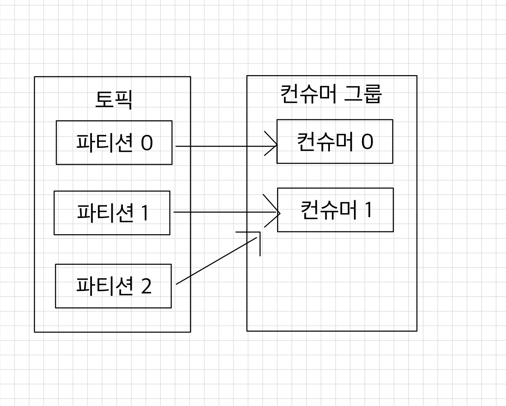
> [!NOTE]
> - 컨슈머 그룹으로 묶인 컨슈머가 토픽을 구독해서 데이터를 가져갈 때, 1개의 파티션은 최대 1개의 컨슈머에 할당 가능하다.
> - 1개의 컨슈머는 여러 개의 파티션에 할당될 수 있다.
> - 컨슈머 그룹의 컨슈머 개수는 토픽의 파티션 개수보다 같거나 작아야 한다.
> - 만약 4개의 컨슈머로 이루어진 컨슈머 그룹으로 3개의 파티션을 가진 토픽에서 데이터를 가져가기 위해 할당하면 1개의 컨슈머는 파티션을 할당받지 못하고 유휴 상태로 남게 된다.  
>   ➡ 파티션을 할당받지 못한 컨슈머는 스레드만 차지하고 실질적인 데이터 처리를 못하므로 애플리케이션 실행에 있어 불필요한 스레드로 남게 된다.

<br>

### 🚀 컨슈머 그룹은 다른 컨슈머 그룹과 격리되는 특징을 가지고 있다.
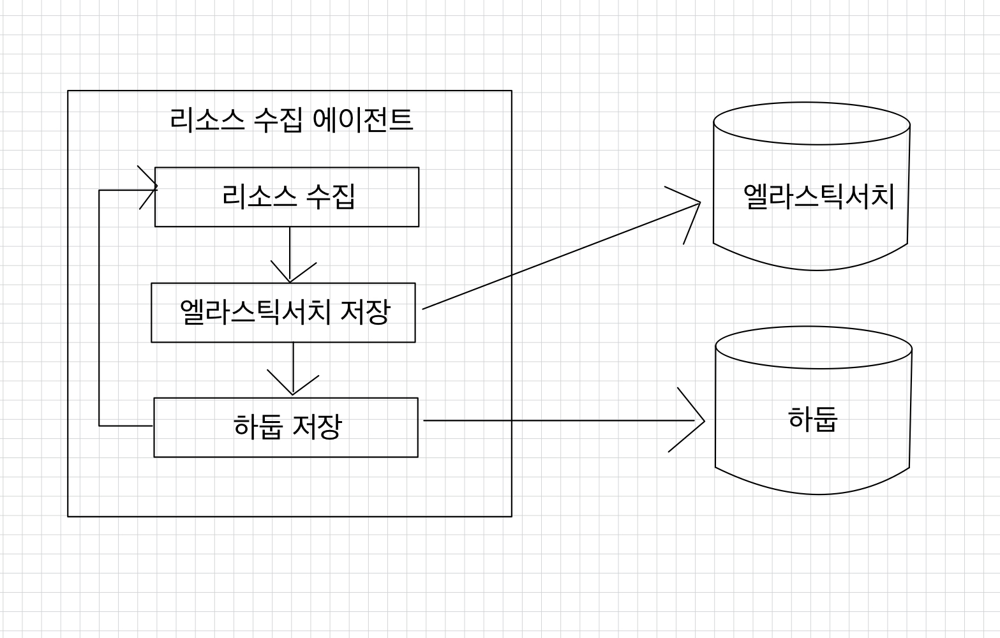  
> [!NOTE]
> 예를 들어, 운영 서버의 주요 리소스인 CPU, 메모리 정보를 수집하는 데이터 파이프라인을 구축한다고 가정해보자.  
> 실시간 리소스를 시간순으로 확인하기 위해 데이터를 엘라스틱서치에 저장하고, 이와 동시에 대용량 적재를 위해 하둡에 적재할 것이다.  
> 위 그림과 같이 카프카를 활용하지 않고 동기적으로 적재 요청을 한다면, 엘라스틱서치 또는 하둡 둘 중 하나에 장애가 발생한다면 더는 적재가 불가능할 수 있다.

<br>

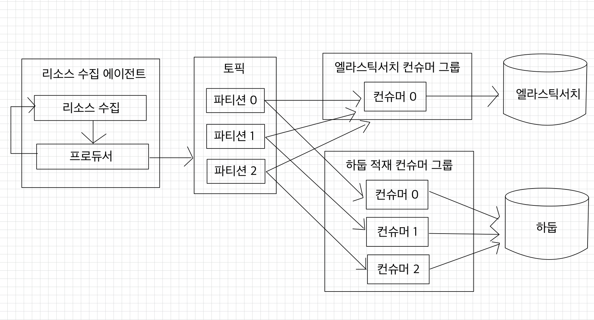  
> [!NOTE]
> 카프카는 이러한 파이프라인을 운영함에 있어 최종 적재되는 저장소의 장애에 유연하게 대응할 수 있도록 각기 다른 저장소에 저장하는 컨슈머를 다른 컨슈머 그룹으로 묶어 각 저장소의 장애에 격리되어 운영할 수 있다.

<br>

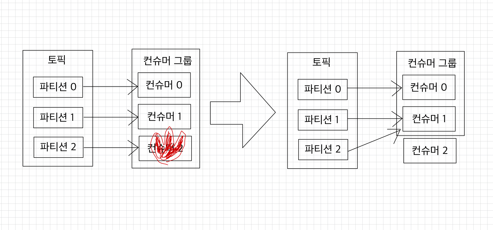  
> [!NOTE]
> 컨슈머 그룹 내에 일부 컨슈머가 장애가 발생하면, 장애가 발생한 컨슈머에 할당된 파티션은 장애가 발생하지 않은 컨슈머로 소유권이 넘어간다.(리밸런싱)  
> 컨슈머 중 1개가 동작을 안 하고 있다면 데이터 처리에 지연이 발생할 수 있으므로 이슈가 발생한 컨슈머를 컨슈머 그룹에서 제외하고 모든 파티션이 지속적으로 데이터를 처리할 수 있도록 가용성을 높여준다.  
> 리밸런싱은 컨슈머가 데이터를 처리하는 도중에 언제든지 발생할 수 있으므로 데이터 처리 중 발생한 리밸런싱에 대응하는 코드를 작성해야 한다.

> [!TIP]
> 리밸런싱은 가용성을 높여주지만 너무 자주 일어나서는 안 된다.  
> 리밸런싱이 발생할 때 파티션의 소유권을 컨슈머로 재할당하는 과정에서 해당 컨슈머 그룹의 컨슈머들이 토픽의 데이터를 읽을 수 없기 때문이다.  
> 그룹 조정자(group coordinator)는 리밸런싱을 발동시키는 역할을 하는데 컨슈머 그룹의 컨슈머가 추가되고 삭제될 때를 감지한다.  
> 카프카 브로커 중 한 대가 그룹 조정자의 역할을 한다.

<br>

### 🚀 컨슈머 오프셋
> [!NOTE]
> 위에서 얘기했지만, 컨슈머는 카프카 브로커로부터 데이터를 어디까지 가져갔는지 커밋(commit)을 통해 기록한다.  
> 특정 토픽의 파티션을 어떤 컨슈머 그룹이 몇 번째 가져갔는지 카프카 브로커 내부에서 사용되는 내부 토픽(`__consumer_offests`)에 기록된다.

<br>

### 🚀 비명시 오프셋 커밋
> [!NOTE]
> 오프셋 커밋의 기본 옵션은 `poll()` 메서드가 수행될 때 일정 간격마다 오프셋을 커밋하도록 `enable.auto.commit=true`로 설정되어 있다.  
> ➡ 일정 간격마다 자동으로 커밋되는 것을 비명시 오프셋 커밋이라고 한다.
> 
> 장점: 편리하다.  
> 단점: `poll()` 메서드 호출 이후에 리밸런싱 또는 컨슈머 강제종료 발생 시 컨슈머가 처리하는 데이터가 중복 또는 유실될 수 있는 가능성이 있다. ➡ 데이터 중복이나 유실을 허용하지 않는 서비스라면 자동 커밋을 사용해서는 안 된다.  

<br>

### 🚀 명시적 오프셋 커밋
> [!NOTE]
> `poll()` 메서드를 호출한 후 반환받은 데이터의 처리가 완료되고 `commitSync()` 메서드를 호출하면 된다.  
> ➡ `commitSync()` 메서드는 `poll()` 메서드가 반환한 레코드의 가장 마지막 오프셋을 기준으로 커밋을 한다.
> 
> 브로커에 커밋 요청을 하고 커밋이 정상적으로 처리되었는지 응답하기까지 기다린다.  
> ➡ 당연히 컨슈머의 처리량에 영향을 끼친다.
> 
> `commitAsync()` 메서드를 사용하면 커밋을 전송하고 응답을 받기 전에 데이터 처리를 수행할 수 있지만, 커밋 요청이 실패했을 경우 현재 처리 중인 데이터의 순서를 보장하지 않으며, 데이터의 중복 처리가 발생할 수 있다.


<br>

### 🚀 컨슈머 내부 구조
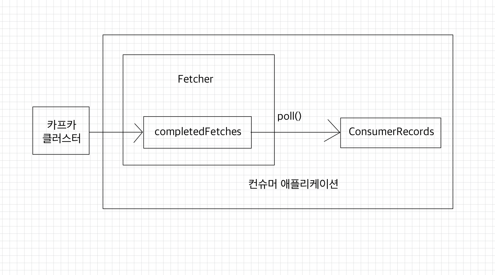  
> [!NOTE]
> 컨슈머는 `poll()` 메서드를 통해 레코드들을 반환받지만 `poll()` 메서드를 호출하는 시점에 클러스터에서 데이터를 가져오는 것은 아니다.
> 1. 컨슈머 애플리케이션 실행
> 2. 내부에서 `Fetcher` 인스턴스가 생성되어 `poll()` 메서드를 호출하기 전에 미리 레코드들을 내부 큐로 가져온다.
> 3. `poll()` 메서드를 호출하면 컨슈머는 내부 큐에 있는 레코드들을 반환받아 처리를 수행한다.

<br>

## ✅ 컨슈머 주요 옵션
> [!NOTE]
> - 필수 옵션
>     - `bootstrap.servers`: 컨슈머가 데이터를 받아올 대상 카프카 클러스터에 속한 브로커의 `host:port`를 1개 이상 작성한다.  
>       2개 이상 브로커 정보를 입력하여 일부 브로커에 이슈가 발생하더라도 접속하는 데에 이슈가 없도록 설정 가능하다.
>     - `key.deserializer`: 레코드의 메시지 `key`를 역직렬화하는 클래스를 지정한다.
>     - `value.deserializer`: 레코드의 메시지 `value`를 역직렬화하는 클래스를 지정한다.
> - 선택 옵션
>     - `group.id`
>         - 컨슈머 그룹 아이디다.
>         - `subscribe()` 메서드로 토픽을 구독하여 사용할 때는 이 옵션을 필수로 넣어야 한다.
>         - 기본값은 `null`이다.
>     - `auto.offset.reset`
>         - 저장된 컨슈머 오프셋이 없을 경우, 어느 오프셋부터 읽을지 선택하는 옵션이다. ➡ 당연히 오프셋이 있다면 무시되는 옵션이다.
>         - `latest`: 가장 높은(가장 최근에 넣은) 오프셋부터 읽기 시작한다.
>         - `earlist`: 가장 낮은(가장 오래전에 넣은) 오프셋부터 읽기 시작한다.
>         - `none`: 컨슈머 그룹이 커밋한 기록이 있는지 찾아보고, 있다면 해당 기록 이후 오프셋부터 읽고, 없다면 오류를 반환한다.
>         - 기본값은 `latest`다.
>     - `enable.auto.commit`: 자동으로 커밋할지 여부(기본값 `true`)
>     - `auto.commit.interval.ms`: 자동 커밋일 경우(`enable.auto.commit=true`) 오프셋 커밋간 간격을 결정한다. (기본값 5000(5초))
>     - `max.poll.records`: `poll()` 메서드를 통해 반환되는 레코드 개수를 지정한다.(기본값 500)
>     - `session.timeout.ms`
>         - 컨슈머가 브로커와 연결이 끊기는 최대 시간
>         - 이 시간 내에 하트 비트(heartbeat)를 전송하지 않으면 브로커는 컨슈머에 이슈가 발생했다고 가정하고 리밸런싱을 시작한다.
>         - 보통 하트비트 시간 간격의 3배로 설정한다.
>         - 기본값은 `10000(10초)`다.
>     - `heartbeat.interval.ms`: 하트비트를 전송하는 시간 간격(기본값 3000(3초))
>     - `max.poll.interval.ms`
>         - `poll()` 메서드를 호출하는 간격의 최대 시간을 지정한다.
>         - `poll()` 메서드를 호출한 이후 데이터를 처리하는 데에 시간이 너무 많이 걸리는 경우 비정상으로 판단하고 리밸런싱을 시작한다.
>         - 기본값: 300000(5분)
>     - `isolation.level`
>         - 트랜잭션 프로듀서가 레코드를 트랜잭션 단위로 보낼 경우 사용한다.
>         - `read_committed`: 커밋이 완료된 레코드만 읽는다.
>         - `read_uncommitted`: 커밋 여부와 관계없이 파티션에 있는 모든 레코드를 읽는다.
>         - 기본값: `read_uncommitted`

<br>

## ✅ 멀티 스레드 컨슈머
- [카프카 컨슈머 멀티 워커 스레드 전략](#-카프카-컨슈머-멀티-워커-스레드-전략)
- [카프카 컨슈머 멀티 스레드 전략](#-카프카-컨슈머-멀티-스레드-전략)

> [!NOTE]
> 카프카는 처리량을 늘리기 위해 파티션과 컨슈머 개수를 늘려서 운영할 수 있다.  
> 파티션을 여러 개로 운영하는 경우 데이터를 병렬처리하기 위해서 파티션 개수와 컨슈머 개수를 동일하게 맞추는 것이 가장 좋은 방법이다.  
> 파티션 개수가 n개라면 동일 컨슈머 그룹으로 묶인 컨슈머 스레드를 최대 n개로 운영할 수 있다.  
> 그러므로 n개의 스레드를 가진 1개의 프로세스를 운영하거나, 1개의 스레드를 가진 프로세스를 n개 운영하는 방법도 있다.

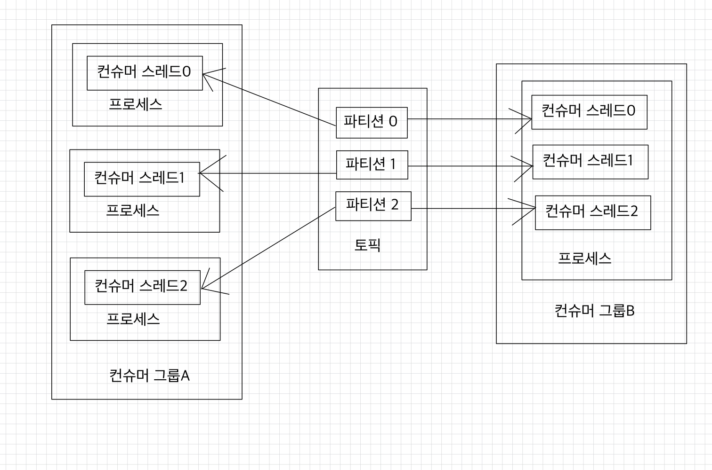

> [!TIP]
> 멀티 스레드를 지원하지 않는 환경이라면 프로세스를 여러 개 실행시키면 되고, 그 외에는 컨슈머 스레드들을 여러 개 실행하는 멀티 스레드 애플리케이션을 운영하면 된다.  
> ➡ 카프카에서 공식적으로 지원하는 라이브러리인 JAVA는 멀티 스레드를 지원하므로 JAVA 애플리케이션에서는 멀티 스레드로 동작하는 먼티 컨슈머 스레드를 개발 및 적용할 수 있다.

<br>

> [!IMPORTANT]
> 멀티 스레드로 컨슈머를 안전하게 운영하기 위해 고려해야할 부분
> 1. 하나의 프로세스 내부에서 스레드가 여러 개 생성되어 실행되기 때문에 하나의 컨슈머 스레드에서 예외적 상황(ex. `OutOfMemoryException`)이 발생할 경우 프로세스 자체가 종료될 수 있고, 다른 컨슈머 스레드에까지 영향을 미칠 수 있다.
>     - 컨슈머 스레드들이 비정상적으로 종료될 경우 데이터 처리에서 중복 또는 유실이 발생할 수 있다.
> 2. 각 컨슈머 스레드 간에 영향이 미치지 않도록 스레드 세이프 로직, 변수를 적용해야 한다.

<br>

멀티코어 CPU를 가진 가상/물리 서버 환경에서 멀티 컨슈머 스레드를 운영하면 제한된 리소스 내에서 최상의 성능을 발휘할 수 있다.

<br>

1. 컨슈머 스레드는 1개만 실행하고, 데이터 처리를 담당하는 워커 스레드(worker thread)를 여러 개 실행하는 멀티 워커 스레드 전략이 있다.
2. 컨슈머 인스턴스에서 `poll()` 메서드를 호출하는 스레드를 여러 개 띄워서 사용하는 컨슈머 멀티 스레드 전략이 있다.

<br>

### 🧑🏻‍💻 카프카 컨슈머 멀티 워커 스레드 전략
브로커로부터 전달받은 레코드들을 병렬로 처리한다면 1개의 컨슈머 스레드로 받은 데이터들을 더욱 향상된 속도로 처리할 수 있다.  
단일 스레드로 데이터를 for 반복구문으로 처리할 경우 이전 레코드의 처리가 끝날 때까지 다음 레코드는 기다리게 되므로 느려진다.

<br>

멀티 스레드를 생성하는 `ExcecutorService` Java 라이브러리를 사용하면 레코드를 병렬처리하는 스레드를 효율적으로 생성하고 관리할 수 있다.  
`Executors`를 사용하여 스레드 개수를 제어하는 스레드 풀(thread pool)을 생성할 수 있는데, 데이터 처리 환경에 맞는 스레드 풀을 사용하면 된다.  
작업 이후 스레드가 종료되어야 한다면 `CachedThreadPool`을 사용하여 스레드를 실행한다.

<br>

[카프카 컨슈머 멀티 워커](https://github.com/kyeoungchan/simple-kafka-consumer/tree/main/src/main/java/com/example/simplekafkaconsumer/multiworker) 참고

<br>

스레드를 이용하면 한 번 `poll()`을 통해 받은 데이터를 병렬처리함으로써 속도의 이점은 확실히 얻을 수 있다.

<br>

**주의할 점**
1. 스레드를 사용함으로써 데이터 처리가 끝나지 않았음에도 불구하고 커밋을 해야하기 때문에 리밸런싱, 컨슈머 장애 시 데이터 유실이 발생할 수 있다.  
   Auto Commit일 경우 데이터 처리가 스레드에서 진행 중임에도 불구하고 다음 `poll()` 메서드 호출 시에 commit을 할 수도 있기 때문에 발생하는 현상이다.
2. 레코드 처리의 역전 현상이다.
    - for 반복구문으로 스레드를 생성하므로 레코드별로 스레드의 생성은 순서대로 진행된다.
    - 그러나 스레드의 처리 시간은 다를 수 있다.  
      ➡ 레코드의 순서가 뒤바뀌는 현상이 발생할 수 있다.

레코드 처리에 있어 중복이 발생하거나 데이터의 역전 현상이 발생해도 되며 매우 빠른 처리 속도가 필요한 데이터 처리에 적합하다.  
서버 리소스(CPU, 메모리 등) 모니터링 파이프라인, IoT 서비스의 센서 데이터 수집 파이프라인이 그 예다.

<br>

### 🧑🏻‍💻 카프카 컨슈머 멀티 스레드 전략
하나의 파티션은 최대 1개의 컨슈머에 할당된다.  
하나의 컨슈머는 여러 파티션에 할당될 수 있다.  
➡ 이런 특징을 잘 살리는 방법은 1개의 애플리케이션에 구독하고자하는 토픽의 파티션 개수만큼 컨슈머 스레드 개수를 늘려서 운영하는 것이다.  
컨슈머 스레드를 늘려서 운영하면 ➡ 각 파티션이 할당되며, ➡ 파티션의 레코드들을 병렬처리할 수 있다.

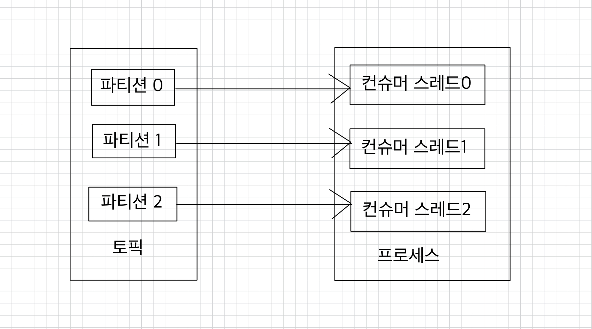

주의해야할 점은 구독하고자 하는 토픽의 파티션 개수만큼 컨슈머 스레드를 운영하는 것이다.  
컨슈머 스레드가 파티션 개수보다 많아지면 할당할 파티션 개수가 더는 없으므로 파티션에 할당하지 못한 컨슈머 스레드는 데이터 처리를 하지 않게 된다.

<br>

[카프카 컨슈머 멀티 스레드](https://github.com/kyeoungchan/simple-kafka-consumer/tree/main/src/main/java/com/example/simplekafkaconsumer/multithread)를 참고해서 1개의 애플리케이션에 n개 컨슈머 스레드를 띄워보자.

<br>

## ✅ 컨슈머 랙
> [!IMPORTANT]
> 컨슈머 랙(`LAG`)은 토픽의 최신 오프셋(`LOG-END-OFFSET`)과 컨슈머 오프셋(`CURRENT-OFFSET`) 간의 차이다.  
> 프로듀서는 계속해서 새로운 데이터를 파티션에 저장하고 컨슈머는 자신이 처리할 수 있는 만큼 데이터를 가져간다.  
> ➡ 컨슈머 랙은 컨슈머가 정상 동작하는지 여부를 확인할 수 있기 때문에 컨슈머 애플리케이션을 운영한다면 필수적으로 모니터링해야 하는 지표다.

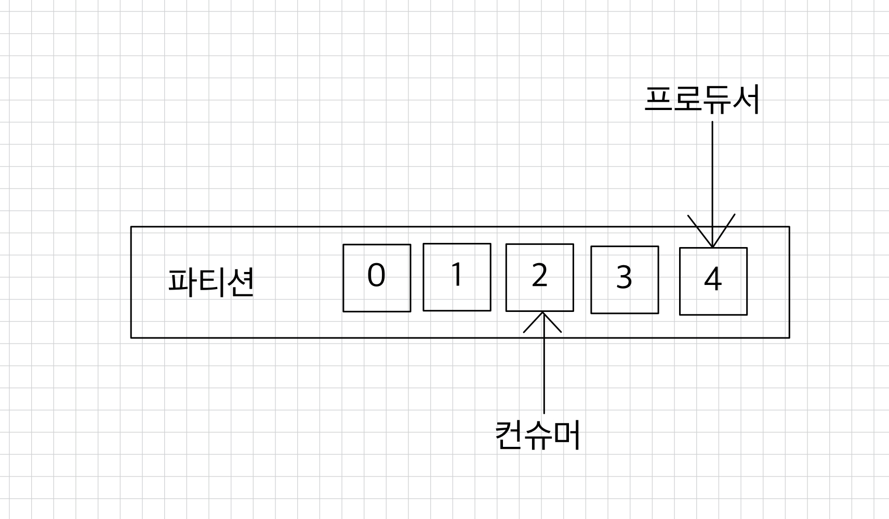    
> [!TIP]
> 위 그림에서 `LOG-END-OFFSET=4`, `CURRENT-OFFSET=2`, `LAG=2`다.

<br>

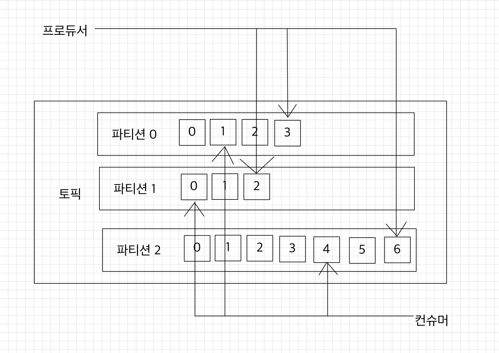  
> [!NOTE]
> 컨슈머 랙은 컨슈머 그룹과 토픽, 파티션별로 생성된다.  
> 1개의 토픽에 3개의 파티션이 있고, 1개의 컨슈머 그룹이 토픽을 구독하여 토픽을 구독하여 데이터를 가져가면 컨슈머 랙은 총 3개다.

<br>

> [!TIP]
> 프로듀서가 보내는 데이터양이 컨슈머의 데이터 처리량보다 크다면 컨슈머 랙은 늘어난다.  
> 반대로, 프로듀서가 보내는 데이터양이 컨슈머의 데이터 처리량보다 적으면 컨슈머 랙은 줄어들고, 최솟값은 0으로 지연이 없음을 뜻한다.

<br>

> [!IMPORTANT]
> 컨슈머 랙을 모니터링하는 것은 카프카를 통한 데이터 파이프라인을 운영하는 데에 핵심적인 역할을 한다.  
> 컨슈머 랙을 모니터링함으로써 컨슈머의 장애를 확인할 수 있고, 파티션 개수를 정하는 데에 참고할 수 있기 때문이다.

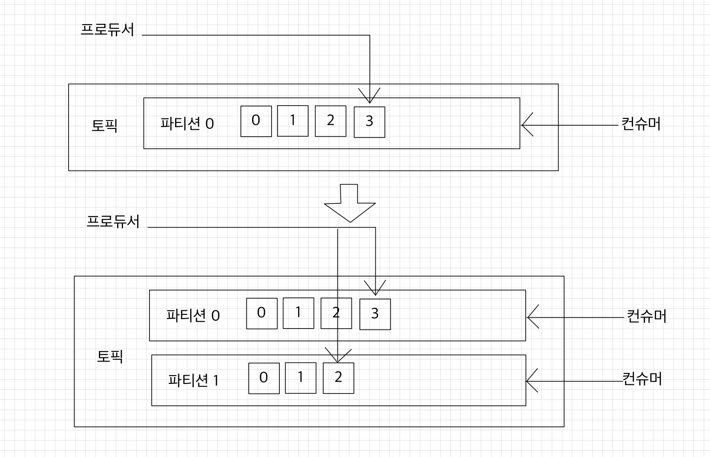

> [!NOTE]
> 예를 들어, 내비게이션의 사용자 데이터를 전송하는 프로듀서가 있다고 가정해보자.  
> 추석, 설날과 같이 내비게이션 사용량이 많을 때 프로듀서가 카프카 클러스터로 전송하는 데이터양은 평소와는 확연히 다르게 올라간다.  
> 반면, 컨슈머는 프로듀서가 전송하는 데이터양이 늘어나더라도 최대 처리량은 한정되어 있기 때문에 추석과 설날에는 컨슈머 랙이 발생할 수 있다.  
> ➡ 지연을 줄이기 위해 일시적으로 파티션 개수와 컨슈머 개수를 늘려서 병렬처리량을 늘리는 방법을 사용할 수 있다.

<br>

> [!TIP]
> 프로듀서 데이터양이 일정함에도 불구하고 컨슈머의 장애로 인해 컨슈머 랙이 증가할 수도 있다.  
> 컨슈머는 파티션 개수만큼 늘려서 병렬처리하며 파티션마다 컨슈머가 할당되어 데이터를 처리하게 한다면 컨슈머 랙이 발생하는 파티션을 발견한다면 해당 파티션에 할당된 컨슈머에 이슈가 있음을 유추할 수 있다.

<br>

컨슈머 랙을 확인하는 방법
1. [카프카 명령어를 사용하는 방법](#-카프카-명령어를-사용하여-컨슈머-랙-조회)
2. [컨슈머 애플리케이션에서 `metrics()` 메서드를 사용하는 방법](#-컨슈머-metrics-메서드를-사용하여-컨슈머-랙-조회)
3. [외부 모니터링 툴을 사용하는 방법](#-외부-모니터링-툴을-사용하여-컨슈머-랙-조회)

<br>

### 🚀 카프카 명령어를 사용하여 컨슈머 랙 조회
`kafka-consumer-groups.sh` 커맨드를 사용하면 컨슈머 랙을 포함한 특정 컨슈머 그룹의 상태를 확인할 수 있다.  
컨슈머 랙을 확인하기 위한 가장 기초적인 방법이다.

```shell
$ bin/kafka-consumer-groups.sh --bootstrap-server my-kafka:9092 \
> --group test-group --describe

Consumer group 'test-group' has no active members.

GROUP           TOPIC           PARTITION  CURRENT-OFFSET  LOG-END-OFFSET  LAG             CONSUMER-ID     HOST            CLIENT-ID
test-group      test            0          7               7               0               -               -               -Kyeongchanui-MacBookPro:kafka
```

카프카 명령어를 통해 컨슈머 랙을 확인하는 방법은 일회성에 그치고 지표를 지속적으로 기록하고 모니터링하기에는 부족하다.  
➡ `kafka-consumer-groups.sh` 커맨드를 통해 컨슈머 랙을 확인하는 것은 테스트용 카프카에서 주로 사용한다.

<br>

### 🚀 컨슈머 `metrics()` 메서드를 사용하여 컨슈머 랙 조회
컨슈머 애플리케이션에서 `KafkaConsumer` 인스턴스의 `metrics()` 메서드를 활용하면 컨슈머 랙 지표를 확인할 수 있다.

컨슈머 인스턴스가 제공하는 컨슈머 랙 관련 모니터링 지표
1. `records-lag-max`
2. `records-lag`
3. `records-lag-avg`

```java
for (Map.Entry<MetricName, ? extends Metric> entry : consumer.metrics().entrySet()) {
    if ("records-lag-max".equals(entry.getKey().name()) |
        "records-lag".equals(entry.getKey().name()) |
        "records-lag-avg".equals(entry.getKey().name())) {
      Metric metric = entry.getValue();
      log.info("{}: {}", entry.getKey().name(), metric.metricValue());
    }
}
```

`metrics()` 메서드로 컨슈머 랙을 확인하는 방법의 3가지 문제점
1. 컨슈머가 정상 동작할 경우에만 확인할 수 있다.  
   만약 컨슈머 애플리케이션이 비정상적으로 종료된다면 더는 컨슈머 랙을 모니터링할 수 없다.
2. 모든 컨슈머 애플리케이션에 컨슈머 랙 모니터링 코드를 중복해서 작성해야 한다.  
   특정 컨슈머 그룹에 해당하는 애플리케이션이 수집하는 컨슈머 랙은 자기 자신 컨슈머 그룹에 대한 컨슈머 랙만 한정되기 때문이다.
3. 컨슈머 랙을 모니터링하는 코드를 추가할 수 없는 카프카 서드 파티(third party) 애플리케이션의 컨슈머 랙 모니터링이 불가능하다.

<br>

### 🚀 외부 모니터링 툴을 사용하여 컨슈머 랙 조회
컨슈머 랙을 모니터링하는 가장 최선의 방법은 외부 모니터링 툴을 사용하는 것이다.  
데이터독(Datadog), 컨플루언트 컨트롤 센터(Confluent Control Center)와 같은 카프카 클러스터 종합 모니터링 툴을 사용하면 카프카 운영에 필요한 다양한 지표를 모니터링할 수 있다.


외부 모니터링툴은 카프카 클러스터에 연결된 모든 컨슈머, 토픽들의 랙 정보를 한 번에 모니터링할 수 있다는 장점이 있다.  
또한, 모니터링 툴들은 클러스터와 연동되어 컨슈머의 데이터 처리와는 별개로 지표를 수집하기 때문에 데이터를 활용하는 프로듀서나 컨슈머의 동작에 영향을 미치지 않는다는 장점이 있다.

<br>

#### 💡 카프카 버로우
컨슈머 랙 모니터링만을 위한 툴로 오픈소스로 공개되어 있는 버로우(Burrow)가 있다.  
버로우는 링크드인에서 개발하여 오픈소스로 공개한 컨슈머 랙 체크 툴로서, REST API를 통해 컨슈머 그룹별로 컨슈머 랙을 확인할 수 있다.

| 요청 메서드 |                    호출 경로                     | 설명                           |
|:------:|:--------------------------------------------:|:-----------------------------|
|  GET   |                /burrow/admin                 | 버로우 헬스 체크                    |
|  GET   |                  /v3/kafka                   | 버로우와 연동 중인 카프카 클러스터 리스트      |
|  GET   |             /v3/kafka/{클러스터 이름}              | 클러스터 정보 조회                   |
|  GET   |         /v3/kafka/{클러스터 이름}/consumer         | 클러스터에 존재하는 컨슈머 그룹 리스트        |
|  GET   |          /v3/kafka/{클러스터 이름}/topic           | 클러스터에 존재하는 토픽 리스트            |
|  GET   |    /v3/kafka/{클러스터 이름}/topic/{컨슈머 그룹 이름}     | 컨슈머 그룹의 컨슈머 랙, 오프셋 정보 조회     |
|  GET   | /v3/kafka/{클러스터 이름}/topic/{컨슈머 그룹 이름}/status | 컨슈머 그룹의 파티션 정보, 상태 조회        |
|  GET   |  /v3/kafka/{클러스터 이름}/topic/{컨슈머 그룹 이름}/lag   | 컨슈머 그룹의 파티션 정보, 상태, 컨슈머 랙 조회 |
| DELETE |    /v3/kafka/{클러스터 이름}/topic/{컨슈머 그룹 이름}     | 버로우에서 모니터링 중인 컨슈머 그룹 삭제      |
|  GET   |      /v3/kafka/{클러스터 이름}/topic/{토픽 이름}       | 토픽 상세 조회                     |

<br>

버로우는 다수의 카프카 클러스터를 동시에 연결하여 컨슈머 랙을 확인한다.  
그러나 모니터링을 위해 컨슈머 랙 지표를 수집, 적재, 알람 설정을 하고 싶다면 별도의 저장소(인플럭스디비, 엘라스틱서치 등)와 대시보드(그라파나, 키바나 등)를 구축해야 한다.

<br>

버로우의 기능 중 가장 돋보이는 것은 컨슈머와 파티션의 상태를 단순히 컨슈머 랙의 임계치(threshold)로 나타내지 않았다는 점이다.  
특정 파티션의 컨슈머 랙이 특정 시점에서 100만이 넘었다고 컨슈머 또는 파티션에 이슈가 있다고 단정지을 수는 없다.  
프로듀서가 데이터를 많이 보내면 일시적으로 임계치가 넘어가는 현상이 발생할 수도 있기 때문이다.

버로우에서는 임계치가 아닌 슬라이딩 윈도우(sliding window) 계산을 통해 문제가 생긴 파티션과 컨슈머의 상태를 표현한다.  
➡ 버로우에서 컨슈머 랙의 상태를 표현하는 것을 컨슈머 랙 평가라고 부른다.  
➡ 컨슈머 랙과 파티션의 상태를 슬라이딩 윈도우로 계산하면 결과가 나온다.
- 파티션의 상태: OK, STALLED, STOPPED
- 컨슈머의 상태: OK, WARNING, ERROR

<br>

**컨슈머 랙 모니터링 아키텍처 준비물**
- 버로우: REST API를 통해 컨슈머 랙을 조회할 수 있다.
- 텔레그래프: 데이터 수집 및 전달에 특화된 툴. 버로우를 조회하여 데이터를 엘라스틱서치에 전달한다.
- 엘라스틱서치: 컨슈머 랙 정보를 담는 저장소
- 그라파나: 엘라스틱서치의 정보를 시각화하고 특정 조건에 따라 슬랙 알람을 보낼 수 있는 웹 대시보드

<br>

## ✅ 컨슈머 배포 프로세스
지속적인 발전을 위해 애플리케이션 내부 로직의 변경과 배포는 필수다.  
카프카 컨슈머 애플리케이션 운영 시 로직 변경으로 인한 배포를 하는 방법은 크게 2가지가 있다.
1. 중단 배포
2. 무중단 배포

만약 짧은 시간동안 중단이 되어 지연이 발생하더라도 서비스 운영에 이슈가 없다면 중단 배포를 사용하면 된다.  
반면, 중단이 발생하면 서비스의 영향이 클 경우에는 무중단 배포를 수행해야 한다.

<br>

#### 💡 중단 배포
중단 배포는 컨슈머 애플리케이션을 완전히 종료한 이후에 개선된 코드를 가진 애플리케이션을 배포하는 방식이다.  
이 방법은 한정된 서버 자원을 운영하는 기업에 적합하다.

중단 배포는 기존 애플리케이션을 완전히 종료한 이후에 신규 애플리케이션을 배포, 실행하여 버전을 올리는 방식이다.  
컨슈머 애플리케이션이 완전히 종료된 이후 신규 애플리케이션이 배포되기 때문에, 기존 컨슈머 애플리케이션이 종료됐을 때 토픽의 데이터를 가져갈 수 없고, 컨슈머 랙이 늘어난다.  
컨슈머 랙이 늘어난다는 것은 지연이 발생한다는 뜻으로, 신규 컨슈머 애플리케이션의 배포에 이슈가 생겨 배포와 실행이 늦어지면 꼼짝없이 해당 파이프라인을 운영하는 서비스는 계속해서 중단된다.  
➡ 신뢰성 있는 배포 시스템을 가진 기업에서 중단 배포를 사용하는 것을 추천한다.

중단 배포를 사용할 경우 새로운 로직이 적용된 신규 애플리케이션의 실행 전후를 명확하게 특정 오프셋 지점으로 나눌 수 있다는 점이 장점이다.  
➡ 신규 애플리케이션에 이슈가 발생해서 롤백할 때 유용하다.

<br>

#### 💡 무중단 배포
컨슈머의 중단이 불가능한 애플리케이션의 신규 로직 배포가 필요한 경우에는 무중단 배포가 필요하다.  
무중단 배포는 인스턴스의 발급과 반환이 다소 유연한 가상 서버를 사용하는 경우에 유용하다.

##### 🧑🏻‍💻 블루/그린 배포
이전 버전 애플리케이션과 신규 버전 애플리케이션을 동시에 띄워놓고 트래픽을 전환하는 방법이다.  
이 방법은 파티션 개수와 컨슈머 개수를 동일하게 실행하는 애플리케이션을 운영할 때 유용하다.  
파티션 개수와 컨슈머 개수를 동일하게 운영하고 있지 않다면 일부 파티션은 기존 애플리케이션에 할당되고 일부 파티션은 신규 애플리케이션에 할당되어 섞이기 때문이다.

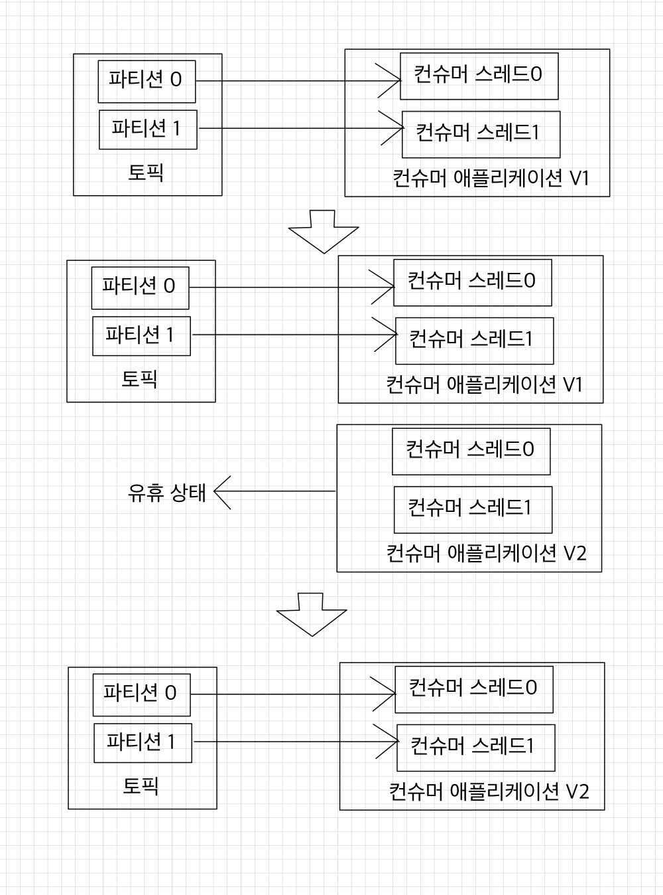

신규 버전 애플리케이션이 준비되면 기존 애플리케이션을 중단하면 된다.  
리밸런싱이 발생하면서 파티션은 모두 신규 컨슈머와 연동된다.  
블루/그린 배포 리밸런스가 한 번만 발생하기 때문에 많은 수의 파티션을 운영하는 경우에도 짧은 리밸런스 시간으로 배포를 수행할 수 있다.

<br>

##### 🧑🏻‍💻 롤링 배포
롤링 배포는 블루/그린 배포의 인스턴스 할당과 반환으로 인한 리소스 낭비를 줄이면서 무중단 배포를 할 수 있다.  
롤링 배포의 중요한 점은 파티션 개수가 인스턴스 개수와 같거나, 그보다 많아야 한다는 점이다.

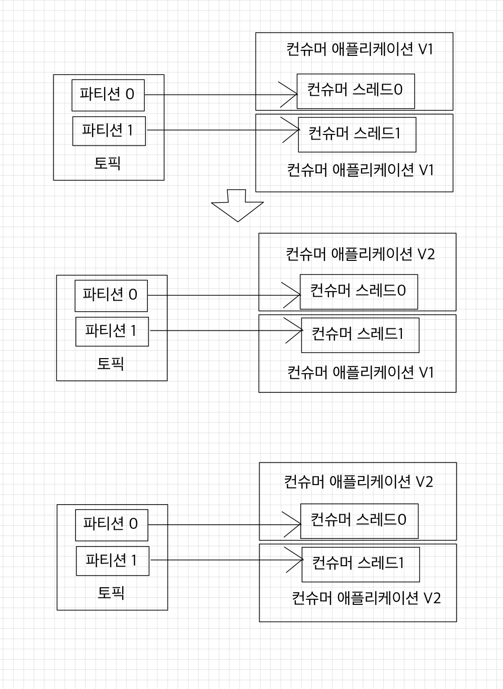

예를 들어, 파티션을 2개로 운영하는 토픽이 있다면 롤링 배포를 위해 최소한 2개의 인스턴스가 필요하다.
1. 2개의 인스턴스 중 1개의 인스턴스를 신규 버전으로 배포하고 모니터링한다.
2. 나머지 1개의 인스턴스를 신규 버전으로 배포하여 롤링 업그레이드를 진행한다.

➡ 이경우, 리밸런스가 총 2번 발생한다.  
파티션 개수가 많을수록 리밸런스 시간도 길어지므로 파티션 개수가 많지 않은 경우에 효과적인 방법이다.

<br>

##### 🧑🏻‍💻 카나리 배포
카나리 배포를 이용하면 많은 데이터 중 일부분을 신규 버전의 애플리케이션에 먼저 배포함으로써 이슈가 없는지 사전에 탐지할 수 있다.

예를 들어, 100개 파티션으로 운영하는 토픽이 있을 경우 1개 파티션에 컨슈머를 따로 배정하여 일부 데이터에 대해 신규 버전의 애플리케이션이 우선적으로 처리하는 방식으로 사전 테스트할 수 있다.  
카나리 배포로 사전 테스트가 완료되면 나머지 99개 파티션에 할당된 컨슈머는 롤링 또는 블루/그린 배포를 수행하여 무중단 배포가 가능하다.

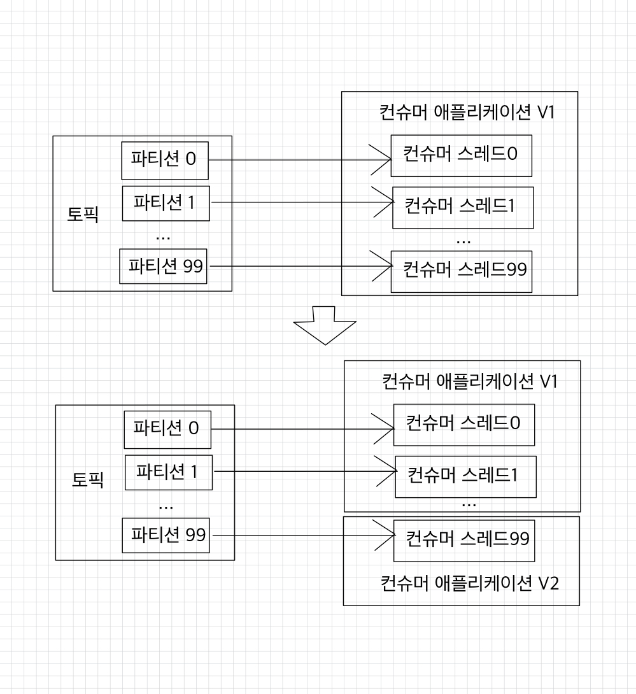


<br>

**참고 자료**  
[아파치 카프카 애플리케이션 프로그래밍 with 자바](https://product.kyobobook.co.kr/detail/S000001842177)