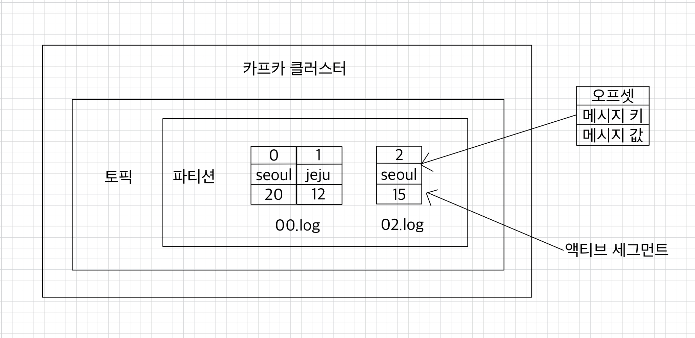
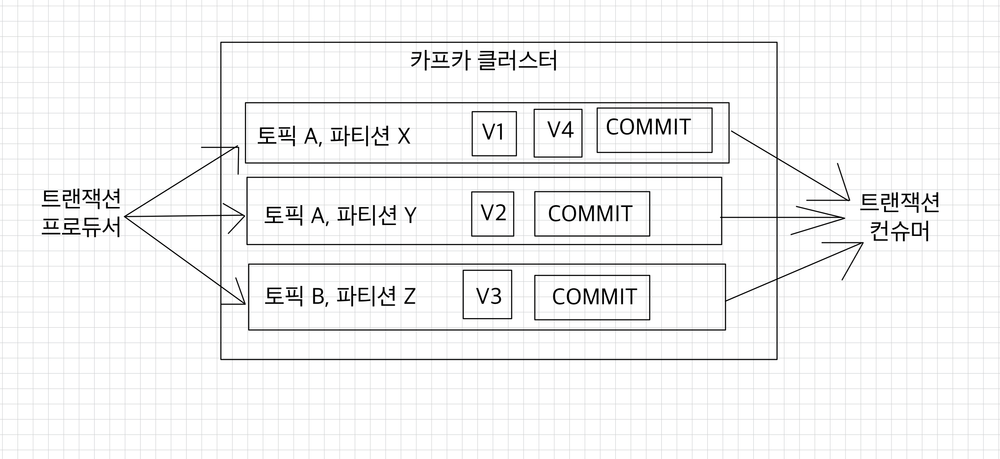

- [토픽과 파티션](#-토픽과-파티션)
  - [적정 파티션 개수](#-적정-파티션-개수)
  - [토픽 정리 정책(cleanup.policy)](#-토픽-정리-정책cleanuppolicy)
  - [토픽 압축 정책(compact policy)](#-토픽-압축-정책compact-policy)
  - [ISR(In-Sync-Replicas)](#-isrin-sync-replicas)
- [카프카 프로듀서](#-카프카-프로듀서)
  - [acks 옵션](#-acks-옵션)
  - [멱등성(idempotence) 프로듀서](#-멱등성idempotence-프로듀서)
  - [트랜잭션(transaction) 프로듀서](#-트랜잭션transaction-프로듀서)

## ❗️ 토픽과 파티션
카프카를 사용하는 것은 토픽을 만들면서 시작된다.  
토픽을 삭제하면 데이터는 삭제되고 파이프라인은 중단된다.  
➡ 데이터의 생명주기 한가운데에 토픽이 있다.

### ✅ 적정 파티션 개수
토픽의 파티션 개수는 카프카의 성능과 관련이 있다.  
<br>

토픽생성 시 파티션 개수 고려사항
- 데이터 처리량
- 메시지 키 사용 여부
- 브로커, 컨슈머 영향도

<br>

파티션은 카프카의 병렬처리의 핵심이다.  
파티션의 개수가 많아질수록 1:1 매핑되는 컨슈머의 개수가 늘어나기 때문에 파티션 개수를 정할 때는 해당 토픽에 필요한 데이터 처리량을 측정하여 정하는 것이 중요하다.  

파티션 개수를 늘리고, 파티션 개수만큼 컨슈머를 추가하는 방법은 데이터 처리량을 늘리는 가장 확실한 방법이다.  
만약 프로듀서가 보내는 데이터가 초당 1,000 레코드이고, 컨슈머가 처리할 수 있는 데이터가 초당 100 레코드라면 최소한으로 필요한 파티션 개수는 10개이다.  
`프로듀서 전송 데이터량 < 컨슈머 데이터 처리량 X 파티션 개수`  
만약 전체 컨슈머 데이터 처리량이 프로듀서가 보내는 데이터보다 적다면 컨슈머 렉이 생기고, 데이터 처리 지연이 발생하게 된다.  
➡ 컨슈머 전체 데이터 처리량이 프로듀서 데이터 처리량보다 많아야 한다.  

<br>

만약 데이터 지연이 절대 발생하면 안 된다면 프로듀서가 보내는 데이터의 최대치를 데이터 생성량으로 잡고 계산하면 된다.  
반면, 데이터의 지연이 일부 발생해도 괜찮다면 프로듀서가 보내는 데이터의 최대치를 잡지 않아도 된다.  

<br>

파티션 개수를 무조건 늘리는 것이 능사는 아니다.  
파티션 개수를 늘리게 됨에 따라 컨슈머, 브로커의 부담이 있기 때문이다.  
➡ 데이터를 처리함에 잇어 지연 발생에 따른 서비스 영향도를 같이 고려하면서 파티션 개수를 정하는 것이 좋다.

<br>

메시지 키 사용 여부에 따라 데이터 처리 순서를 지켜야 하는 경우, 파티션 개수를 신중히 결정해야 한다.  
메시지 키를 사용하면 프로듀서가 토픽으로 데이터를 보낼 때 메시지 키를 해시 변환하여 메시지 키를 파티션에 매칭시킨다.  

만약 파티션 개수가 달라지면 이미 매칭돤 파티션과 메시지 키의 매칭이 깨지고, 전혀 다른 파티션에 데이터가 할당된다.  
➡ 메시지 키를 사용하는 컨슈머는 특정 메시지 키의 순서를 더는 보장받지 못한다.

<br>

메시지 키를 사용하고, 컨슈머에서 메시지 처리 순서가 보장되어야 한다면 최대한 파티션의 변화가 발생하지 않는 방향으로 운영해야 한다.  
만약 파티션 개수가 변해야 하는 경우에는 기존에 사용하던 메시지 키의 매칭을 그대로 가져가기 위해 커스텀 파티셔너를 개발 적용해야 한다.  
➡ 메시지 키별로 처리 순서를 보장하기 위해서는 파티션 개수를 프로듀서가 전송하는 데이터양보다 더 넉넉하게 잡고 생성하는 것이 좋다.  

메시지 키를 사용하지만 데이터 처리 순서를 지키지 않아도 된다면 파티션 개수를 처음부터 넉넉하게 잡지 않아도 된다.  
데이터의 양에 따라 파티션을 늘리면 되기 때문이다.

<br>

마지막으로 파티션 개수를 정할 때 브로커와 컨슈머의 영향도를 고려해야 한다.  
카프카에서 파티션은 각 브로커의 파일 시스템을 사용하기 때문에 파티션이 늘어나는 만큼 브로커에서 접근하는 파일 개수가 많아진다.  
그런데 운영체제에서는 프로세스당 열 수 있는 파일 최대 개수를 제한하고 있다.  
➡ 데이터양이 많아져서 파티션 개수를 늘러야 하는 상황이라면 브로커당 파티션 개수를 확인하고 진행한다.  
만약 브로커가 관리하는 파티션 개수가 너무 많다면 파티션 개수를 분산하기 위해 브로커 개수를 늘리는 방안도 같이 고려해야 한다.

<br>

### ✅ 토픽 정리 정책(cleanup.policy)
토픽의 데이터는 시간 또는 용량에 따라 삭제 규칙을 적용할 수 있다.  
또는 삭제를 원치 않는다면 카프카 클러스터가 살아있는 한 토픽의 데이터를 삭제하지 않도록 설정할 수도 있다.  
AWS MSK 또는 EC2의 EBS를 사용한다면 저장소 용량이 늘어남에 따라 카프카 운영 비용도 함께 늘어날 수 있다.

<br>

**토픽 삭제 정책(delete policy)**  
토픽을 운영하면서 일반적으로 대부분의 토픽의 `delete.policy`를 `delete`로 설정한다.  
명시적으로 토픽의 데이터를 삭제하는 것을 뜻한다.  
토픽의 데이터를 삭제할 때는 세그먼트 단위로 삭제를 진행한다.

<br>

세그먼트: 토픽의 데이터를 저장하는 명시적인 파일 시스템 단위  
세그먼트는 파티션마다 별개로 생성되며, 세그먼트의 파일 이름은 오프셋 중 가장 작은 값이 된다.  
세그먼트는 여러 조각으로 나뉘는데 `segment.bytes` 옵션으로 1개의 세그먼트 크기를 설정할 수 있다.  
`segment.bytes` 크기보다 커질 경우에는 기존에 적재하던 세그먼트 파일을 닫고 새로운 세그먼트를 열어서 데이터를 저장한다.  
데이터를 저장하기 위해 사용 중인 세그먼트를 액티브 세그먼트라고 한다.  
  

<br>

삭제 정책이 실행되는 시점은 시간 또는 용량이 기준이 된다.  
- `retention.ms`는 토픽의 데이터를 유지하는 시간을 밀리초(millisecond)로 설정할 수 있다.    
  카프카는 일정 주기마다 세그먼트 파일의 마지막 수정 시간과 `retention.ms`를 비교하는데, 세그먼트 파일의 마지막 수정 시간이 `retention.ms`를 넘어가면 세그먼트는 삭제된다.  
- `retention.bytes`는 토픽의 최대 데이터 크기를 제어한다.  
  `retention.bytes`를 넘어간 세그먼트 파일들은 삭제된다.

삭제된 데이터는 복구할 수 없다.

<br>

### ✅ 토픽 압축 정책(compact policy)
토픽의 압축 정책은 일반적으로 생각하는 zip이나 tar 압축(compression)관느 다른 개념이다.  
여기서 압축이란, 메시지 키별로 해당 메시지 키의 레코드 중 오래된 데이터를 삭제하는 정책을 뜻한다.  
메시지 키를 기준으로 오래된 데이터를 삭제하기 때문에 삭제 정책과 다르게 1개 파티션에서 오프셋의 증가가 일정하지 않을 수 있다.  
예를 들어, 아래와 같이 파티션에 메시지가 구성되어 있다.

|오프셋|메시지 키|메시지 값|
|:---:|:---:|:---:|
|0|K1|V1|
|1|K2|V1|
|2|K3|v1|
|3|k3|V2|
|4|K1|V2|
|5|K2|V2|
|6|K1|V3|

압축하면 다음과 같이 구성된다.

|오프셋|메시지 키|메시지 값|
|:---:|:---:|:---:|
|3|k3|V2|
|5|K2|V2|
|6|K1|V3|

토픽 압축 정책은 카프카 스트림즈의 KTable과 같이 메시지 키를 기반으로 데이터를 처리할 경우 유용하다.  
데이터의 흐름이 아닌 가장 마지막 업데이트된 메시지 키의 데이터가 중요할 경우 가장 최신의 데이터를 제외한 나머지 데이터들을 삭제할 수 있기 때문이다.  

<br>

압축 정책은 액티브 세그먼트를 제외한 나머지 세그먼트들에 한해서만 데이터를 처리한다.

<br>

`min.cleanable.dirty.ratio`
- 데이터의 압축 시작 시점은 `min.cleanable.dirty.ratio` 옵션값을 따른다.
- `min.cleanable.dirty.ratio` 옵션값은 액티브 세그먼트를 제외한 세그먼트에 남아있는 데이터의 tail 영역의 레코드 개수와 head 영역의 레코드 개수의 비율을 뜻한다.
  - tail 영역
    - 브로커의 압축 정책에 의해 압축이 완료된 레코드들을 뜻한다.  
    - tail 영역의 레코드들은 clean 로그라고 부른다.
    - 압축이 완료됐기 때문에 tail 영역에는 중복된 메시지 키가 없다.
  - head 영역
    - dirty 레코드라고 부른다.
    - 압축이 되기 전 레코드들이 있으므로 중복된 메시지 키를 가진 레코드들이 있다.
  - dirty ratio
    - dirty 영역의 메시지 개수를 압축 대상 세그먼트에 남아있는 데이터의 총 레코드 수(dirty 영역 메시지 개수 + clean 영역 메시지 개수)로 나눈 비율
    - 액티브 세그먼트의 레코드는 계산에서 제외해야 한다!
  - 만약 `min.cleanable.dirty.ratio` 옵션값을 0.5로 설정할 경우, dirty 비율이 0.5가 넘어가면 압축이 수행된다.

`min.cleanable.dirty.ratio`값을 0.9와 같이 크게 설정하면 한 번 압축을 할 때 많은 데이터가 줄어드므로 압축효과가 좋지만, 비율이 될 때까지 용량을 차지하므로 용량 효율이 좋지 않다.  
반면, `min.cleanable.dirty.ratio`를 0.1과 같이 작게 설정하면 압축이 더 자주 일어나 계속 메시지 키의 최신 데이터만 유지할 수 있다.  
하지만 압축이 자주 발생하는 만큼 브로커에 부담을 줄 수 있다.  
토픽별로 데이터의 특성에 맞는 적절한 `min.cleanable.dirty.ratio`값을 설정하는 것이 중요하다.  

<br>

### ✅ ISR(In-Sync-Replicas)
ISR은 리더 파티션과 팔로워 파티션이 모두 싱크가 된 상태를 뜻한다.  
복제 개수가 2인 토픽을 가정해보자.  
이 토픽에는 리더 파티션 1개와 팔로워 파티션 1개가 존재할 것이다.  
리더 파티션에 0부터 3의 오프셋이 있다고 가정할 때, 팔로워 파티션에 동기화가 완료되려면 0부터 3까지 오프셋이 존재해야 한다.  
팔로워 파티션에 오프셋이 하나라도 부족하면 동기화가 완벽하게 된 상태가 아니다.

<br>

ISR이라는 용어가 나온 이유는 팔로워 파티션이 리더 파티션으로부터 데이터를 복제하는 데에 시간이 걸리기 때문이다.  
프로듀서가 특정 파티션에 데이터를 저장하는 작업은 리더 파티션을 통해 처맇나다.  
이때 리더 파티션에 새로운 레코드가 추가되어 오프셋이 증가하면 팔로워 파티션이 위치한 브로커는 리더 파티션의 데이터를 복제한다.  
리더 파티션에 데이터가 적재된 이후 팔로워 파티션이 복제하는 시간차 때문에 리더 파티션과 팔로워 파티션 간에 오프셋 차이가 발생한다.  
이런 차이를 모니터링하기 위해 리더 파티션은 `replica.lag.time.max.ms`값만큼의 주기를 가지고 팔로워 파티션이 데이터를 복제하는지 확인한다.  
➡ 만약 팔로워 파티션이 `replica.lag.time.max.ms`값보다 더 긴 시간 동안 데이터를 가져가지 않는다면, 해당 팔로워 파티션에 문제가 생긴 것으로 판단하고 ISR 그룹에서 제외한다.

<br>

ISR로 묶인 리더 파티션과 팔로워 파티션은 파티션에 존재하는 데이터가 모두 동일하다.  
➡ 해당 팔로워 파티션은 리더 파티션으로 새로 선출될 자격을 가진다.  
ISR로 묶이지 못한 팔로워 파티션은 리더로 선출될 자격이 없다.

<br>

일부 데이터 유실이 발생하더라도 서비스를 중단하지 않고 지속적으로 토픽을 사용하고 싶다면 ISR이 아닌 팔로워 파티션을 리더로 선출하도록 선출할 수 있다.  

`unclean.leader.election.enable` 옵션
- `false`로 설정할 경우, ISR이 아닌 팔로워 파티션을 리더 파티션으로 선출하지 않는다.  
  ➡ 리더 파티션이 존재하는 브로커가 다시 시작되기까지 기다린다.  
  ➡ 리더 파티션이 존재하는 브로커가 다시 시작될 때까지 기다리는 것은 토픽을 사용하는 서비스가 중단됨을 뜻한다.  
  대신, 데이터의 유실은 발생하지 않는다.
- `true`로 설정하는 경우, ISR이 아닌 팔로워 파티션, 즉 동기화되지 않은 팔로워 파티션도 리더로 선출될 수 있다.  
  ➡ 동기화되지 않은 일부 데이터는 유실될 수 있다.  
  일부 데이터가 유실되는 대신 토픽을 사용하는 서비스의 중단은 발생하지 않는다.

<br>

`unclean.leader.election.enable` 옵션 값은 서비스의 운영 정책에 따라 달라진다.  
`unclean.leader.election.enable` 옵션은 토픽별로 설정할 수 있으며, 토픽 생성 시 설정하는 방법은 다음과 같다.
```shell
$ bin/kafka-topics.sh --bootstrap-server my-kafka:9092 \
--create --topic my-topic \
--config unclean.leader.election.enable=false
```

<br>

## ❗️ 카프카 프로듀서
프로듀서는 카프카에 데이터를 저장하는 첫 단계이다.  
카프카 클러스터는 3대 이상의 브로커로 이루어져 있어서 일부 브로커에 이슈가 생기더라도 데이터의 유실을 막을 수 있다.  
그러나 유실을 막기 위해서는 프로듀서에서 제공하는 다양한 옵션을 함께 사용해야 한다.

### ✅ `acks` 옵션
0, 1, all(또는 -1) 값을 가질 수 있다.  
이 옵션을 통해 프로듀서가 전송한 데이터가 카프카 클러스터에 얼마나 신뢰성 높게 저장할지 지정할 수 있다.  

<br>

**acks=0**  
`acks`를 0으로 설정하는 것은 프로듀서가 리더 파티션으로 데이터를 전송했을 때 리더 파티션으로 데이터가 저장되었는지 확인하지 않는다는 뜻이다.  
리더 파티션은 데이터가 저장된 이후에 데이터가 몇 번째 오프셋에 저자오디었는지 리턴한다.  
➡ `acks`가 0으로 설정되어 있다면 프로듀서는 리더 파티션에 데이터가 저장되었는지 여부에 대한 응답값을 받지 않는다.

<br>

프로듀서에는 데이터의 전송이 실패했을 때 재시도를 할 수 있도록 `retries` 옵션을 설정할 수 있는데, `acks`가 0일 때는 프로듀서가 데이터를 전송하자마자 저장되었음을 가정하기 때문에 재시도를 하지 않고, `retries` 옵션은 무의미해진다.  

`acks`를 0으로 설정했을 경우, 프로듀서와 브로커 사이의 네트워크 오류나 브로커의 이슈 등으로 인해 데이터가 유실되더라도 프로듀서는 리더 파티션으로부터 응답값을 받지 않기 때문에 지속적으로 다음 데이터를 보내기 때문에 훨씬 빠르다는 장점이 있다.  
➡ 데이터가 일부 유실이 발생하더라도 전송 속도가 중요한 경우에는 이 옵션값을 사용하면 좋다.

<br>

**acks=1**  
`acks`를 1로 설정한다면 프로듀서는 보낸 데이터가 리더 파티션에만 정상적으로 적재되었는지 확인한다.  
만약 리더 파티선에 정상적으로 적재되지 않았다면 리더 파티션에 적재될 때까지 재시도할 수 있다.  

그러나 리더 파티션에 정상 적재되었음을 보장하더라도 데이터는 유실될 수 있다.  
복제 개수를 2개 이상으로 운영할 경우 리더 파티션에 적재가 완료되더라도 팔로워 파티션에는 아직 데이터 동기화가 되지 않을 수 있는데, 팔로워 파티션이 데이터를 복제하기 직전에 리더 파티션이 있는 브로커에 장애가 발생하면 동기화되지 못한 일부 데이터가 유실될 수 있기 때문이다.  

`acks`를 1로 설정하면 리더 파티션에 데이터가 적재될 때까지 기다린 뒤 응답 값을 받기 때문에 `acks`를 0으로 설정하는 것에 비해 전송 속도가 느리다.  

<br>

**acks=all 또는 acks=-1**  
`acks`를 `all` 또는 -1로 설정할 경우 프로듀서는 보낸 데이터가 리더 파티션과 팔로워 파티션에 모두 정상적으로 적재되었는지 확인한다.  
리더 파티션뿐만아니라 팔로워 파티션까지 데이터가 적재되었는지 확인하기 때문에 0 또는 1 옵션보다도 속도가 느리다.  
그러나 팔로워 파티션에 데이터가 정상 적재되었는지 기다리기 때문에 일부 브로커에 장애가 발생하더라도 프로듀서는 안전하게 데이터를 전송하고 저장할 수 있음을 보장할 수 있다.  

`acks`를 `all` 또는 -1로 설정할 경우 토픽 단위로 설정 가능한 `min.insync.replicas` 옵션값에 따라 데이터의 안전성이 달라진다.  
`all` 옵션값은 모든 리더 파티션과 팔로워 파티션의 적재를 뜻하는 것은 아니고, ISR에 포함된 파티션들을 뜻하는 것이기 때문이다.  
➡ `min.insync.replicas` 옵션값이 1이라면 ISR 중 최소 1개의 파티션에 데이터가 적재됐는지 확인 ➡ 리더 파티션이 적재되었는지만 확인 ➡ `acks=1`과 동일한 동작을 하게 된다.

실제 카프카 클러스터를 운영하면서 브로커가 동시에 2개가 중단되는 일은 극히 드물기 때문에 `min.insync.replicas=2`로 설정한다면 데이터는 유실되지 않는다고 볼 수 있다.

<br>

`min.insync.replicas`를 설정할 때는 복제 개수도 함께 고려해야 한다.  
운영하는 카프카 브로커 개수가 `min.insync.replicas` 옵션값보다 작은 경우에는 프로듀서가 더는 데이터를 전송할 수 없기 때문이다.

예를 들어, 복제 개수가 3이고, `min.insync.replicas` 옵션값을 3으로 지정했을 경우를 살펴보자.  
브로커 3대 중 1대에 이슈가 발생하여 동작하지 못하는 상황이 생기면 프로듀서는 데이터를 해당 토픽에 더는 전송할 수 없다.  
최소한으로 복제되어야 하는 파티션 개수가 3개인데, 팔로워 파티션이 위치할 브로커의 개수가 부족하기 때문이다.  
➡ `NotEnoughReplicasException` 또는 `NotEnoughReplicasAfterAppendException`이 발생하여 더는 토픽으로 데이터를 전송할 수 없다.
 
카프카 클러스터의 버전 업그레이드와 같은 상황이 발생하면 브로커는 롤링 다운 타임이 생기는데, 브로커가 1대라도 중단되면 프로듀서가 데이터를 추가할 수 없다.  
➡ `min.insync.replicas` 옵션값은 브로커 개수 미만으로 설정해서 운영해야 한다.  
상용 환경에서 일반적으로 브로커를 3대 이상으로 묶어 클러스터를 운영하는데, 이 점을 고려하여 프로듀서가 데이터를 가장 안정적으로 보내려면 토픽의 복제 개수는 3, `min.insync.replicas` 옵션은 2로 설정하고, 프로듀서는 `acks`를 `all`로 설정하는 것이 좋다.

<br>

### ✅ 멱등성(idempotence) 프로듀서
기본 프로듀서의 동작 방식은 `적어도 한 번 전달(at least once delivery)`을 지원한다.  
➡ 프로듀서가 클러스터에 데이터를 전송하여 저장할 때 적어도 한 번 이상 데이터를 적재할 수 있고, 데이터가 유실되지 않음을 뜻한다.  
다만, 두 번 이상 적재할 가능성이 있으므로 데이터의 중복이 발생할 수 있다.

<br>

프로듀서가 보내는 데이터의 중복 적재를 막기 위해 0.11.0 이후 버전부터는 프로듀서에서 `enable.idempotence` 옵션을 사용하여 `정확히 한 번 전달(exactly once delivery)`을 지원한다.  
`enable.idempotence` 옵션의 기본값은 `false`이며, 정확히 한 번 전달을 위해서는 `true`로 옵션값을 설정하면 된다.  

멱등성 프로듀서는 데이터를 브로커로 전달할 때 프로듀서 PID(Producer unique ID)와 시퀀스 넘버(sequence number)를 함께 전달한다.  
➡ 브로커는 프로듀서의 PID와 시퀀스 넘버를 확인하여 동일한 메시지의 적재 요청이 오더라도 단 한 번만 데이터를 적재함으로써 프로듀서의 데이터는 정확히 한 번 브로커에 적재되도록 동작한다.

<br>

그러나, 멱등성 프로듀서는 동일한 세션에서만 정확히 한 번 전달을 보장한다.  
여기서 동일한 세션이란, PID의 생명주기를 뜻한다.  
➡ 만약 멱등성 프로듀서로 동작하는 프로듀서 애플리케이션에 이슈가 발생하여 종료되고, 애플리케이션을 재시작하면 PID가 달라진다.  
➡ 멱등성 프로듀서는 장애가 발생하지 않을 경우에만 정확히 한 번 적재하는 것을 보장한다는 점을 고려해야 한다.

<br>

멱등성 프로듀서를 사용하기 위해 `enable.idempotence`를 `true`로 설정하면 정확히 한 번 적재하는 로직이 성립되기 위해 프로듀서의 일부 옵션들이 강제로 설정된다.  
- `retries`: `Integer.MAX_VALUE`로 설정된다.
- `acks`: `all`로 설정된다.

이렇게되어야 프로듀서가 상황에 따라 여러 번 전송하되 브로커가 여러 번 전송된 데이터를 확인하고 중복된 데이터는 적재하지 않을 수 있는 것이다.

<br>

멱등성 프로듀서의 시퀀스 넘버는 0부터 시작하여 숫자를 1씩 더한 값이 전달된다.  
브로커에서 멱등성 프로듀서가 전송한 데이터의 PID와 시퀀스 넘버를 확인하는 과정에서 시퀀스 넘버가 일정하지 않은 경우에는 `OutOfOrderSequenceException`이 발생할 수 있다.  
순서가 중요한 데이터를 전송하는 프로듀서는 해당 `Exception`이 발생했을 경우 대응하는 방안을 고려해야 한다.

<br>

### ✅ 트랜잭션(transaction) 프로듀서
️카프카의 트랜잭션 프로듀서는 다수의 파티션에 데이터를 저장할 경우 모든 데이터에 대해 동일한 원자성(atomic)을 만족시키기 위해 사용된다.  

> 원자성을 만족시킨다는 것은 다수의 데이터를 동일 트랜잭션으로 묶음으로써 전체 데이터를 처리하거나, 전체 데이터를 처리하지 않도록 하는 것을 의미한다.

컨슈머는 기본적으로 프로듀서가 보내는 데이터가 파티션에 쌓이는 대로 모두 가져가서 처리한다.  
그러나 트랜잭션으로 묶인 데이터를 브로커에서 가져갈 때는 다르게 동작하도록 설정할 수 있다.  

<br>

트랜잭션 프로듀서를 사용기 위해서
- `enable.idempotence`를 `true`로 설정
- `transaction.id`를 임의의 String값으로 정의
- 컨슈머의 `isolation.level`을 `read_committed`로 설정

➡ 프로듀서와 컨슈머는 트랜잭션으로 처리 완료된 데이터만 쓰고 읽게 된다.

<br>

트랜잭션은 파티션의 레코드로 구분한다.  
트랜잭션 프로듀서는 사용자가 보낸 데이터를 레코드로 파티션에 저장할 뿐만 아니라 트랜잭션의 시작과 끝을 표현하기 위해 트랜잭션 레코드를 하나 더 보낸다.  
트랜잭션 레코드는 실질적인 데이터는 가지고 있지 않지만 트랜잭션이 끝난 상태를 표시하는 정보만 가지고 있으며, 파티션에 저장되어 오프셋 한 개를 차지한다.  
그리고 데이터를 보내는 파티션과 같은 파티션을 쓴다.

  

트랜잭션 컨슈머는 커밋이 완료된 데이터가 파티션에 있을 경우에만 데이터를 가져간다.  
만약 데이터만 존재하고 트랜잭션 레코드가 존재하지 않으면 아직 트랜잭션이 완료되지 않았다고 판단하고 데이터를 가져가지 않는다.


<br>

**참고 자료**  
[아파치 카프카 애플리케이션 프로그래밍 with 자바](https://product.kyobobook.co.kr/detail/S000001842177)