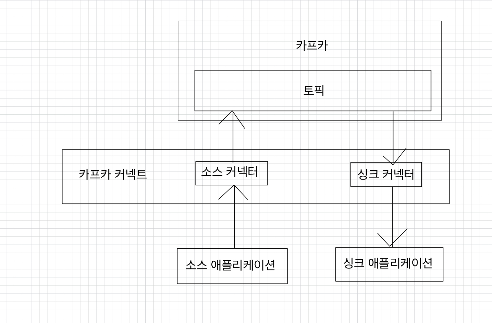
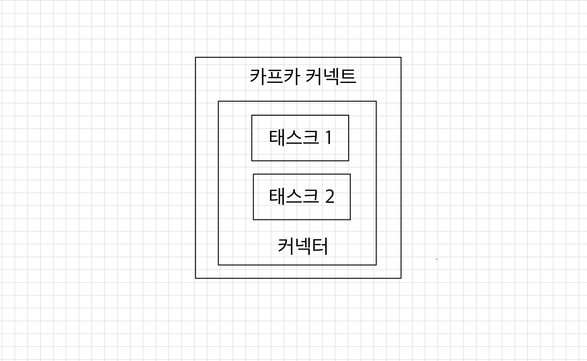

# 💻 카프카 커넥트
카프카 커넥트(kafka connect)는 카프카 오픈소스에 포함된 툴 중 하나로, 데이터 파이프라인 생성 시 **반복 작업을 줄이고 효율적인 전송**을 이루기 위한 애플리케이션이다.  

> 파이프라인을 생성할 때 프로듀서, 컨슈머 애플리케이션을 만드는 것도 좋은 방법이다.  
> 하지만 반복적인 파이프라인을 생성할 때 커넥트는 특정한 작업 형태를 템플릿으로 만들어놓은 커넥터(connector)를 실행함으로써 반복 작업을 줄일 수 있다.  
> 파이프라인 생성 시 자주 반복되는 값들(토픽 이름, 파일 이름, 테이블 이름 등)을 파라미터로 받는 커넥터를 코드로 작성하면 이후에 파이프라인을 실행할 때는 코드를 작성할 필요가 없기 때문이다.  

<br>

커넥터는 각 커넥터가 가진 고유한 설정값을 입력받아 데이터를 처리한다.  
예를 들어, 파일의 데이터를 토픽으로 보내는 커넥터가 있다면 파일이 존재하는 디렉토리 위치, 파일 이름을 설정해야 한다.  

<br>

  
- `소스 커넥터(source connector)`: 프로듀서 역할을 한다.
- `싱크 커넥트(sink connector)`: 컨슈머 역할을 한다.

일정한 프로토콜을 가진 소스 애플리케이션이나 싱크 애플리케이션이 있다면 커넥터를 통해 카프카로 데이터를 보내거나 카프카에서 데이터를 가져올 수 있다.  
MySQL, S3, MongoDB 등과 같은 저장소를 대표적인 싱크 애플리케이션, 소스 애플리케이션이라고 볼 수 있다.  
➡ MySQL에서 카프카로 데이터를 보낼 때, 그리고 카프케엇 데이터를 MySQL로 저장할 때 JDBC 커넥터를 사용하여 파이프라인을 생성할 수 있다.  

<br>

오픈소스 커넥터는 직접 커넥터를 만들 필요 없이 커넥터 jar 파일을 다운로드하여 사용할 수 있다는 장점이 있다.  
오픈소스 커넥터의 종류는 [컨플루언트 허브](https://www.confluent.io/hub)에서 검색할 수 있다.  

<br>

  
사용자가 커넥트에 커넥터 생성 명령을 내리면 커넥트는 내부에 커넥터와 태스크를 생성한다.  
커넥터는 태스크들을 관리한다.  
태스크는 커넥터에 종속되는 개념으로 실질적인 데이터 처리를 한다.  
그렇기 때문에 데이터 처리를 정상적으로 하는지 확인하기 위해선느 각 태스크의 상태를 확인해야 한다.  

<br>

> 사용자가 커넥터를 사용하여 파이프라인을 생성할 때 컨버터(converter)와 트랜스폼(transform) 기능을 옵션으로 추가할 수 있다.  
> 커넥터를 운영할 때 반드시 필요한 설정은 아니지만 데이터를 더욱 풍부하게 도와주는 역할을 한다.
> - 컨버터: 데이터 처리를 하기 전에 스키마를 변경하는 데 도와준다.  
>   `JsonConverter`, `StringConverter`, `ByteArrayConverter`를 지원하고 커스텀 컨버터를 작성할 수도 있다.
> - 트랜스폼: 데이터 처리 시 각 메시지 단위로 메시지를 간단하게 변환하기 위한 용도로 사용된다.  
>   예를 들어, JSON 데이터를 커넥터로 사용할 때 특정 키를 삭제하거나 추가할 수 있다.  
>   `Cast`, `Drop`, `ExtractField` 등이 있다.

<br>

### ✅ 커넥트를 실행하는 방법
- 단일 모드 커넥터(standalone mode kafka connector)
  - 단일 애플리케이션으로 실행된다.
  - 1개 프로세스만 실행되므로 고가용성 구성이 되지 않아 단일 장애점(SPOF: Single Point Of Failure)가 될 수 있다.
  - 주로 개발환경이나 중요도가 낮은 파이프라인을 운영할 때 사용한다.
- 분산 모드 커넥터(distributed mode kafka connector)
  - 2대 이상의 서버에서 클러스터 형태로 운영함으로써 단일 모드 커넥트 대비 안전하게 운영할 수 있다는 장점이 있다.
  - 서버 개수를 늘림으로써 무중단으로 스케일 아웃하여 처치량을 늘릴 수 있어, 데이터 처리량의 변화에도 유연하게 대응할 수 있다.
  - 상용환경에서 구성하고 설정하는 것이 좋다.

<br>

REST API를 사용하면 현재 실행 중인 커넥트의 커넥터 정보를 조회할 수 있다.  
커넥트는 `8083` 포트로 호출할 수 있다.  

| 요청 메서드 |                        호출 경로                        |          설명           |
|:------:|:---------------------------------------------------:|:---------------------:|
|  GET   |                         `/`                         |    실행 중인 커넥트 정보 확인    |
|  GET   |                    `/connectors`                    |    실행 중인 커넥터 이름 확인    |
|  POST  |                    `/connectors`                    |     새로운 커넥터 생성 요청     |
|  GET   |               `/connectors/{커넥터 이름}`                |    실행 중인 커넥터 정보 확인    |
|  GET   |            `/connectors/{커넥터 이름}/config`            |   실행 중인 커넥터의 설정값 확인   |
|  PUT   |            `/connectors/{커넥터 이름}/config`            | 실행 중인 커넥터의 설정값 변경 요청  |
|  GET   |            `/connectors/{커넥터 이름}/status`            |    실행 중인 커넥터 상태 확인    |
|  POST  |           `/connectors/{커넥터 이름}/restart`            |   실행 중인 커넥터 재시작 요청    |
|  PUT   |            `/connectors/{커넥터 이름}/pause`             |     커넥터 일시 중지 요청      |
|  PUT   |            `/connectors/{커넥터 이름}/resume`            |   일시 중지된 커넥터 실행 요청    |
| DELETE |               `/connectors/{커넥터 이름}`                |     실행 중인 커넥터 종료      |
|  GET   |            `/connectors/{커넥터 이름}/tasks`             | 실행 중인 커넥터의 태스크 정보 확인  |
|  GET   |    `/connectors/{커넥터 이름}/tasks/{태스트 아이디}/status`    | 실행 중인 커넥터의 태스크 상태 확인  |
|  POST  |   `/connectors/{커넥터 이름}/tasks/{태스트 아이디}/restart`    | 실행 중인 커넥터의 태스크 재시작 요청 |
|  GET   |            `/connectors/{커넥터 이름}/topics`            |   커넥터별 연동된 토픽 정보 확인   |
|  GET   |                `/connectors-plugins`                | 커넥트에 존재하는 커넥터 플러그인 확인 |
|  PUT   | `/connectors-plugins/{커넥터 플러그인 이름}/config/validate` | 커넥터 생성 시 설정값 유효 여부 확인 |

<br>

### ✅ 단일 모드 커넥트
단일 모드 커넥트를 실행하기 위해서는 단일 모드 커넥트를 참조하는 설정 파일인 `connect-standalone.properties` 파일을 수정해야 한다.  

```shell
# 위치: config/connect-standalone.properties

bootstrap.servers=my-kafka:9092

# 데이터를 카프카에 저장하거나 카프카에서 가져올 때 변환에 사용된다.
key.converter=org.apache.kafka.connect.json.JsonConverter
value.converter=org.apache.kafka.connect.json.JsonConverter
# 스키마 형태를 사용할지 여부다.
# false로 하면 payload만 보내므로 메시지가 더 가벼워진다.
key.converter.schemas.enable=false
value.converter.schemas.enable=false

# 로컬 파일에 오프셋 정보를 저장한다.
# 소스 커넥터 또는 싱크 커넥터가 데이터 처리 시점을 저장되는 데 사용되는 오프셋이다.
offset.storage.file.filename=/tmp/connect.offsets

# 태스크가 처리 완료한 오프셋을 커밋하는 주기다.
offset.flush.interval.ms=10000

# 플로그인 형태로 추가할 커넥터의 디렉토리 주소를 입력한다.
# 기본 설정은 주석처리 되어있다.
plugin.path=/usr/local/share/java,/usr/local/share/kafka/plugins,/opt/connectors,
```

<br>

단일 모드 커넥트는 커넥"트" 설정파일과 함께 커넥"터" 설정파일도 정의하여 실행해야 한다.  
커넥터 설정 파일에 대해 알아보기 위해 카프카에서 기본으로 제공하는 파일 소스 커넥터를 살펴본다.  

```shell
# 위치: config/connect-file-source.properties

# 커넥터의 이름으로, 커넥트에서 유일해야 한다.
name=local-file-source

# 커넥터 클래스 이름을 지정한다.
connector.class=FileStreamSource

# 커넥터로 실행할 태스크 개수를 지정한다. ➡ 개수를 늘려 병렬처리할 수 있다.
tasks.max=1

# 읽을 파일의 위치를 지정한다.
file=test.txt

# 읽은 파일의 데이터를 저장할 토픽의 이름을 지정한다.
topic=connect-test
```

<br>

이제 단일 모드 커넥트를 실행하려면 다음과 같이 커넥트 설정파일과 커넥터 설정파일을 넣어 실행하면 된다.
```shell
# 로컬 환경이다.
$ bin/connect-standalone.sh config/connect-standalone.properties \
> config/connect-file-source.properties
```
> 현재로서는 디렉토리 및 읽을 파일이 존재하지 않다고 에러가 뜰 것이다.  


<br>

### ✅ 분산 모드 커넥트
분산 모드 커넥트를 실행하기 위해서는 분산 모드 커넥트를 참조하는 설정 파일인 `connect-distributed.properties` 파일을 수정해야 한다.
```shell
# 위치: config/connect-distributed.properties

bootstrap.servers=my-kafka:9092

# 다수의 커넥트 프로세스들을 묶을 그룹 이름을 지정한다.
# 동일한 group.id로 지정된 커넥트들은 같은 그룹으로 인식한다.
group.id=connect-cluster

# 데이터를 카프카에 저장하거나 카프카에서 가져올 때 변환에 사용된다.
key.converter=org.apache.kafka.connect.json.JsonConverter
value.converter=org.apache.kafka.connect.json.JsonConverter

# 스키마 형태를 사용할지 여부다.
# false로 하면 payload만 보내므로 메시지가 더 가벼워진다.
key.converter.schemas.enable=false
value.converter.schemas.enable=false

# 내부 토픽에 오프셋 정보를 저장한다.
# 실제로 운영할 때는 복제 개수를 3보다 큰 값으로 설정하는 것이 좋다.
offset.storage.topic=connect-offsets
offset.storage.replication.factor=1

config.storage.topic=connect-configs
config.storage.replication.factor=1

status.storage.topic=connect-status
status.storage.replication.factor=1

# 태스크가 처리 완료한 오프셋을 커밋하는 주기를 설정한다.
offset.flush.interval.ms=10000

# 플로그인 형태로 추가할 커넥터의 디렉토리 주소를 입력한다.
# 기본 설정은 주석처리 되어있다.
plugin.path=/usr/local/share/java,/usr/local/share/kafka/plugins,/opt/connectors,
```

분산 모드 커넥트를 실행할 때는 커넥트 설정파일만 있으면 된다.  
커넥터는 커넥트가 실행된 이후에 REST API를 통해 실행/중단/변경할 수 있기 때문이다.  

```shell
$ bin/connect-distributed.sh config/connect-distributed.properties
```

> 여기서는 테스트를 위해 분산 모드 커넥트를 프로세스 1개로 실행했지만 상용 환경에서는 2대 이상의 분리된 서버에서 서버마다 1개의 분산 모드 커넥트를 실행하는 것이 좋다.

```shell
# 플러그인 조회하기
$ curl -X GET http://localhost:8083/connector-plugins
[
  {
    "class":"org.apache.kafka.connect.file.FileStreamSinkConnector",
    "type":"sink",
    "version":"3.9.0"
  },
  {
    "class":"org.apache.kafka.connect.file.FileStreamSourceConnector",
    "type":"source",
    "version":"3.9.0"
  },
  {
    "class":"org.apache.kafka.connect.mirror.MirrorCheckpointConnector",
    "type":"source",
    "version":"3.9.0"
  },
  {
    "class":"org.apache.kafka.connect.mirror.MirrorHeartbeatConnector",
    "type":"source",
    "version":"3.9.0"
  },
  {
    "class":"org.apache.kafka.connect.mirror.MirrorSourceConnector",
    "type":"source",
    "version":"3.9.0"
  }
]
```
```shell
# FileStreamSourceConnector 실행
curl -X POST -H "Content-Type: application/json" \
--data '{
  "name": "local-file-source",
  "config":
  {
    "connector.class": "org.apache.kafka.connect.file.FileStreamSourceConnector",
    "file": "/tmp/test.txt",
    "tasks.max": "1",
    "topic": "connect-test"
  }
}' \
http://localhost:8083/connectors
```

```shell
# 커넥터가 정상적으로 실행되고 있는지 확인
$ curl -X GET http://localhost:8083/connectors/local-file-source/status
{
  "name":"local-file-source",
  "connector":{"state":"RUNNING","worker_id":"127.0.0.1:8083"},
  "tasks":[{"id":0,"state":"RUNNING","worker_id":"127.0.0.1:8083"}],
  "type":"source"
}
```

```shell
# 커넥터를 종료한다.
$ curl -X DELETE https://localhost:8083/connectors/local-file-source
```


<br>

**참고 자료**  
[아파치 카프카 애플리케이션 프로그래밍 with 자바](https://product.kyobobook.co.kr/detail/S000001842177)