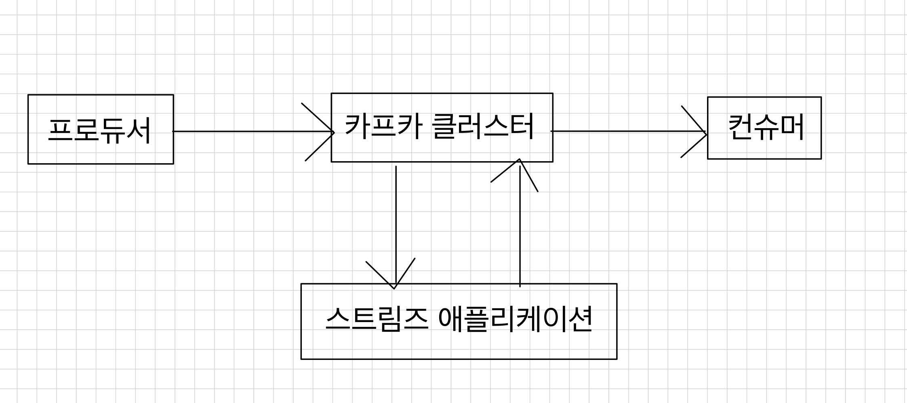
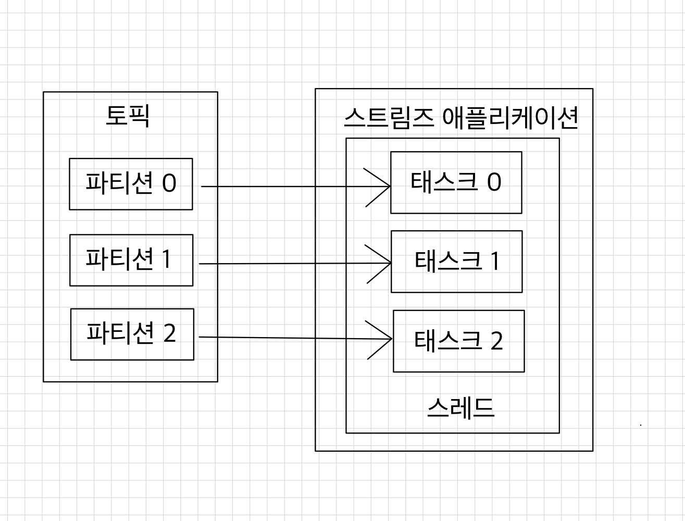
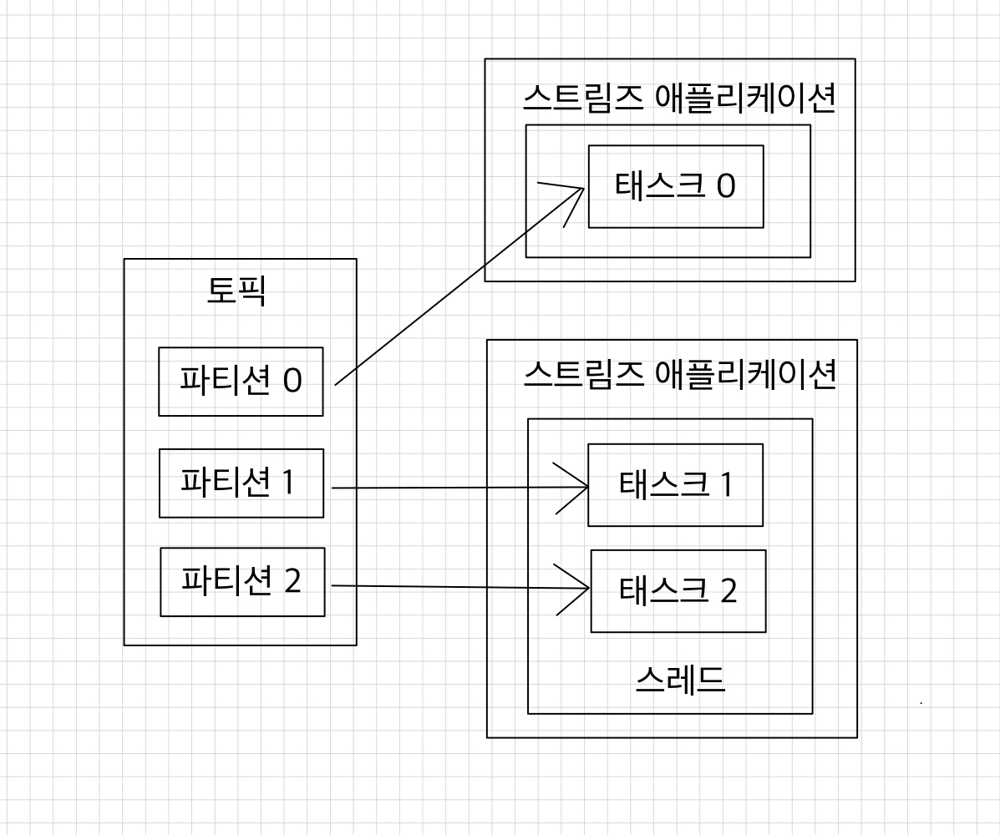
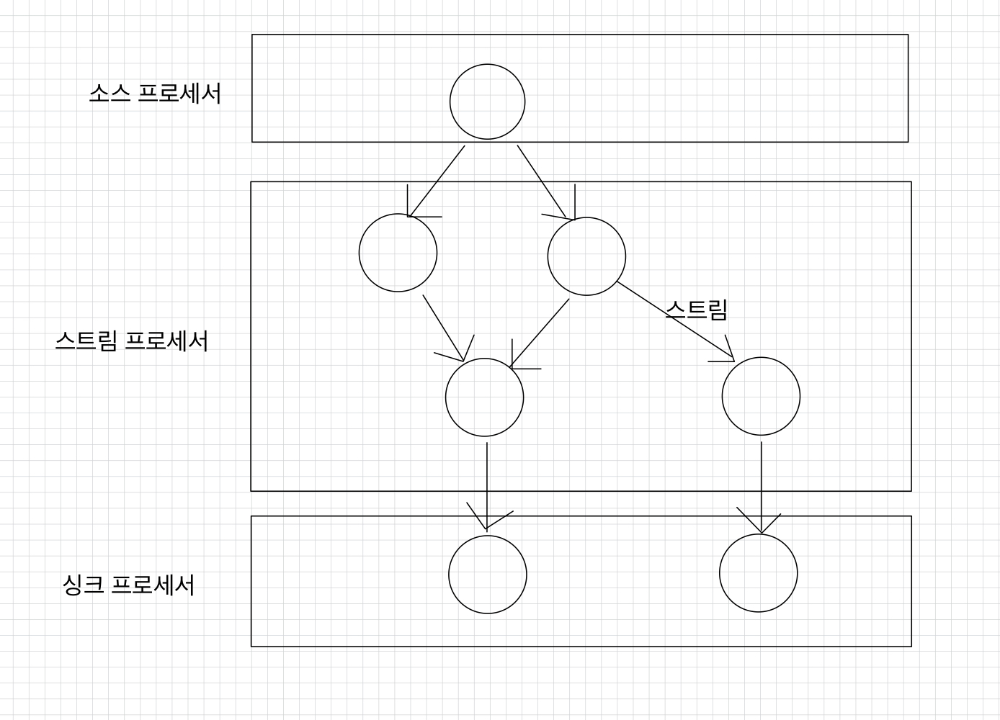

# 💻️ 카프카 스트림즈
카프카 스트림즈는 토픽에 적재된 데이터를 실시간으로 변환하여 다른 토픽에 적재하는 카프카에서 공식 지원하는 라이브러리다.  
➡ JAVA 기반 스트림즈 애플리케이션은 카프카 클러스터와 완벽하게 호환되면서 스트림 처리에 필요한 편리한 기능들(신규 토픽 생성, 상태 저장, 데이터 조인 등)을 제공한다.  
스트림즈 애플리케이션 또는 카프카 브로커의 장애가 발생하더라도 정확히 한 번(exactly once)할 수 있도록 장애 허용 시스템(fault tolerant system)을 가지고 있어 데이터 처리 안정성이 매우 뛰어나다.
 

> 보통의 빅데이터 처리에 필수적이라고 판단되었던 분산 시스템이나 스케줄링 프로그램들은 스트림즈를 운영하는 데에 있어 불필요하다.  
> JAVA 라이브러리로 구현하는 스트림즈 애플리케이션은 JVM 위에서 하나의 프로세스로 실행되기 때문이다.

 

> **프로듀서와 컨슈머를 조합해서 사용하지 않고 스트림즈를 사용해야 하는 이유**  
> 스트림 데이터 처리에 있어 필요한 다양한 기능을 스트림즈DSL로 제공하며 필요하다면 프로세서 API를 사용하여 기능을 확장할 수 있기 때문이다.  
> 컨슈머와 프로듀서를 조합하여 스트림즈가 제공하는 기능과 유사하게 만들 수 있다.  
> 그러나 스트림즈 라이브러리를 통해 제공하는 단 한 번의 데이터 처리, 장애 허용 시스템 등의 특징들은 컨슈머와 프로듀서의 조합만으로는 완벽하게 구현하기는 어렵다.  
> 다만, 소스 토픽(사용하는 토픽)과 싱크 토픽(저장하는 토픽)의 카프카 클러스터가 서로 다른 경우는 스트림즈가 지원하지 않으므로 컨슈머와 프로듀서 조합으로 직접 클러스터를 지정하는 방식으로 개발할 수 있다.

 

태스트(task): 스트림즈 애플리케이션을 실행하면 생기는 데이터 처리의 최소 단위  
스트림즈 애플리케이션은 내부적으로 스레드를 1개 이상 생성할 수 있으며, 스레드는 1개 이상의 태스크를 가진다.  
컨슈머의 병렬처리를 위해 컨슈머 그룹으로 이루어진 컨슈머 스레드를 여러 개 실행하는 것과 비슷하다고 볼 수 있다.  
➡ 카프카 스트림즈는 컨슈머 스레드를 늘리는 방법과 동일하게 병렬처리를 위해 파티션과 스트림즈 스레드(또는 프로세스) 개수를 늘림으로써 처리량을 늘릴 수 있다.  

 

실제 운영환경에서는 장애가 발생하더라도 안정적으로 운영할 수 있도록 2개 이상의 서버로 구성하여 스트림즈 애플리케이션을 운영한다.
 

 

카프카 스트림즈의 구조와 사용 방법에는 토폴로지 개념이 들어있다.
- 토폴로지(topology): 2개 이상의 노드들과 선으로 이루어진 집합
- 프로세서(processor): 토폴로지를 이루는 노드
    - 소스 프로세서: 데이터를 처리하기 위해 최초로 선언해야 하는 노드로, 하나 이상의 토픽에서 데이터를 가져오는 역할을 한다.
    - 스트림 프로세서: 다른 프로세서가 반환한 데이터를 처리하는 역할을 하는 노드로, 변환, 분기처리와 같은 로직이 데이터 처리의 일종이라고 볼 수 있다.
    - 싱크 프로세서: 데이터를 특정 카프카 토픽으로 저장하는 역할을 하는 노드로, 스트림즈로 처리된 데이터의 최종 종착지다.
      
- 스트림(stream): 노드와 노드를 이은 선
    - 토픽의 데이터로, 레코드와 동일한 개념이다.

 

- 스트림즈DSL로 구현한 데이터 처리 예시
    - 메시지 값을 기반으로 토픽 분기처리
    - 지난 10분간 들어온 데이터의 개수 집계
    - 토픽과 다른 토픽의 결합으로 새로운 데이터 생성
- 프로세서 API로 구현하는 데이터 처리 예시
    - 메시지 값의 종류에 따라 토픽을 가변적으로 전송
    - 일정한 시간 간격으로 데이터 처리

 

**참고 자료**  
[아파치 카프카 애플리케이션 프로그래밍 with 자바](https://product.kyobobook.co.kr/detail/S000001842177)