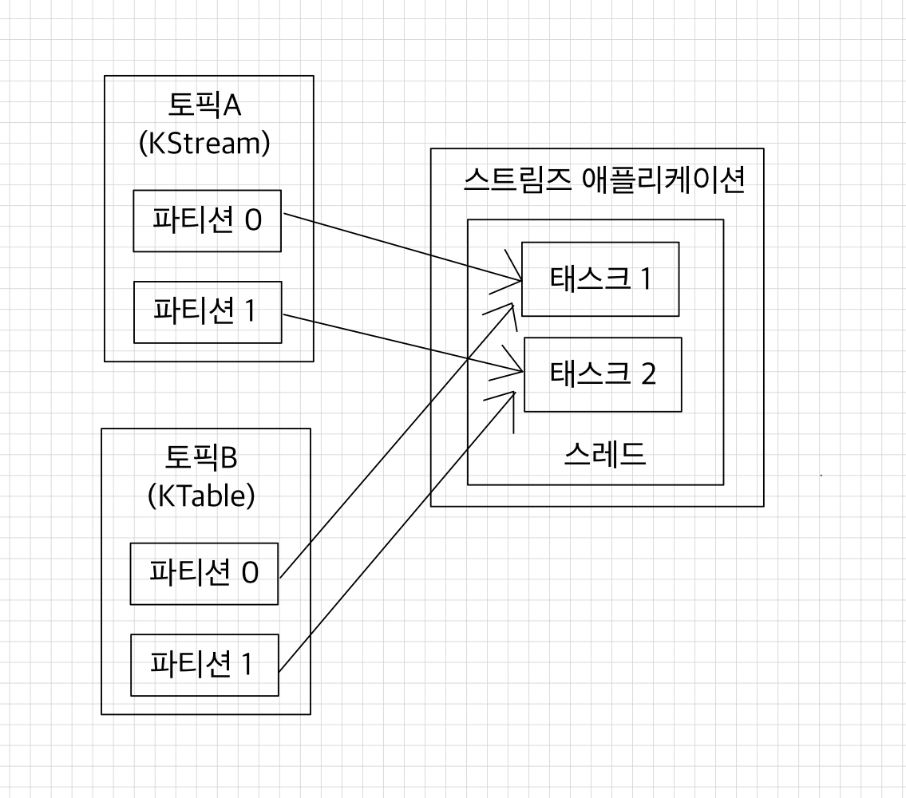
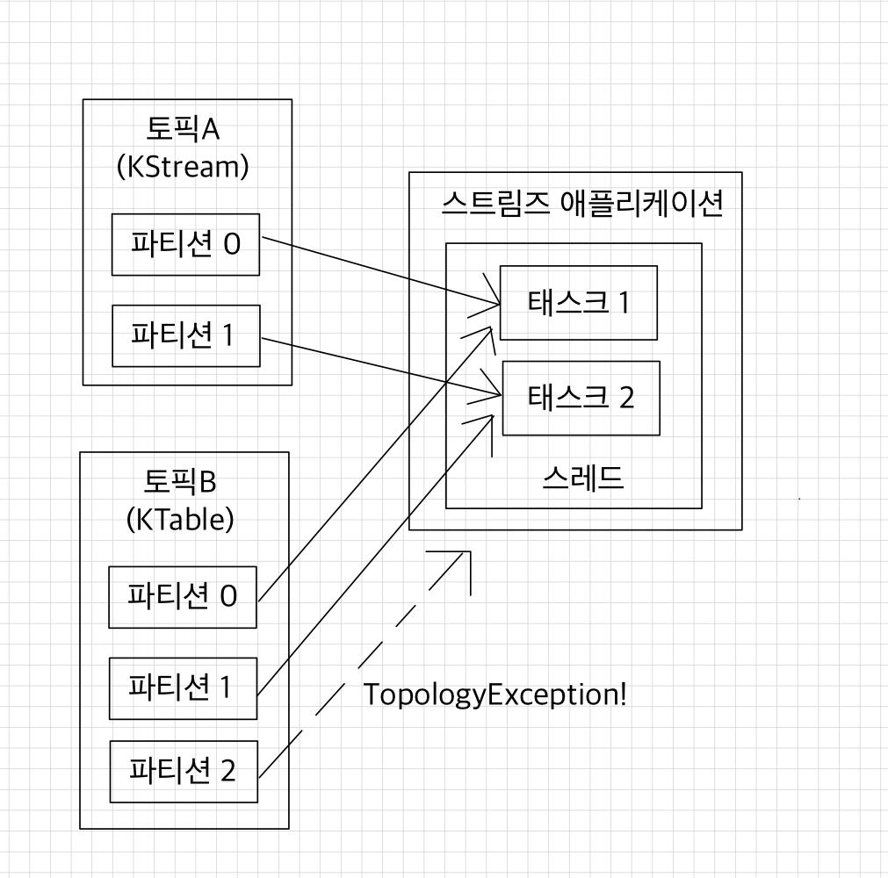

# 💻 스트림즈DSL
- [KStream](#-kstream)
- [KTable](#-ktable)
- [GlobalKTable](#-globalktable)
  - [KStream과 KTable 데이터를 조인하는 경우](#-kstream과-ktable-데이터를-조인하는-경우)
- [스트림트DSL 주요 옵션](#-스트림트dsl-주요-옵션)

스트림즈DSL에는 레코드의 흐름을 추상화한 3가지 개념인 KStream, KTable, GlobalKTable이 있는데, 컨슈머, 프로듀서, 프로세서 API에는 사용되지 않고 스트림즈DSL에서만 사용되는 개념이다.

 

## ✅ KStream
KStream은 레코드의 흐름을 포현한 것으로 메시지 키와 값으로 구성되어 있다.  
KStream으로 데이터를 조회하면 토픽 또는 KStream에 존재하는 모든 레코드가 출력된다.  
컨슈머로 토픽을 구독하는 것과 동일한 선상에서 사용하는 것이라고 볼 수 있다.

 

## ✅ KTable
KTable은 KStream과 다르게 메시지 키를 기준으로 묶어서 사용한다.  
KStream은 토픽의 모든 레코드를 조회할 수 있지만 KTable은 유니크한 메시지 키를 기준으로 가장 최신 레코드를 사용한다.  
KTable로 데이터를 조회하면 메시지 키를 기준으로 가장 최신에 추가된 레코드의 데이터가 출력된다. ➡ 업데이트 개념으로 볼 수 있다.

 

## ✅ GlobalKTable
GlobalKTable은 KTable과 동일하게 메시지 키를 기준으로 묶어서 사용된다.  
그러나 KTable로 선언된 토픽은 1개 파티션이 1개 태스크에 할당되어 사용되고, GlobalKTable로 선언된 토픽은 모든 파티션 데이터가 각 태스크에 할당되어 사용된다는 차이점이 있다.

 

### 💡 KStream과 KTable 데이터를 조인하는 경우
  
이 경우, 반드시 코파티셔닝(co-partitioning)되어 있어야 한다.  
코파티셔닝: 조인을 하는 2개 파티션의 파티션 개수가 동일하고 파티셔닝 전략(partitioning strategy)을 동일하게 맞추는 작업
- 파티션 개수가 동일하고 파티셔닝 전략이 같은 경우에는 동일한 메시지 키를 가진 데이터가 동일한 태스크에 들어가는 것을 보장한다.
- 각 태스크는 KStream의 레코드와 KTable의 메시지 키가 동일할 경우 조인을 수행할 수 있다.
 

  
문제는 조인을 수행하려는 토픽들이 코파티셔닝되어 있음을 보장할 수 없다는 것이다.  
➡ KStream과 KTable로 사용하는 2개의 토픽이 파티션 개수가 다를 수 있고, 파티션 전략이 다를 수 있다.  
➡ 코파티셔닝이 되지 않은 2개의 토픽을 조인하는 로직이 담긴 스트림즈 애플리케이션을 실행하면 `TopologyException`이 발생한다.

조인을 수행하는 KStream과 KTable이 코파티셔닝되어 있지 않으면 KStream 또는 KTable을 리파티셔닝(repartitioning)하는 과정을 거쳐야 한다.  
리파티셔닝: 새로운 토픽에 새로운 메시지 키를 가지고 재배열하는 과정  
그러나, 리파티셔닝을 하는 과정은 토픽에 기존 데이터를 중복해서 생성할 뿐만 아니라 파티션을 재배열 하기 위해 프로세싱하는 과정도 거쳐야 한다.
 

  
KTable을 GlobalKTable로 선언하여 사용하면 리파티셔닝을 하지 않고 코파티셔닝되지 않은 KStream과 데이터 조인할 수 있다.  
KTable과 달리 GlobalKTable로 정의된 데이터는 스트림즈 애플리케이션의 모든 태스크에 동일하게 공유되어 사용되기 때문이다.

다만, GlobalKTable을 사용하면 태스크마다 GlobalKTable로 정의된 모든 데이터를 저장하고 사용하기 때문에 스트림즈 애플리케이션의 로컬 스토리지 사용량이 증가하고 네트워크, 브로커에 부하가 생기므로 되도록이면 작은 용량의 데이터일 경우에만 사용하는 것이 좋다.  
많은 양의 데이터를 가진 토픽으로 조인할경우에는 리파티셔닝을 통해 KTable을 사용하는 것을 권장한다.  

 

[카프카 스트림즈 애플리케이션](https://github.com/kyeoungchan/simple-kafka-streams)을 참고하자.

 

## ✅ 스트림트DSL 주요 옵션
- 필수 옵션
  - `bootstrap.servers`
  - `application.id`: 스트림즈 애플리케이션을 구분하기 위한 고유한 아이디
    - 다른 로직을 가진 스트림즈 애플리케이션들은 서로 다른 `application.id`값을 가져야 한다.
- 선택 옵션
  - `default.key.serde`: 레코드의 메시지 키를 직렬화, 역직렬화하는 클래스를 지정한다.
    - 기본값: 바이트 직렬화, 역직렬화 클래스인 `Serdes.ByteArray().getClass().getName()`이다.
  - `default.value.serde`: 스트림 프로세싱 실행 시 실행될 스레드 개수를 지정한다.
    - 기본값: 1
  - `state.dir`: 상태기반 데이터 처리를 할 때 데이터를 저장할 디렉토리를 지정한다.
    - 기본값: `/tmp/kafka-streams`

 

**참고 자료**  
[아파치 카프카 애플리케이션 프로그래밍 with 자바](https://product.kyobobook.co.kr/detail/S000001842177)