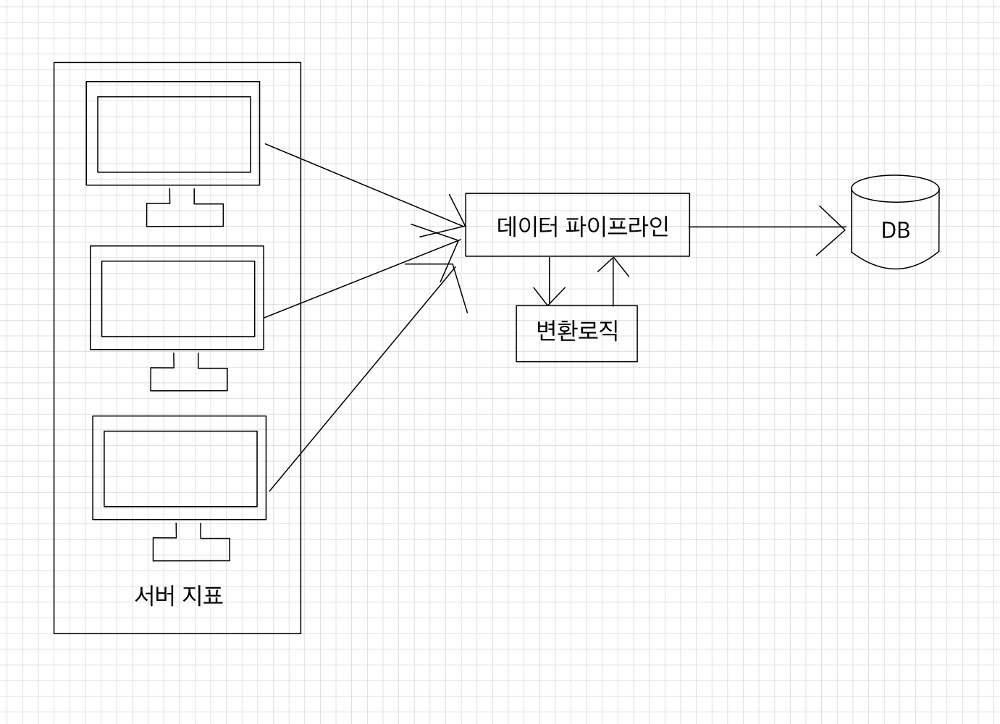
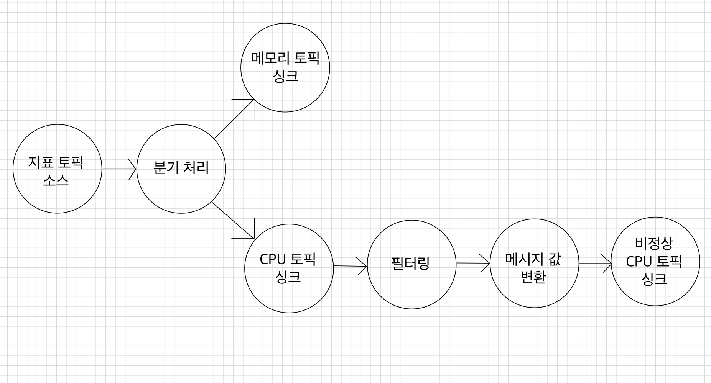

# 🧑🏻‍💻 카프카 실전 프로젝트 - 서버 지표 수집 파이프라인과 카프카 스트림즈 활용
- [요구 사항](#-요구-사항)
- [적재 정책](#-적재-정책)
- [토픽](#-토픽)
- [데이터 포맷](#-데이터-포맷)
- [메트릭비트](#-메트릭비트)
- [카프카 스트림즈](#-카프카-스트림즈)
  - [지표 데이터를 분기처리하는 스트림즈 토폴로지](#-지표-데이터를-분기처리하는-스트림즈-토폴로지)
  - [CPU 지표 데이터를 필터링, 변환 처리하는 스트림즈 토폴로지](#-cpu-지표-데이터를-필터링-변환-처리하는-스트림즈-토폴로지)
- [기능 구현](#-기능-구현)
  - [토픽 생성](#-토픽-생성)
  - [메트릭비트 설치 및 설정](#-메트릭비트-설치-및-설정)
  - [카프카 스트림즈 개발](#-카프카-스트림즈-개발)
- [기능 테스트](#-기능-테스트)


  
카프카는 불특정 다수의 서버의 지표를 수집하는 데에 아주 적합하다.  
서비스하고 있는 모니터링해야 하는 서버들의 개수는 상황에 따라 줄어들고 늘어나곤 하는데, 카프카를 사용하면 클러스터를 스케일 아웃하거나 파티션을 늘림으로써 데이터 양에 유연하게 대응하여 스트리밍 데이터 처리를 할 수 있다.

<br>

### ✅ 요구 사항
1. 컴퓨터의 서버 지표 중 CPU와 메모리 데이터를 수집해서 토픽으로 전송한다.  
2. 토픽에 전송된 전체 지표 데이터는 분기처리하여 CPU와 메모리 토픽에 각각 저장한다.  
3. 로컬 컴퓨터 CPU 사용량이 50%가 넘을 경우에는 지표 데이터 중 hostname과 timestamp 정보를 비정상 CPU 토픽으로 전송한다.  

<br>

서버 지표 수집에는 메트릭비트(metricbeat)를 활용한다.  
메트릭비트는 서버 지표 수집에 특화된 경량 에이전트로 CPU, 메모리, 네트워크 등 서버 모니터링에 필요한 거의 모든 지표를 수집할 수 있다.  
수집된 데이터는 카프카 모듈을 사용해서 카프카로 전송할 수 있다.  
➡ 메트릭비트가 서버 지표 수집과 프로듀서 역할을 동시에 하는 것이다.

<br>

### ✅ 적재 정책
서버들의 지표를 모으는 이유는 서버 사용자로 하여금 서버 상태를 모니터링할 수 있도록 도와주기 위함이다.  
CPU, 메모리 등 서버 지표를 수집할 때 중요한 것은 24시간 365일 끊임없이 수집할 수 있는 환경이다.  
➡ 카프카 클러스터의 브로커 중 일부에 장애가 발생하더라도 모니터링은 지속적으로 이루어져야 한다.

일부 데이터가 유실되는 것보다 브로커의 장애를 복구하는 동안 서버들의 상태를 모니터링하지 못하게 되는 것이 더 치명적이다.  
➡ 지표 데이터를 적재할 때는 지속적으로 데이터를 처리할 수 있으면서도 일부 데이터가 유실되거나 중복되는 것을 감안해서 파이프라인을 구성하는 것이 중요하다.

<br>

파이프라인 정책
- 일부 데이터 유실 또는 중복 허용
- 안정적으로 끊임없는 적재

<br>

### ✅ 토픽
필요한 토픽은 총 4개다.
1. 전체 서버의 지표들을 저장하는 토픽
2. CPU 지표만 저장하는 토픽
3. 메모리 지표만 저장하는 토픽
4. 비정상 CPU 지표 정보를 저장하는 토픽

토픽에 저장된 지표를 저장하고 사용할 때 메시지 키는 별도로 사용하지 않는다.  
➡ 서버 지표를 처리하는 데에 엄격한 데이터 처리 순서보다는 유연하고 처리량을 늘리는 것이 더 중요하기 때문이다.  
➡ 토픽에서 메시지 키를 사용하지 않으면 파티션의 변화에 크게 영향을 받지 않으므로 파티션 크기는 3으로 설정한다.(추후 수집되는 서버들의 개수가 많아지면 그만큼 높은 처리량을 위해 파티션 크기를 늘리면 된다.)

클러스터의 브로커 1대에 이슈가 발생했을 경우에도 안정적으로 데이터를 가져가기 위해 복제 개수는 2로 설정한다.  

나머지 토픽 옵션들은 기본값을 사용한다.

<br>

### ✅ 데이터 포맷
메트릭비트가 서버 지표들을 전송할 때 사용하는 포맷은 JSON이다.  
JSON은 확장성이 높고, 디버깅하기에도 편리하다.  
➡ 카프카 스트림즈에서 지표 데이터를 변환하고 필터링할 대도 gson 라이브러리를 사용하면 JSON을 아주 편리하게 처리할 수 있다.  
➡ 토픽의 메시지 값은 JSON 포맷을 가진 String 타입을 사용한다.

<br>

### ✅ 메트릭비트
메트릭비트에서는 데이터 수집을 위해 다양한 모듈을 지원한다.  
➡ 그 중 서버의 지표를 수집하기 위해서는 시스템 모듈(system module)을 사용하면 된다.  

지표를 수집하는 간격은 10초로 설정하여 데이터가 과도하게 수집되지 않도록 설정한다.  
수집 간격이 10초 ➡ 1분에 6개 ➡ 1시간에 360개의 데이터가 수집된다.  
➡ 순간적인 지표 변화를 실시간으로 확인할 수는 없지만 지표의 전체적인 흐름은 확인할 수 있다.  

수집한 데이터는 카프카 모듈을 아웃풋으로 설정해서 카프카에 쌓이도록 설정한다.

<br>

### ✅ 카프카 스트림즈
- [지표 데이터를 분기처리하는 스트림즈 토폴로지](#-지표-데이터를-분기처리하는-스트림즈-토폴로지)
- [CPU 지표 데이터를 필터링, 변환 처리하는 스트림즈 토폴로지](#-cpu-지표-데이터를-필터링-변환-처리하는-스트림즈-토폴로지)

> [카프카 스트림즈 페이지](https://github.com/kyeoungchan/note/tree/main/kafka/kafkastreams)도 함께 보면 좋다.

수집된 서버의 지표 데이터를 분기처리하고 필터링하는 동작은 카프카 스트림즈가 최적이다.  
카프카 스트림즈로 개발할 때는 요구사항에 맞는 형태로 토폴로지(topology)를 그리고 각 프로세서에 맞는 DSL 메서드를 찾아서 적용하면 된다.  
➡ 만약 스트림즈DSL 메서드로 처리가 불가능하다면 프로세서 API를 사용하면 된다.

<br>

처리해야할 토폴로지는 크게 2가지가 있다.  
  

<br>

#### 🧑🏻‍💻 지표 데이터를 분기처리하는 스트림즈 토폴로지
전체 지표를 가진 토픽의 데이터를 CPU와 메모리 토픽으로 분기하는 로직이다.  
지표 토픽 소스를 KStream으로 선언하고, branch() 메서드로 KStream 배열을 반환받아서 데이터를 분기처리할 수 있다.  
메트릭비트가 보낸 JSON 데이터의 `metricset.name` 값으로 보내는 데이터의 종류를 구분할 수 있기 때문에 CPU인 경우와 memory인 경우를 Predicate 인터페이스로 구현하여 분기를 선언할 수 있다.

<br>

#### 🧑🏻‍💻 CPU 지표 데이터를 필터링, 변환 처리하는 스트림즈 토폴로지
CPU 지표 중 전체 사용량이 50%가 넘는 경우에 대해 필터링하고 hostname과 timestamp 값으로 생성하는 로직이다.  

- `filter()`
  - 분기처리로 받은 CPU 토픽 KStream 객체를 필터링하는 데 사용할 메서드다.
  - JSON 데이터의 전체 CPU 사용량의 50%가 넘는 경우 반환하도록 조건 처리를 추가한다.
- `mapValues()`
  - 메시지 값을 변환하는 데 사용할 메서드다.  
  - 비정상 CPU 토픽에 `hostname`과 `timestamp` 데이터를 보내기 위해 JSON 데이터의 변환이 필요하고, 메시지 값만 변환하면 되므로 `mapValues()` 메서드를활용하여 CPU 지표 토픽의 데이터를 변환하여 다음 싱크로 보낼 수 있다.

<br>
 
### ✅ 기능 구현
- [토픽 생성](#-토픽-생성)
- [메트릭비트 설치 및 설정](#-메트릭비트-설치-및-설정)
- [카프카 스트림즈 개발](#-카프카-스트림즈-개발)


#### 🧑🏻‍💻 토픽 생성
생성할 토픽은 총 4개다.  
각 토픽의 파티션은 3, 복제 개수는 2로 설정하고, 나머지 토픽 설정들은 기본값으로 생성한다.  

> 상용 파이프라인 아키텍처에 적용하는 것을 고려하여 복제 개수를 2개로 잡았다.  
> 만약 싱글 브로커로 구성된 카프카 클러스터를 사용하는 환경이라면 복제 개수로 설정할 수 있는 최댓값은 1이다.  
> 실제로 싱글 브로커에서 복제 개수를 2개로 잡아서 토픽을 생성하려고 하면 이런 에러가 뜬다.  

```shell
Error while executing topic command : Unable to replicate the partition 2 time(s): The target replication factor of 2 cannot be reached because only 1 broker(s) are registered.
[2025-12-26 07:54:03,202] ERROR org.apache.kafka.common.errors.InvalidReplicationFactorException: Unable to replicate the partition 2 time(s): The target replication factor of 2 cannot be reached because only 1 broker(s) are registered.
 (org.apache.kafka.tools.TopicCommand)
```

<br>

```shell
# 서버의 전체 지표들을 저장하는 토픽 생성
$ bin/kafka-topics.sh --create \
--bootstrap-server my-kafka:9092 \
--replication-factor 2 \
--partitions 3 \
--topic metric.all
```

```shell
$ bin/kafka-topics.sh --create \
--bootstrap-server my-kafka:9092 \
--replication-factor 2 \
--partitions 3 \
--topic metric.cpu
```

```shell
$ bin/kafka-topics.sh --create \
--bootstrap-server my-kafka:9092 \
--replication-factor 2 \
--partitions 3 \
--topic metric.memory
```

```shell
$ bin/kafka-topics.sh --create \
--bootstrap-server my-kafka:9092 \
--replication-factor 2 \
--partitions 3 \
--topic metric.cpu.alert
```

<br>

#### 🧑🏻‍💻 메트릭비트 설치 및 설정

[메트릭 환경 설정 페이지](https://github.com/kyeoungchan/note/tree/main/metricbeat/settings)를 참고해서 설치 후 아래의 가이드를 따른다.  

```shell
# metricbeat 바이너리 경로로 이동
$ cd /opt/homebrew/Cellar/metricbeat/9.2.3/bin

# metricbeat.yml 파일 신규로 생성
$ vi metricbeat.yml
```

```yml
# metricbeat.yml에 다음과 같이 입력한다.
metricbeat.modules:
- module: system
  metricsets:
    - cpu
    - memory
  enabled: true
  period: 10s

output.kafka:
  hosts: ["my-kafka:9092"]
  topic: 'metric.all'
```

<br>

#### 🧑🏻‍💻 카프카 스트림즈 개발
[metric-kafka-streams](https://github.com/kyeoungchan/metric-kafka-streams) 페이지 참고


<br>

### ✅ 기능 테스트
로컬 개발환경에서 실행하기 위해 2가지 단계를 실행한다.  
1. 메트릭비트 실행
2. 스트림즈 애플리케이션 실행

```shell
# metricbeat 바이너리 경로로 이동
$ cd /opt/homebrew/Cellar/metricbeat/9.2.3/bin

# 메트릭비트 실행
# --path.config 옵션을 따로 지정하지 않으면 기존의 config yml 파일을 가져온다. (나의 경우, /opt/homebrew/etc/metricbeat/metricbeat.yml)
$ metricbeat \
--path.config /opt/homebrew/Cellar/metricbeat/9.2.3/bin \
-c metricbeat.yml
```

```shell
# metric.all 토픽에 지표 데이터가 들어오는지 확인
$ bin/kafka-console-consumer.sh --bootstrap-server my-kafka:9092 \
--topic metric.all \
--from-beginning
{"@timestamp":"2025-12-28T04:56:17.004Z","@metadata":{"beat":"metricbeat","type":"_doc","version":"9.2.3"},"agent":{"version":"9.2.3","ephemeral_id":"815c6648-8e68-49f0-8d84-aacf328437e5","id":"26da68f6-1b1c-4790-968a-62697dee69d6","name":"Kyeongchanui-MacBookPro.local","type":"metricbeat"},"metricset":{"name":"cpu","period":10000},"event":{"dataset":"system.cpu","module":"system","duration":861459},"service":{"type":"system"},"system":{"cpu":{"system":{"pct":0.4339,"norm":{"pct":0.0434}},"idle":{"pct":8.7701,"norm":{"pct":0.877}},"nice":{"pct":0,"norm":{"pct":0}},"cores":10,"total":{"pct":1.2299,"norm":{"pct":0.123}},"user":{"pct":0.7959,"norm":{"pct":0.0796}}}},"host":{"cpu":{"usage":0.123},"name":"Kyeongchanui-MacBookPro.local"},"ecs":{"version":"8.0.0"}}
{"@timestamp":"2025-12-28T04:56:15.937Z","@metadata":{"beat":"metricbeat","type":"_doc","version":"9.2.3"},"event":{"dataset":"system.memory","module":"system","duration":1178042},"metricset":{"name":"memory","period":10000},"service":{"type":"system"},"system":{"memory":{"total":17179869184,"used":{"pct":0.9977,"bytes":17140019200},"free":39849984,"actual":{"free":1602580480,"used":{"pct":0.9067,"bytes":15577288704}},"swap":{"total":0,"used":{"bytes":0},"free":0}}},"agent":{"ephemeral_id":"815c6648-8e68-49f0-8d84-aacf328437e5","id":"26da68f6-1b1c-4790-968a-62697dee69d6","name":"Kyeongchanui-MacBookPro.local","type":"metricbeat","version":"9.2.3"},"ecs":{"version":"8.0.0"},"host":{"name":"Kyeongchanui-MacBookPro.local"}}
{"@timestamp":"2025-12-28T04:56:27.005Z","@metadata":{"beat":"metricbeat","type":"_doc","version":"9.2.3"},"host":{"name":"Kyeongchanui-MacBookPro.local","cpu":{"usage":0.12}},"event":{"dataset":"system.cpu","module":"system","duration":782083},"metricset":{"period":10000,"name":"cpu"},"ecs":{"version":"8.0.0"},"agent":{"id":"26da68f6-1b1c-4790-968a-62697dee69d6","name":"Kyeongchanui-MacBookPro.local","type":"metricbeat","version":"9.2.3","ephemeral_id":"815c6648-8e68-49f0-8d84-aacf328437e5"},"service":{"type":"system"},"system":{"cpu":{"total":{"norm":{"pct":0.12},"pct":1.2},"user":{"norm":{"pct":0.07},"pct":0.7},"system":{"norm":{"pct":0.05},"pct":0.5},"idle":{"pct":8.8,"norm":{"pct":0.88}},"nice":{"norm":{"pct":0},"pct":0},"cores":10}}}
{"@timestamp":"2025-12-28T04:56:25.939Z","@metadata":{"beat":"metricbeat","type":"_doc","version":"9.2.3"},"system":{"memory":{"actual":{"free":1620217856,"used":{"pct":0.9057,"bytes":15559651328}},"swap":{"total":0,"used":{"bytes":0},"free":0},"total":17179869184,"used":{"pct":0.9988,"bytes":17158909952},"free":20959232}},"event":{"dataset":"system.memory","module":"system","duration":543041},"metricset":{"period":10000,"name":"memory"},"ecs":{"version":"8.0.0"},"host":{"name":"Kyeongchanui-MacBookPro.local"},"agent":{"name":"Kyeongchanui-MacBookPro.local","type":"metricbeat","version":"9.2.3","ephemeral_id":"815c6648-8e68-49f0-8d84-aacf328437e5","id":"26da68f6-1b1c-4790-968a-62697dee69d6"},"service":{"type":"system"}}
```

<br>


<br>

**참고 자료**  
[아파치 카프카 애플리케이션 프로그래밍 with 자바](https://product.kyobobook.co.kr/detail/S000001842177)