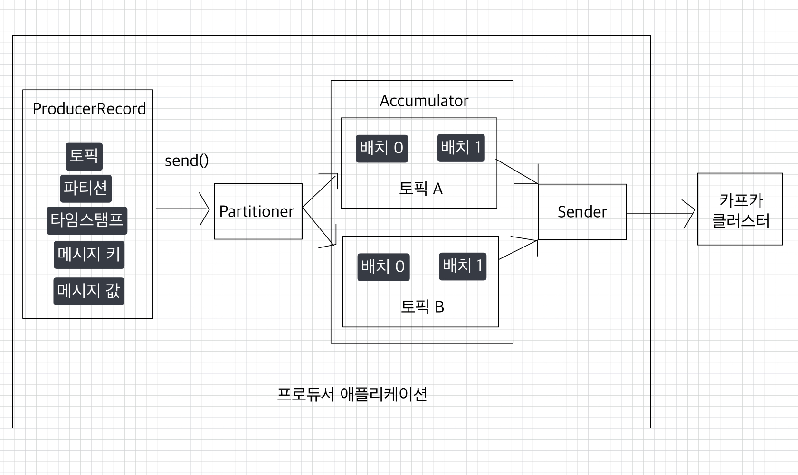
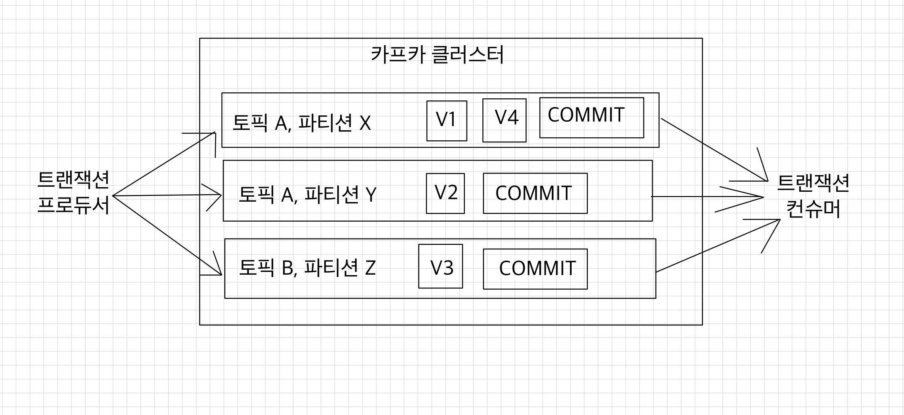

# 🧑🏻‍💻 Producer

- [✅ 프로듀서 중요 개념](#-프로듀서-중요-개념)
- [✅ 프로듀서 주요 옵션](#-프로듀서-주요-옵션)
- [✅ 멱등성(idempotence) 프로듀서](#-멱등성idempotence-프로듀서)
- [✅ 트랜잭션(transaction) 프로듀서](#-트랜잭션transaction-프로듀서)

---

## ✅ 프로듀서 중요 개념

> [!TIP]
> [카프카 프로듀서](https://github.com/kyeoungchan/simple-kafka-producer)를 구현한 애플리케이션을 참고하자.

 

> [!IMPORTANT]
> 프로듀서는 카프카 브로커로 데이터를 전송할 때 내부적으로 파티셔너, 배치 생성 단계를 거친다.

> [!NOTE]
> - `org.apache.kafka.clients.producer.KafkaProducer` 인스턴스가 `send()` 메서드를 호출하면 `org.apache.kafka.clients.producer.ProducerRecord`는 토픽의 어느 파티션으로 전송될 것인지 정해진다.
> - `KafkaProducer` 인스턴스는 생성할 때 파티셔너를 따로 설정하지 않으면 기본값인 `DefaultPartitioner`로 설정되어 파티션이 정해진다.
> - 파티셔너에 의해 분리된 레코드는 데이터를 전송하기 전에 `Accumulator`에 데이터를 버퍼로 쌓아놓고 발송한다.
>     - 버퍼로 쌓인 데이터는 배치로 묶어서 전송함으로써 카프카의 프로듀서 처리량을 향상시키는 데에 상당한 도움을 준다.

 

> [!TIP]
> **Partitioner**  
> 카프카 클라이언트 라이브러리 3.3.0 이전 버전까지는 파티션을 지정하지 않은 경우 `UniformStickyPatitioner`가 파티셔너로 기본 설정되었다.  
> 카프카 2.4.0 이전 버전까지는 `RoundRobinPatitioner`가 기본 파티셔너로 설정되었다.
> - `RoundRobinPatitioner`는 `ProducerRecord`가 들어오는 대로 파티션을 순회하면서 전송하기 때문에 배치로 묶이는 빈도가 적다.
> - `UniformStickyPatitioner`는 `Accumulator`에서 데이터가 배치로 모두 묶일 때까지 기다렸다가 배치로 묶인 데이터는 모두 동일한 파티션에 전송함으로써 `RoundRobinPatitioner`에 비해 향상된 성능을 갖게 되었다.
> - 3.3.0 버전 이후로는 카프카 내부 파티셔너 로직이 사용된다.  
>   ➡`UniformStickyPatitioner`가 batch를 모으느라 latency가 증가되는 것을 개선

 

> [!IMPORTANT]
> `Sender` 스레드는 `Accumulator`에 쌓인 배치 데이터를 가져가 카프카 브로커로 전송한다.  

 

## ✅ 프로듀서 주요 옵션
> [!TIP]
> 카프카 클라이언트 애플리케이션을 개발할 때 설정하지 않은 선택 옵션의 기본값(default)을 파악해서 운영해야 한다.

 

> [!NOTE]
> - 필수 옵션
>     - `bootstrap.servers`: 프로듀서가 데이터를 전송할 대상 카프카 클러스터에 속한 브로커의 `host:port`를 1개 이상 작성한다.  
>       2개 이상 브로커 정보를 입력하여 일부 브로커에 이슈가 발생하더라도 접속하는 데에 이슈가 없도록 설정 가능하다.
>     - `key.serializer`: 레코드의 메시지 `key`를 직렬화하는 클래스를 지정한다.
>     - `value.serializer`: 레코드의 메시지 `value`를 직렬화하는 클래스를 지정한다.
> - 선택 옵션
>     - `acks`: 프로듀서가 전송한 데이터가 브로커들에 정상적으로 저장되었는지 전송 성공 여부를 확인하는 옵션이다.
>         - `1`: 리더 파티션에 데이터가 저장되면 전송 성공으로 판단한다. 기본값이다.
>         - `0`: 프로듀서가 전송한 즉시 브로커에 데이터 저장 여부와 상관 없이 성공으로 판단한다.
>         - `-1` 또는 `all`: 토픽의 `min.insync.replicas` 개수에 해당하는 리더의 파티션과 팔로워 파티션에 데이터가 저장되면 성공하는 것으로 판단한다.
>     - `buffer.memory`: 브로커로 전송할 데이터를 배치로 모으기 위해 설정할 버퍼 메모리양을 지정한다. 기본값은 `33554432(32MB)`다.
>     - `retries`: 프로듀서가 브로커로부터 에러를 받고 난 뒤 재전송을 시도하는 횟수를 지정한다. 기본값은 `2147483647`이다.
>     - `batch.size`: 배치로 전송할 레코드 최대 용량을 지정한다.
>         - 너무 작게 설정하면 프로듀서가 브로커로 더 자주 보내기 때문에 네트워크 부담이 있다.
>         - 너무 크게 설정하면 메모리를 더 많이 사용하게 된다.
>         - 기본값은 `16384`다.
>     - `linger.ms`: 배치로 전송하기 전까지 기다리는 최소 시간이다. 기본값은 `0`이다.
>     - `partitioner.class`: 레코드를 파티션에 전송할 때 적용하는 파티셔너 클래스를 지정한다.
>         - 3.9.0 버전 기준 기본값은 `null`이다. (위에 [프로듀서 중요 개념](#-프로듀서-중요-개념)에서 **Partitioner** 참고)
>     - `transactional.id`: 프로듀서가 레코드를 전송할 때 레코드를 트랜잭션 단위로 묶을지 여부를 설정한다.
>         - 이 값을 설정하면 트랜잭션 프로듀서로 동작한다.

 

### 🚀 `acks` 옵션
> [!IMPORTANT]
K> 0, 1, all(또는 -1) 값을 가질 수 있다.  
K> 이 옵션을 통해 프로듀서가 전송한 데이터가 카프카 클러스터에 얼마나 신뢰성 높게 저장할지 지정할 수 있다.

 

#### 🧑🏻‍💻 acks=0
> [!NOTE]
> `acks`를 0으로 설정하는 것은 프로듀서가 리더 파티션으로 데이터를 전송했을 때 리더 파티션으로 데이터가 저장되었는지 확인하지 않는다는 뜻이다.  
> 리더 파티션은 데이터가 저장된 이후에 데이터가 몇 번째 오프셋에 저장되었는지 리턴한다.  
> ➡ `acks`가 0으로 설정되어 있다면 프로듀서는 리더 파티션에 데이터가 저장되었는지 여부에 대한 응답값을 받지 않는다.

 

> [!CAUTION]
> 프로듀서에는 데이터의 전송이 실패했을 때 재시도를 할 수 있도록 `retries` 옵션을 설정할 수 있는데, `acks`가 0일 때는 프로듀서가 데이터를 전송하자마자 저장되었음을 가정하기 때문에 재시도를 하지 않고, `retries` 옵션은 무의미해진다.

> [!TIP]
> `acks`를 0으로 설정했을 경우, 프로듀서와 브로커 사이의 네트워크 오류나 브로커의 이슈 등으로 인해 데이터가 유실되더라도 프로듀서는 리더 파티션으로부터 응답값을 받지 않기 때문에 지속적으로 다음 데이터를 보내기 때문에 훨씬 빠르다는 장점이 있다.  
> ➡ 데이터가 일부 유실이 발생하더라도 전송 속도가 중요한 경우에는 이 옵션값을 사용하면 좋다.

 

#### 🧑🏻‍💻 acks=1
> [!NOTE]
> `acks`를 1로 설정한다면 프로듀서는 보낸 데이터가 리더 파티션에만 정상적으로 적재되었는지 확인한다.  
> 만약 리더 파티션에 정상적으로 적재되지 않았다면 리더 파티션에 적재될 때까지 재시도할 수 있다.

> [!CAUTION]
> 그러나 리더 파티션에 정상 적재되었음을 보장하더라도 데이터는 유실될 수 있다.  
> 복제 개수를 2개 이상으로 운영할 경우 리더 파티션에 적재가 완료되더라도 팔로워 파티션에는 아직 데이터 동기화가 되지 않을 수 있는데, 팔로워 파티션이 데이터를 복제하기 직전에 리더 파티션이 있는 브로커에 장애가 발생하면 동기화되지 못한 일부 데이터가 유실될 수 있기 때문이다.

> [!TIP]
> `acks`를 1로 설정하면 리더 파티션에 데이터가 적재될 때까지 기다린 뒤 응답 값을 받기 때문에 `acks`를 0으로 설정하는 것에 비해 전송 속도가 느리다.

 

#### 🧑🏻‍💻 acks=all 또는 acks=-1
> [!NOTE]
> `acks`를 `all` 또는 -1로 설정할 경우 프로듀서는 보낸 데이터가 리더 파티션과 팔로워 파티션에 모두 정상적으로 적재되었는지 확인한다.  
> 리더 파티션뿐만아니라 팔로워 파티션까지 데이터가 적재되었는지 확인하기 때문에 0 또는 1 옵션보다도 속도가 느리다.  
> 그러나 팔로워 파티션에 데이터가 정상 적재되었는지 기다리기 때문에 일부 브로커에 장애가 발생하더라도 프로듀서는 안전하게 데이터를 전송하고 저장할 수 있음을 보장할 수 있다.

> [!TIP]
> `acks`를 `all` 또는 -1로 설정할 경우 토픽 단위로 설정 가능한 `min.insync.replicas` 옵션값에 따라 데이터의 안전성이 달라진다.  
> `all` 옵션값은 모든 리더 파티션과 팔로워 파티션의 적재를 뜻하는 것은 아니고, ISR에 포함된 파티션들을 뜻하는 것이기 때문이다.  
> ➡ `min.insync.replicas` 옵션값이 1이라면 ISR 중 최소 1개의 파티션에 데이터가 적재됐는지 확인 ➡ 리더 파티션이 적재되었는지만 확인 ➡ `acks=1`과 동일한 동작을 하게 된다.

> [!IMPORTANT]
> 실제 카프카 클러스터를 운영하면서 브로커가 동시에 2개가 중단되는 일은 극히 드물기 때문에 `min.insync.replicas=2`로 설정한다면 데이터는 유실되지 않는다고 볼 수 있다.

 

> [!CAUTION]
> `min.insync.replicas`를 설정할 때는 복제 개수도 함께 고려해야 한다.  
> 운영하는 카프카 브로커 개수가 `min.insync.replicas` 옵션값보다 작은 경우에는 프로듀서가 더는 데이터를 전송할 수 없기 때문이다.
> 
> 예를 들어, 복제 개수가 3이고, `min.insync.replicas` 옵션값을 3으로 지정했을 경우를 살펴보자.  
> 브로커 3대 중 1대에 이슈가 발생하여 동작하지 못하는 상황이 생기면 프로듀서는 데이터를 해당 토픽에 더는 전송할 수 없다.  
> 최소한으로 복제되어야 하는 파티션 개수가 3개인데, 팔로워 파티션이 위치할 브로커의 개수가 부족하기 때문이다.  
> ➡ `NotEnoughReplicasException` 또는 `NotEnoughReplicasAfterAppendException`이 발생하여 더는 토픽으로 데이터를 전송할 수 없다.
> 
> 카프카 클러스터의 버전 업그레이드와 같은 상황이 발생하면 브로커는 롤링 다운 타임이 생기는데, 브로커가 1대라도 중단되면 프로듀서가 데이터를 추가할 수 없다.  
> ➡ `min.insync.replicas` 옵션값은 브로커 개수 미만으로 설정해서 운영해야 한다.  
> 상용 환경에서 일반적으로 브로커를 3대 이상으로 묶어 클러스터를 운영하는데, 이 점을 고려하여 프로듀서가 데이터를 가장 안정적으로 보내려면 토픽의 복제 개수는 3, `min.insync.replicas` 옵션은 2로 설정하고, 프로듀서는 `acks`를 `all`로 설정하는 것이 좋다.

 

## ✅ 멱등성(idempotence) 프로듀서
> [!IMPORTANT]
> 기본 프로듀서의 동작 방식은 `적어도 한 번 전달(at least once delivery)`을 지원한다.  
> ➡ 프로듀서가 클러스터에 데이터를 전송하여 저장할 때 적어도 한 번 이상 데이터를 적재할 수 있고, 데이터가 유실되지 않음을 뜻한다.  
> 다만, 두 번 이상 적재할 가능성이 있으므로 데이터의 중복이 발생할 수 있다.

 

> [!TIP]
> 프로듀서가 보내는 데이터의 중복 적재를 막기 위해 0.11.0 이후 버전부터는 프로듀서에서 `enable.idempotence` 옵션을 사용하여 `정확히 한 번 전달(exactly once delivery)`을 지원한다.  
> `enable.idempotence` 옵션의 기본값은 `false`이며, 정확히 한 번 전달을 위해서는 `true`로 옵션값을 설정하면 된다.

 

> [!NOTE]
> 멱등성 프로듀서는 데이터를 브로커로 전달할 때 프로듀서 PID(Producer unique ID)와 시퀀스 넘버(sequence number)를 함께 전달한다.  
> ➡ 브로커는 프로듀서의 PID와 시퀀스 넘버를 확인하여 동일한 메시지의 적재 요청이 오더라도 단 한 번만 데이터를 적재함으로써 프로듀서의 데이터는 정확히 한 번 브로커에 적재되도록 동작한다.

 

> [!CAUTION]
> 그러나, 멱등성 프로듀서는 동일한 세션에서만 정확히 한 번 전달을 보장한다.  
> 여기서 동일한 세션이란, PID의 생명주기를 뜻한다.  
> ➡ 만약 멱등성 프로듀서로 동작하는 프로듀서 애플리케이션에 이슈가 발생하여 종료되고, 애플리케이션을 재시작하면 PID가 달라진다.  
> ➡ 멱등성 프로듀서는 장애가 발생하지 않을 경우에만 정확히 한 번 적재하는 것을 보장한다는 점을 고려해야 한다.

 

> [!IMPORTANT]
> 멱등성 프로듀서를 사용하기 위해 `enable.idempotence`를 `true`로 설정하면 정확히 한 번 적재하는 로직이 성립되기 위해 프로듀서의 일부 옵션들이 강제로 설정된다.
> - `retries`: `Integer.MAX_VALUE`로 설정된다.
> - `acks`: `all`로 설정된다.
> 
> 이렇게되어야 프로듀서가 상황에 따라 여러 번 전송하되 브로커가 여러 번 전송된 데이터를 확인하고 중복된 데이터는 적재하지 않을 수 있는 것이다.

 

> [!NOTE]
> 멱등성 프로듀서의 시퀀스 넘버는 0부터 시작하여 숫자를 1씩 더한 값이 전달된다.  
> 브로커에서 멱등성 프로듀서가 전송한 데이터의 PID와 시퀀스 넘버를 확인하는 과정에서 시퀀스 넘버가 일정하지 않은 경우에는 `OutOfOrderSequenceException`이 발생할 수 있다.  
> 순서가 중요한 데이터를 전송하는 프로듀서는 해당 `Exception`이 발생했을 경우 대응하는 방안을 고려해야 한다.

 

> [!CAUTION]
> - exactly-once는 카프카 클러스터 내부(토픽 간 이동)에서만 보장됩니다.
>   - 외부 시스템(DB, 외부 API 등)에 부수효과를 발생시키는 순간 그 보장은 깨집니다.
>   - 이 경우는 결국 컨슈머 측에서 멱등한 처리 로직(예: upsert, 유니크 제약 활용)을 별도로 설계해야 합니다. 
> - 트랜잭션 커밋 시 2단계 커밋과 유사한 오버헤드가 있어 처리량(throughput)이 떨어집니다.
>   - 그래서 무조건 EOS를 쓰기보다 at-least-once + 컨슈머 측 멱등 처리로 대체 가능한지 먼저 검토하는 게 실무적으로 맞는 접근입니다.

 

## ✅ 트랜잭션(transaction) 프로듀서
> [!NOTE]
> 카프카의 트랜잭션 프로듀서는 다수의 파티션에 데이터를 저장할 경우 모든 데이터에 대해 동일한 원자성(atomic)을 만족시키기 위해 사용된다.  
> 원자성을 만족시킨다는 것은 다수의 데이터를 동일 트랜잭션으로 묶음으로써 전체 데이터를 처리하거나, 전체 데이터를 처리하지 않도록 하는 것을 의미한다.

> [!TIP]
> 컨슈머는 기본적으로 프로듀서가 보내는 데이터가 파티션에 쌓이는 대로 모두 가져가서 처리한다.  
> 그러나 트랜잭션으로 묶인 데이터를 브로커에서 가져갈 때는 다르게 동작하도록 설정할 수 있다.

 

> [!IMPORTANT]
> 트랜잭션 프로듀서를 사용기 위해서
> - `enable.idempotence`를 `true`로 설정
> - `transaction.id`를 임의의 String값으로 정의
> - 컨슈머의 `isolation.level`을 `read_committed`로 설정
> 
> ➡ 프로듀서와 컨슈머는 트랜잭션으로 처리 완료된 데이터만 쓰고 읽게 된다.

 

> [!NOTE]
> 트랜잭션은 파티션의 레코드로 구분한다.  
> 트랜잭션 프로듀서는 사용자가 보낸 데이터를 레코드로 파티션에 저장할 뿐만 아니라 트랜잭션의 시작과 끝을 표현하기 위해 트랜잭션 레코드를 하나 더 보낸다.  
> 트랜잭션 레코드는 실질적인 데이터는 가지고 있지 않지만 트랜잭션이 끝난 상태를 표시하는 정보만 가지고 있으며, 파티션에 저장되어 오프셋 한 개를 차지한다.  
> 그리고 데이터를 보내는 파티션과 같은 파티션을 쓴다.

> [!NOTE]
> 트랜잭션 컨슈머는 커밋이 완료된 데이터가 파티션에 있을 경우에만 데이터를 가져간다.  
> 만약 데이터만 존재하고 트랜잭션 레코드가 존재하지 않으면 아직 트랜잭션이 완료되지 않았다고 판단하고 데이터를 가져가지 않는다.

 

**참고 자료**  
[아파치 카프카 애플리케이션 프로그래밍 with 자바](https://product.kyobobook.co.kr/detail/S000001842177)