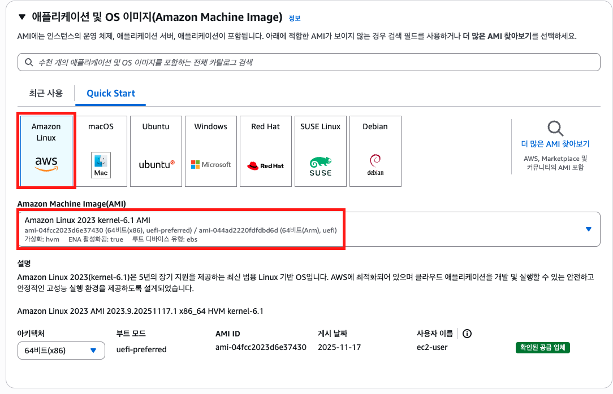
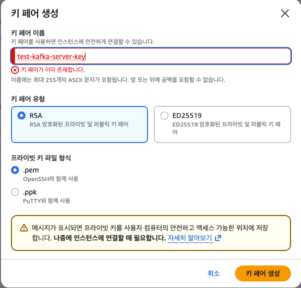
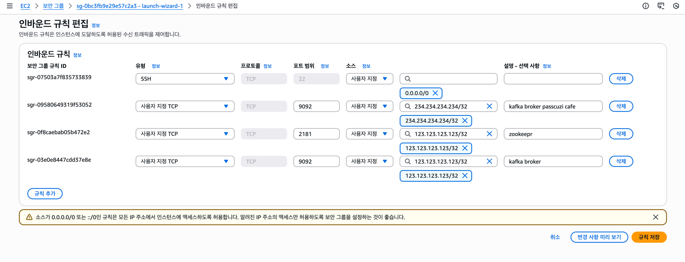

# 💻 Kafka 실습 환경 세팅하기
- [EC2 인스턴스 생성하기](#-ec2-인스턴스-생성하기)
- [인스턴스에 Java 설치하기](#-인스턴스에-java-설치하기)
- [주키퍼・카프카 브로커 실행](#-주키퍼카프카-브로커-실행)
  - [카프카 브로커 힙 메모리 설정](#-카프카-브로커-힙-메모리-설정)
  - [카프카 브로커 실행 옵션 설정](#-카프카-브로커-실행-옵션-설정)
    - [Kafka 3.5.0 이전 버전](#-kafka-350-이전-버전)
    - [KRaft 모드 - 브로커 노드와 컨트롤러 노드 따로](#-kraft-모드---브로커-노드와-컨트롤러-노드-따로)
    - [KRaft 모드 - 브로커 노드에 컨트롤러 노드 겸용 - 가장 권장](#-kraft-모드---브로커-노드에-컨트롤러-노드-겸용---가장-권장)
- [로컬 컴퓨터에서 카프카와 통신 확인](#-로컬-컴퓨터에서-카프카와-통신-확인)
  - [테스트 편의를 위한 hosts 설정](#-테스트-편의를-위한-hosts-설정)

<br>

## ❗️ EC2 인스턴스 생성하기

> AWS EC2(Elastic Compute Cloud)에서 인스턴스를 발급받아 실행해볼 것이다.  
> 카프카를 안전하게 서비스로 운영하기 위해서는 최소 3대의 서버로 카프카 클러스터를 구축해야 하지만,  
> 카프카 클라이언트 개발 실습을 위해 1대만 설치한다. 

<br>

  
EC2 인스턴스를 설치하는데, 다음과 같이 Amazon Linux 2023 kernel-6.1 AMI로 선택했다.  
Amazon에서 직접 만든 템플릿으로, EC2 성능에 최적화가 되어있다.  


<br>


인스턴스 유형에는 다음과 같이 `t2.micro`로 설정하고, 메모리는 1GB로 설정한다.  
➡ 주키퍼와 카프카를 실행시킬건데, 두 프로세스에 각각 400MB의 힙 메모리를 설정하기 위해서다.  
그리고 프리티어인지 꼭 확인해둔다.  

<br>

  
키 페어를 생성한다.  
키 페어 이름은 `test-kafka-server-key`로 설정했다.  

<br>



보안 그룹에서 Inbound 규칙을 설정한다.
- `9092` port: 카프카 브로커의 기본 포트
- `2181` port: 주키퍼의 기본 포트

소스 IP를 `0.0.0.0/0`으로 설정하면 모든 IP 주소에서 접속하는 것을 허용한다.  
운영이 아니니 그렇게 해도 되지만, 나의 경우 우리집 와이파이 IP를 설정했다.

<br>

> Inbound: 발급 받은 인스턴스 외부로부터 들어오는 트래픽  
> ➡ 기본으로 ssh(22번 포트)만 설정돼 있다.
> <br>
> 
> Outbound: 인스턴스로부터 나가는 트래픽  
> ➡ 기본으로 모든 IP, 모든 port 접속 가능으로 설정돼 있다.

<br>

```shell
# read 권한만 가지고 있도록 설정
Kyeongchanui-MacBookPro:~ kyeongchanwoo$ chmod 400 test-kafka-server-key.pem

# read 권한만 있는 거 확인
Kyeongchanui-MacBookPro:~ kyeongchanwoo$ ll test-kafka-server-key.pem
-r--------@ 1 kyeongchanwoo  staff  1674 11월 26 06:31 test-kafka-server-key.pem

# 기본 유저명은 ec2-user다.
Kyeongchanui-MacBookPro:~ kyeongchanwoo$ ssh -i test-kafka-server-key.pem ec2-user@13.***.**.***
The authenticity of host '13.***.**.*** (13.***.**.***)' can't be established.
ED25519 key fingerprint is SHA256:vjA0FCdQgDQKu2ataJT6nVLysPVXXN9xtCXMh7DL03k.
This key is not known by any other names.
Are you sure you want to continue connecting (yes/no/[fingerprint])? yes
Warning: Permanently added '13.***.**.***' (ED25519) to the list of known hosts.
   ,     #_
   ~\_  ####_        Amazon Linux 2023
  ~~  \_#####\
  ~~     \###|
  ~~       \#/ ___   https://aws.amazon.com/linux/amazon-linux-2023
   ~~       V~' '->
    ~~~         /
      ~~._.   _/
         _/ _/
       _/m/'
```

<br>

> 카프카 클러스터 구성을 위해 브로커를 생성할 때, 위의 과정을 그대로 따라해서 새로 생성하되, 키 페어(.pem)는 신규로 생성하지 말고 기존에 생성한 키 페어를 그대로 사용해도 된다.

<br>

## ❗️ 인스턴스에 Java 설치하기
```shell
java 설치
[ec2-user@ip- ~]$ sudo dnf install -y java-17-amazon-corretto-devel
...
Complete!

# java 버전 확인
[ec2-user@ip- ~]$ java -version
openjdk version "17.0.17" 2025-10-21 LTS
OpenJDK Runtime Environment Corretto-17.0.17.10.1 (build 17.0.17+10-LTS)
OpenJDK 64-Bit Server VM Corretto-17.0.17.10.1 (build 17.0.17+10-LTS, mixed mode, sharing)
```

<br>

> 참고로 Amazon Linux 2023 기준 명령어가 Amazon Linux 2와는 다르다.  
> - `dnf`: Amazon Linux의 패키지 매니저가 변경됐다.  
>   `yum` 자체가 deprecated 되었고, `yum` 명령어를 호출해도 `dnf`로 redirect된다.
> - `corretto`: Amazon이 자체적으로 최적화된 OpenJDK를 제공한다.  
>   `java-17-openjdk-devel` ➡ 옛날 버전
> - `확장자`: `yum` 스타일에는 패키지명 뒤에 확장자를 붙였지만, `modern dnf` 정책에 따라 아키텍처 명시를 생략하게 되었다.


<br>


## ❗️ 주키퍼・카프카 브로커 실행
```shell
# 카프카 바이너리 패키지 2.13-4.1.0 버전 설치
[ec2-user@ip- ~]$ wget https://archive.apache.org/dist/kafka/3.9.0/kafka_2.12-3.9.0.tgz

# 압축 풀기
[ec2-user@ip- ~]$ tar -xzvf kafka_2.12-3.9.0.tgz
```


<br>

### ✅ 카프카 브로커 힙 메모리 설정
카프카 브로커는 레코드(`Kafka Topic`에 저장되는 개별 메시지)의 내용은 페이지 캐시로 시스템 메모리를 사용하고, 나머지 객체들을 힙 메모리에 저장하여 사용한다는 특징이 있다.  
➡ 카프카 브로커를 운영할 때 힙 메모리를 5GB 이상으로 설정하지 않는 것이 일반적이다.  


<br>

카프카 패키지에서 디폴트
- 카프카 브로커: 1GB
- 주키퍼: 512MB

<br>

여기에서 생성한 인스턴스(t2.micro)는 1GB 메모리를 가지고 있으므로, `export` 명령어를 통해 힙 메모리 사이즈를 미리 환경변수로 지정해야 한다.  

<br>

```shell
# export 명령어 선언
[ec2-user@ip- ~]$ export KAFKA_HEAP_OPTS="-Xmx400m -Xms400m"

# 설정값 확인
[ec2-user@ip- ~]$ echo $KAFKA_HEAP_OPTS
-Xmx400m -Xms400m
```
- `Xmx`: 힙 메모리 사이즈의 최대 크기
- `Xms`: 힙 메모리 사이즈의 최소 크기


<br>

하지만 위의 명령어는 일회성이고, 터미널 세션이 종료되고 나면 다시 입력해야한다는 단점이 있다.  
따라서 `bashrc` 파일을 수정해준다.  

```shell
# shell 확인 결과 bash shell
[ec2-user@ip- ~]$ echo $SHELL
/bin/bash

# bashrc 수정
[ec2-user@ip- ~]$ vi ~/.bashrc

################
# bashrc에 추가한 내용
# Kafka heap size settings
export KAFKA_HEAP_OPTS="-Xmx400m -Xms400m"
################

# source 명령어를 통해 수정한 .bashrc를 바로 반영시킨다.
[ec2-user@ip- ~]$ source ~/.bashrc

# $KAFKA_HEAP_OPTS 값 확인
[ec2-user@ip- ~]$ echo $KAFKA_HEAP_OPTS
-Xmx400m -Xms400m
```

<br>

```shell
# kafka 설치 디렉터리 위치로
[ec2-user@ip- ~]$ cd kafka_2.13-4.1.0

# 카프카 실행시 사용하는 스크립트 살펴보기
[ec2-user@ip- kafka_2.13-4.1.0]$ cat bin/kafka-server-start.sh
# 중략...
if [ $# -lt 1 ];
then
	echo "USAGE: $0 [-daemon] server.properties [--override property=value]*"
	exit 1
fi
base_dir=$(dirname $0)

if [ -z "$KAFKA_LOG4J_OPTS" ]; then
    export KAFKA_LOG4J_OPTS="-Dlog4j2.configurationFile=$base_dir/../config/log4j2.yaml"
fi

# $KAFKA_HEAP_OPTS가 설정돼 있지 않으면, 1GB 사이즈의 힙 메모리를 사용한다.
if [ "x$KAFKA_HEAP_OPTS" = "x" ]; then
    export KAFKA_HEAP_OPTS="-Xmx1G -Xms1G"
fi

EXTRA_ARGS=${EXTRA_ARGS-'-name kafkaServer -loggc'}

COMMAND=$1
case $COMMAND in
  -daemon) # daemon으로 실행한다.
    EXTRA_ARGS="-daemon "$EXTRA_ARGS
    shift
    ;;
  *)
    ;;
esac

exec $base_dir/kafka-run-class.sh $EXTRA_ARGS kafka.Kafka "$@"
```

<br>

### ✅ 카프카 브로커 실행 옵션 설정
- [Kafka 3.5.0 이전 버전](#-kafka-350-이전-버전)
- [KRaft 모드 - 브로커 노드와 컨트롤러 노드 따로](#-kraft-모드---브로커-노드와-컨트롤러-노드-따로)
- [KRaft 모드 - 브로커 노드에 컨트롤러 노드 겸용 - 가장 권장](#-kraft-모드---브로커-노드에-컨트롤러-노드-겸용---가장-권장)

`config/server.properties`에서 카프카 브로커가 클러스터 운영에 필요한 옵션들을 지정할 수 있다.  
➡ 현재는 실습용 카프카 브로커를 실행할 것이기 때문에 `advertised.listener`만 설정할 것이다.  
➡ `advertised.listener`는 카프카 클라이언트 또는 커맨드 라인 툴을 브로커와 연결할 때 쓴다.

#### 🧑🏻‍💻 Kafka 3.5.0 이전 버전

> 아래는 옛날 설정 방식으로, 각 설정의 뜻을 참고용으로만 보고, 실제 현 설정은 더 아래에 `config/kraft/controller.properties`와 `config/kraft/server.properties` 설정을 참고하자.

```shell
[ec2-user@ip-172-31-47-253 ~]$ vi config/server.properties


# The node id associated with this instance's roles
node.id=1

listeners=PLAINTEXT://:9092,CONTROLLER://:9093

# Listener name, hostname and port the broker or the controller will advertise to clients.
# If not set, it uses the value for "listeners".
#advertised.listeners=PLAINTEXT://localhost:9092,CONTROLLER://localhost:9093
advertised.listeners=PLAINTEXT://13.***.**.***:9092,CONTROLLER://13.***.**.***:9093

# Maps listener names to security protocols, the default is for them to be the same. See the config documentation for more details
listener.security.protocol.map=CONTROLLER:PLAINTEXT,PLAINTEXT:PLAINTEXT,SSL:SSL,SASL_PLAINTEXT:SASL_PLAINTEXT,SASL_SSL:SASL_SSL

# The number of threads that the server uses for receiving requests from the network and sending responses to the network
num.network.threads=3

# The number of threads that the server uses for processing requests, which may include disk I/O
num.io.threads=8

# A comma separated list of directories under which to store log files
log.dirs=/tmp/kraft-combined-logs

# The default number of log partitions per topic. More partitions allow greater
# parallelism for consumption, but this will also result in more files across
# the brokers.
num.partitions=1

# The minimum age of a log file to be eligible for deletion due to age
log.retention.hours=168

# The maximum size of a log segment file. When this size is reached a new log segment will be created.
log.segment.bytes=1073741824

# The interval at which log segments are checked to see if they can be deleted according
# to the retention policies
log.retention.check.interval.ms=300000
```
- `node.id`: 브로커와 컨트롤러를 식별하는 번호다. 클러스터 내에서 하나뿐인 번호로 작성해야 한다.
- `listeners=PLAINTEXT`: 통신을 위해 열어둘 인터페이스 IP, port, 프로토콜을 설정할 수 있다. 따로 설정하지 않으면 모든 IP와 port에서 접속할 수 있다.
- `advertised.listeners`: 카프카 클라이언트 또는 카프카 커맨드 라인 툴에서 접속할 때 사용하는 IP와 port 정보다.
  - EC2 인스턴스를 발급받을 때 생성한 퍼블릭 IPv4와 port들을 넣는다.
- `listener.security.protocol.map`: 보안 설정 시 프로토콜 매핑을 위한 설정이다.
- `num.network.threads`: 네트워크를 통한 처리를 할 때 사용할 네트워크 스레드 개수 설정이다.
- `num.io.threads`: 카프카 브로커 내부에서 사용할 스레드 개수다.
- `log.dirs`: 통신을 통해 가져온 데이터를 파일로 저장할 디렉토리 위치다.
- `num.partitions`: 파티션 개수를 명시하지 않고 토픽을 생성할 때 기본 설정되ㅏ는 파티션 개수다.
  - 파티션 개수가 많아지면 병렬처리 데이터 양이 늘어난다.
- `log.retention.hours`: 카프카 브로커가 저장한 파일이 삭제되기까지 걸리는 시간을 설정할 수 있다.
  - 운영 시에는 가장 작은 단위를 기준으로 하므로 `log.retention.hours`보다는 `log.retention.ms` 값을 설정하는 것을 권장한다.
  - `log.retention.ms` 값을 -1로 설정하면 파일은 영원히 삭제되지 않는다.
- `log.segment.bytes`: 카프카 브로커가 저장할 파일의 최대 크기
  - 데이터 양이 많아 이 크기를 채우게 되면 새로운 파일이 생성된다.
- `log.retention.check.interval.ms`: 카프카 브로커가 저장한 파일을 삭제하기 위해 체크하는 간격

<br>

#### 🧑🏻‍💻 KRaft 모드 - 브로커 노드와 컨트롤러 노드 따로
Kafka 3.5.0 버전 이상부터는 zookeeper가 없어지고, kraft 모드가 새로 생겼다.  
따라서 실행하는 방식이 달라졌는데, 아래와 같다.

<br>

설정 내용


```shell
# config/kraft/controller.properties

# The role of this server. Setting this puts us in KRaft mode
process.roles=controller

# The node id associated with this instance's roles
node.id=1

# Uncomment controller.quorum.voters to use a static controller quorum.
controller.quorum.voters=1@localhost:9093
controller.quorum.bootstrap.servers=127.0.0.1:9093

# The address the socket server listens on.
# Note that only the controller listeners are allowed here when `process.roles=controller`
listeners=CONTROLLER://:9093

# Listener name, hostname and port the controller will advertise to admin clients, broker nodes and controller nodes.
# Note that the only controller listeners are allowed here when `process.roles=controller`.
# If not set, it uses the value for "listeners".
advertised.listeners=CONTROLLER://localhost:9093

# A comma-separated list of the names of the listeners used by the controller.
# This is required if running in KRaft mode.
controller.listener.names=CONTROLLER

# A comma separated list of directories under which to store log files
log.dirs=/tmp/kraft-controller-logs
```


```shell
# config/kraft/server.properties

# The role of this server. Setting this puts us in KRaft mode
process.roles=broker

# The node id associated with this instance's roles
node.id=2

# The connect string for the controller quorum
controller.quorum.voters=1@localhost:9093

# The address the socket server listens on.
listeners=PLAINTEXT://:9092

# Name of listener used for communication between brokers.
inter.broker.listener.name=PLAINTEXT

# Listener name, hostname and port the broker or the controller will advertise to clients.
# If not set, it uses the value for "listeners".
advertised.listeners=PLAINTEXT://13.***.**.***:9092

# A comma-separated list of the names of the listeners used by the controller.
# If no explicit mapping set in `listener.security.protocol.map`, default will be using PLAINTEXT protocol
# This is required if running in KRaft mode.
controller.listener.names=CONTROLLER

# Maps listener names to security protocols, the default is for them to be the same. See the config documentation for more details
listener.security.protocol.map=CONTROLLER:PLAINTEXT,PLAINTEXT:PLAINTEXT,SSL:SSL,SASL_PLAINTEXT:SASL_PLAINTEXT,SASL_SSL:SASL_SSL

# A comma separated list of directories under which to store log files
log.dirs=/tmp/kraft-combined-logs
```

> EC2 특성상 퍼블릭 IP → 퍼블릭 IP loopback 은 안 된다 (AWS의 기본 정책)    
> 따라서 컨트롤러는 `advertised.listeners=CONTROLLER://localhost:9093`로 해야 한다.  
> 브로커는 외부에서 Kafka 접속이 가능해야 하니까 퍼블릭 IP가 필요하다.  
> ➡ `server.properties`에는 `advertised.listeners=PLAINTEXT://13.***.**.***:9092`


<br>

아래 명령어는 초기 1회만 실행한다.
```shell
# KRaft 메타데이터를 저장하기 위해 스토리지 포맷 명령 실행
# 컨트롤러와 브로커 서로가 uuid가 같아야 한다!

# uuid 생성
$ bin/kafka-storage.sh random-uuid

# 컨트롤러 storage 포맷
$ bin/kafka-storage.sh format -t <UUID> -c config/kraft/controller.properties

# 카프카 브로커 storage 포맷
$ bin/kafka-storage.sh format -t <UUID> -c config/kraft/server.properties
```

> 처음에는 바로 이런 에러가 나왔다.  
> config/kraft/controller.properties Because controller.quorum.voters is not set on this controller, you must specify one of the following: --standalone, --initial-controllers, or --no-initial-controllers.  
> <br>
> `controller.quorum.voters` 설정이 `controller.properties`에 없기 때문에 발생한 오류다.  
> KRaft(Kafka Raft) 모드에서는 컨트롤러 노드들이 서로 누가 컨트롤러인지 알 수 있도록 `controller.quorum.voters` 설정이 필수다.  
> 따라서 `config/kraft/controller.properties`에 `controller.quorum.voters=1@localhost:9093`로 주석해제를 해보면 된다.

<br>

```shell
# 카프카 컨트롤러 실행
$ bin/kafka-server-start.sh -daemon config/kraft/controller.properties

# 카프카 브로커 실행
$ bin/kafka-server-start.sh -daemon config/kraft/server.properties

# 프로세스 확인
$ jps -vm
71206 Kafka config/kraft/controller.properties -Xmx400m -Xms400m -XX:+UseG1GC -XX:MaxGCPauseMillis=20 -XX:InitiatingHeapOccupancyPercent=35 -XX:+ExplicitGCInvokesConcurrent -XX:MaxInlineLevel=15 -Djava.awt.headless=true -Xlog:gc*:file=/home/ec2-user/kafka_2.12-3.9.0/bin/../logs/kafkaServer-gc.log:time,tags:filecount=10,filesize=100M -Dcom.sun.management.jmxremote=true -Dcom.sun.management.jmxremote.authenticate=false -Dcom.sun.management.jmxremote.ssl=false -Dkafka.logs.dir=/home/ec2-user/kafka_2.12-3.9.0/bin/../logs -Dlog4j.configuration=file:bin/../config/log4j.properties
72923 Jps -vm -Dapplication.home=/usr/lib/jvm/java-17-amazon-corretto.x86_64 -Xms8m -Djdk.module.main=jdk.jcmd
72879 Kafka config/kraft/server.properties -Xmx400m -Xms400m -XX:+UseG1GC -XX:MaxGCPauseMillis=20 -XX:InitiatingHeapOccupancyPercent=35 -XX:+ExplicitGCInvokesConcurrent -XX:MaxInlineLevel=15 -Djava.awt.headless=true -Xlog:gc*:file=/home/ec2-user/kafka_2.12-3.9.0/bin/../logs/kafkaServer-gc.log:time,tags:filecount=10,filesize=100M -Dcom.sun.management.jmxremote=true -Dcom.sun.management.jmxremote.authenticate=false -Dcom.sun.management.jmxremote.ssl=false -Dkafka.logs.dir=/home/ec2-user/kafka_2.12-3.9.0/bin/../logs -Dlog4j.configuration=file:bin/../config/log4j.properties
```

<br>

```shell
# 로그 확인
$ tail -f logs/server.log
```

<br>

```shell
# daemon으로 실행시킨 kafka 종료 방법
$ bin/kafka-server-stop.sh

# 종료 잘 됐는지 확인
$ jps -vm
73242 Jps -vm -Dapplication.home=/usr/lib/jvm/java-17-amazon-corretto.x86_64 -Xms8m -Djdk.module.main=jdk.jcmd
```

<br>


설정 변경 후 재 실행
```shell
# 카프카 종료
$ pkill -f kafka.Kafka

# 브로커 메타 데이터 삭제
$ rm -rf /tmp/kraft-combined-logs

# 컨트롤러 메타 데이터 삭제
$ rm -rf /tmp/kraft-controller-logs

# uuid 생성
$ bin/kafka-storage.sh random-uuid

# 컨트롤러 storage 포맷
$ bin/kafka-storage.sh format -t <UUID> -c config/kraft/controller.properties

# 카프카 브로커 storage 포맷
$ bin/kafka-storage.sh format -t <UUID> -c config/kraft/server.properties

# 카프카 컨트롤러 실행
$ bin/kafka-server-start.sh -daemon config/kraft/controller.properties

# 카프카 브로커 실행
$ bin/kafka-server-start.sh -daemon config/kraft/server.properties

# 에러 생겼을 때 로그 확인하기
$ tail -n 200 logs/server.log
```

<br>

#### 🧑🏻‍💻 KRaft 모드 - 브로커 노드에 컨트롤러 노드 겸용 - 가장 권장
> 브로커 노드와 컨트롤러 노드를 따로 계속 사용하다가 브로커 노드에 컨트롤러 노드를 겸용하는 설정 방식이 있음을 깨닫고 이 방식으로 바꿨다.

```properties
# config/kraft/server.properties

# 브로커와 컨트롤러 역할 겸용 설정
process.roles=broker,controller

# The node id associated with this instance's roles
# id 지정
node.id=2

# The connect string for the controller quorum
# 이제 따로 컨트롤러 노드를 지정하지 않고 자신을 지정하면 된다.
controller.quorum.voters=2@localhost:9093

# The address the socket server listens on.
listeners=PLAINTEXT://:9092,CONTROLLER://:9093

# Name of listener used for communication between brokers.
# 따로 설정한 거는 없다.
inter.broker.listener.name=PLAINTEXT

# Listener name, hostname and port the broker or the controller will advertise to clients.
advertised.listeners=PLAINTEXT://my-kafka2:9092,CONTROLLER://localhost:9093

# A comma-separated list of the names of the listeners used by the controller.
# 따로 설정한 거는 없다.
controller.listener.names=CONTROLLER

# A comma separated list of directories under which to store log files
# 따로 설정한 거는 없다.
log.dirs=/tmp/kraft-combined-logs
```

<br>

이제 `server.properties` 설정만으로 브로커를 구동시키면 된다.  
```shell
# 카프카 종료
$ bin/kafka-server-stop.sh

# 재시작시 브로커 메타 데이터 삭제
$ rm -rf /tmp/kraft-combined-logs

# uuid 생성
$ bin/kafka-storage.sh random-uuid

# 카프카 브로커 storage 포맷
$ bin/kafka-storage.sh format -t <UUID> -c config/kraft/server.properties

# 카프카 브로커 실행
$ bin/kafka-server-start.sh -daemon config/kraft/server.properties

# 에러 생겼을 때 로그 확인하기
$ tail -n 200 logs/server.log
```


<br>


## ❗️ 로컬 컴퓨터에서 카프카와 통신 확인
로컬 컴퓨터에서 원격으로 카프카 브로커로 명령을 내려 정상적으로 통신하는지 확인한다.  
➡ 카프카가 정상 동작하는지 가장 쉽게 확인하는 방법은 카프카 브로커 정보를 요청하는 것이다.

<br>

카프카 바이너리 패키지는 카프카 브로커에 대한 정보를 가져올 수 있는 kafka-broker-api-versions.sh 명령어를 제공한다.  
➡ 이 명령어를 통해 카프카 브로커와 정상적으로 연동되는지 확인할 수 있다.

```shell
# 로컬 컴퓨터에 카프카 바이너리 패키지 다운로드
# 참고로 이 방법은 너무 느리다. 그냥 다운로드 페이지에 들어가서 다운받자..
Kyeongchanui-MacBookPro:~ kyeongchanwoo$ curl https://archive.apache.org/dist/kafka/3.9.0/kafka_2.12-3.9.0.tgz --output kafka.tgz

# 압축 해제
Kyeongchanui-MacBookPro:~ kyeongchanwoo$ tar -xzvf kafka_2.12-3.9.0.tgz

Kyeongchanui-MacBookPro:~ kyeongchanwoo$ cd kafka_2.12-3.9.0

# 카프카 브로커 정보 요청
Kyeongchanui-MacBookPro:~ kyeongchanwoo$ bin/kafka-broker-api-versions.sh --bootstrap-server 13.***.**.***:9092
13.***.**.***:9092 (id: 2 rack: null) -> (
	Produce(0): 0 to 11 [usable: 11],
	Fetch(1): 0 to 17 [usable: 17],
	ListOffsets(2): 0 to 9 [usable: 9],
	Metadata(3): 0 to 12 [usable: 12],
	LeaderAndIsr(4): UNSUPPORTED,
	...
)
```
카프카 브로커와 정상적으로 연동되었다. 

<br>

### ✅ 테스트 편의를 위한 hosts 설정
hosts 파일을 설정하면 로컬 컴퓨터에서 AWS EC2에 설치한 카프카 클러스터와 통신할 때 설정한 IP를 사용자 지정 문장으로 매핑하여 통신할 수 있다.  
EC2 인스턴스 public IP로 설정한다.
```shell
# Mac을 포함한 유닉스 계열에서 hosts 파일 수정
$ sudo vi /etc/hosts
13.***.**.*** my-kafka
```

<br>

```shell
# 이제 ip 주소 기억 안해도 EC2 접속 가능하다.
$ ssh -i test-kafka-server-key.pem ec2-user@my-kafka
```


<br>

**참고 자료**  
[아파치 카프카 애플리케이션 프로그래밍 with 자바](https://product.kyobobook.co.kr/detail/S000001842177)