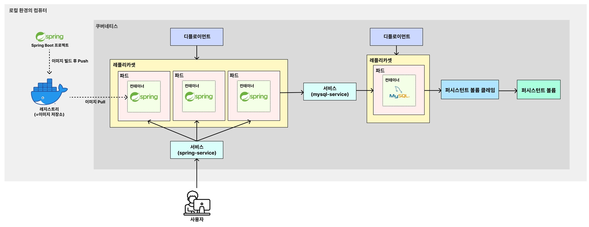
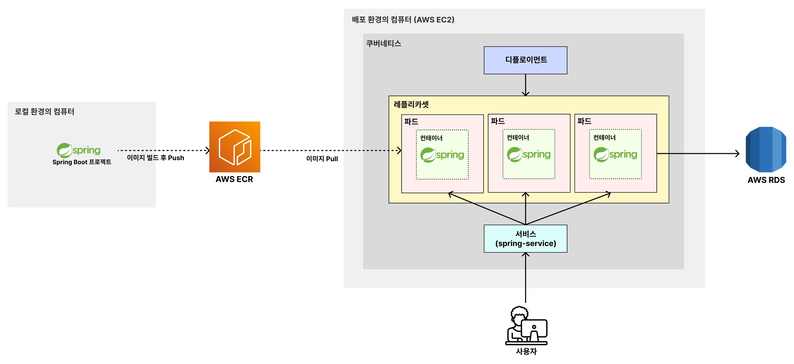

# 🧑🏻‍💻 쿠버네티스

---

> [!TIP]
> 실습 코드는 [kubernetes-study](https://github.com/kyeoungchan/kubernetes-study/tree/charels)를 참고한다.

## ✅ 쿠버네티스란?
> [!NOTE]
> 쿠버네티스(k8s)는 다수의 컨테이너를 효율적으로 배포, 확장 및 관리하기 위한 오픈 소스 시스템이다.  
> 일종의 Docker Compose의 확장판이다.

[이 링크를 통해 쿠버네티스를 설치하자.](https://kubernetes.io/ko/docs/tasks/tools/install-kubectl-macos/)  

 

## ✅ EC2 환경에서 k8s 구조

---

> [!NOTE]
> 로컬 환경에서의 아키텍처와의 차이점은 크게 2가지이다.
> 1. 로컬에 도커 이미지를 저장하지 않고, 외부 저장소인 **AWS ECR**에 도커 이미지를 저장한다.
> 2. 로컬의 데이터베이스를 사용하지 않고, 외부 데이터베이스인 **AWS RDS**를 활용한다.

 

**출처**  
[쿠버네티스 강의](https://www.inflearn.com/course/%EB%B9%84%EC%A0%84%EA%B3%B5%EC%9E%90-%EC%BF%A0%EB%B2%84%EB%84%A4%ED%8B%B0%EC%8A%A4-%EC%9E%85%EB%AC%B8-%EC%8B%A4%EC%A0%84?cid=335433)