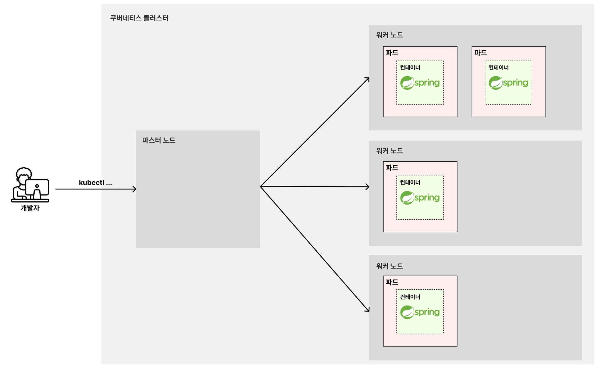
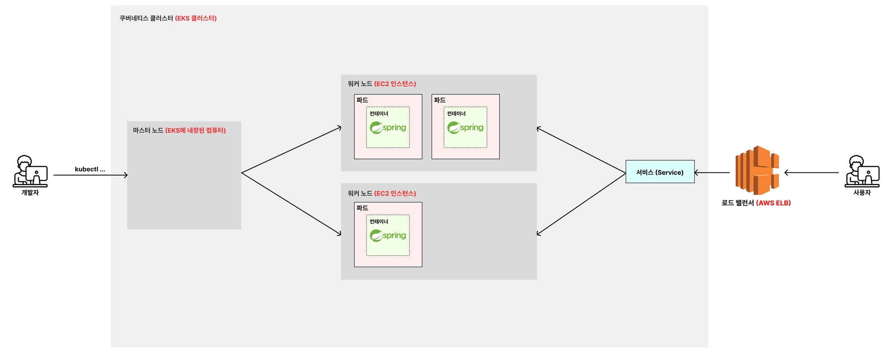

# 🧑🏻‍💻 쿠버네티스

---

> [!TIP]
> 실습 코드는 [kubernetes-study](https://github.com/kyeoungchan/kubernetes-study/tree/charels)를 참고한다.


## ✅ 쿠버네티스란?
> [!NOTE]
> 쿠버네티스(k8s)는 다수의 컨테이너를 효율적으로 배포, 확장 및 관리하기 위한 오픈 소스 시스템이다.  
> 일종의 Docker Compose의 확장판이다.


[이 링크를 통해 쿠버네티스를 설치하자.](https://kubernetes.io/ko/docs/tasks/tools/install-kubectl-macos/)  

<br>

### 🚀 쿠버네티스 아키텍처



- `쿠버네티스 클러스터` : 하나의 **마스터 노드**와 여러 **워커 노드**들을 한 묶음으로 부르는 단위
- `마스터 노드` : 쿠버네티스 클러스터 전체를 관리하는 서버
  - `kubectl`로 시작하는 명령어를 수행했을 때 가장 먼저 그 명령어를 받드는 노드.
- `워커 노드` : 쿠버네티스의 파드를 실행시키는 서버
  - 마스터 노드가 시키는 대로 Pod를 직접적으로 생성하거나 삭제하는 등의 역할을 수행하는 노드


<br>

## ✅ EC2 환경에서 k8s 구조

---


> [!NOTE]
> 로컬 환경에서의 아키텍처와의 차이점은 크게 2가지이다.
> 1. 로컬에 도커 이미지를 저장하지 않고, 외부 저장소인 **AWS ECR**에 도커 이미지를 저장한다.
> 2. 로컬의 데이터베이스를 사용하지 않고, 외부 데이터베이스인 **AWS RDS**를 활용한다.


## ✅ EKS

---

> [!NOTE]
> **Elastic Kubernetes Service**  
> EKS란 AWS에서 쿠버네티스를 편하게 관리하고 사용할 수 있게 만든 AWS용 쿠버네티스이다.  
> 현업에서는 쿠버네티스를 EC2와 같은 서버에 직접 설치해서 쓰지 않고, AWS에서 제공하는 EKS를 활용하는 경우가 많다.

<br>

### 🚀 EKS 아키텍처


> [!NOTE]
> - `마스터 노드`
>   - EKS에 내장된 컴퓨터로 마스터 노드 역할을 수행한다.
> - `워커 노드`
>   - EC2 인스턴스를 관리한다. 
> - `서비스`
>   - 로드 밸런서(AWS ELB)가 요청을 분배한다.
>   - 사용자의 요청을 직접 받는다.

<br>

### 🚀 EKS 커맨드
```shell
# 로컬에서 cluster가 어떤 환경에서 뜨고 있는지 조회
$ kubectl config get-contexts

# EKS 클러스터 추가
$ aws eks --region ap-northeast-2 update-kubeconfig --name {생성한 클러스터 이름}
```


<br>

**출처**  
[쿠버네티스 강의](https://www.inflearn.com/course/%EB%B9%84%EC%A0%84%EA%B3%B5%EC%9E%90-%EC%BF%A0%EB%B2%84%EB%84%A4%ED%8B%B0%EC%8A%A4-%EC%9E%85%EB%AC%B8-%EC%8B%A4%EC%A0%84?cid=335433)