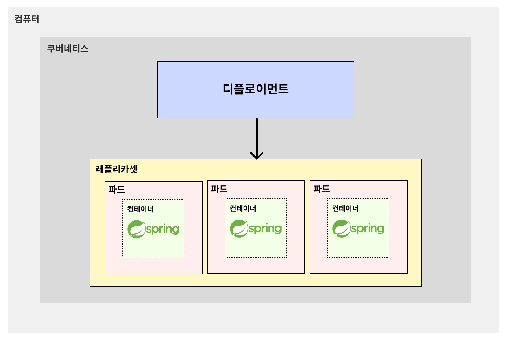

# 🧑🏻‍💻 Deployment

---

> [!NOTE]
> Deployment란?  
> 파드를 묶음으로 쉽게 관리할 수 있는 기술이다.  
> - 파드의 수를 지정하는 대로 여러 대의 파드를 쉽게 생성할 수 있다.
>   - ex) 파드를 100개를 생성하라고 시키면 디플로이먼트가 알아서 파드를 100개 생성해준다.
> - 파드가 비정상적으로 종료된 경우, 알아서 새로 파드를 생성해 파드 수를 유지한다.
> - 동일한 구성의 여러 파드를 일시 중지, 삭제, 업데이트를 하기가 쉽다.
>   - ex) 디플로이먼트를 활용하면 ‘100개의 파드로 띄워져있는 결제 서버’를 한 번에 일시 중지/삭제/업데이트하는 게 굉장히 쉽다.

## ✅ Deployment 구조

> [!NOTE]
> **디플로이먼트(Deployment)가 레플리카셋(ReplicaSet)을 관리하고, 레플리카셋(ReplicaSet)이 여러 파드(Pod)를 관리하는 구조다.**
> - 레플리카(Replica) : 복제본
> - 레플리카셋(ReplicaSet) : 복제본끼리의 묶음

 

**출처**  
[쿠버네티스 강의](https://www.inflearn.com/course/%EB%B9%84%EC%A0%84%EA%B3%B5%EC%9E%90-%EC%BF%A0%EB%B2%84%EB%84%A4%ED%8B%B0%EC%8A%A4-%EC%9E%85%EB%AC%B8-%EC%8B%A4%EC%A0%84?cid=335433)