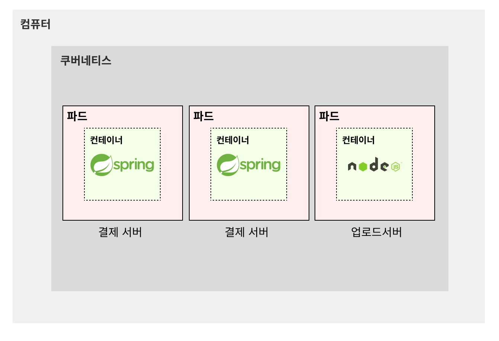
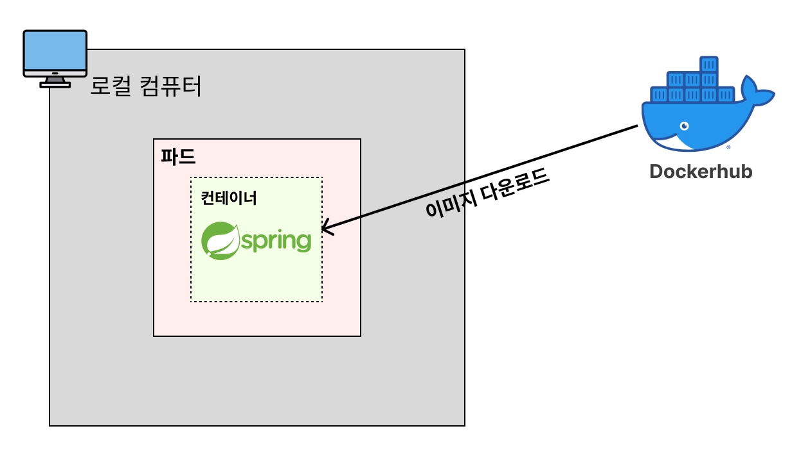
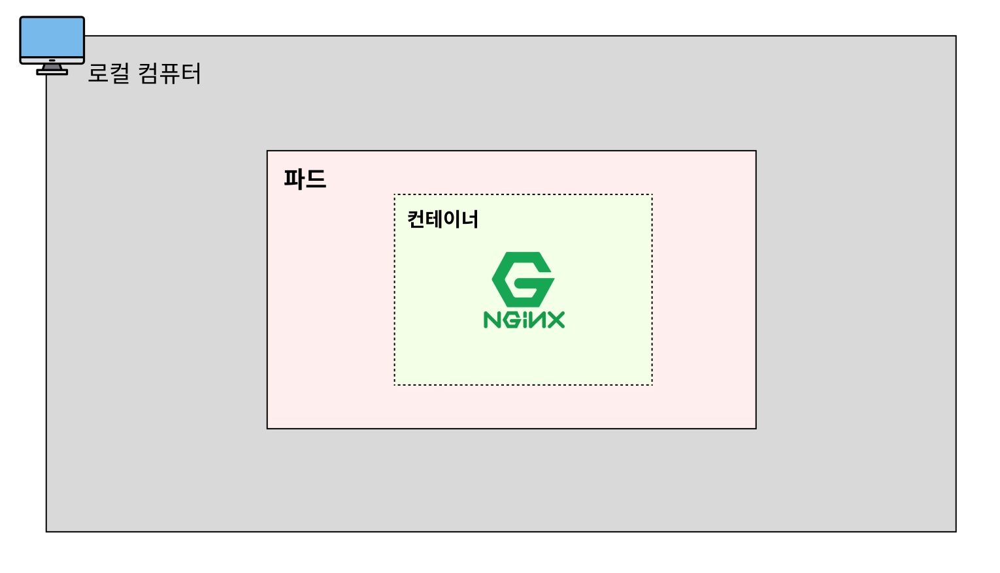
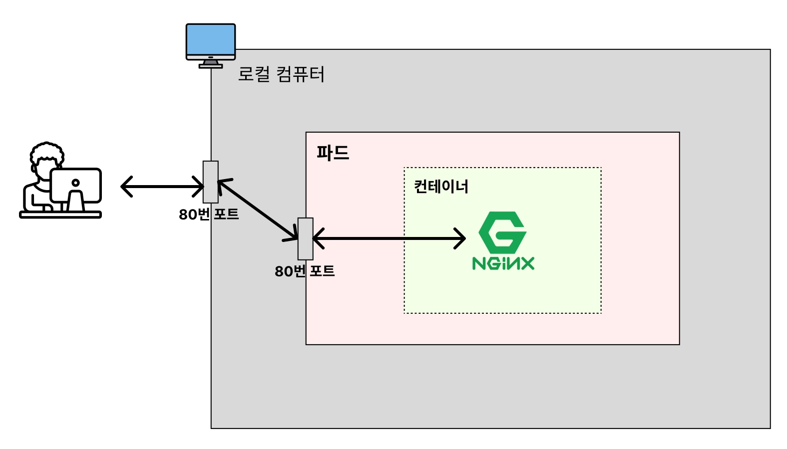

# 🧑🏻‍💻 Pod(파드)

---

> [!NOTE]
> 파드란, 쿠버네티스에서 하나의 프로그램을 실행시키는 단위다.  
> 도커에서 컨테이너와 비슷한 개념이다.  
> 
> 일반적으로 하나의 파드가 하나의 컨테이너를 가지지만, 예외적으로 하나의 파드가 여러 개의 컨테이너를 가지는 경우도 있다.



<br>

> [!TIP]
> 참고로 쿠버네티스도 도커처럼 이미지를 기반으로 파드를 띄워 실행시킨다.



<br>

> [!TIP]
> 파드(Pod)를 생성할 때 CLI를 활용하는 방법이 있고, yaml 파일을 활용하는 방법이 있다.  
> 실제 현업에서는 yaml 파일을 활용하는 경우가 많고, 매니페스트 파일(Manifest File)이라고 부른다.  
> 이 매니페스트 파일은 쿠버네티스에서 다양한 리소스(파드, 서비스, 볼륨 등)를 생성하고 관리하기 위해 사용하는 파일로, Docker의 Dockerfile과 같은 역할을 하는 파일이다.

<br>


```yaml
# nginx-pod.yaml
apiVersion: v1 # Pod를 생성할 때는 v1이라고 기재한다. (공식 문서)
kind: Pod # Pod를 생성한다고 명시
metadata:
  name: nginx-pod # Pod에 이름 붙이는 기능
spec:
  containers:
    - name: nginx-container # 생성할 컨테이너의 이름
      image: nginx # 컨테이너를 생성할 때 사용할 Docker 이미지
      ports:
        - containerPort: 80 # 해당 컨테이너가 어떤 포트를 사용하는 지 명시적으로 표현
```

<br>

```shell
# yaml 파일에 적혀져있는 리소스(파드)를 생성
$ kubectl apply -f nginx-pod.yaml
pod/nginx-pod created
```

<br>

```shell
# 파드(Pod) 조회
$ kubectl get pods
NAME        READY   STATUS    RESTARTS   AGE
nginx-pod   1/1     Running   0          47s
```
> [!NOTE]
> - `NAME` : Pod의 이름
> - `READY` : (파드 내 준비 완료된 컨테이너 수)/(파드 내 총 컨테이너 수)
> - `STATUS` : 파드의 상태 (`Running` : 정상적으로 실행 중)
> - `RESTARTS` : 해당 파드의 컨테이너가 재시작된 횟수
> - `AGE` : 파드가 생성되어 실행된 시

<br>



> [!IMPORTANT]
> 쿠버네티스에서는 파드(Pod) 내부의 네트워크를 컨테이너가 공유해서 같이 사용한다.  
> 파드(Pod)의 네트워크는 로컬 컴퓨터의 네트워크와는 독립적으로 분리되어 있다.  
> 즉, 파드는 컨테이너와는 연결, 외부와는 분리돼있는 구조다.  
> 따라서 외부에서 바로 접근은 할 수 없다.
> 
> 외부에서 접근하려면 2가지 방법이 있다.
> 1. 파드(Pod) 내부로 들어가서 접근하기
> 2. 파드(Pod)의 내부 네트워크를 외부에서도 접속할 수 있도록 포트 포워딩(= 포트 연결시키기) 활용하기


<br>

### ✅ 파드(Pod) 내부로 들어가서 Nginx로 요청보내기

```shell
# kubectl exec -it [파드명] -- bash
# 도커에서 컨테이너로 접속하는 명령어(docker exec -it [컨테이너 ID] bash)와 비슷하다. 
# nginx-pod 내부 환경으로 접속
$ kubectl exec -it nginx-pod -- bash

# Nginx로 요청보내기
root@nginx-pod:/# curl localhost:80
<!DOCTYPE html>
...

root@nginx-pod:/# exit
exit
```

<br>

### ✅ 포트 포워딩을 활용해 Nginx로 요청보내기


```shell
# kubectl port-forward pod/[파드명] [로컬에서의 포트]/[파드에서의 포트]
$ sudo kubectl port-forward pod/nginx-pod 80:80
Password:
Forwarding from 127.0.0.1:80 -> 80
Forwarding from [::1]:80 -> 80
Handling connection for 80
Handling connection for 80
```

<br>


```shell
# kubectl delete pod [파드명]
$ kubectl delete pod nginx-pod
pod "nginx-pod" deleted from default namespace
```

<br>

```shell
$ kubectl get pods
No resources found in default namespace.
```


<br>

**출처**  
[쿠버네티스 강의](https://www.inflearn.com/course/%EB%B9%84%EC%A0%84%EA%B3%B5%EC%9E%90-%EC%BF%A0%EB%B2%84%EB%84%A4%ED%8B%B0%EC%8A%A4-%EC%9E%85%EB%AC%B8-%EC%8B%A4%EC%A0%84?cid=335433)