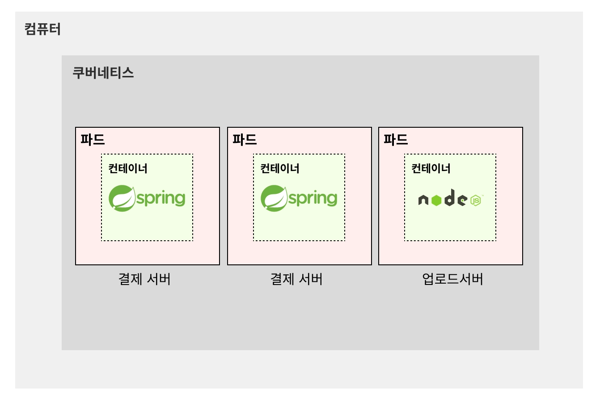
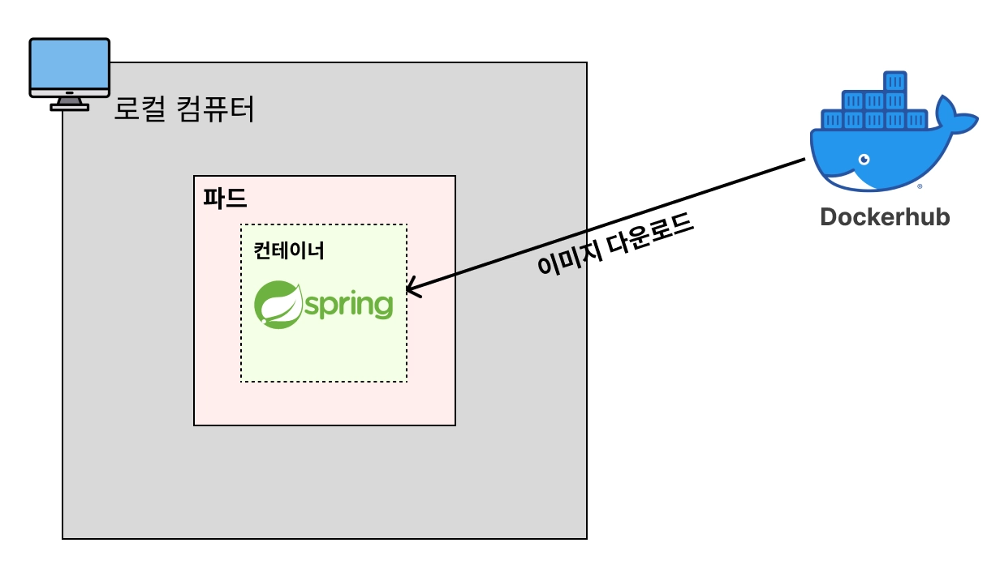
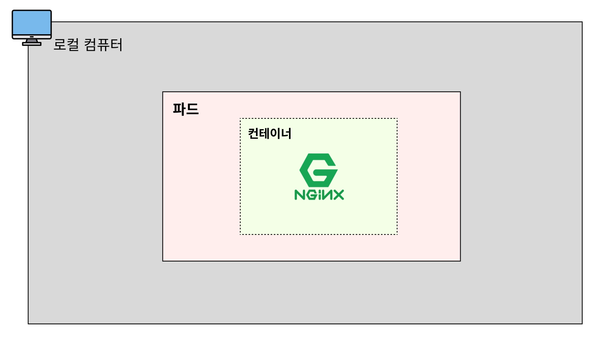
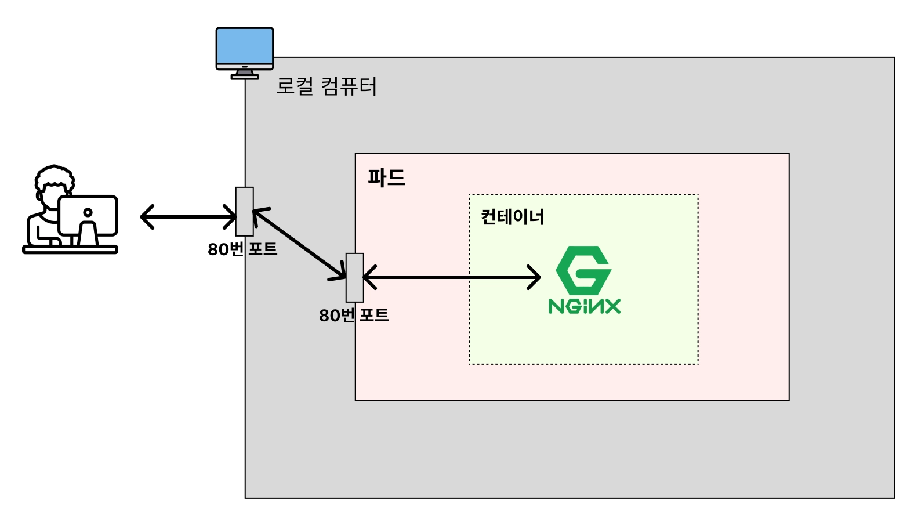

# 🧑🏻‍💻 Pod(파드)

---

> [!NOTE]
> 파드란, 쿠버네티스에서 하나의 프로그램을 실행시키는 단위다.  
> 도커에서 컨테이너와 비슷한 개념이다.  
> 
> 일반적으로 하나의 파드가 하나의 컨테이너를 가지지만, 예외적으로 하나의 파드가 여러 개의 컨테이너를 가지는 경우도 있다.



<br>

> [!TIP]
> 참고로 쿠버네티스도 도커처럼 이미지를 기반으로 파드를 띄워 실행시킨다.



<br>

> [!TIP]
> 파드(Pod)를 생성할 때 CLI를 활용하는 방법이 있고, yaml 파일을 활용하는 방법이 있다.  
> 실제 현업에서는 yaml 파일을 활용하는 경우가 많고, 매니페스트 파일(Manifest File)이라고 부른다.  
> 이 매니페스트 파일은 쿠버네티스에서 다양한 리소스(파드, 서비스, 볼륨 등)를 생성하고 관리하기 위해 사용하는 파일로, Docker의 Dockerfile과 같은 역할을 하는 파일이다.

<br>


```yaml
# nginx-pod.yaml
apiVersion: v1 # Pod를 생성할 때는 v1이라고 기재한다. (공식 문서)
kind: Pod # Pod를 생성한다고 명시
metadata:
  name: nginx-pod # Pod에 이름 붙이는 기능
spec:
  containers:
    - name: nginx-container # 생성할 컨테이너의 이름
      image: nginx # 컨테이너를 생성할 때 사용할 Docker 이미지
      ports:
        - containerPort: 80 # 해당 컨테이너가 어떤 포트를 사용하는 지 명시적으로 표현
```

<br>

```shell
# yaml 파일에 적혀져있는 리소스(파드)를 생성
$ kubectl apply -f nginx-pod.yaml
pod/nginx-pod created
```

<br>

```shell
# 파드(Pod) 조회
$ kubectl get pods
NAME        READY   STATUS    RESTARTS   AGE
nginx-pod   1/1     Running   0          47s
```
> [!NOTE]
> - `NAME` : Pod의 이름
> - `READY` : (파드 내 준비 완료된 컨테이너 수)/(파드 내 총 컨테이너 수)
> - `STATUS` : 파드의 상태 (`Running` : 정상적으로 실행 중)
> - `RESTARTS` : 해당 파드의 컨테이너가 재시작된 횟수
> - `AGE` : 파드가 생성되어 실행된 시

<br>



> [!IMPORTANT]
> 쿠버네티스에서는 파드(Pod) 내부의 네트워크를 컨테이너가 공유해서 같이 사용한다.  
> 파드(Pod)의 네트워크는 로컬 컴퓨터의 네트워크와는 독립적으로 분리되어 있다.  
> 즉, 파드는 컨테이너와는 연결, 외부와는 분리돼있는 구조다.  
> 따라서 외부에서 바로 접근은 할 수 없다.
> 
> 외부에서 접근하려면 2가지 방법이 있다.
> 1. 파드(Pod) 내부로 들어가서 접근하기
> 2. 파드(Pod)의 내부 네트워크를 외부에서도 접속할 수 있도록 포트 포워딩(= 포트 연결시키기) 활용하기


<br>

### ✅ 파드(Pod) 내부로 들어가서 Nginx로 요청보내기

```shell
# kubectl exec -it [파드명] -- bash
# 도커에서 컨테이너로 접속하는 명령어(docker exec -it [컨테이너 ID] bash)와 비슷하다. 
# nginx-pod 내부 환경으로 접속
$ kubectl exec -it nginx-pod -- bash

# Nginx로 요청보내기
root@nginx-pod:/# curl localhost:80
<!DOCTYPE html>
...

root@nginx-pod:/# exit
exit
```

<br>

### ✅ 포트 포워딩을 활용해 Nginx로 요청보내기


```shell
# kubectl port-forward pod/[파드명] [로컬에서의 포트]/[파드에서의 포트]
$ sudo kubectl port-forward pod/nginx-pod 80:80
Password:
Forwarding from 127.0.0.1:80 -> 80
Forwarding from [::1]:80 -> 80
Handling connection for 80
Handling connection for 80
```

<br>


```shell
# kubectl delete pod [파드명]
$ kubectl delete pod nginx-pod
pod "nginx-pod" deleted from default namespace
```

<br>

```shell
$ kubectl get pods
No resources found in default namespace.
```

<br>

### ✅ Image Pull 정책(`ImagePullBackOff` 에러)
> [!NOTE]
> 직접 Spring Boot 프로젝트를 빌드해서 파드를 띄울 때 `ImagePullBackOff`가 발생한다면 이미지 풀 정책을 봐야한다.  
> 이미지 풀 정책(Image Pull Policy)이란 쿠버네티스가 yaml 파일을 읽어들여 파드를 생성할 때, 이미지를 어떻게 Pull을 받아올 건지에 대한 정책을 의미한다.
> 1. **`Always`**  
>    - 로컬에서 이미지를 가져오지 않고, 무조건 **레지스트리(= Dockerhub, ECR과 같은 원격 이미지 저장소)에서 가져온다.**  
>    - 이미지 태그가 `latest`거나 명시되지 않은 경우 자동으로 `always`로 설정된다.
> 2. **`IfNotPresent`**
>    - 로컬에서 이미지를 먼저 가져온다. 만약 로컬에 이미지가 없는 경우에만 레지스트리에서 가져온다.
>    - 이미지의 태그가 `latest`가 아닌 경우 자동으로 `IfNotPresent`로 설정된다.
> 3. **`Never`**  
   로컬에서만 이미지를 가져온다.

```yaml
# 이렇게 하면 로컬에 있는 이미지를 가져올 수 있게 된다.
apiVersion: v1
kind: Pod
metadata:
  name: spring-pod
spec:
  containers:
    - name: spring-container
      image: spring-server
      ports:
        - containerPort: 8080
      imagePullPolicy: IfNotPresent
```

```shell
# spring boot 서버 빌드
$ ./gradlew clean build


# 도커 이미지 생성
$ docker build -t spring-server .

# 도커 이미지 확인
$ docker image ls

# 기존에 잘못 올린 파드 삭제
$ kubectl delete pod spring-pod

# 파드 실행
$ kubectl apply -f spring-pod.yaml

# 파드 조회
$ kubectl get pods
```

<br>

### ✅ Nest.js 서버를 파드로 띄우기
```shell
$ sudo npm i -g @nestjs/cli

# 원하는 경로로 이동 후
$ nest new nest-server

# nest-server 디렉터리로 이동 후
# 의존성 설치
$ npm i

$ npm run start
```

<br>

```
# Dockerfile
FROM node

WORKDIR /app

COPY . .

RUN npm install

RUN npm run build

EXPOSE 3000

ENTRYPOINT ["node", "dist/main.js"]
```
```
# .dockerignore
node_modules
```
```shell
# nest-server image 생성
$ docker build -t nest-server .

# image 생성 여부 확인
$ docker image ls
```

<br>

```yaml
# nest-pod.yaml
apiVersion: v1
kind: Pod

metadata:
  name: nest-pod

spec:
  containers:
    - name: nest-container
      image: nest-server
      imagePullPolicy: IfNotPresent
```
```shell
$ kubectl apply -f nest-pod.yaml

$ kubectl get pods
NAME       READY   STATUS    RESTARTS   AGE
nest-pod   1/1     Running   0          55s

# 로컬 컴퓨터에 3000번 포트로 포트 포워딩
$ kubectl port-forward nest-pod 3000:3000
Forwarding from 127.0.0.1:3000 -> 3000
Forwarding from [::1]:3000 -> 3000
Handling connection for 3000
Handling connection for 3000

# localhost:3000 잘 접속되는 거 확인 후 파드 삭제
$ kubectl delete pod nest-pod
```

<br>

**출처**  
[쿠버네티스 강의](https://www.inflearn.com/course/%EB%B9%84%EC%A0%84%EA%B3%B5%EC%9E%90-%EC%BF%A0%EB%B2%84%EB%84%A4%ED%8B%B0%EC%8A%A4-%EC%9E%85%EB%AC%B8-%EC%8B%A4%EC%A0%84?cid=335433)